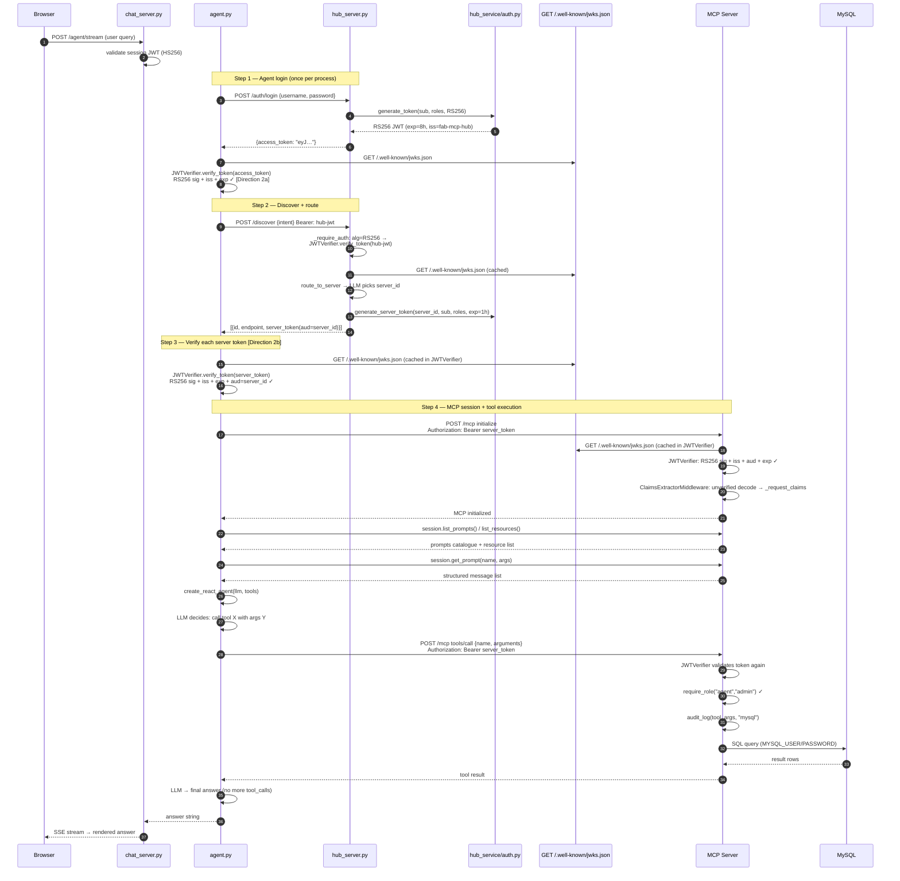
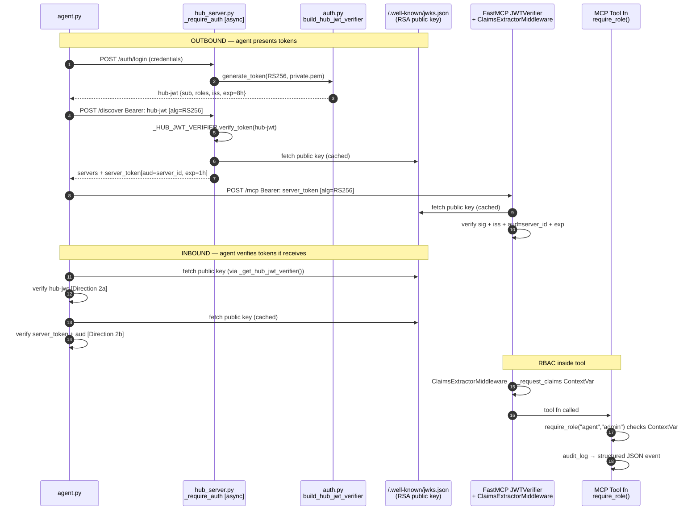
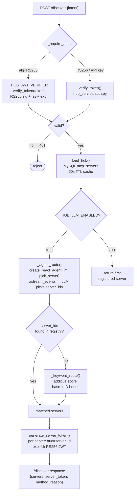
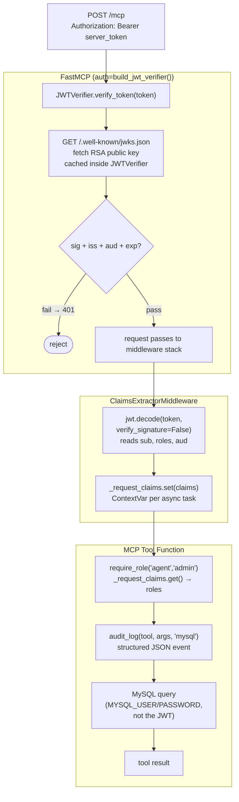

# FAB MCP Hub — Complete Function Call Graph

This document maps every function call from the moment a user submits a query to the moment a tool result is returned, including all auth checks at each boundary. Use it alongside [AUTH.md](AUTH.md) (auth design) and [ARCHITECTURE.md](ARCHITECTURE.md) (system map).

---

## 1. Top-level Entry Points

| Trigger | Entry function | File |
|---|---|---|
| Chat UI submits a query | `POST /agent/stream` handler | `chat_service/chat_server.py` |
| CLI direct call | `run_agent(query)` | `agent.py` |
| Agent-standalone (no chat) | `run_agent(query)` | `agent.py` |

---

## 2. Complete Call Graph (Text Tree)

### 2.1 Chat UI Path

```
[Browser] POST /agent/stream  →  chat_server.py
  │
  ├─ chat_server: validate user session JWT (HS256 / JWT_SECRET)
  │
  └─ agent.run_agent(query, hub_token=user_session_jwt, on_event=...)
       │  agent.py:1291
       │
       ├─[1] _get_hub_token()                          agent.py:179
       │       ├─ httpx.post("/auth/login", credentials)
       │       │     hub_server.auth_login()            hub_server.py:700
       │       │         generate_token(sub, roles)     auth.py:211
       │       │         └─ jwt.encode(payload, private_key, "RS256")
       │       │
       │       └─ _verify_hub_token(access_token)       agent.py:549  [DIRECTION 2a]
       │             ├─ _get_hub_jwt_verifier()          agent.py:522
       │             │     JWTVerifier(jwks_uri, issuer) fastmcp
       │             ├─ verifier.verify_token(token)
       │             │     GET /.well-known/jwks.json    hub_server.py:695
       │             │         get_jwks()                auth.py:103
       │             │     RS256 sig + iss + exp ✓
       │             └─ jwt.decode(token, verify=False)  → claims dict
       │
       ├─[2] httpx.post("/discover", intent, Bearer hub-jwt)
       │       hub_server.discover()                    hub_server.py:790
       │         ├─ _require_agent(claims)
       │         │     _require_auth(request, creds)    hub_server.py:213  [async]
       │         │         jwt.get_unverified_header(token) → alg
       │         │         if alg == "RS256":
       │         │             _HUB_JWT_VERIFIER.verify_token(token)
       │         │                 GET /.well-known/jwks.json
       │         │                 RS256 sig + iss + exp ✓
       │         │             jwt.decode(token, verify=False) → claims
       │         │         else:
       │         │             verify_token(token)      auth.py:184
       │         │
       │         ├─ load_hub()                          hub_server.py:335
       │         │     SQLAlchemy: SELECT * FROM mcp_servers  (TTL 60s cache)
       │         │
       │         ├─ route_to_server(hub, intent)        hub_server.py:570
       │         │     if HUB_LLM_ENABLED:
       │         │         _agent_route(servers, intent) hub_server.py:514
       │         │             _make_routing_tools(decision) hub_server.py:408
       │         │             create_react_agent(llm, [pick_server])
       │         │             agent.astream_events({"messages": [HumanMessage]})
       │         │                 on_tool_start → pick_server(server_id, reason)
       │         │             └─ returns (server_ids, reason)
       │         │         fallback:
       │         │             _keyword_route(servers, intent)  hub_server.py:434
       │         │
       │         └─ generate_server_token(server_id, sub, roles, exp=1h)
       │               auth.py:244
       │               └─ generate_token(sub, roles, aud=server_id, "RS256")
       │                     jwt.encode(payload, private_key)
       │                     payload: {sub, roles, iss, aud=server_id, exp=now+1h}
       │
       ├─[3] _verify_hub_token(server_token, audience=server_id)   [DIRECTION 2b]
       │       agent.py:549  (called for each server in /discover response)
       │         ├─ _get_hub_jwt_verifier()          agent.py:522  (cached singleton)
       │         ├─ verifier.verify_token(token)
       │         │     GET /.well-known/jwks.json (cached in JWTVerifier)
       │         │     RS256 sig + iss + exp ✓
       │         └─ manual aud check: payload["aud"] == server_id ✓
       │
       └─[4] asyncio.gather(_run_on_server(server, query, on_event))
               │  (one coroutine per matched server; parallel)
               │
               └─ _run_on_server(server, query, on_event)    agent.py:846
                     │
                     ├─ mcp_session(server)                  agent.py:354
                     │     token = server["server_token"]    (per-server RS256 JWT)
                     │     _auth_headers(token)              agent.py:344
                     │     streamablehttp_client(endpoint, headers={"Authorization":"Bearer …"})
                     │         MCP server: FastMCP JWTVerifier intercepts
                     │             GET /.well-known/jwks.json (cached)
                     │             RS256 sig + iss + aud=server_id + exp ✓
                     │             → 401 on any failure
                     │         ClaimsExtractorMiddleware
                     │             jwt.decode(token, verify=False) → _request_claims ContextVar
                     │         ClientSession.initialize()           [MCP handshake]
                     │
                     ├─[4a] load_mcp_tools(session)
                     │         session.tools/list  → wraps each tool as LangChain BaseTool
                     │
                     ├─[4b] _fetch_mcp_context(session, query, server_id, on_event)  agent.py:655
                     │         ├─ session.list_prompts()
                     │         │     MCP: tools/list → prompts catalogue
                     │         ├─ session.list_resources()
                     │         │     MCP: resources/list → resource catalogue
                     │         ├─ keyword matching: query → prompt_name + args
                     │         │     _CUST_ID_RE, _DEAL_ID_RE  agent.py:649-650
                     │         ├─ session.get_prompt(prompt_name, prompt_args)
                     │         │     MCP: prompts/get → structured message list
                     │         └─ session.read_resource(uri)
                     │               MCP: resources/read → static reference docs
                     │               (only URIs containing "policy", "guide", "rule", "action")
                     │
                     ├─[4c] create_react_agent(llm, tools, prompt=system_prompt)
                     │         LangGraph ReAct graph
                     │
                     └─[4d] agent.astream_events({"messages": initial_messages}, v2)
                               LLM inference loop:
                               ┌─ on_chat_model_end (tool decision)
                               │     LLM → tool_name + args
                               ├─ on_tool_start
                               │     tool_name: e.g. customer_360
                               │     MCP JSON-RPC:  POST /mcp
                               │         tools/call  {name, arguments}
                               │         Bearer: server_token (per-server JWT)
                               │         MCP server validates again via JWTVerifier
                               │
                               │         MCP tool function:
                               │             require_role("agent","admin")   auth.py:104
                               │                 _request_claims.get() → roles ✓
                               │             audit_log(tool, args, "mysql") auth.py:129
                               │             MySQL query (MYSQL_USER/PASSWORD)
                               │             return result dict
                               │
                               ├─ on_tool_end   → result back to LLM
                               └─ on_chat_model_end (final answer, no tool_calls)
                                     → answer string returned up the stack
```

---

## 3. Mermaid Sequence Diagram — Full Request Flow



---

## 4. Mermaid Sequence Diagram — Auth Layer Only

This strips out MCP protocol detail to show just the security boundaries.



---

## 5. Mermaid Flow — Hub Routing Logic



---

## 6. Mermaid Flow — MCP Server Auth Stack



---

## 7. Key Function Index

| Function | File | Line | Role |
|---|---|---|---|
| `run_agent()` | `agent.py` | 1291 | Top-level orchestrator |
| `_get_hub_token()` | `agent.py` | 179 | Login + cache hub JWT; calls `_verify_hub_token` [Dir 2a] |
| `_verify_hub_token()` | `agent.py` | 549 | Inbound token verification via `JWTVerifier` [Dir 2a/2b] |
| `_get_hub_jwt_verifier()` | `agent.py` | 522 | Lazy singleton `JWTVerifier` for hub JWKS |
| `mcp_session()` | `agent.py` | 354 | Opens authenticated streamable-HTTP MCP client session |
| `_auth_headers()` | `agent.py` | 344 | Builds `{"Authorization": "Bearer …"}` dict |
| `_run_on_server()` | `agent.py` | 846 | Per-server ReAct loop: tools + context + LLM |
| `_fetch_mcp_context()` | `agent.py` | 655 | Prompts + resources discovery + keyword matching |
| `_decode_jwt_claims()` | `agent.py` | 472 | Unverified decode — **observability only, never auth** |
| `_answer_from_hub_meta()` | `agent.py` | 1214 | Fallback answer when no server matched |
| `_require_auth()` | `hub_server.py` | 213 | **async** FastAPI dep; routes by alg: RS256→JWTVerifier; HS256→`verify_token` |
| `_require_agent()` | `hub_server.py` | 288 | Role check wrapping `_require_auth` |
| `_require_admin()` | `hub_server.py` | 296 | Admin-only role check |
| `discover()` | `hub_server.py` | 790 | `/discover` route: auth → route → mint per-server tokens |
| `auth_login()` | `hub_server.py` | 700 | `/auth/login`: credential check → RS256 JWT |
| `route_to_server()` | `hub_server.py` | 570 | LLM or keyword routing dispatcher |
| `_agent_route()` | `hub_server.py` | 514 | LangGraph ReAct routing agent |
| `_keyword_route()` | `hub_server.py` | 434 | Deterministic fallback scorer |
| `load_hub()` | `hub_server.py` | 335 | MySQL registry with 60s TTL cache |
| `build_hub_jwt_verifier()` | `hub_service/auth.py` | 134 | Factory: `JWTVerifier(jwks_uri=hub JWKS)` for hub endpoints |
| `generate_token()` | `hub_service/auth.py` | 211 | Mint RS256 JWT with RSA private key |
| `generate_server_token()` | `hub_service/auth.py` | 244 | Scoped variant: `aud=server_id`, `exp=1h` |
| `get_jwks()` | `hub_service/auth.py` | 103 | Build JWKS doc from RSA public key |
| `verify_token()` | `hub_service/auth.py` | 184 | HS256 / API-key / RS256 verification (backward compat) |
| `build_jwt_verifier()` | `mcp_server/auth.py` | 161 | Factory: `JWTVerifier(jwks_uri, iss, aud=server_id)` for MCP |
| `ClaimsExtractorMiddleware` | `mcp_server/auth.py` | 226 | Unverified decode → `_request_claims` ContextVar |
| `require_role()` | `mcp_server/auth.py` | 104 | RBAC inside tool functions |
| `audit_log()` | `mcp_server/auth.py` | 129 | Structured audit event per tool call |
| `claims_middleware()` | `mcp_server/auth.py` | 286 | Returns `[ClaimsExtractorMiddleware]` for MCP server wiring |

---

## 8. Auth Boundary Summary

```
Layer          Function/Class                   Validator                  Credential type
─────────────  ───────────────────────────────  ─────────────────────────  ──────────────────────
Hub endpoint   _require_auth (hub_server.py)    JWTVerifier (RS256 path)   Agent hub-jwt
                                                verify_token() (HS256)     Chat UI session JWT
Agent inbound  _verify_hub_token (agent.py)     JWTVerifier               Hub-issued JWT
MCP server     FastMCP JWTVerifier              JWTVerifier               Per-server JWT (aud=id)
MCP RBAC       require_role (mcp_server/auth)   ContextVar claims          Extracted from ContextVar
MySQL          SQLAlchemy engine                DB driver auth             MYSQL_USER/PASSWORD
External APIs  tool fn → httpx                  MCP_TOOL_KEY              Per-tool secret
```
