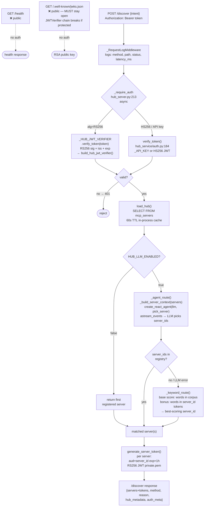
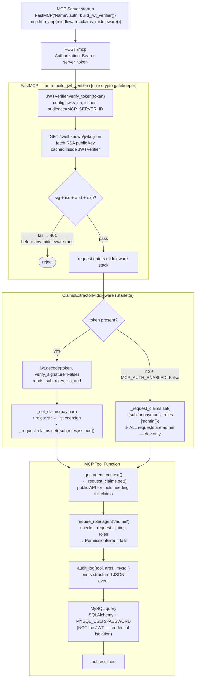

# FAB MCP Hub — Complete Function Call Graph

This document maps every function call from the moment a user submits a query to the moment a tool result is returned, including all auth checks at each boundary. Use it alongside [AUTH.md](AUTH.md) (auth design) and [ARCHITECTURE.md](ARCHITECTURE.md) (system map).

---

## 1. Entry Points and Hub Endpoints

### 1.1 Agent / Chat entry points

| Trigger | Entry function | File |
|---|---|---|
| Chat UI submits a query | `POST /agent/stream` handler | `chat_service/chat_server.py` |
| CLI direct call | `run_agent(query)` | `agent.py` |
| Agent-standalone (no chat) | `run_agent(query)` | `agent.py` |

### 1.2 Hub endpoints

| Endpoint | Auth required | Handler | Notes |
|---|---|---|---|
| `GET /health` | ❌ **public** | `health()` hub_server.py:682 | Returns hub status + server count |
| `GET /.well-known/jwks.json` | ❌ **public** | `jwks()` hub_server.py:695 | Returns RSA public key — **must stay public**; JWTVerifier chain breaks if this is protected |
| `POST /auth/login` | ❌ **public** | `auth_login()` hub_server.py:700 | Credential check → RS256 JWT |
| `GET /servers` | ✅ `readonly` role | `list_servers()` | All active servers |
| `GET /servers/{id}` | ✅ `readonly` role | `get_server()` | Single server by ID |
| `POST /discover` | ✅ `agent` role | `discover()` hub_server.py:790 | Route intent → per-server tokens |
| `GET /api/logs` | ✅ `admin` role | `get_logs()` | Observability ring buffer |

### 1.3 MCP Server startup wiring

Every MCP server initialises with this pattern before accepting requests:

```python
# e.g. pricing_server.py, customer_server.py, …
mcp = FastMCP("Server Name", auth=build_jwt_verifier())   # mcp_server/auth.py:161
                                                           # JWTVerifier = sole crypto gatekeeper

app = mcp.http_app(middleware=claims_middleware())         # mcp_server/auth.py:286
# claims_middleware() = [ClaimsExtractorMiddleware]        # RBAC ContextVar wiring

# uvicorn serves `app` — JWTVerifier + ClaimsExtractorMiddleware are both active
# ⚠ mcp.run() (standalone mode) does NOT wire ClaimsExtractorMiddleware — dev only
```

---

## 2. Complete Call Graph (Text Tree)

### 2.1 Chat UI Path — `run_agent()` full call tree

```
[Browser] POST /agent/stream  →  chat_server.py
  │
  ├─ chat_server: validate user session JWT (HS256 / JWT_SECRET)
  │
  └─ agent.run_agent(query, hub_token=user_session_jwt, on_event=...)   agent.py:1291
       │
       │   # Token resolution: caller-supplied hub_token takes priority over cached login.
       │   # Chat server passes its own session JWT so hub logs show the human user identity.
       │   _hub_token = hub_token or await _get_hub_token()
       │   hub_claims = _decode_jwt_claims(_hub_token)   [observability only]  agent.py:1334
       │   → on_event("auth_hop", from="agent", to="hub", token_hint, sub, roles, iss, exp)
       │
       ├─[1] _get_hub_token()                                            agent.py:179
       │       # Skipped when _hub_token_cache is already populated (process-level cache)
       │       │
       │       ├─ httpx.post("/auth/login", {username, password})
       │       │     → _RequestLogMiddleware logs: POST /auth/login     hub_server.py:114
       │       │     hub_server.auth_login()                            hub_server.py:700
       │       │         credential check (admin or agent user)
       │       │         generate_token(sub, roles, exp=8h)             auth.py:211
       │       │         └─ jwt.encode(payload, private_key, "RS256")
       │       │              payload: {sub, roles, iss="fab-mcp-hub", exp=now+8h}
       │       │         → RS256 JWT returned
       │       │
       │       └─ _verify_hub_token(access_token)                       agent.py:549  [DIRECTION 2a]
       │             ├─ _get_hub_jwt_verifier()                         agent.py:522
       │             │     # Lazy singleton — created once per process
       │             │     JWTVerifier(jwks_uri=hub/.well-known/jwks.json, issuer=fab-mcp-hub)
       │             ├─ verifier.verify_token(token)
       │             │     # JWTVerifier internally does all of the following:
       │             │     [internal] GET /.well-known/jwks.json → hub_server.py:695 → get_jwks() auth.py:103
       │             │     [internal]     → RSA public key (n, e) in JWK format; cached in JWTVerifier
       │             │     [internal] Match kid header → select RSA public key
       │             │     [internal] RS256 signature verified ✓
       │             │     [internal] iss == "fab-mcp-hub" ✓
       │             │     [internal] exp > now ✓
       │             │     HARD fail (sig/iss/exp wrong) → raise (token not cached; login rejected)
       │             │     SOFT fail (JWKS unreachable)  → WARNING + proceed
       │             └─ jwt.decode(token, verify_signature=False) → claims dict
       │                  # Safe: JWTVerifier already validated the token
       │
       ├─[2] httpx.post("/discover", {intent}, Bearer=hub-jwt)
       │       → _RequestLogMiddleware logs: POST /discover              hub_server.py:114
       │       hub_server.discover()                                     hub_server.py:790
       │         │
       │         ├─ _require_agent(claims)                               hub_server.py:288
       │         │     _require_auth(request, creds)    [async]          hub_server.py:213
       │         │         jwt.get_unverified_header(token) → alg
       │         │         │
       │         │         ├─ alg == "RS256":
       │         │         │     _HUB_JWT_VERIFIER.verify_token(token)   # singleton
       │         │         │         # JWTVerifier internally fetches JWKS and verifies:
       │         │         │         [internal] GET /.well-known/jwks.json (cached in JWTVerifier)
       │         │         │         [internal] RS256 sig ✓  iss ✓  exp ✓
       │         │         │     jwt.decode(token, verify=False) → claims
       │         │         │
       │         │         └─ HS256 / API key / other:
       │         │               verify_token(token)                     auth.py:184
       │         │                   _API_KEY match → apikey claims
       │         │                   _verify_jwt_local() → HS256 decode
       │         │                   _verify_jwt_rs256() → last resort
       │         │
       │         │     _require_agent: checks "agent" or "admin" in roles
       │         │     → 403 if neither; → claims dict if passes
       │         │     log_event("auth", valid, sub, roles, token_type, endpoint)
       │         │
       │         ├─ load_hub()                                           hub_server.py:335
       │         │     if cache valid (< 60s): return _hub_cache
       │         │     SQLAlchemy: SELECT id,name,endpoint,transport,capability,
       │         │                        skills,description,examples,start_cmd,api_key
       │         │                 FROM mcp_servers WHERE is_active=1
       │         │     → _hub_cache = {hub_name, version, servers:[…]}
       │         │
       │         ├─ route_to_server(hub, intent)                         hub_server.py:570
       │         │     servers = hub["servers"]
       │         │     │
       │         │     ├─ HUB_LLM_ENABLED=true:
       │         │     │     _agent_route(servers, intent)               hub_server.py:514
       │         │     │         _build_server_context(servers)          hub_server.py:487
       │         │     │         │   # Formats each server's id, capability, description,
       │         │     │         │   # skills, examples into a plain-text block for the LLM
       │         │     │         │   → server_context string
       │         │     │         _make_routing_tools(decision)           hub_server.py:408
       │         │     │         │   → pick_server(server_id, reason) tool
       │         │     │         │     # per-request instance — no shared state between
       │         │     │         │     # concurrent /discover calls
       │         │     │         create_react_agent(_get_llm(), [pick_server],
       │         │     │                            prompt=_ROUTING_PROMPT)
       │         │     │         agent.astream_events(
       │         │     │             {"messages": [HumanMessage(server_context + intent)]})
       │         │     │             on_tool_start  → pick_server(server_id, reason)
       │         │     │             on_tool_end    → "Added 'server_id' (selected: N)"
       │         │     │             on_chat_model_end → LLM reasoning text (logged)
       │         │     │         → (server_ids, reason)
       │         │     │
       │         │     │         if server_ids not in registry: ──► keyword fallback ─┐
       │         │     │                                                               │
       │         │     ├─ LLM disabled or fallback:                                   │
       │         │     │     _keyword_route(servers, intent)  hub_server.py:434  ◄────┘
       │         │     │         q_words = {w for w in intent.lower().split() if len(w)>=4}
       │         │     │         score = base (corpus match) + bonus (server_id token match)
       │         │     │         → best-scoring server_id, or [] (→ default first server)
       │         │     │
       │         │     └─ HUB_LLM_ENABLED=false: return first registered server
       │         │
       │         ├─ generate_server_token(server_id, sub=claims.sub,    auth.py:244
       │         │       roles=claims.roles, expires_hours=1)
       │         │     generate_token(sub, roles, aud=server_id, RS256)  auth.py:211
       │         │         jwt.encode(payload, private_key, "RS256")
       │         │         payload: {sub, roles, iss="fab-mcp-hub",
       │         │                   aud=server_id, server_id, exp=now+1h}
       │         │     # One per-server token per matched server;
       │         │     # aud=server_id makes token cryptographically bound to one MCP server
       │         │
       │         └─ log_event("routing", sub, method, reason, server_ids, intent)
       │              → /discover response: {servers[{id,endpoint,transport,server_token}],
       │                                     method, reason, hub_metadata, auth_meta}
       │
       ├─[3] INBOUND VERIFICATION — verify each per-server JWT           [DIRECTION 2b]
       │       # For each server in /discover response:
       │       _verify_hub_token(server_token, audience=server_id)       agent.py:549
       │           ├─ _get_hub_jwt_verifier()  (cached singleton)         agent.py:522
       │           ├─ verifier.verify_token(token)
       │           │     # JWTVerifier internally fetches JWKS and verifies:
       │           │     [internal] GET /.well-known/jwks.json (cached in JWTVerifier)
       │           │     [internal] RS256 sig ✓  iss ✓  exp ✓
       │           ├─ jwt.decode(token, verify_signature=False) → payload
       │           ├─ manual aud check: payload["aud"] == server_id ✓
       │           │     raises InvalidAudienceError if mismatch → server SKIPPED
       │           │
       │           # Hard fail (sig/iss/aud/exp mismatch) → server skipped entirely
       │           # Soft fail (JWKS unreachable) → WARNING + proceed; MCP server is fallback
       │           # No server_token → server uses api_key/MCP_API_KEY; JWKS check skipped
       │
       ├─[4a] if servers == []:   # /discover returned no matches
       │         _answer_from_hub_meta(query, hub_meta, hub_token, on_event)  agent.py:1214
       │             httpx.get("/servers", Bearer=hub_token) → full server list
       │             llm.ainvoke([HumanMessage(server_context + query)])
       │             # LLM answers hub-meta questions ("what servers are available?")
       │             → on_event("final_answer", content=answer)
       │             → return answer  [exits run_agent]
       │
       └─[4b] if len(servers) == 1:
               answer = await _run_on_server(servers[0], query, on_event)
             else:   # multiple matched servers — run in parallel
               results = await asyncio.gather(
                   *[_run_on_server(s, query, on_event) for s in servers],
                   return_exceptions=True          # one failing server doesn't abort others
               )
               answer = "\n\n".join(
                   f"[{s['id']}]\n{r}" for s, r in zip(servers, results)
                   if not isinstance(r, Exception)
               )

               └─ _run_on_server(server, query, on_event, use_context)    agent.py:846
                       │
                       │   # Token priority (highest wins):
                       │   token = (server.get("server_token")   # 1: per-server RS256 JWT from /discover
                       │         or server.get("api_key")        # 2: per-server DB static key (Admin UI)
                       │         or MCP_API_KEY)                 # 3: shared env fallback (dev)
                       │   hint   = _token_hint(token)
                       │   claims = _decode_jwt_claims(token)    # unverified  [OBSERVABILITY ONLY]
                       │   key_src = "server-token" | "per-server-db" | "env-MCP_API_KEY" | "none"
                       │
                       │   → on_event("mcp_connecting", server_id, endpoint, transport)
                       │   → on_event("auth_hop", from="agent", to="mcp", server_id,
                       │             token_hint, token_full, sub, roles, iss, aud, exp, key_source,
                       │             http_request:{method,url,headers:{Authorization,…}})
                       │
                       ├─ mcp_session(server)                              agent.py:354
                       │     # Same token priority chain as above
                       │     token   = server.get("server_token") or server.get("api_key") or MCP_API_KEY
                       │     headers = _auth_headers(token)   → {"Authorization":"Bearer …"}
                       │     │
                       │     ├─ transport == "streamable-http" (default):
                       │     │     streamablehttp_client(endpoint, headers=headers)
                       │     │         → (read_stream, write_stream, _session_id_cb)
                       │     │     ClientSession(read_stream, write_stream)
                       │     │
                       │     └─ transport == "sse":
                       │           sse_client(endpoint, headers=headers)
                       │               GET /sse  → persistent server→client event stream
                       │               POST /messages → client→server JSON-RPC
                       │               # Both channels carry Authorization header
                       │               # Closing GET stream before session ends → 404 on POST
                       │           ClientSession(read_stream, write_stream)
                       │
                       │     ClientSession.initialize()                    [MCP handshake]
                       │         POST /mcp  {"method":"initialize",…}  Bearer: token
                       │         ┌─ MCP server side ────────────────────────────────────┐
                       │         │  FastMCP JWTVerifier (auth=build_jwt_verifier())      │
                       │         │    JWTVerifier.verify_token(token)  ← called by FastMCP│
                       │         │      [internal] GET /.well-known/jwks.json (cached)   │
                       │         │      [internal] Match kid → RSA public key            │
                       │         │      [internal] RS256 sig ✓  iss="fab-mcp-hub" ✓     │
                       │         │      [internal] aud == MCP_SERVER_ID ✓  exp > now ✓  │
                       │         │    → 401 on ANY failure (before middleware runs)       │
                       │         │                                                        │
                       │         │  ClaimsExtractorMiddleware.dispatch()   auth.py:247   │
                       │         │    auth = request.headers["Authorization"]             │
                       │         │    token = auth.removeprefix("Bearer ")                │
                       │         │    if token:                                            │
                       │         │        payload = jwt.decode(token, verify=False)        │
                       │         │        _set_claims(payload)              auth.py:209   │
                       │         │            # roles: str → list coercion               │
                       │         │            _request_claims.set({sub, roles, iss, aud}) │
                       │         │    elif MCP_AUTH_ENABLED is False:    # dev mode       │
                       │         │        _request_claims.set(                             │
                       │         │            {"sub":"anonymous","roles":["admin"]})        │
                       │         │        # ⚠ ALL requests are admin in dev mode          │
                       │         └──────────────────────────────────────────────────────────┘
                       │
                       ├─[4b-1] load_mcp_tools(session)
                       │           session.list_tools()  → tool definitions
                       │           wraps each as LangChain BaseTool
                       │
                       ├─[4b-2] _fetch_mcp_context(session, query, server_id, on_event)  agent.py:655
                       │           │   (skipped when use_context=False)
                       │           ├─ session.list_prompts()
                       │           │     POST /mcp {"method":"prompts/list"}  Bearer: token
                       │           │     → [{name, description, arguments:[{name,required}]}]
                       │           ├─ session.list_resources()
                       │           │     POST /mcp {"method":"resources/list"}  Bearer: token
                       │           │     → [{uri, name, description, mimeType}]
                       │           ├─ on_event("mcp_capabilities", server_id, prompts, resources)
                       │           ├─ keyword matching: query → prompt_name + prompt_args
                       │           │     _CUST_ID_RE.search(query) → customer_id  agent.py:649
                       │           │     _DEAL_ID_RE.search(query) → deal_id       agent.py:650
                       │           │     rules: "exception/compliance" → exception prompt
                       │           │            "competitor/compare"   → competitor prompt
                       │           │            "pricing/price/deal"   → pricing prompt
                       │           ├─ session.get_prompt(prompt_name, prompt_args)
                       │           │     POST /mcp {"method":"prompts/get",…}  Bearer: token
                       │           │     → [{role, content.text}]  structured workflow messages
                       │           │     → on_event("mcp_prompt_used", prompt_name, prompt_args)
                       │           └─ session.read_resource(uri)
                       │                 POST /mcp {"method":"resources/read",…}  Bearer: token
                       │                 # Only auto-fetched when uri contains:
                       │                 # "policy" | "guide" | "rule" | "action"
                       │                 → on_event("mcp_resource_used", uri)
                       │
                       ├─[4b-3] create_react_agent(llm, tools, prompt=system_prompt)
                       │           # system_prompt = base instruction
                       │           #               + resource_context (if any) appended
                       │           LangGraph ReAct graph
                       │
                       └─[4b-4] agent.astream_events({"messages": initial_messages}, version="v2")
                                   # initial_messages: prompt_messages (if matched)
                                   #                or [HumanMessage(query)] (fallback)
                                   │
                                   ├─ on_chat_model_end (intermediate — tool_calls non-empty)
                                   │     LLM decided which tool to call next
                                   │
                                   ├─ on_tool_start
                                   │     tool_name = event["name"]
                                   │     args      = event["data"]["input"]
                                   │     → on_event("tool_call", tool_name, args, server_id,
                                   │               jsonrpc_request, http_headers, token_full, key_source)
                                   │
                                   │     MCP JSON-RPC:  POST /mcp  Bearer: server_token
                                   │         {"jsonrpc":"2.0","method":"tools/call",
                                   │          "params":{"name":tool_name,"arguments":args}}
                                   │
                                   │         ┌─ MCP server side ─────────────────────────┐
                                   │         │  JWTVerifier.verify_token(token)            │
                                   │         │    [internal] GET /.well-known/jwks.json    │
                                   │         │    [internal] RS256 sig+iss+aud+exp ✓       │
                                   │         │    (per-request; keys cached in JWTVerifier)│
                                   │         │  ClaimsExtractorMiddleware reads claims     │
                                   │         │                                             │
                                   │         │  MCP Tool function:                         │
                                   │         │    get_agent_context() → _request_claims    │
                                   │         │    require_role("agent","admin")  auth.py:104│
                                   │         │        claims = _request_claims.get()        │
                                   │         │        "admin" in roles → pass              │
                                   │         │        any(r in roles) → pass or raise      │
                                   │         │    audit_log(tool, args, "mysql") auth.py:129│
                                   │         │        print structured JSON event           │
                                   │         │    DB query (MYSQL_USER / MYSQL_PASSWORD)    │
                                   │         │    return result dict                        │
                                   │         └─────────────────────────────────────────────┘
                                   │
                                   ├─ on_tool_end
                                   │     → on_event("tool_rbac", tool_name, server_id, sub,
                                   │               roles, token_hint, result="PASS")
                                   │     → on_event("tool_result", tool_name, result, jsonrpc_response)
                                   │     if '"auth_pattern"' in result:
                                   │         → on_event("external_tool_call", tool_name,
                                   │                   server_id, external_service, auth_pattern)
                                   │     result → LLM (next inference pass)
                                   │
                                   └─ on_chat_model_end (final — tool_calls empty)
                                         answer = output.content
                                         → on_event("final_answer", content=answer)
                                         return answer
```

---

## 3. Mermaid Sequence Diagram — Full Request Flow

> **Key:** `JWTVerifier` is a library object that lives *inside* the caller (Agent, Hub, or MCP).
> The caller never calls `GET /.well-known/jwks.json` directly — `JWTVerifier.verify_token()`
> does it internally as its first step, then caches the fetched keys.
> Arrows from `JWTVerifier` to `JWKS` represent that internal fetch.

```mermaid
sequenceDiagram
    autonumber
    participant Browser
    participant Chat as chat_server.py
    participant Agent as agent.py
    participant Hub as hub_server.py
    participant Auth as hub_service/auth.py
    participant JV as JWTVerifier<br/>(library — inside Agent / Hub / MCP)
    participant JWKS as GET /.well-known/jwks.json<br/>❌ public — no auth
    participant MCP as MCP Server
    participant DB as MySQL

    Browser->>Chat: POST /agent/stream (user query)
    Chat->>Chat: validate session JWT (HS256/JWT_SECRET)

    Note over Agent,Hub: Step 1 — Agent login (once per process; cached)
    Agent->>Hub: POST /auth/login {username, password}
    Hub->>Hub: _RequestLogMiddleware logs request
    Hub->>Auth: generate_token(sub, roles, RS256, exp=8h)
    Auth->>Auth: jwt.encode(payload, private.pem)
    Auth-->>Hub: RS256 JWT {sub, roles, iss=fab-mcp-hub, exp=now+8h}
    Hub-->>Agent: {access_token}

    Note over Agent,JWKS: Direction 2a — Agent verifies hub-issued JWT via JWTVerifier
    Agent->>JV: _verify_hub_token → verifier.verify_token(access_token)
    JV->>JWKS: GET /.well-known/jwks.json [internal to JWTVerifier; cached]
    JWKS-->>JV: RSA public key (n, e)
    JV->>JV: RS256 sig ✓  iss=fab-mcp-hub ✓  exp ✓
    JV-->>Agent: verified (or raises on failure)
    Agent->>Agent: jwt.decode(token, verify=False) → claims dict

    Note over Agent,Hub: Step 2 — Discover + route
    Agent->>Agent: _decode_jwt_claims(hub_token) [observability only]
    Agent->>Hub: POST /discover {intent}<br/>Authorization: Bearer hub-jwt
    Hub->>Hub: _RequestLogMiddleware logs request
    Hub->>Hub: _require_auth: jwt.get_unverified_header → alg=RS256
    Hub->>JV: _HUB_JWT_VERIFIER.verify_token(hub-jwt)
    JV->>JWKS: GET /.well-known/jwks.json [cached in JWTVerifier]
    JWKS-->>JV: RSA public key
    JV->>JV: RS256 sig ✓  iss ✓  exp ✓
    JV-->>Hub: verified
    Hub->>Hub: jwt.decode(token, verify=False) → claims
    Hub->>Hub: load_hub() → MySQL mcp_servers (60s TTL cache)
    Hub->>Hub: _agent_route: _build_server_context → LLM picks server_id
    Hub->>Auth: generate_server_token(server_id, sub, roles, exp=1h)
    Auth->>Auth: jwt.encode({aud=server_id, exp=now+1h}, private.pem)
    Hub-->>Agent: [{id, endpoint, server_token(aud=server_id)}]

    Note over Agent,JWKS: Direction 2b — Agent verifies each per-server JWT
    Agent->>JV: _verify_hub_token → verifier.verify_token(server_token)
    JV->>JWKS: GET /.well-known/jwks.json [cached]
    JWKS-->>JV: RSA public key
    JV->>JV: RS256 sig ✓  iss ✓  exp ✓
    JV-->>Agent: verified
    Agent->>Agent: manual aud check: payload.aud == server_id ✓

    Note over Agent,MCP: Step 4 — MCP session + tool execution
    Agent->>Agent: _decode_jwt_claims(server_token) [observability only]
    Agent->>MCP: POST /mcp initialize<br/>Authorization: Bearer server_token
    MCP->>JV: FastMCP JWTVerifier.verify_token(server_token)
    JV->>JWKS: GET /.well-known/jwks.json [cached in MCP's JWTVerifier]
    JWKS-->>JV: RSA public key
    JV->>JV: RS256 sig ✓  iss ✓  aud=server_id ✓  exp ✓
    JV-->>MCP: verified (or 401)
    MCP->>MCP: ClaimsExtractorMiddleware:<br/>jwt.decode → _set_claims → _request_claims ContextVar
    MCP-->>Agent: MCP initialized

    Agent->>MCP: list_prompts() / list_resources()
    MCP-->>Agent: prompts + resources catalogues

    Agent->>MCP: get_prompt(name, args) / read_resource(uri)
    MCP-->>Agent: structured messages + reference docs

    Agent->>Agent: create_react_agent(llm, tools, prompt=system+resources)
    Agent->>Agent: LLM inference → decides: call tool X with args Y

    Agent->>MCP: POST /mcp tools/call {name, arguments}<br/>Authorization: Bearer server_token
    MCP->>JV: FastMCP JWTVerifier.verify_token(server_token) [per-request]
    JV->>JWKS: GET /.well-known/jwks.json [cached]
    JWKS-->>JV: RSA public key
    JV->>JV: RS256 sig ✓  iss ✓  aud ✓  exp ✓
    JV-->>MCP: verified
    MCP->>MCP: ClaimsExtractorMiddleware → _request_claims refreshed
    MCP->>MCP: get_agent_context() → claims / require_role ✓ / audit_log
    MCP->>DB: SQL query (MYSQL_USER/MYSQL_PASSWORD — NOT the JWT)
    DB-->>MCP: result rows
    MCP-->>Agent: tool result

    Agent->>Agent: LLM → final answer (tool_calls empty)
    Agent-->>Chat: answer string
    Chat-->>Browser: SSE stream → rendered answer
```

---

## 4. Mermaid Sequence Diagram — Auth Layer Only

Strips MCP protocol detail to show only the security enforcement boundaries.
`JWTVerifier` is shown as a separate participant because it is the actor that
actually calls `GET /.well-known/jwks.json` — not the Agent, Hub, or MCP server.

```mermaid
sequenceDiagram
    autonumber
    participant Agent as agent.py
    participant Hub as hub_server.py<br/>_require_auth [async]
    participant Auth as auth.py
    participant JV as JWTVerifier<br/>(library — inside Agent / Hub / MCP)
    participant JWKS as /.well-known/jwks.json<br/>❌ public — no auth
    participant MCP as MCP Server<br/>(FastMCP + ClaimsExtractorMiddleware)
    participant Tool as MCP Tool fn<br/>require_role()

    Note over Agent,Auth: OUTBOUND — agent presents tokens
    Agent->>Hub: POST /auth/login (credentials)
    Hub->>Auth: generate_token(RS256, private.pem)
    Auth-->>Agent: hub-jwt {sub, roles, iss=fab-mcp-hub, exp=8h}

    Agent->>Hub: POST /discover  Bearer: hub-jwt
    Hub->>Hub: jwt.get_unverified_header(token) → alg=RS256
    Hub->>JV: _HUB_JWT_VERIFIER.verify_token(hub-jwt)
    JV->>JWKS: GET /.well-known/jwks.json [internal fetch; cached]
    JWKS-->>JV: RSA public key
    JV->>JV: RS256 sig ✓  iss ✓  exp ✓
    JV-->>Hub: verified
    Hub->>Auth: generate_server_token(server_id, sub, roles, exp=1h)
    Hub-->>Agent: servers + server_token[aud=server_id, exp=1h]

    Agent->>MCP: POST /mcp  Bearer: server_token
    MCP->>JV: FastMCP JWTVerifier.verify_token(server_token)
    JV->>JWKS: GET /.well-known/jwks.json [internal fetch; cached]
    JWKS-->>JV: RSA public key
    JV->>JV: RS256 sig ✓  iss ✓  aud=server_id ✓  exp ✓
    JV-->>MCP: verified (or 401 before any tool code runs)

    Note over Agent,JWKS: INBOUND — agent verifies tokens it receives [Direction 2]
    Agent->>JV: _verify_hub_token → verifier.verify_token(hub-jwt) [Dir 2a]
    JV->>JWKS: GET /.well-known/jwks.json [internal fetch; cached]
    JWKS-->>JV: RSA public key
    JV->>JV: RS256 sig ✓  iss ✓  exp ✓
    JV-->>Agent: verified
    Agent->>JV: _verify_hub_token → verifier.verify_token(server_token) [Dir 2b]
    JV->>JWKS: GET /.well-known/jwks.json [cached]
    JWKS-->>JV: RSA public key
    JV->>JV: RS256 sig ✓  iss ✓  exp ✓
    JV-->>Agent: verified
    Agent->>Agent: manual aud check: payload.aud == server_id ✓

    Note over MCP,Tool: RBAC inside every tool call
    MCP->>MCP: ClaimsExtractorMiddleware:<br/>jwt.decode(verify=False) → _set_claims → _request_claims ContextVar
    MCP->>Tool: tool function called
    Tool->>Tool: get_agent_context() → _request_claims.get()
    Tool->>Tool: require_role("agent","admin") ✓
    Tool->>Tool: audit_log(tool, args, "mysql") → structured JSON event
```

---

## 5. Mermaid Flow — Hub Routing Logic



---

## 6. Mermaid Flow — MCP Server Auth Stack



---

## 7. `on_event` Callback Inventory

Every call to `on_event({…})` in `agent.py` streams a structured dict to the chat UI. The event `type` determines how the chat UI renders it (Security tab, tool trace, etc.).

| `type` | Emitted in | Key fields | Purpose |
|---|---|---|---|
| `auth_hop` | `run_agent` (agent→hub) | `from, to, token_hint, token_full, sub, roles, iss, exp, hub_url` | First hop in Security tab |
| `auth_hop` | `_run_on_server` (agent→mcp) | `from, to, server_id, token_hint, token_full, sub, roles, aud, key_source, http_request` | Per-server auth hop |
| `auth_hop` (rejected) | `_run_on_server` on 401 | `valid=False, token_hint="REJECTED-401", error` | Red failure card in Security tab |
| `hub_loaded` | `run_agent` after /discover | `hub_name, server_ids, servers, method, reason, hub_request, hub_response` | Hub discovery result |
| `routing` | `run_agent` after /discover | `server_ids, method, reason, intent, hub_request, hub_response` | Routing decision trace |
| `mcp_connecting` | `_run_on_server` before session | `server_id, endpoint, transport` | "connecting…" UI state |
| `mcp_capabilities` | `_fetch_mcp_context` | `server_id, prompts:[{name,description,arguments}], resources:[{uri,name}]` | Prompts + resources discovered |
| `mcp_prompt_used` | `_fetch_mcp_context` after get_prompt | `server_id, prompt_name, prompt_args, message_count` | Which prompt template matched |
| `mcp_resource_used` | `_fetch_mcp_context` after read_resource | `server_id, uri, content_length` | Which resource docs were fetched |
| `mcp_connected` | `_run_on_server` after tool load | `server_id, tool_names, tool_count, prompt_count, has_resources` | Session ready |
| `tool_call` | `_run_on_server` on `on_tool_start` | `tool_name, args, server_id, jsonrpc_request, http_headers, token_full, key_source` | Tool call detail |
| `tool_rbac` | `_run_on_server` on `on_tool_end` | `tool_name, server_id, sub, roles, result="PASS"` | RBAC check passed |
| `tool_result` | `_run_on_server` on `on_tool_end` | `tool_name, result, server_id, jsonrpc_response` | Tool return value |
| `external_tool_call` | `_run_on_server` on `on_tool_end` | `tool_name, server_id, external_service, auth_pattern` | MCP→external service hop |
| `final_answer` | `_run_on_server` / `_answer_from_hub_meta` | `content` | Completed answer |
| `error` | Multiple locations | `message` | User-readable error hint |

---

## 8. Key Function Index

| Function | File | Line | Role |
|---|---|---|---|
| `run_agent()` | `agent.py` | 1291 | Top-level orchestrator; resolves hub token; calls /discover; dispatches to server(s) |
| `_get_hub_token()` | `agent.py` | 179 | Login + process-level cache; POST /auth/login; calls `_verify_hub_token` [Dir 2a] |
| `_verify_hub_token()` | `agent.py` | 549 | Inbound token verification via `JWTVerifier`; hard/soft failure tiers [Dir 2a/2b] |
| `_get_hub_jwt_verifier()` | `agent.py` | 522 | Lazy singleton `JWTVerifier(jwks_uri, issuer)` — no audience; shared across all calls |
| `_decode_jwt_claims()` | `agent.py` | 472 | Unverified decode — **observability only, never auth**; used in `run_agent` + `_run_on_server` |
| `_answer_from_hub_meta()` | `agent.py` | 1214 | Fallback when /discover returns 0 servers; LLM answers from hub metadata |
| `mcp_session()` | `agent.py` | 354 | Context manager; resolves token priority; opens SSE or streamable-HTTP client session |
| `_auth_headers()` | `agent.py` | 344 | Returns `{"Authorization": "Bearer …"}` or `{}` (dev mode) |
| `_run_on_server()` | `agent.py` | 846 | Per-server ReAct loop: token resolution + MCP session + tools + context + LLM stream |
| `_fetch_mcp_context()` | `agent.py` | 655 | Prompts + resources discovery; keyword matching to prompt template; resource auto-fetch |
| `_require_auth()` | `hub_server.py` | 213 | **async** FastAPI dep; routes by `alg` header: RS256→`JWTVerifier`; HS256/key→`verify_token` |
| `_require_agent()` | `hub_server.py` | 288 | Role guard: `agent` or `admin`; wraps `_require_auth` |
| `_require_admin()` | `hub_server.py` | 296 | Role guard: `admin` only; wraps `_require_auth` |
| `_require_readonly()` | `hub_server.py` | 303 | Role guard: `readonly`, `agent`, or `admin`; wraps `_require_auth` |
| `_classify_token()` | `hub_server.py` | 311 | Maps claims `_source` + `sub` → `"jwt"` / `"apikey"` / `"dev"` for observability logging |
| `_RequestLogMiddleware` | `hub_server.py` | 114 | App-level middleware; logs every HTTP request (method, path, status, latency_ms) |
| `discover()` | `hub_server.py` | 790 | `/discover`: auth → `load_hub` → `route_to_server` → `generate_server_token` per server |
| `auth_login()` | `hub_server.py` | 700 | `/auth/login`: credential check → `generate_token(RS256, exp=8h)` |
| `load_hub()` | `hub_server.py` | 335 | MySQL `mcp_servers` SELECT with 60s in-process TTL cache |
| `route_to_server()` | `hub_server.py` | 570 | LLM or keyword routing dispatcher; returns (matched_servers, method, reason) |
| `_agent_route()` | `hub_server.py` | 514 | LangGraph ReAct routing: `_build_server_context` + `pick_server` tool + LLM |
| `_build_server_context()` | `hub_server.py` | 487 | Formats server registry as plain text for LLM routing message |
| `_keyword_route()` | `hub_server.py` | 434 | Deterministic fallback: additive score (corpus match + server_id token bonus) |
| `build_hub_jwt_verifier()` | `hub_service/auth.py` | 134 | Factory: `JWTVerifier(jwks_uri=hub JWKS, issuer)`; no audience (hub login tokens have no aud) |
| `generate_token()` | `hub_service/auth.py` | 211 | Mint RS256 JWT with RSA private key; base for all hub-issued tokens |
| `generate_server_token()` | `hub_service/auth.py` | 244 | Scoped variant: `aud=server_id`, `exp=1h`; calls `generate_token` |
| `get_jwks()` | `hub_service/auth.py` | 103 | Build JWKS JSON doc from RSA public key (n, e in base64url) |
| `verify_token()` | `hub_service/auth.py` | 184 | HS256 / API-key / RS256 fallback; backward-compat for chat UI and static keys |
| `build_jwt_verifier()` | `mcp_server/auth.py` | 161 | Factory: `JWTVerifier(jwks_uri, issuer, audience=MCP_SERVER_ID)` — sole MCP crypto gate |
| `claims_middleware()` | `mcp_server/auth.py` | 286 | Returns `[ClaimsExtractorMiddleware]`; wired via `mcp.http_app(middleware=…)` |
| `ClaimsExtractorMiddleware` | `mcp_server/auth.py` | 226 | Unverified decode → `_set_claims` → `_request_claims` ContextVar; dev-mode admin grant |
| `_set_claims()` | `mcp_server/auth.py` | 209 | Normalises roles (str→list); populates `_request_claims` ContextVar |
| `get_agent_context()` | `mcp_server/auth.py` | 89 | Public API for tool functions to read current caller's claims dict |
| `require_role()` | `mcp_server/auth.py` | 104 | RBAC: raises `PermissionError` if caller lacks required role; admin bypasses all checks |
| `audit_log()` | `mcp_server/auth.py` | 129 | Structured JSON audit event: tool + service + sub + roles + args_keys (no values — PII) |

---

## 9. Auth Boundary Summary

```
Layer            Function / Class                  Validator                       Credential
───────────────  ────────────────────────────────  ──────────────────────────────  ─────────────────────────────
Hub login        auth_login() hub_server.py:700    username+password check         HUB_AGENT_PASSWORD / admin pw
Hub endpoint     _require_auth hub_server.py:213   JWTVerifier (RS256 alg path)    Agent RS256 hub-jwt
                                                   verify_token() (HS256 path)     Chat UI HS256 JWT / HUB_API_KEY
Agent inbound    _verify_hub_token agent.py:549    JWTVerifier (same library)      Hub-issued RS256 JWT
MCP gateway      FastMCP JWTVerifier               JWTVerifier (sig+iss+aud+exp)   Per-server RS256 JWT (aud=id)
MCP claims       ClaimsExtractorMiddleware         unverified decode (safe)        Already-validated JWT
MCP RBAC         require_role mcp_server/auth:104  _request_claims ContextVar      Roles extracted from token
MySQL            SQLAlchemy engine                 DB driver (TCP)                 MYSQL_USER / MYSQL_PASSWORD
External APIs    tool fn → httpx                   per-tool auth header            MCP_TOOL_KEY (not the JWT)
JWKS endpoint    GET /.well-known/jwks.json        ❌ public — no auth required    — (public key, not secret)
```

Token never forwarded across layers: JWT stops at the MCP boundary. MySQL uses its own credentials. External APIs use `MCP_TOOL_KEY`.
