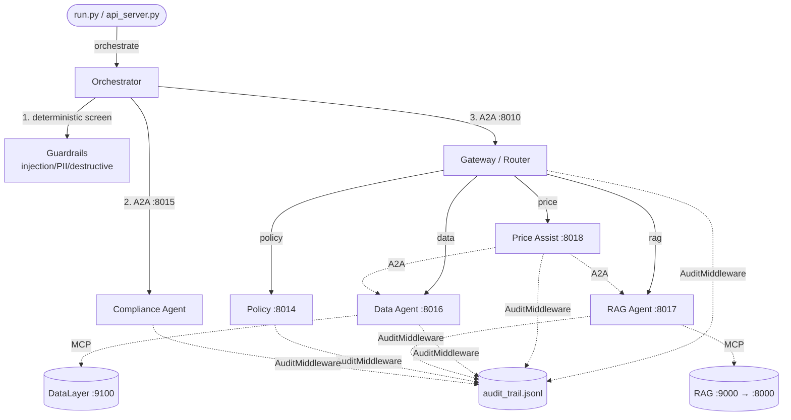
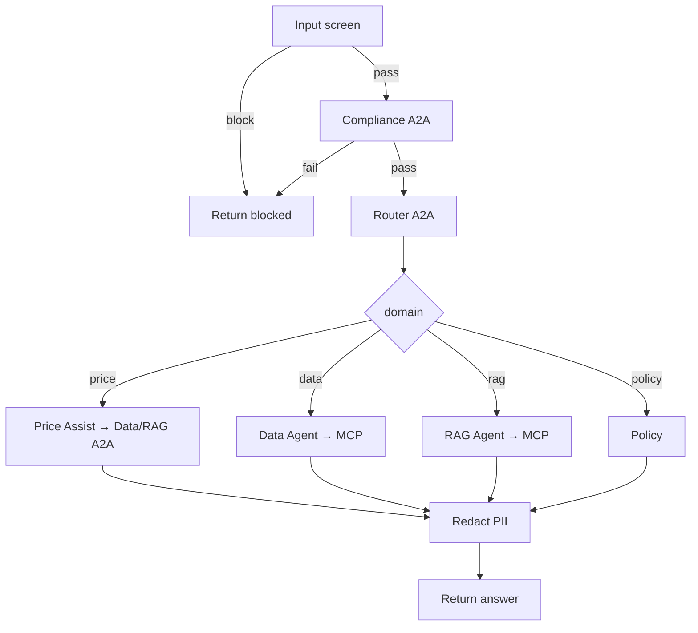

# Agent Mesh — End-to-End Codebase Explanation

A complete walkthrough of the `agent-mesh` project: what it is, how it is structured as a **distributed agent-to-agent (A2A) mesh**, how a request flows through the system, and the security model.

---

## 1. What this project is

A **distributed multi-agent system on the Microsoft Agent Framework (Python SDK)** — the FAB Pricing Assistant Mesh. A user asks a pricing/policy question; the orchestrator screens it, routes it to a specialist agent, and returns a redacted answer.

A **Price Assist** coordinator agent composes answers across two thin specialist agents:
- **Data Agent** → DataLayer-as-a-Service over MCP (structured: customer/deal data).
- **RAG Agent** → RAG-as-a-Service over MCP (unstructured: policy documents).

The Data/RAG agents hold no business logic — it lives in the independent services. Shared **Compliance** and **Policy** agents plus deterministic guardrails provide defense-in-depth.

---

## 2. High-level architecture



Each node is an `agent_framework` Agent wrapped by `A2AExecutor` and served over HTTP (`src/a2a/hosting.py`); reached via `A2AAgent` (`src/a2a/clients.py`). MCP-backed nodes keep a live MCP session open for their lifetime (`a2a_server.py`).

---

## 3. Component-by-component

| File | Role |
|------|------|
| `run.py` / `api_server.py` | CLI client / REST bridge for the React frontend |
| `launch_mesh.py` | Spawns all six nodes, one isolated process/port each |
| `a2a_server.py` | Generic A2A server: `--agent <node>` (async serve for MCP-backed nodes) |
| `src/config.py` | `AGENT_PORTS`, `*_MCP_URL`, `A2A_TIMEOUT`, observability |
| `src/a2a/hosting.py` / `clients.py` | Host an agent / `ask_remote()` call a node |
| `src/integrations/mcp_clients.py` | `MCPStreamableHTTPTool` factories (DataLayer, RAG) |
| `src/mesh/orchestrator.py` | Pipeline driver: guardrail → compliance → router → domain → redact |
| `src/mesh/workflow.py` | `MeshState` + the 5 executors + `WorkflowBuilder` graph |
| `src/agents/gateway_agent.py` | Router: classify → `price/data/rag/policy` + `domain_to_node` |
| `src/agents/price_assist_agent.py` | Coordinator; tools delegate to peers over A2A |
| `src/tools/collaboration_tools.py` | `query_structured_data` / `query_policy_documents` (A2A peer calls) |
| `src/agents/data_agent.py` / `rag_agent.py` | Thin MCP-backed agents |
| `src/agents/policy_agent.py` / `compliance_agent.py` | Policy KB / semantic safety reviewer |
| `src/agents/node_registry.py` | Node name → builder + card; `MCP_BACKED_NODES` |
| `src/middleware/audit_middleware.py` | Per-call audit + PII redaction |
| `data/policies.json` | Corporate policy knowledge base |
| `test_agent_mesh.py` | Offline tests (A2A + MCP mocked) |

---

## 4. Step-by-step execution flow

**Startup:** `python launch_mesh.py` spawns six processes: `policy:8014`, `compliance:8015`, `data_agent:8016`, `rag_agent:8017`, `price_assist:8018`, `gateway:8010`. The Data/RAG nodes open MCP sessions to the backing services (start those first).

**Client:** `python run.py` → mock login → query → `handle_request()` in `src/mesh/orchestrator.py`:

1. **Input screen** (`screen_input`): regex gate for injection/PII/destructive. A hit blocks immediately.
2. **Compliance (A2A → 8015)**: semantic safety review. `COMPLIANCE_FAILED` blocks.
3. **Router (A2A → gateway:8010)**: `parse_domain()` → `price | data | rag | policy` → node.
4. **Domain dispatch (A2A)**: hop to the resolved node. `price_assist` further calls `data_agent`/`rag_agent` over A2A (its collaboration tools) and synthesizes. A failed hop soft-fails to an "unavailable" answer.
5. **Output redaction** (`redact_pii`): scrub PII before returning.

Every hop is logged by `AuditMiddleware` and joins one `mesh.request` distributed trace.

### Control flow



---

## 5. Security model (defense in depth)

- **Layer 1 — deterministic filters** (`src/guardrails`): regex gates before any LLM and again on output.
- **Layer 2 — Compliance agent**: semantic review for injection/leakage/harm (fails closed).
- **Layer 3 — graceful degradation**: A2A/MCP hops soft-fail; a `ContextVar` depth guard bounds peer delegation.
- **Audit**: every A2A/MCP hop logged with PII redacted.

---

## 6. Microsoft Agent Framework features used

1. **A2A protocol** — `A2AExecutor` (host) + `A2AAgent` (client); each node isolated on its own port.
2. **MCP tool consumption** — `MCPStreamableHTTPTool` auto-discovers external service tools (thin agents).
3. **Agent-as-tool** — Price Assist calls peer agents as tools via `ask_remote()`.
4. **Workflow orchestration** — typed `WorkflowBuilder` pipeline emitting native spans.
5. **Agent middleware** — `AuditMiddleware`.
6. **Local LLM** — `OllamaChatClient`.

---

## 7. How to run

```bash
pip install -r requirements.txt
# Backing services first:
cd datalayer-as-service && MCP_TRANSPORT=http MCP_PORT=9100 python -m mcp_server.server
cd rag-as-a-service && uvicorn gernas_rag.main:app --app-dir src        # :8000
MCP_TRANSPORT=http MCP_PORT=9000 python -m mcp_integration.server       # :9000
# Mesh:
cd agent-mesh && python launch_mesh.py     # 6 nodes
python run.py                              # login + chat
python -m unittest test_agent_mesh.py      # offline tests
```

Demo users: `alice` (leadership), `carol` (hr), `bob`/`dave` (employee).

---

## 8. Future work

- Use the RAG service's richer REST surface (filters/ingest/evaluate) where MCP is insufficient.
- Real identity provider; database-backed session store; tamper-evident audit log.
