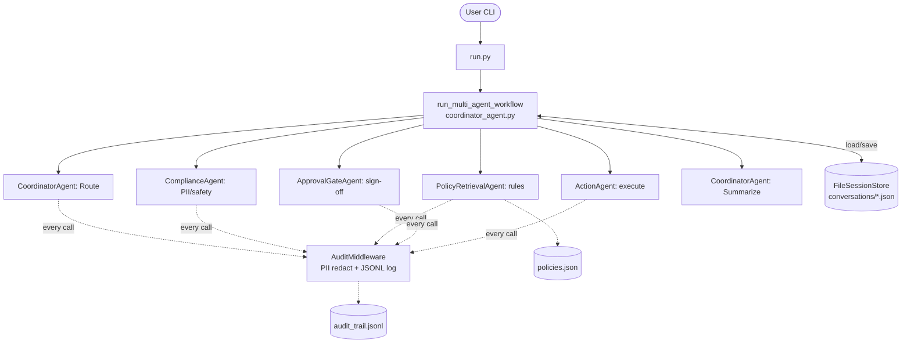
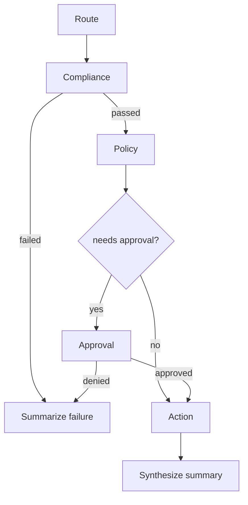

# Agent Mesh — End-to-End Codebase Explanation

A complete walkthrough of the `agent-mesh` project: what it is, how it is structured, how a request flows through the system step by step, known correctness issues, and the areas of improvement required to make it production-grade.

---

## 1. What this project is

A **reference demo for the Microsoft Agent Framework (Python SDK)** that simulates a *Policy-Aware Employee Action Request Assistant*. A user types a request (e.g. "Can I access the finance folder?") and a **mesh of 5 specialist LLM agents** cooperate to route, check compliance, look up policy, gate on approval, execute a simulated action, and summarize — all powered by a **local Ollama LLM**, with audit logging and file-based session memory.

---

## 2. High-level architecture

Every agent is built the same way via `agent_factory.py` → wraps an `OllamaChatClient` + attaches `AuditMiddleware`. Only the **instructions** (system prompt) differ per agent.

---

## 3. Component-by-component

| File | Role |
|------|------|
| `run.py` | CLI entry point — banner, interactive loop, calls the workflow |
| `src/config.py` | Loads env vars (Ollama host/model, file paths), `validate()` |
| `src/agents/agent_factory.py` | Factory `create_demo_agent()` — Ollama client + audit middleware |
| `src/agents/coordinator_agent.py` | The **orchestrator** `run_multi_agent_workflow()` + Coordinator agent |
| `src/agents/policy_retrieval_agent.py` | Policy Retrieval Agent (rules embedded in prompt) |
| `src/agents/compliance_agent.py` | Compliance/PII guardrail agent |
| `src/agents/approval_gate_agent.py` | Approval Gate agent (manager sign-off) |
| `src/agents/action_execution_agent.py` | Action/Execution agent (simulated) |
| `src/agents/mesh_workflow.py` | Wraps the orchestration as a `WorkflowBuilder` executor for **DevUI** |
| `src/memory/session_store.py` | `FileSessionStore` — JSON conversation history per session |
| `src/middleware/audit_middleware.py` | Intercepts each agent call, redacts PII, writes JSONL + latency |
| `src/utils/console_logger.py` | ANSI-colored console logging |
| `data/policies.json` | Knowledge base (finance access, travel reimbursement, general) |
| `test_agent_mesh.py` | Offline unit tests with a `LocalMockChatClient` (no Ollama needed) |

---

## 4. Step-by-step execution flow

When you run `python run.py`:

1. **Startup** (`run.py`): `Config.validate()` checks Ollama host/model → prints banner → generates a `session_id` (`session_<hex>`) → enters the input loop.
2. **User input**: `exit`/`quit` breaks, `clear` wipes the session file, otherwise calls `run_multi_agent_workflow(user_query, session_id)`.

Inside `run_multi_agent_workflow()` (`coordinator_agent.py`) — a **procedural sequential orchestration**:

3. **Load context**: `memory.get_context_summary(session_id)` reads prior turns; user message appended to history.
4. **STEP 1 – Routing**: `CoordinatorAgent.run()` analyzes the query and emits a routing decision.
5. **STEP 2 – Compliance**: `ComplianceAgent.run()` scans for PII. If the response text contains `"failed"`, the workflow **short-circuits** → coordinator synthesizes a failure summary → returns.
6. **STEP 3 – Policy**: `PolicyRetrievalAgent.run()` returns applicable rules.
7. **STEP 4 – Approval gate**: A Python check — `needs_approval = "requires manager approval" in policy_text or "restricted" in policy_text`. If true, `ApprovalGateAgent.run()` is called. If the result contains `"denied"`/`"rejected"`, **short-circuit** → failure summary → return. Otherwise it defaults to auto-approved.
8. **STEP 5 – Action**: `ActionAgent.run()` simulates execution (folder provisioning / payout).
9. **STEP 6 – Synthesis**: Coordinator gets a consolidated prompt (compliance + policy + approval + action) and produces the final user-facing summary.
10. **Throughout**: Each `agent.run()` passes through `AuditMiddleware.process()`, which times the call, redacts emails/SSNs from inputs & outputs, and appends a JSON line to `audit_trail.jsonl`. Each step is also persisted via `memory.append_message()`.

### Control flow (the branching gates)

**Two parallel ways to run it:** the CLI (`run.py`) and the **DevUI workflow** (`mesh_workflow.py`), which wraps the same `run_multi_agent_workflow` inside a `MultiAgentMeshExecutor` so it appears in the Agent Framework dashboard.

**Testing** (`test_agent_mesh.py`): Patches `OllamaChatClient` with a deterministic `LocalMockChatClient` that pattern-matches the system prompt + query to return canned responses, so the full mesh is testable offline.

---

## 5. Key design observations & correctness issues

A few things stand out where the **docs and code disagree**, or where logic is fragile:

1. **"Human-in-the-loop" is not actually interactive.** The README and `architecture.md` claim the Approval Gate prompts the operator with `Approve this sensitive request? (yes/no)`. But `coordinator_agent.py` just calls `approval_agent.run()` — an LLM, no `input()`. The approval is simulated, not human-driven.
2. **Control flow depends on fragile string matching.** Gating on substrings like `"failed"`, `"denied"`, `"restricted"` in free-form LLM text is brittle — a model rewording its answer can silently bypass a guardrail. This is a real **security weakness** for anything beyond a demo.
3. **The real PII guardrail is the LLM, not deterministic code.** The `ComplianceAgent` relies on the LLM to detect PII. The regex redaction in `AuditMiddleware` only scrubs *logs* — it does not block the request. So PII enforcement is non-deterministic.
4. **Per-call agent re-instantiation.** Every workflow invocation rebuilds all 5 agents and a new `OllamaChatClient` — fine for a demo, wasteful at scale.
5. **Silent exception swallowing.** `FileSessionStore` and `AuditMiddleware` use bare `except: pass`. Audit-log write failures vanish — unacceptable for a compliance audit trail.
6. **`policies.json` is loaded by no one.** Policy rules are hard-coded inside the agent's prompt string in `policy_retrieval_agent.py`; the JSON file is never actually read. The KB and the agent can drift apart.
7. **No concurrency safety.** `FileSessionStore` does read-modify-write without locking — concurrent turns on the same session can lose data.

---

## 6. Areas of improvement to make it production-grade

### Reliability & correctness
- Replace substring-based gating with **structured agent outputs** (JSON / Pydantic schema: `{decision: PASS|FAIL, reason, ...}`) and branch on typed fields, not text.
- Make compliance & policy **deterministic code paths** (regex/validators + the actual `policies.json`), using the LLM only for explanation, not for the security decision.
- Actually load and parse `policies.json` into the Policy agent so rules are single-sourced.

### Security
- Enforce PII blocking before any downstream processing (not just log redaction); expand detectors (phone, credit card, addresses) and consider a vetted library (e.g. Presidio).
- Add authn/authz — today any caller can request finance access; there's no real user identity.
- Implement genuine human-in-the-loop using the framework's interrupt/approval primitives, with a real approver identity recorded in the audit log.
- Validate/limit input length to mitigate prompt-injection and resource abuse.

### Observability & audit integrity
- Stop swallowing exceptions; log failures and surface audit-write errors loudly (an audit trail that can silently fail is not an audit trail).
- Add structured logging (JSON to stdout) + the `--instrumentation` OpenTelemetry tracing already hinted in the README; add correlation/trace IDs spanning the whole workflow.
- Make audit logging append atomic and tamper-evident (e.g. hash chaining) for compliance use.

### State & scalability
- Swap `FileSessionStore` for a real store (Redis/Postgres) with transactions and locking; add history trimming/summarization so prompts don't grow unbounded.
- Reuse agent/client instances (or pool connections) instead of rebuilding per request.
- Add retries, timeouts, and circuit-breaking around the Ollama calls; handle model-unavailable gracefully.

### Quality & ops
- Add typed config validation (e.g. Pydantic Settings), a real `.env.example`, and fail-fast on missing required vars.
- Expand tests: error paths, short-circuit branches, middleware redaction, and concurrency — current tests mostly cover happy paths.
- Add CI, linting (ruff/mypy), dependency pinning, and containerization.
