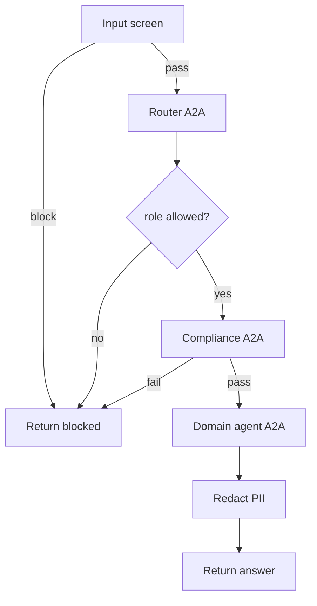

# Agent Mesh — End-to-End Codebase Explanation

A complete walkthrough of the `agent-mesh` project: what it is, how it is structured as a **distributed agent-to-agent (A2A) mesh**, how a request flows through the system step by step, and the security model.

---

## 1. What this project is

A **distributed multi-agent system built on the Microsoft Agent Framework (Python SDK)**. It models a *Role-Aware Enterprise Assistant Mesh*: an employee (or leader) asks a question, and a mesh of independent agents — **each running as its own A2A server on an isolated port** — cooperate to route, guard, and answer it.

Three **domain agents** (Finance, HR, Internal Job) serve different business needs, gated by **role-based access control** and **defense-in-depth guardrails**, with shared **Policy** and **Compliance** agents. Domain agents use **framework tool-calling** (`@tool`, hardcoded now / MCP-ready) and the Finance agent's payment tool uses the SDK's **native human-in-the-loop approval**.

---

## 2. High-level architecture (distributed A2A mesh)

```mermaid
graph TD
    CLI([run.py CLI<br/>mock login + role]) -->|orchestrate| ORCH[Mesh Orchestrator]
    ORCH -->|1. deterministic screen| GR[Guardrails<br/>injection/PII/destructive]
    ORCH -->|2. A2A :8010| GW[Gateway / Router]
    ORCH -->|3. role access control| AC{allowed?}
    ORCH -->|4. A2A :8015| COMP[Compliance Agent]
    AC -->|finance + leadership| FIN[Finance :8011]
    AC -->|hr| HR[HR :8012]
    AC -->|internal_job| JOB[Internal Job :8013]
    FIN -->|@tool| FT[finance_tools<br/>+ approval gate]
    HR -->|@tool| HT[hr_tools]
    JOB -->|@tool| JT[job_tools → job_postings.json]
    FIN & HR & JOB -.->|consult_policy A2A :8014| POL[Policy :8014]
    GW & FIN & HR & JOB & POL & COMP -.->|AuditMiddleware| LOG[(audit_trail.jsonl)]
```

Each node is a plain `agent_framework` Agent wrapped by `A2AExecutor` and served over HTTP via Starlette + uvicorn (`src/a2a/hosting.py`). Other nodes reach it with an `A2AAgent` client (`src/a2a/clients.py`).

---

## 3. Component-by-component

| File | Role |
|------|------|
| `run.py` | CLI client — mock login, then dispatches each query through the mesh orchestrator |
| `launch_mesh.py` | Spawns all six nodes, one isolated process/port each |
| `a2a_server.py` | Generic A2A server entry: `--agent <node> [--port N]` |
| `src/config.py` | Env config + the **port registry** (`AGENT_PORTS`) and `agent_url()` |
| `src/a2a/hosting.py` | `build_agent_card()` / `serve()` — host an agent as an A2A server |
| `src/a2a/clients.py` | `get_remote_agent()` / `ask_remote()` — call a node over A2A |
| `src/mesh/orchestrator.py` | The pipeline: guardrails → router → access control → compliance → domain → redact |
| `src/auth/identity_provider.py` | Mock SSO: `Role` enum, users, `login()` |
| `src/guardrails/deterministic_filters.py` | Hard regex gates: injection / PII / destructive + `redact_pii` |
| `src/agents/agent_factory.py` | `create_demo_agent()` — Ollama client + audit middleware + tools |
| `src/agents/gateway_agent.py` | Router agent + deterministic `parse_domain()` |
| `src/agents/finance_agent.py` | Finance domain agent (leadership-only) |
| `src/agents/hr_agent.py` | HR domain agent |
| `src/agents/internal_job_agent.py` | Internal Job domain agent |
| `src/agents/policy_agent.py` | Shared Policy agent (loads `policies.json`) |
| `src/agents/compliance_agent.py` | Shared Compliance agent (semantic safety review) |
| `src/agents/node_registry.py` | Maps node name → builder + card metadata |
| `src/tools/finance_tools.py` | `@tool` budget/summary + `issue_payment` (approval gate) |
| `src/tools/hr_tools.py` | `@tool` leave / benefits / HR policy |
| `src/tools/job_tools.py` | `@tool` search postings over `job_postings.json` |
| `src/tools/governance_tools.py` | `consult_policy` — agent-initiated A2A call to the Policy node |
| `src/middleware/audit_middleware.py` | Per-call audit logging + PII redaction |
| `src/memory/session_store.py` | File-based session history (available for stateful extensions) |
| `src/utils/console_logger.py` | ANSI-colored console logging |
| `data/policies.json` | Role access + domain policies + legacy policy rules |
| `data/job_postings.json` | Internal postings knowledge base |
| `test_agent_mesh.py` | Offline tests (A2A mocked): guardrails, auth, routing, access, orchestrator |

---

## 4. Step-by-step execution flow

**Startup:** run `python launch_mesh.py` — it spawns six processes: `policy:8014`, `compliance:8015`, `finance:8011`, `hr:8012`, `internal_job:8013`, `gateway:8010`. Each is an isolated A2A server. (Ports default to 8010–8015 to avoid Windows-reserved ports; override via `PORT_*` env vars.)

**Client:** run `python run.py` → mock login resolves a `User` + `Role` → enter a query. The query goes to `handle_request()` in `src/mesh/orchestrator.py`:

1. **Deterministic input screen** (`screen_input`): hard regex gate for prompt injection, PII, and destructive intent. A hit **blocks immediately** — no agent is ever called.
2. **Router (A2A → `gateway:8010`)**: the Gateway LLM classifies the request; `parse_domain()` deterministically extracts `finance | hr | internal_job`.
3. **Role-based access control**: looks up `role_access` in `policies.json`. e.g. `finance` requires `leadership` — otherwise denied here.
4. **Compliance (A2A → `compliance:8015`)**: the Compliance agent does a semantic safety review. `COMPLIANCE_FAILED` **blocks**.
5. **Domain agent (A2A → `:8011/8012/8013`)**: the specialist answers using its `@tool` functions. It may call `consult_policy` (a genuine A2A call to `policy:8014`). Finance's `issue_payment` triggers the framework's **native approval gate**.
6. **Deterministic output redaction** (`redact_pii`): scrubs any PII from the answer before returning.

Every hop is logged by each node's `AuditMiddleware` to `audit_trail.jsonl`.

### Control flow



---

## 5. Security model (defense in depth)

- **Layer 1 — deterministic filters** (`src/guardrails`): regex gates that run before any LLM sees the input and again on output. Cannot be talked around by prompt injection.
- **Layer 2 — Compliance agent**: semantic LLM review for injection / leakage / harmful intent.
- **Access control**: role-gated domains (Finance = leadership-only), enforced in Python from `policies.json`.
- **Approval gate**: outbound payments require the framework's native human approval.
- **Audit**: every A2A hop logged with PII redacted.

---

## 6. Microsoft Agent Framework features used

1. **A2A protocol** — `A2AExecutor` (host) + `A2AAgent` (client); each agent isolated on its own port.
2. **Tool calling** — `@tool` functions passed to agents (`tools=[...]`); MCP-ready (swap for `MCPStreamableHTTPTool` later).
3. **Native human-in-the-loop** — `approval_mode="always_require"` on the payment tool.
4. **Agent middleware** — `AuditMiddleware` intercepts every call.
5. **Local LLM** — `OllamaChatClient`.

---

## 7. How to run

```bash
pip install -r requirements.txt          # includes agent-framework-a2a, uvicorn, starlette
python launch_mesh.py                     # terminal 1: starts all six nodes
python run.py                             # terminal 2: login + chat
python -m unittest test_agent_mesh.py     # offline tests (no servers needed)
```

Demo users: `alice` (leadership), `carol` (hr), `bob`/`dave` (employee).

---

## 8. Future work

- Replace hardcoded `@tool` responses with a real **MCP server** (`MCPStreamableHTTPTool`).
- Swap the file session store for a transactional database.
- Add authn/identity beyond the mock provider; persist approvals with approver identity.
- Tamper-evident audit log; OpenTelemetry tracing across the mesh.
