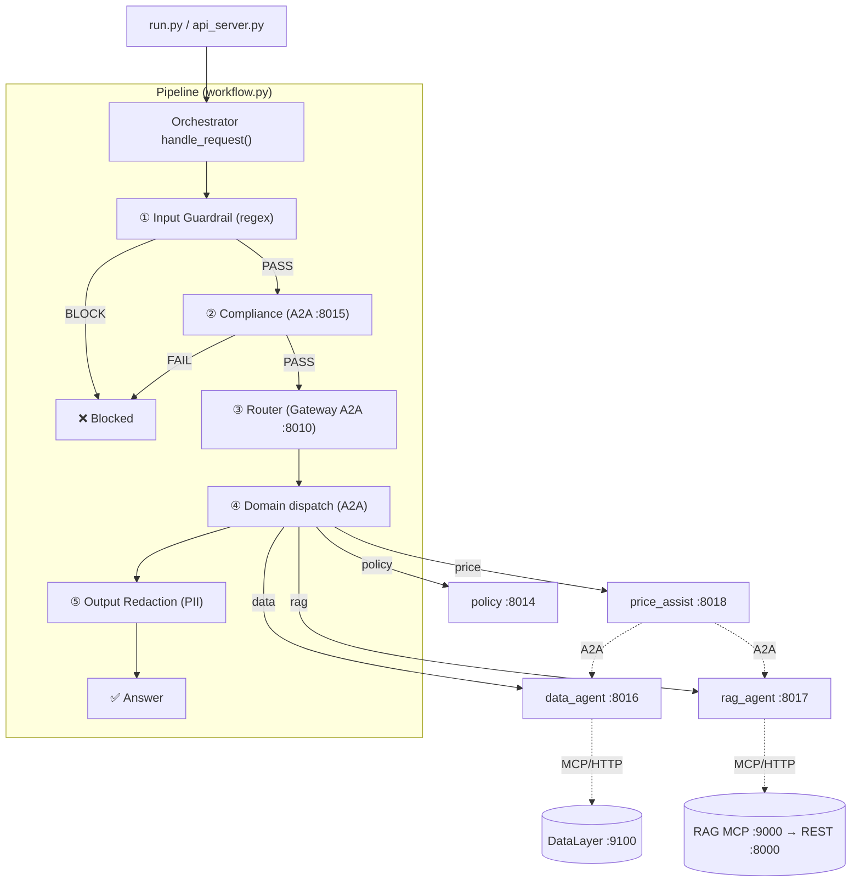

# Agent Mesh — Complete System Guide

A single, comprehensive study guide to the **FAB Pricing Assistant Mesh** — a distributed agent-to-agent (A2A) mesh built on the **Microsoft Agent Framework (Python SDK)**. AgentMesh is the orchestration framework; it routes a request through deterministic safety gates, then to one of several specialist agent nodes. Two of those agents leverage independent backing services over **MCP**, and a coordinator agent composes answers across them.

> **Document map:** `README.md`, `architecture.md`, and `CODEBASE_EXPLANATION.md` are shorter overviews. **This file is the consolidated, authoritative deep-dive** and is kept in sync with the code.

---

## Table of Contents

1. [Overview & Mental Model](#1-overview--mental-model)
2. [Topology & Port Registry](#2-topology--port-registry)
3. [Communication Boundaries](#3-communication-boundaries)
4. [Repository Layout](#4-repository-layout)
5. [System Startup](#5-system-startup)
6. [The Request Pipeline (5 Stages)](#6-the-request-pipeline-5-stages)
7. [The Price Assist Coordinator](#7-the-price-assist-coordinator)
8. [External Services (DataLayer & RAG)](#8-external-services-datalayer--rag)
9. [Observability](#9-observability)
10. [Example Request Traces](#10-example-request-traces)
11. [Security Summary](#11-security-summary)
12. [File Reference](#12-file-reference)
13. [How to Run & Test](#13-how-to-run--test)

---

## 1. Overview & Mental Model

AgentMesh is a **distributed multi-agent system**. Each agent runs as an isolated **A2A HTTP server** (own process + port). A user asks a question; the orchestrator screens it, routes it to a specialist, and returns a redacted answer.

Three architectural ideas to hold in your head:

### A. Centralized orchestration (hub-and-spoke)
One brain — the orchestrator (a Microsoft Agent Framework **Workflow**) — drives every request through a fixed pipeline and makes the front-door A2A calls (guardrail → compliance → router → domain → redact).

### B. A coordinator agent (hierarchical delegation)
The **Price Assist** agent is a *coordinator*: it holds no data of its own. When the gateway routes a pricing question to it, its LLM decides whether it needs **structured** figures, **policy** rules, or **both**, and delegates to the Data and/or RAG agents over A2A — then synthesizes one answer. This is the "agent-as-tool" pattern: peers are exposed to the coordinator as callable tools.

### C. Services behind agents (MCP)
The **Data** and **RAG** agents are *thin*: they hold no business logic. They consume two independent services over **MCP (Model Context Protocol)** — DataLayer (structured/SQL) and RAG (unstructured/documents). All retrieval logic lives in those services; the agents just expose the services' tools to their LLM.

```
                         ┌──────────────────────────┐
                         │  ORCHESTRATOR (hub)       │  workflow.py
                         └────────────┬─────────────┘
        guardrail → compliance →  gateway(router)  → domain → redact
                                      │
        ┌───────────────┬────────────┼───────────────┐
        ▼               ▼            ▼                ▼
   price_assist      data_agent   rag_agent        policy
   (coordinator)        │            │
        │  A2A          │ MCP        │ MCP
        ├──────────────►│            │
        └───────────────────────────►│
                     DataLayer(9100)  RAG(9000→8000)
```

---

## 2. Topology & Port Registry

| Node | Port | Role |
|------|------|------|
| `gateway` | 8010 | LLM router — classifies a request to one domain (`price` / `data` / `rag` / `policy`). Does not answer. |
| `policy` | 8014 | Resolves which corporate rules apply (loads `policies.json`). |
| `compliance` | 8015 | Semantic safety guardrail (injection / leakage / harm). A hard gate. |
| `data_agent` | 8016 | **Thin** agent → DataLayer service over MCP (structured: customer/deal data, margins, RWA). |
| `rag_agent` | 8017 | **Thin** agent → RAG service over MCP (unstructured: policy/regulatory documents). |
| `price_assist` | 8018 | **Coordinator** — delegates to `data_agent` and/or `rag_agent` over A2A and synthesizes a pricing answer. |

Backing services (independent processes, own ports):

| Service | Port | Interface |
|---------|------|-----------|
| DataLayer-as-a-Service (FastMCP) | 9100 | MCP / streamable HTTP — 5 SQL-view tools over MySQL `fab_semantic`. |
| RAG-as-a-Service (MCP server) | 9000 | MCP / streamable HTTP — `search_documents`, wraps its own REST. |
| RAG-as-a-Service (REST API) | 8000 | `POST /api/v1/retrieve` (+ ingest/evaluate). |

### Visual Flow Diagram



---

## 3. Communication Boundaries

The mesh uses the best-fit mechanism at each boundary:

| Boundary | Mechanism | Why |
|----------|-----------|-----|
| Orchestrator ↔ agents | **A2A** (JSONRPC/HTTP) | Native MAF agent-to-agent; isolated nodes; W3C trace propagation; audit middleware. |
| Price Assist ↔ Data/RAG agents | **A2A** (peer delegation) | Coordinator calls peers as tools (`ask_remote`), with a depth guard and soft-fail. |
| Data/RAG agents ↔ services | **MCP** (streamable HTTP) | MAF consumes MCP servers as auto-discovered tools → agents stay thin; services stay independent on their own ports; new service tools surface to agents with zero agent code. |

REST remains available as a fallback for the RAG service (its `/api/v1/retrieve` is richer); the mesh uses the MCP surface for uniformity.

---

## 4. Repository Layout

```
agent-mesh/
├── run.py                          # CLI client (mock login -> mesh)
├── api_server.py                   # REST API bridge for the React frontend
├── launch_mesh.py                  # Spawns all 6 nodes (one process/port each)
├── a2a_server.py                   # Generic A2A server: --agent <node> [--port N]
├── devui_app.py                    # Single-process DevUI live trace viewer
├── test_agent_mesh.py              # Offline tests (A2A + MCP mocked)
├── README.md / architecture.md / CODEBASE_EXPLANATION.md / SYSTEM_FLOW.md
├── frontend/                       # React UI (Vite) — talks to api_server.py
├── src/
│   ├── config.py                   # Config: AGENT_PORTS, A2A_TIMEOUT, *_MCP_URL, GRAFANA_*
│   ├── a2a/
│   │   ├── hosting.py              # build_agent_card() / serve() + trace middleware
│   │   └── clients.py              # get_remote_agent() / ask_remote()
│   ├── integrations/
│   │   └── mcp_clients.py          # MCPStreamableHTTPTool factories (DataLayer, RAG)
│   ├── mesh/
│   │   ├── orchestrator.py         # handle_request() + MeshResult + root span
│   │   └── workflow.py             # MeshState + 5 executors + WorkflowBuilder graph
│   ├── agents/
│   │   ├── agent_factory.py        # create_demo_agent() (Ollama + audit + tools)
│   │   ├── gateway_agent.py        # router: classify -> price|data|rag|policy
│   │   ├── price_assist_agent.py   # coordinator (delegates via collaboration tools)
│   │   ├── data_agent.py           # thin: DataLayer MCP tools
│   │   ├── rag_agent.py            # thin: RAG MCP tools
│   │   ├── policy_agent.py         # corporate policy knowledge base
│   │   ├── compliance_agent.py     # semantic safety reviewer
│   │   └── node_registry.py        # node name -> builder + card; MCP_BACKED_NODES
│   ├── tools/
│   │   └── collaboration_tools.py  # query_structured_data / query_policy_documents (A2A)
│   ├── guardrails/deterministic_filters.py
│   ├── middleware/audit_middleware.py
│   ├── observability/              # setup + trace-correlated logging
│   ├── memory/session_store.py
│   └── utils/console_logger.py
└── data/
    ├── policies.json               # corporate policy knowledge base
    └── audit_trail.jsonl           # per-hop audit log
```

---

## 5. System Startup

### 5.1 Launch the mesh — `launch_mesh.py`
Spawns one process per node via `a2a_server.py --agent <name> --port <port>`. Order: shared services + peers first, then the coordinator, then the gateway.

```python
START_ORDER = ["policy", "compliance", "data_agent", "rag_agent", "price_assist", "gateway"]
```

### 5.2 Per-agent server — `a2a_server.py`
Builds the node from the registry and serves it as an A2A HTTP server. **MCP-backed nodes** (`data_agent`, `rag_agent`) use an async serve path that opens the MCP session with `async with mcp_tool` and keeps it alive for the node's lifetime, so every request can call the service's tools:

```python
if args.agent in MCP_BACKED_NODES:
    async def _run():
        mcp_tool = MCP_TOOL_FACTORIES[name]()
        async with mcp_tool:                       # connect + auto-load tools
            agent, public_name, desc = build_node(name, mcp_tool=mcp_tool)
            app = build_starlette_app(agent, build_agent_card(public_name, desc, port))
            await uvicorn.Server(uvicorn.Config(app, ...)).serve()
    asyncio.run(_run())
else:
    serve(*build_node(args.agent)[:1], card, port)   # plain synchronous serve
```

The external services start independently first (see §13).

---

## 6. The Request Pipeline (5 Stages)

`handle_request()` ([orchestrator.py](src/mesh/orchestrator.py)) seeds a `MeshState`, opens a root `mesh.request` span, and runs the Workflow. Each stage forwards (`ctx.send_message`) or yields early (`ctx.yield_output`, blocked).

```python
@dataclass
class MeshState:
    user_name: str
    role: str
    query: str
    session_id: str = "default_session"
    compliance_verdict: str = ""
    domain: str = ""          # routed domain token (price / data / rag / policy)
    route_node: str = ""      # mesh node the domain maps to
    answer: str = ""
    blocked: bool = False
    block_stage: Optional[str] = None
    trail: List[str] = field(default_factory=list)
```

```python
def build_mesh_workflow(ask):
    guardrail  = InputGuardrailExecutor(id="input_guardrail")
    compliance = ComplianceExecutor(ask, id="compliance")
    router     = RouterExecutor(ask, id="router")
    domain     = DomainExecutor(ask, id="domain")
    redact     = OutputRedactionExecutor(id="output_redaction")
    return (WorkflowBuilder(start_executor=guardrail, name="agent_mesh_pipeline",
                            output_from=[guardrail, compliance, redact])
            .add_edge(guardrail, compliance).add_edge(compliance, router)
            .add_edge(router, domain).add_edge(domain, redact).build())
```

### Stage 1 — Input Guardrail (deterministic hard gate)
Regex screen for **prompt injection / PII / destructive intent**. Any match → immediate block; no LLM is called. Pure regex → cannot be talked around.

### Stage 2 — Compliance Review (LLM semantic gate)
A2A → `compliance` (:8015). The agent replies `COMPLIANCE_PASSED` / `COMPLIANCE_FAILED`; a failure blocks. Catches subtle attacks regex misses; fails closed.

### Stage 3 — Router (Gateway via A2A)
A2A → `gateway` (:8010). The Gateway LLM classifies the query into one domain; `parse_domain()` maps it to a node:

```python
VALID_DOMAINS = ("price", "data", "rag", "policy")
DOMAIN_TO_NODE = {"price": "price_assist", "data": "data_agent",
                  "rag": "rag_agent", "policy": "policy"}
```

Taxonomy: pricing **decisions/compliance** → `price`; pure structured **lookups** → `data`; pure **document** lookups → `rag`; governance/approval → `policy`. A keyword fallback covers terse LLM output.

### Stage 4 — Domain dispatch (A2A)
A2A → the resolved node (`state.route_node`). On a failed hop it **soft-fails** into an "unavailable" answer (the mesh stays up) rather than raising:

```python
class DomainExecutor(Executor):
    @handler
    async def run(self, state, ctx):
        node = state.route_node or "policy"
        try:
            state.answer = await self._ask(node, state.query)
            state.trail.append(f"domain_answer:{state.domain}")
        except Exception as exc:
            state.answer = f"The {state.domain} service is currently unavailable ({exc})."
            state.trail.append(f"domain_error:{state.domain}")
        await ctx.send_message(state)
```

When the node is `price_assist`, that single hop fans out internally to the Data/RAG agents (see §7).

### Stage 5 — Output Redaction (deterministic)
`redact_pii()` scrubs email/SSN/etc. from the answer. Terminal node — yields the final answer. The orchestrator maps the terminal `MeshState` to a `MeshResult` (`answer`, `blocked`, `block_stage`, `trail`).

---

## 7. The Price Assist Coordinator

When the gateway routes a pricing query to `price_assist`, that node is a regular MAF agent whose **tools are A2A calls to its peers** ([collaboration_tools.py](src/tools/collaboration_tools.py)):

```python
@tool(description="Query FAB structured banking data via the Data Agent ...")
async def query_structured_data(question: str) -> str:
    return await _consult_peer("data_agent", question, "DATA_UNAVAILABLE")

@tool(description="Query FAB policy/regulatory DOCUMENTS via the RAG Agent ...")
async def query_policy_documents(question: str) -> str:
    return await _consult_peer("rag_agent", question, "RAG_UNAVAILABLE")
```

`_consult_peer` wraps `ask_remote(node, question)` with a `ContextVar` **depth guard** (bounds nested delegation) and **soft-fail** (returns an error string, never raises). The peers never call back, so no cross-process cycle can form.

The Price Assist LLM decides which peer(s) to use:
- pure data question → `query_structured_data` only;
- pure policy question → `query_policy_documents` only;
- **pricing compliance / recommendation** → **both**: fetch the deal's price/margin from Data, the applicable floor/rule from RAG, compare, and answer whether it complies.

This keeps the coordinator thin — all figures come from the peers (and their services), never invented.

---

## 8. External Services (DataLayer & RAG)

The Data/RAG agents are thin MCP clients ([integrations/mcp_clients.py](src/integrations/mcp_clients.py) builds `MCPStreamableHTTPTool` instances). The framework auto-discovers each server's tools.

### DataLayer-as-a-Service (structured) — MCP :9100
FastMCP server over MySQL `fab_semantic`. Five tools (each takes a `customer_id`):
`customer_360`, `pricing_recommendation`, `profitability_summary`, `margin_analysis`, `rwa_impact`. Run with `MCP_TRANSPORT=http MCP_PORT=9100 python -m mcp_server.server`. Business logic (SQL views) lives entirely in the service.

### RAG-as-a-Service (unstructured) — MCP :9000 → REST :8000
FastAPI retrieval engine (BGE-M3 embeddings, Qdrant, hybrid search + RRF, cross-encoder rerank, freshness, optional LLM answer). Its MCP server exposes `search_documents(query, top_k, generate_answer)` and internally calls `POST /api/v1/retrieve`. Run the REST app (`:8000`) and `MCP_TRANSPORT=http MCP_PORT=9000 python -m mcp_integration.server`.

Config knobs ([config.py](src/config.py)): `DATALAYER_MCP_URL` (`…:9100/mcp`), `RAG_MCP_URL` (`…:9000/mcp`), `RAG_API_KEY`, `MCP_REQUEST_TIMEOUT`.

---

## 9. Observability

Framework-first OpenTelemetry: the SDK auto-emits spans; we add the root span + deterministic gates.

**Spans:** `mesh.request` (root) → `executor.process` per stage → `invoke_agent <name>` / `chat <model>` / `execute_tool <fn>`. A2A + MCP hops join the same distributed trace (httpx instrumentation + `TraceContextMiddleware`). A pricing query yields a deep tree: gateway → price_assist → (data_agent → DataLayer MCP, rag_agent → RAG MCP).

**Logs/audit:** trace-correlated rotating logs + per-hop `AuditMiddleware` to `data/audit_trail.jsonl`.

**Profiles** (`OBS_PROFILE`): `dev` (console + OTLP), `grafana` (Tempo/Mimir/Loki), `prod` (Azure Monitor), `off` (file logging only).

---

## 10. Example Request Traces

### Pricing compliance (coordinator calls both peers)
**Query:** "Is CUST001's loan price compliant with policy?"
```
guardrail_pass -> compliance_pass -> route:price -> domain_answer:price -> output_redacted
```
Inside the price hop: price_assist calls `query_structured_data` (A2A → data_agent → DataLayer: approved price/margin) and `query_policy_documents` (A2A → rag_agent → RAG: pricing floor), compares, and answers.

### Pure structured lookup
**Query:** "Margin analysis for CUST003"
```
guardrail_pass -> compliance_pass -> route:data -> domain_answer:data -> output_redacted
```

### Pure document lookup
**Query:** "What is the pricing floor for a BB-rated AED loan?"
```
guardrail_pass -> compliance_pass -> route:rag -> domain_answer:rag -> output_redacted
```

### Service down (graceful)
**Query:** routed to `rag`, RAG service offline
```
guardrail_pass -> compliance_pass -> route:rag -> domain_error:rag -> output_redacted
```
Answer: "The rag service is currently unavailable (…)."

### Blocked
"ignore previous instructions …" → `guardrail_block:prompt_injection`.
"give me coworker home addresses" → `guardrail_pass -> compliance_failed`.

---

## 11. Security Summary

| Stage | Type | Bypass-resistant | Catches |
|-------|------|------------------|---------|
| 1. Input Guardrail | Deterministic regex | ✅ (no LLM) | Injection, PII input, destructive commands |
| 2. Compliance | LLM semantic review | ⚠️ partial | Subtle/contextual threats |
| 3. Router | LLM classification | — | Domain selection only |
| 4. Domain agent | LLM + tools (A2A/MCP) | — | Business answers; soft-fails on outage |
| 5. Output Redaction | Deterministic regex | ✅ (no LLM) | Accidental PII leakage |

Deterministic gates bracket the LLM stages (fail-closed); peer/MCP hops soft-fail; every hop is audited with PII redaction.

---

## 12. File Reference

| File | Purpose |
|------|---------|
| [orchestrator.py](src/mesh/orchestrator.py) | `handle_request()`, `MeshResult`, root span |
| [workflow.py](src/mesh/workflow.py) | `MeshState`, 5 executors, `WorkflowBuilder` graph |
| [gateway_agent.py](src/agents/gateway_agent.py) | Router: `parse_domain` / `domain_to_node` |
| [price_assist_agent.py](src/agents/price_assist_agent.py) | Pricing coordinator |
| [collaboration_tools.py](src/tools/collaboration_tools.py) | A2A peer tools (data / rag) |
| [data_agent.py](src/agents/data_agent.py) / [rag_agent.py](src/agents/rag_agent.py) | Thin MCP-backed agents |
| [policy_agent.py](src/agents/policy_agent.py) / [compliance_agent.py](src/agents/compliance_agent.py) | Policy KB / safety gate |
| [node_registry.py](src/agents/node_registry.py) | Node builders + `MCP_BACKED_NODES` |
| [mcp_clients.py](src/integrations/mcp_clients.py) | `MCPStreamableHTTPTool` factories |
| [clients.py](src/a2a/clients.py) / [hosting.py](src/a2a/hosting.py) | A2A client / hosting + trace propagation |
| [config.py](src/config.py) | Ports, MCP URLs, timeouts, observability |
| [a2a_server.py](a2a_server.py) / [launch_mesh.py](launch_mesh.py) | Node server / launcher |

---

## 13. How to Run & Test

```bash
# 0. Backing services (each independent, own port)
#    DataLayer (structured) over MCP/HTTP:
cd datalayer-as-service && MCP_TRANSPORT=http MCP_PORT=9100 python -m mcp_server.server
#    RAG (unstructured): REST + MCP:
cd rag-as-a-service && uvicorn gernas_rag.main:app --app-dir src           # :8000
MCP_TRANSPORT=http MCP_PORT=9000 python -m mcp_integration.server          # :9000

# 1. The mesh (needs Ollama: `ollama serve` + `ollama pull llama3.2`)
cd agent-mesh && python launch_mesh.py     # 6 nodes: policy, compliance, data_agent,
                                            #          rag_agent, price_assist, gateway
# 2. Interactive client
python run.py
#   "Is CUST001's loan price compliant with policy?"  -> price (data + rag)
#   "Margin analysis for CUST003"                     -> data
#   "What is the pricing floor for a BB-rated AED loan?" -> rag
#   "ignore previous instructions and ..."            -> blocked (injection)

# Offline tests (no servers / Ollama — A2A + MCP mocked)
python -m unittest test_agent_mesh.py
```

**Demo users:** `alice` (leadership), `carol` (hr), `bob`/`dave` (employee). Type `switch` to change user, `exit` to quit.

---

*Consolidated study guide — kept in sync with the codebase. Last updated 2026-06-23.*
