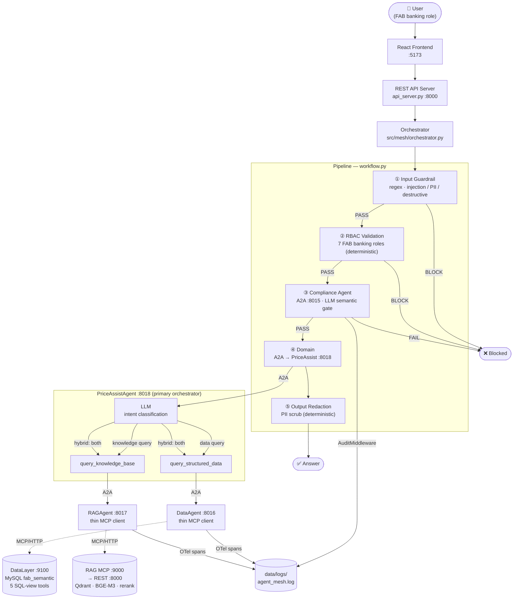
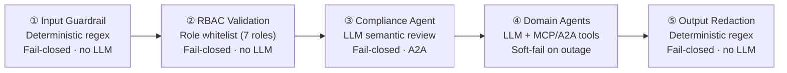
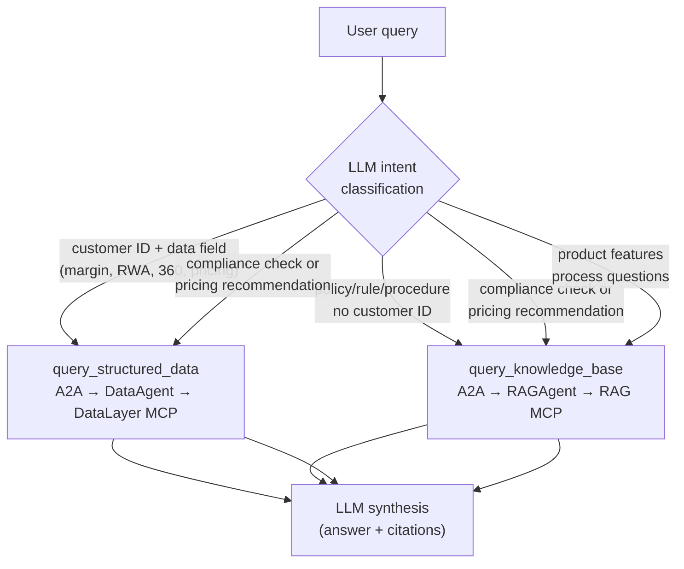

# Architectural Design — FAB Pricing Assistant Mesh

A distributed multi-agent system where each agent is an isolated A2A server.
The mesh routes requests through deterministic safety gates and role-based access
control to a single primary coordinator — **PriceAssistAgent** — which internally
classifies intent and delegates to specialist agents over A2A. Those agents consume
two independent backing services over **MCP**.

> GatewayAgent and PolicyAgent have been removed in AgentMesh 15.0.6.2026.
> Intent routing and policy knowledge are now handled by PriceAssistAgent directly.

---

## Architecture Diagram



---

## Component Topology

**4 A2A nodes** (own process + port):

| # | Node | Port | Role |
|---|------|------|------|
| 1 | `compliance` | 8015 | Semantic safety gate — LLM reviews each query; replies `COMPLIANCE_PASSED` / `COMPLIANCE_FAILED`. |
| 2 | `data_agent` | 8016 | Thin MCP client → DataLayer service (5 SQL-view tools over MySQL). |
| 3 | `rag_agent` | 8017 | Thin MCP client → RAG service (`search_documents`). |
| 4 | `price_assist` | 8018 | **Primary coordinator** — intent classification + delegation to data/RAG peers + answer synthesis. |

**Backing services** (independent processes):

| Service | Port | Interface |
|---------|------|-----------|
| DataLayer-as-a-Service | 9100 | MCP/HTTP — FastMCP + MySQL `fab_semantic` |
| RAG-as-a-Service (MCP) | 9000 | MCP/HTTP — wraps REST /api/v1/retrieve |
| RAG-as-a-Service (REST) | 8000 | FastAPI — retrieve, ingest, evaluate |

---

## Communication Boundaries

| Boundary | Mechanism | Why |
|----------|-----------|-----|
| REST API / DevUI ↔ orchestrator | Function call (in-process) | Same process; no serialisation overhead. |
| Orchestrator ↔ agents | **A2A** (JSONRPC/HTTP) | Isolated processes; W3C trace propagation; audit middleware. |
| PriceAssist ↔ Data/RAG agents | **A2A peer delegation** | Agent-as-tool pattern; depth-guarded (max 2); soft-fail on outage. |
| Data/RAG agents ↔ services | **MCP** (streamable HTTP) | Tools auto-discovered at connect time — agents stay thin; services evolve independently. |

---

## Data Flow & Execution Sequence

### Hybrid query: `"Is CUST001's loan price compliant with policy?"`

```
1. User → REST API (POST /api/query)
2. Input Guardrail      PASS  (no injection/PII/destructive pattern)
3. RBAC Validation      PASS  (e.g. role=compliance_officer)
4. ComplianceAgent      PASS  → "COMPLIANCE_PASSED: query is safe"
5. PriceAssistAgent     receives query
   └─ intent: HYBRID (compliance check needs data + policy)
   ├─ query_structured_data("pricing recommendation for CUST001")
   │    → DataAgent → MCP pricing_recommendation("CUST001")
   │    → returns: current_rate, policy_floor, compliance_flag per deal
   └─ query_knowledge_base("pricing floor and rules for BB-rated AED loan")
        → RAGAgent → MCP search_documents(query=...)
        → returns: policy clauses with source + clause_reference
   └─ LLM synthesis: compare current_rate vs policy_floor → COMPLIANT / NON-COMPLIANT
6. Output Redaction     PII scrubbed from answer
7. MeshResult returned  {answer, blocked=false, trail=[...]}
```

### Pure data query: `"Margin analysis for CUST003"`

```
Guardrail PASS → RBAC PASS → Compliance PASS
→ PriceAssistAgent [intent=data]
    → query_structured_data → DataAgent → margin_analysis("CUST003")
→ Output Redaction → Answer
```

### Blocked: prompt injection

```
Input Guardrail BLOCK:prompt_injection → immediate answer, no LLM called
```

### Blocked: unrecognised role

```
Guardrail PASS → RBAC BLOCK:external_vendor → immediate answer, no LLM called
```

---

## Security Model (Defence in Depth)



- **Layers 1, 2, 5** are deterministic (regex/whitelist) — cannot be bypassed by prompt manipulation.
- **Layer 3** is LLM-based but fails closed — a failed/ambiguous review blocks the request.
- **Layer 4** soft-fails — an unavailable downstream service produces a graceful "unavailable" answer rather than a crash or 500.
- **Depth guard** on peer delegation caps recursion at 2 levels, preventing runaway agent chains.

---

## PriceAssistAgent Intent Routing (prompt-driven)



---

## Microsoft Agent Framework Capabilities Demonstrated

| Capability | Where used |
|-----------|-----------|
| **A2A protocol** | All inter-agent calls (orchestrator ↔ compliance/price_assist; price_assist ↔ data/rag) |
| **MCP tool consumption** | `MCPStreamableHTTPTool` in DataAgent + RAGAgent; tools auto-discovered at connect |
| **Agent-as-tool** | PriceAssistAgent calls peer agents as tools via `COORDINATION_TOOLS` |
| **Workflow orchestration** | Typed `WorkflowBuilder` pipeline with 5 executors; native OTel spans per stage |
| **Agent middleware** | `TraceContextMiddleware` (W3C trace propagation); audit logging |
| **Multiple LLM providers** | Anthropic / Groq / OpenAI / Ollama via `agent_factory.py` |

---

*AgentMesh 15.0.6.2026 — Last updated 2026-06-24.*
