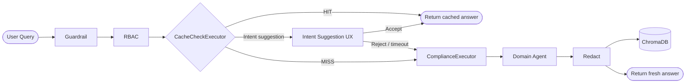
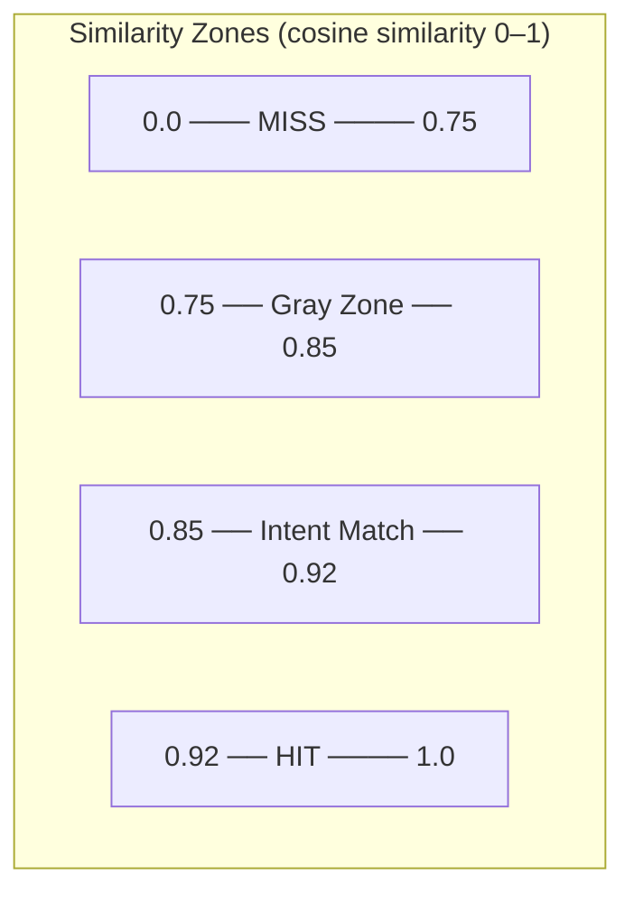
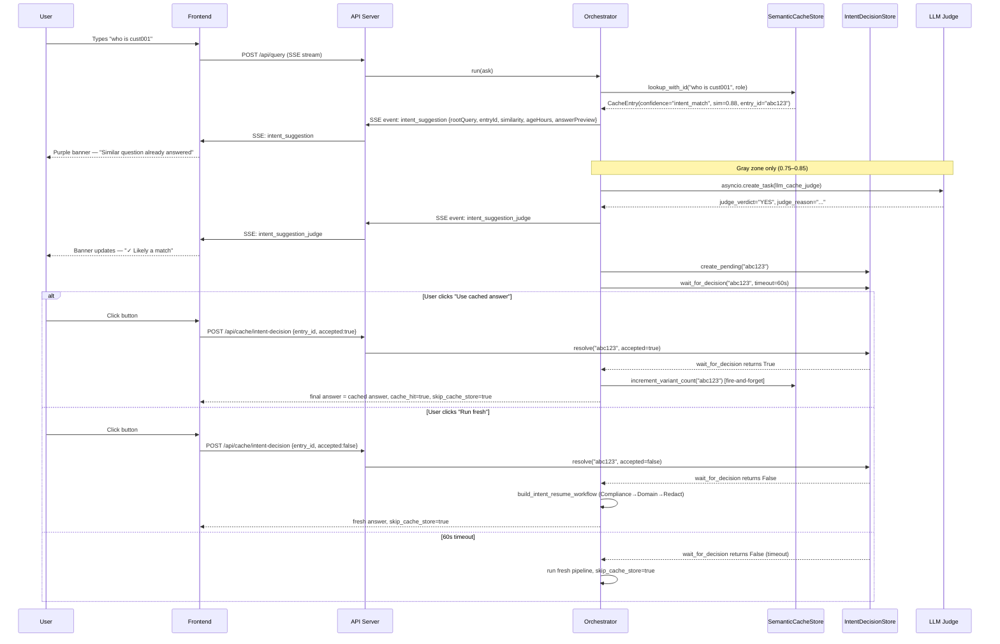
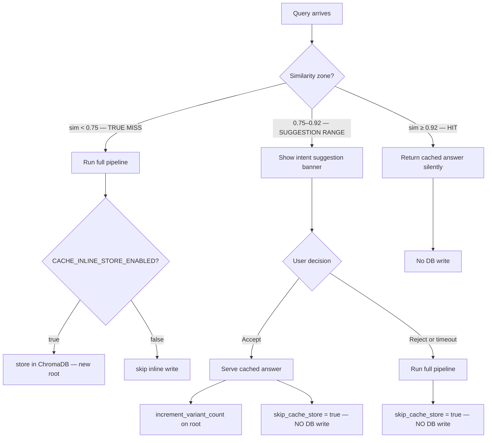
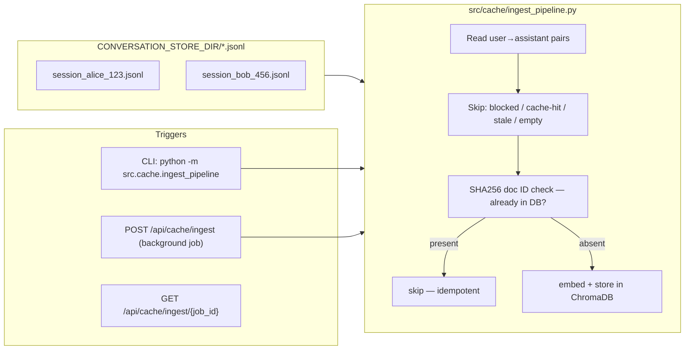
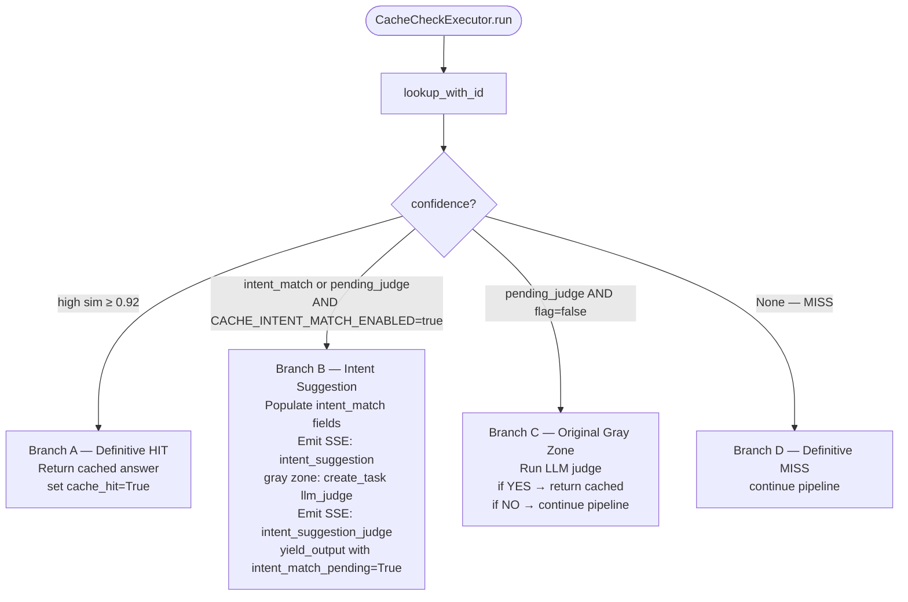

# Semantic Response Cache — Knowledge Base

## Overview

The semantic response cache prevents redundant LLM pipeline runs by storing Q&A pairs as dense vector embeddings in ChromaDB. On each request, the incoming query is embedded and compared against stored entries for the same role. If a sufficiently similar answer exists that is still within its TTL, it is returned without touching the pipeline.

### Core Technology Stack

| Component | Detail |
|---|---|
| Vector DB | ChromaDB (persistent SQLite-backed, local process) |
| Embedding model | `all-MiniLM-L6-v2` — 384-dim vectors, via ChromaDB `DefaultEmbeddingFunction` (bundled, no HuggingFace download) |
| Similarity metric | Cosine similarity (`hnsw:space=cosine`) — `similarity = 1 - distance` |
| Thread safety | `threading.Lock` serialises all writes; reads are concurrent |
| Document ID | `SHA256(role::query)` — deterministic, enables idempotent upserts |

---

## Architecture

### High-Level Position in the Pipeline



---

## Similarity Zones

The cache operates on four distinct similarity bands. The thresholds are configurable via environment variables.



| Zone | Similarity Range | Confidence Value | Action |
|---|---|---|---|
| **MISS** | `sim < 0.75` | — | Full pipeline runs; store result (if enabled) |
| **Gray Zone** | `0.75 ≤ sim < 0.85` | `pending_judge` | Intent suggestion shown + LLM judge runs concurrently |
| **Intent Match** | `0.85 ≤ sim < 0.92` | `intent_match` | Intent suggestion shown (no LLM judge needed) |
| **Definitive HIT** | `sim ≥ 0.92` | `high` | Cached answer returned immediately, silently |

> The gray zone and intent match zone are only active when `CACHE_INTENT_MATCH_ENABLED=true`. When disabled, both zones fall back to original LLM-judge-only behavior.

---

## Feature: Intent-Grouped Cache (NEW)

### Problem

Previously, every semantically unique question was stored as a separate ChromaDB entry on a cache miss. Variant questions like "show details of cust001", "who is cust001", "what can I know about cust001" each received their own DB entry with nearly identical embeddings — causing unbounded DB growth over time.

### Solution

Queries in the suggestion range (0.75–0.92) are surfaced to the user as an **intent suggestion banner** in the UI. The user explicitly decides whether to use the cached answer or run fresh. In either case, the variant query is **never stored** in ChromaDB — only true root queries (sim < 0.75) can become new DB entries.

### Full Request Flow with Intent Suggestion



### Storage Invariant



**Only true MISS queries (sim < 0.75) can become new root entries in ChromaDB.**

---

## Feature: Ingest Pipeline (NEW)

### Problem

Previously, cache writes happened inline on the hot request path — after each pipeline run, `orchestrator.py` called `store.store()` synchronously. This coupled write I/O to request latency and caused unbounded DB growth.

### Solution

`CACHE_INLINE_STORE_ENABLED` (default: `true` for backward compat) gates the inline write. When disabled, a separate **batch ingest pipeline** handles all embedding in bulk from existing conversation JSONL files.



### Ingest Report Fields

| Field | Meaning |
|---|---|
| `total_scanned` | Total user→assistant pairs examined |
| `already_present` | Skipped — SHA256 doc ID already in ChromaDB |
| `newly_stored` | Embedded and written to ChromaDB |
| `skipped_stale` | Age exceeded `CACHE_MAX_AGE_HOURS` |
| `skipped_empty` | Empty query/answer, blocked, or role-filtered |
| `skipped_cache_hit` | Assistant turn was itself a cache-hit replay |
| `errors` | Files that failed to parse |
| `elapsed_ms` | Total wall-clock time |

### CLI Usage

```bash
# Preview without writing
python -m src.cache.ingest_pipeline --dry-run

# Run full ingest
python -m src.cache.ingest_pipeline

# Options
python -m src.cache.ingest_pipeline \
  --source-dir /path/to/conversations \
  --overwrite \          # re-embed existing entries
  --role relationship_manager  # only ingest this role
```

---

## Configuration Reference

All settings live in `src/config.py` and can be overridden via `.env`.

```
# Core cache
ENABLE_RESPONSE_CACHE=false          # Master switch (default off)
CACHE_CHROMA_DIR=data/cache/chroma   # Where ChromaDB SQLite files live
CACHE_COLLECTION_NAME=mesh_response_cache
CACHE_EMBED_MODEL=all-MiniLM-L6-v2
CACHE_MAX_AGE_HOURS=24.0             # Entries older than this are never served

# Similarity thresholds
CACHE_SIMILARITY_THRESHOLD=0.92      # sim ≥ this → definitive HIT
CACHE_MISS_THRESHOLD=0.75            # sim < this → definitive MISS
CACHE_INTENT_MATCH_THRESHOLD=0.85    # boundary between gray zone and intent-match zone

# LLM Judge (gray zone 0.75–0.85)
CACHE_JUDGE_ENABLED=true
CACHE_JUDGE_MODEL=openai/gpt-oss-20b

# NEW — Intent-Grouped Cache
CACHE_INTENT_MATCH_ENABLED=false     # Enable intent suggestion UX (default off)

# NEW — Inline vs batch embedding
CACHE_INLINE_STORE_ENABLED=true      # Set false to disable per-turn inline writes
```

### Threshold Diagram

```
0.0           0.75          0.85          0.92         1.0
 |─────────────|─────────────|─────────────|────────────|
      MISS         Gray Zone    Intent Match    HIT
                  (judge runs)  (no judge)
         ↑                   ↑              ↑
   CACHE_MISS_THRESHOLD  CACHE_INTENT_   CACHE_SIMILARITY_
                         MATCH_THRESHOLD  THRESHOLD
```

---

## New Files

### `src/cache/intent_decision_store.py`

In-memory asyncio-based decision store. The orchestrator parks a pending decision here; the user's API call resolves it.

```
IntentDecisionStore
  ├── create_pending(entry_id)       register a pending decision
  ├── wait_for_decision(entry_id, timeout=60s)  → bool  await user choice
  ├── resolve(entry_id, accepted)    signal from POST /api/cache/intent-decision
  └── get_pending_ids()              list currently-paused requests
```

- Uses `asyncio.Event` — zero-polling, no busy wait
- Timeout defaults to 60s → resolves as rejected (run fresh) — pipeline never hangs permanently
- Single-process only; for multi-worker: replace with Redis-backed store

### `src/cache/ingest_pipeline.py`

Batch embedding CLI and background API job runner.

```
run_ingest_sync(source_dir, dry_run, overwrite, role_filter) → IngestReport
run_ingest(...)  →  async wrapper (asyncio.to_thread)
run_ingest_job(job_id, ...)  →  background task used by POST /api/cache/ingest
```

---

## Changed Files

### `src/cache/semantic_cache.py`

| Change | Detail |
|---|---|
| `CacheEntry.entry_id` | New field — ChromaDB doc ID, populated by `lookup_with_id()` |
| `lookup_with_id()` | New method — same as `lookup()` but always sets `entry_id`; applies four-zone confidence logic |
| `store()` metadata | Now includes `variant_count: 0` and `last_variant_ts: 0.0` on every new root entry |
| `increment_variant_count(entry_id)` | New method — atomically increments `variant_count` and sets `last_variant_ts` under `_write_lock` |
| `stats()` | Now returns `intent_match_enabled`, `intent_match_threshold`, `inline_store_enabled` |

### `src/mesh/workflow.py` — MeshState new fields

```python
intent_match_pending:    bool  = False   # orchestrator pauses when True
intent_match_root_query: str   = ""      # root question text shown to user
intent_match_entry_id:   str   = ""      # ChromaDB doc ID for resolution
intent_match_similarity: float = 0.0
intent_match_answer:     str   = ""      # cached answer (served on accept)
intent_match_age_hours:  float = 0.0
intent_match_confidence: str   = ""      # "high" | "pending_judge"
skip_cache_store:        bool  = False   # prevents variant from being stored
```

### `src/mesh/workflow.py` — CacheCheckExecutor branches



### `src/mesh/orchestrator.py` — Intent-match interception block

```python
if getattr(final, "intent_match_pending", False):
    intent_decision_store.create_pending(entry_id)
    accepted = await intent_decision_store.wait_for_decision(entry_id, timeout=60.0)

    if accepted:
        final.answer = final.intent_match_answer    # serve cached answer
        final.cache_hit = True
        final.skip_cache_store = True
        asyncio.create_task(                        # fire-and-forget
            asyncio.to_thread(cache.increment_variant_count, entry_id)
        )
    else:
        final.skip_cache_store = True               # variant never stored
        resume_wf = build_intent_resume_workflow(ask)
        final = await resume_wf.run(final)          # Compliance → Domain → Redact
        final.skip_cache_store = True               # preserve through resume
```

### `src/mesh/orchestrator.py` — Cache store guard

```python
if (
    Config.ENABLE_RESPONSE_CACHE
    and Config.CACHE_INLINE_STORE_ENABLED          # NEW: gated by env var
    and final.answer
    and not final.blocked
    and not getattr(final, "cache_hit", False)
    and not getattr(final, "skip_cache_store", False)  # NEW: variant guard
):
    get_cache_store().store(...)
```

### `src/cache/cache_indexer.py`

Simplified: startup warmup only (`store._warmup()`). JSONL indexing removed from startup — use `ingest_pipeline.py` instead. Avoids blocking server startup on large conversation histories.

### `api_server.py` — New endpoints

| Endpoint | Method | Purpose |
|---|---|---|
| `/api/cache/intent-decision` | POST | Resolve user accept/reject for an intent suggestion |
| `/api/cache/ingest` | POST | Trigger background ingest job, returns `job_id` |
| `/api/cache/ingest/{job_id}` | GET | Poll ingest job status and `IngestReport` |

### SSE Events (new)

```
event: intent_suggestion
data: {
  "event_type": "intent_suggestion",
  "root_query": "show details of cust001",
  "entry_id": "abc123-...",
  "similarity": 0.88,
  "age_hours": 3.2,
  "answer_preview": "Customer cust001 is...",
  "confidence": "intent_match" | "pending_judge",
  "judge_verdict": null,
  "judge_reason": null
}

event: intent_suggestion_judge        ← fired only for gray zone (0.75–0.85)
data: {
  "event_type": "intent_suggestion_judge",
  "entry_id": "abc123-...",
  "judge_verdict": "YES" | "NO",
  "judge_reason": "The queries refer to the same entity and intent."
}
```

---

## Frontend Changes

### IntentSuggestionBanner (`MessageBubble.tsx`)

Purple/violet themed banner rendered above the thinking indicator when a suggestion arrives.

```
┌──────────────────────────────────────────────────────────────┐
│  ◈ Similar question already answered   3.2h ago   88% match │
│                                                              │
│  "show details of cust001"                                   │
│                                                              │
│  LLM Judge:  [spinner] Checking semantic match…              │
│              ──► ✓ Likely a match  (after judge resolves)    │
│                                                              │
│  [ Use cached answer ]    [ Run fresh ]   60s timeout        │
└──────────────────────────────────────────────────────────────┘
```

- Judge row only shown for gray-zone queries (0.75–0.85); spinner updates in-place when `intent_suggestion_judge` SSE arrives
- Both buttons always available regardless of judge result
- 60s countdown shown; on timeout the pipeline auto-continues as "run fresh"

### `useChat.ts` — new SSE handlers

```
"intent_suggestion"       → set message.intentSuggestion, streamingStage="intent_pending"
"intent_suggestion_judge" → patch message.intentSuggestion.judgeVerdict / judgeReason in-place
"result"                  → clear intentSuggestion from message
```

New callback exported: `resolveIntentSuggestion(messageId, accepted)` — optimistically clears banner, calls `POST /api/cache/intent-decision`.

---

## Operational Playbook

### Enable Intent-Grouped Cache

```bash
# .env
ENABLE_RESPONSE_CACHE=true
CACHE_INTENT_MATCH_ENABLED=true
CACHE_INLINE_STORE_ENABLED=false   # switch to batch mode (optional)
```

### Populate cache from existing conversations

```bash
# Dry run first
python -m src.cache.ingest_pipeline --dry-run

# Full ingest
python -m src.cache.ingest_pipeline

# Expected output
=== Ingest Report ===
  total_scanned: 142
  already_present: 0
  newly_stored: 118
  skipped_stale: 12
  skipped_empty: 8
  skipped_cache_hit: 4
  errors: []
  elapsed_ms: 3240.0
```

### Check cache stats

```bash
GET /api/cache/stats
# Returns: total_entries, intent_match_enabled, inline_store_enabled, judge_invocations, ...
```

### Verify DB growth is controlled

```bash
# Before: ask variant questions
# After: ChromaDB entry count should NOT increase for variants
python -c "
import chromadb
c = chromadb.PersistentClient('data/cache/chroma')
col = c.get_collection('mesh_response_cache')
print('entries:', col.count())
"
```

---

## Design Decisions & Trade-offs

| Decision | Rationale |
|---|---|
| User always decides for 0.75–0.92 range | LLM judge is advisory only — prevents false positives from silently polluting answers |
| `skip_cache_store=true` on reject path | User rejection may mean different scope/entity; storing as new root would add near-duplicates |
| `asyncio.Event` for pause-resume | Zero-polling, same proven pattern as HITL approval_store.py |
| 60s timeout → run fresh | Pipeline never hangs permanently; graceful degradation |
| SHA256 doc ID for dedup | Idempotent upserts — safe to re-run ingest pipeline anytime |
| `CACHE_INLINE_STORE_ENABLED` defaults `true` | Zero regression — existing deployments unaffected until opt-in |
| `CACHE_INTENT_MATCH_ENABLED` defaults `false` | Feature flag — rollout is opt-in |
