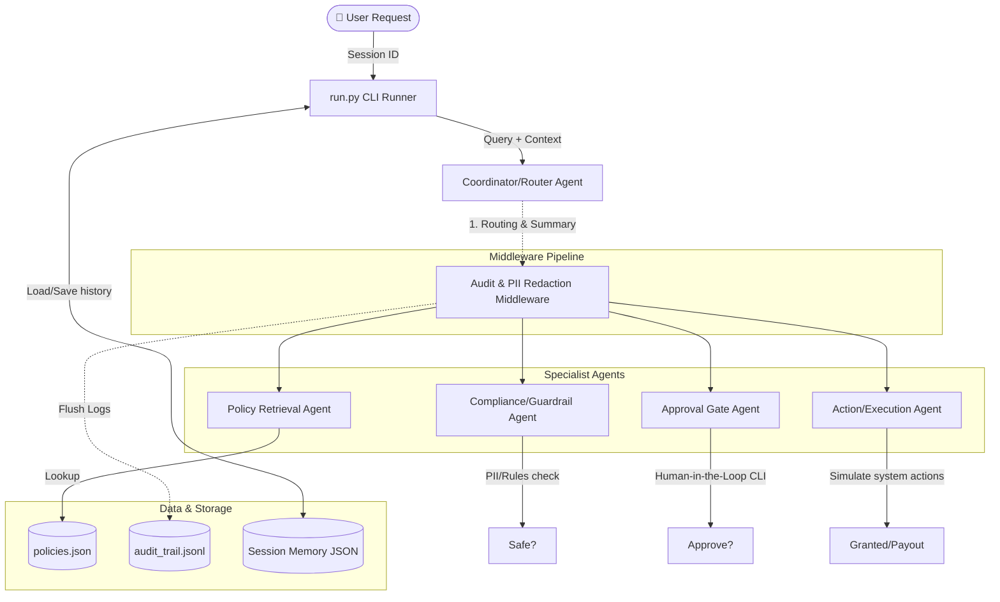

# Architectural Design - Policy-Aware Employee Action Assistant

This document provides a detailed overview of the system architecture, component topology, and execution data flows for the Policy-Aware Employee Action Assistant.

---

## Architecture Diagram

The diagram below visualizes the multi-agent mesh, middleware pipeline, and data storage layers.

---

## Component Topology

The system comprises 5 distinct agents, cooperating in a decentralized mesh under the direction of the `CoordinatorAgent`:

1. **Coordinator/Router Agent**
   - **Role**: Primary entrypoint and final synthesizer.
   - **Logic**: Inspects the user prompt to determine if routing is necessary. Gathers downstream outputs and compiles a cohesive, professional summary back to the user.

2. **Policy Retrieval Agent**
   - **Role**: Domain knowledge retrieval.
   - **Logic**: Reads regulations from `policies.json`. Checks constraints such as reimbursement limits (e.g. pre-approval limit of $500.00) or restricted access flags.

3. **Compliance/Guardrail Agent**
   - **Role**: Safety gatekeeper.
   - **Logic**: Scans requests for structural violations, unauthorized access parameters, and Personally Identifiable Information (PII) like SSNs or emails, triggering short-circuits.

4. **Approval Gate Agent**
   - **Role**: Authorization management.
   - **Logic**: Evaluates whether a request warrants a manager sign-off. If so, it simulates a Human-in-the-loop CLI prompt asking for explicit `yes/no` permission.

5. **Action/Execution Agent**
   - **Role**: System state driver.
   - **Logic**: Once all validation gates are satisfied, it executes/simulates restricted commands (e.g. provisioning folder access, creating payment queues).

---

## Data Flow & Execution Sequence

For a high-risk request (e.g. "Can I access the finance folder?"):

1. **Input**: User submits the request. The CLI runner initializes a unique `Session ID` and loads past context.
2. **Analysis**: The `Coordinator` determines the request concerns a restricted folder. It routes the task.
3. **Safety Gate**: The `Compliance Agent` scans for safety violations. If clean (no PII), it yields `COMPLIANCE_PASSED`.
4. **Policy Check**: The `Policy Retrieval Agent` reviews access rules in `policies.json`. It reports that the Finance Folder is restricted and requires manager approval.
5. **Human Gate**: The `Approval Gate Agent` triggers a console CLI prompt. The user is required to enter `yes` to authorize the request.
6. **Execution**: The `Action Agent` receives the approval indicator and provisions read/write access.
7. **Summary**: The `Coordinator` compiles the Specialist outputs and returns a final response to the user.
8. **Audit Logging**: At each agent transition, the `AuditMiddleware` intercepts the request/response, redacts PII elements, and writes a correlated JSONL trace to `audit_trail.jsonl`.
