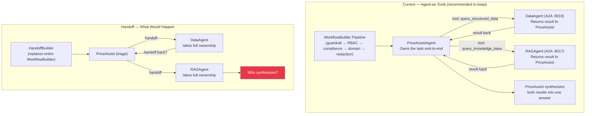

# Analysis: MAF Handoff vs Current Agent-as-Tools Architecture

> **Purpose:** Decision-quality analysis of whether MAF `HandoffBuilder` should replace the current
> PriceAssistAgent-as-orchestrator (agent-as-tools) pattern in FAB AgentMesh.
> Written against MAF docs: https://learn.microsoft.com/en-us/agent-framework/workflows/orchestrations/handoff
> Date: 2026-07-10

---

## Context

PriceAssistAgent currently acts as the central orchestrator using the **agent-as-tools** pattern:

1. Receives every user query after the security pipeline (guardrail → RBAC → compliance)
2. Classifies intent (data / knowledge / hybrid) internally via LLM
3. Delegates to DataAgent and RAGAgent as `@tool` calls over A2A (separate OS processes)
4. Receives both results back, synthesizes a single cited answer
5. Returns the answer to the `WorkflowBuilder` pipeline for PII redaction

The question is whether MAF `HandoffBuilder` should replace this — either partially or fully.

---

## What MAF Handoff Actually Is

Key facts from the official docs:

- **Mesh topology, no central orchestrator.** All agents are peers. Any agent calls a special handoff tool that *transfers full ownership* of the conversation to the next agent — the handing-off agent is done.
- **Full context forwarded automatically.** After every agent turn, conversation history is broadcast to all participants so the receiving agent has full context.
- **Interactive by design.** If an agent does NOT call a handoff tool, the framework emits a `request_info` event and waits for human input before the next turn. Autonomous mode is **experimental** and must be explicitly enabled.
- **In-process only.** The docs state explicitly: *"Handoff orchestration only supports `Agent` and the agents must support local tools execution."* All agents run in the same Python process.
- **HITL + checkpointing are first-class.** `@tool(approval_mode="always_require")` and `FileCheckpointStorage` are built in.
- **`HandoffAgentExecutor`** automatically injects handoff tools on each agent based on configured rules and strips handoff-related calls from history before forwarding.

### Handoff vs Agent-as-Tools: Core Differences

| Dimension | Agent-as-Tools (current) | Handoff |
|-----------|--------------------------|---------|
| Control flow | Primary agent orchestrates; sub-agents return results to it | Agent explicitly passes full control; no return to sender |
| Task ownership | PriceAssistAgent retains ownership end-to-end | DataAgent or RAGAgent takes full ownership once handed off |
| Context management | PriceAssistAgent controls what goes to each sub-agent | Full history broadcast to all participants automatically |
| Synthesis | PriceAssistAgent receives all results and synthesizes | Whoever holds ownership at the end answers alone |
| Deployment | Separate processes (A2A/JSONRPC) | In-process (local tool execution) |

---

## Is Handoff Suitable for This Architecture?

**Verdict: No — not as a wholesale replacement. Selectively yes — for HITL on future write operations.**

---

## 1. The Hybrid Query Problem — Critical Blocker

**Current behaviour:** PriceAssistAgent calls `query_structured_data` AND `query_knowledge_base`, receives both answers, then synthesizes a single cited response combining structured data and policy.

**In handoff:** Ownership transfers to ONE agent. When PriceAssistAgent hands off to DataAgent, DataAgent owns the conversation and answers it alone. For a hybrid query this produces a partial answer (no policy context). Possible workarounds:

- Multi-hop: `PriceAssist → DataAgent → PriceAssist → RAGAgent → SynthesisAgent` — more round-trips than current, no advantage over agent-as-tools
- Synthesis agent at the end: receives full broadcast context including both peers' answers — but requires predictable handoff ordering and specialized prompt engineering

**Conclusion:** Hybrid queries are the primary use case for FAB AgentMesh. Handoff's "full ownership transfer" model does not compose well for "collect multiple specialist results and merge." Agent-as-tools is exactly the right pattern for this.

---

## 2. Cross-Process A2A vs In-Process — Architectural Blocker

**Current:** Four separate OS processes — ComplianceAgent (:8015), DataAgent (:8016), RAGAgent (:8017), PriceAssistAgent (:8018) — connected over A2A/JSONRPC.

**Handoff requirement:** In-process. All agents run in one Python runtime with local tool execution.

**Migration cost:** You would have to abandon the entire A2A mesh:
- Rewrite `a2a_server.py`, `launch_mesh.py`, `src/a2a/clients.py`, `src/a2a/hosting.py`
- MCP tools still work in-process, but independent failure domains are lost

**What you lose by collapsing to one process:**
- A crash in DataAgent's MCP connection today doesn't affect PriceAssistAgent — in-process it does
- Each node has its own OTel provider and restart cycle — in-process they share one
- The MCP reconnect loop fix (`ever_started` flag in `a2a_server.py`) only makes sense in a separate process
- Per-agent API keys distributing Groq rate limits — in-process they share one event loop

---

## 3. Security Pipeline Disruption — High Risk

**Current 5-stage WorkflowBuilder pipeline** runs BEFORE any agent sees the query:
```
InputGuardrailExecutor → RBACValidationExecutor → ComplianceExecutor → DomainExecutor → OutputRedactionExecutor
```
Each stage emits OTel spans, business metrics, and ExecutionEvents, and can terminate early (blocked).

**HandoffBuilder replaces the entire orchestration layer.** It has no concept of pre-execution guardrail stages. If HandoffBuilder were used wholesale, you would lose:

| Lost | Impact |
|------|--------|
| `fab.guardrail.input_screen` OTel span | No trace of regex safety gate |
| `fab.rbac.validate` OTel span | No trace of RBAC check |
| `fab.compliance.check` OTel span + bypass logic | No trace of compliance decision |
| `fab.output.redact` OTel span + PII redaction | PII could leak into answers |
| `trail` field in `MeshResult` | React `PipelineTrail` component breaks |
| All `fab.*` business metric counters | Grafana dashboards go dark |

You could keep the WorkflowBuilder pipeline and run HandoffBuilder only *inside* `DomainExecutor` (replacing just the A2A call to PriceAssistAgent). This is the safest partial adoption path but still requires in-process agent refactoring.

---

## 4. Observability Regression — High Risk

**Current observability across 4 processes:**
- OTel distributed trace: `mesh.request` → `fab.guardrail` → `fab.domain` → `invoke_agent` → `chat` → `execute_tool` (spans from 4 separate processes joined by `trace_id`)
- W3C `traceparent`/`tracestate` injected outbound by httpx, extracted inbound by `TraceContextMiddleware`
- W3C Baggage (`fab.request_id`, `fab.user`, `fab.role`, `fab.session_id`) propagated cross-process
- `AuditMiddleware` writes one JSONL record per LLM call per node to `data/audit_trail.jsonl`
- `<llm_reasoning>` extracted cross-process via temp file `data/logs/.peer_{rid}.json`

**In-process handoff:** The distributed trace collapses to a single-process trace — no cross-process `traceparent` propagation needed. The `<llm_reasoning>` temp file trick is unnecessary (a simplification). But `AuditMiddleware` per-node wiring needs revisiting, and the custom `fab.*` OTel spans from WorkflowBuilder executors disappear unless explicitly re-implemented.

---

## 5. Conversation Memory — Medium Concern (Actually a Net Positive)

**Current workaround:** Because `A2AAgent.run()` sends only the last message (A2A flattening constraint), conversation history is manually injected as a `[Conversation so far]` block in the prompt before every A2A call.

**In handoff:** Context synchronization is automatic — all agents receive full history after every turn. The manual injection becomes redundant. The `ConversationStore` JSONL storage and session ownership (`.owner` sidecar files) would still be needed to power the React UI's ConversationsDashboardPage.

This is the one area where handoff is genuinely better than the current architecture.

---

## 6. What You Would Genuinely Gain

| Advantage | Detail |
|-----------|--------|
| **HITL for sensitive operations** | `@tool(approval_mode="always_require")` on high-risk tools (e.g., `submit_pricing_change`) — a credit officer must approve before execution. Not possible today. |
| **Durable workflows** | `FileCheckpointStorage` lets a workflow pause overnight while waiting for approval. Current architecture has no durability. |
| **Simpler context management** | No manual `[Conversation so far]` injection, no A2A flattening constraint to work around. |
| **Simpler `<llm_reasoning>` extraction** | No temp file needed — all in-process. |
| **Fewer network hops for simple queries** | Current: orchestrator → A2A → PriceAssist → A2A → DataAgent → MCP → DataLayer. In-process removes two A2A round-trips. |

---

## 7. Effort to Migrate (Full Replacement)

| Task | Effort | Notes |
|------|--------|-------|
| Replace A2A nodes with in-process agents | Large | Rewrite `a2a_server.py`, `launch_mesh.py`, `src/a2a/` entirely |
| Move security pipeline into HandoffBuilder context | Large | All 5 executors need a new home (pre-middleware or separate pipeline stage) |
| Solve hybrid query synthesis | Medium–Large | Design synthesis agent or multi-hop pattern that doesn't degrade quality |
| Rewire OTel observability | Medium | `fab.*` custom spans and baggage propagation need reimplementing |
| Update `AuditMiddleware` wiring | Medium | Per-process wiring gone; in-process single middleware needed |
| Rewire `<llm_reasoning>` extraction | Small | Simplified — temp file removed, extract in-process |
| Update `ConversationStore` | Small | Remove history injection; keep JSONL storage and session ownership |
| Update React UI (LogsDashboard, AuditDashboard) | Medium | Journey View cross-join with audit_trail.jsonl still works |
| Update `test_agent_mesh.py` | Medium | All `patch.object(orchestrator, "ask_remote")` mocks are invalid — new seam needed |
| Remove `collaboration_tools.py` | Small | `_consult_peer()`, depth guard, dedup cache, retry all deleted |
| Remove `launch_mesh.py` + `a2a_server.py` | Small | Two fewer entry points to maintain |

**Total estimated effort: 3–5 sprints for a full migration with no regressions.**

---

## 8. What Can Go Wrong

| Risk | Severity | Why |
|------|----------|-----|
| **Hybrid queries silently degrade** | Critical | Without a dedicated synthesis step, hybrid queries return only one source's answer — the user gets an incomplete answer without knowing it |
| **Security pipeline gaps** | Critical | Guardrails, RBAC, and compliance must be explicitly re-implemented — they don't migrate automatically and omitting any one of them is a regulatory violation |
| **PII leakage** | Critical | `OutputRedactionExecutor` is post-processing. If omitted in the new design, LLM output PII is not scrubbed before reaching the user |
| **Single-process failure blast radius** | High | A crash in one in-process agent (MCP reconnect hang, OOM) takes down all agents simultaneously |
| **Autonomous mode instability** | High | Marked **experimental** in the May 2026 docs — unexpected infinite loops in a banking LLM system are unacceptable |
| **Compliance audit trail gap** | High | If `AuditMiddleware` wiring breaks during migration, agent LLM calls are no longer recorded — a regulatory problem |
| **Test suite entirely invalid** | Medium | All existing offline tests mock A2A transport via `patch.object(orchestrator, "ask_remote")` — that seam no longer exists in-process |
| **Rate-limit distribution lost** | Medium | Per-agent Groq API keys currently distribute rate limits across 4 independent network clients — in-process they share one event loop |

---

## 9. Recommendation

### Do not replace the architecture wholesale with HandoffBuilder.

**Why the current agent-as-tools pattern is correct for FAB AgentMesh:**
- Hybrid queries require collecting multiple results and synthesizing — handoff's full-ownership-transfer model is the wrong shape for this
- The 3-layer security pipeline (deterministic guardrail + semantic compliance + RBAC) is the system's most important feature and must not be disrupted
- Observability, audit trails, and compliance recording are non-negotiable in a banking context
- Autonomous mode being experimental means the system could get stuck or loop in unpredictable ways

### What you should consider instead

**Option A — Targeted HITL (recommended, low effort):**
Add `@tool(approval_mode="always_require")` on specific high-risk future tools (e.g., `submit_pricing_change`, `adjust_credit_limit`). Handle the `function_approval_request` event in `api_server.py`. Show an approval UI in the React frontend. This adds HITL to the current architecture with no structural changes.

Files changed:
- `src/tools/collaboration_tools.py` — `approval_mode` on specific tools
- `api_server.py` — handle `function_approval_request` events in `/api/query`
- `frontend/src/api/mesh.ts` + new approval UI component

**Option B — Separate handoff workflow for write/action operations (future state):**
When FAB eventually needs "agent-assisted deal submission" (not just querying), HandoffBuilder is the right pattern:
```
triage → credit_officer_review → pricing_officer_approval → deal_submission
```
Keep the current query mesh for reads. Add a separate handoff workflow for write operations. These are different endpoints in `api_server.py` with different pipelines.

**Option C — Wait for autonomous mode to stabilise:**
The autonomous mode being experimental in May 2026 is a blocker for banking. Revisit in 6–12 months once it is production-stable.

---

## Architecture Comparison Diagram



---

## Summary Table

| Question | Answer |
|----------|--------|
| Is handoff suitable as a wholesale replacement? | No — hybrid query synthesis breaks, security pipeline disrupted, requires in-process architecture |
| Is the current agent-as-tools pattern correct? | Yes — it is the canonical MAF pattern for collect-multiple-results-and-synthesize |
| What does handoff give us that we lack? | HITL for sensitive tool approval, durable checkpointing |
| Best way to get HITL today? | `@tool(approval_mode="always_require")` on specific tools, keeping current architecture |
| When would handoff make sense? | A separate write/action workflow (deal submission, pricing changes) distinct from the current read/query mesh |
| Effort for full migration? | 3–5 sprints with high risk of regressions in security, observability, and test coverage |
