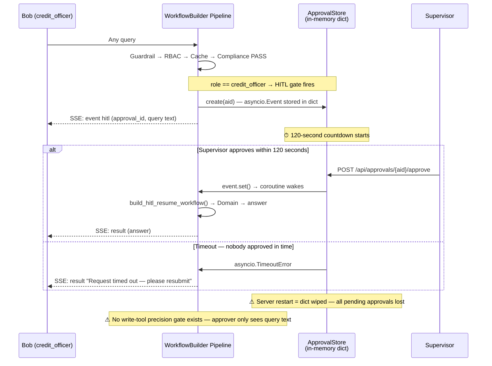
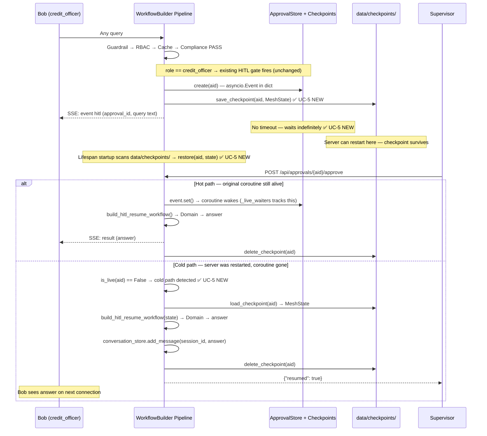
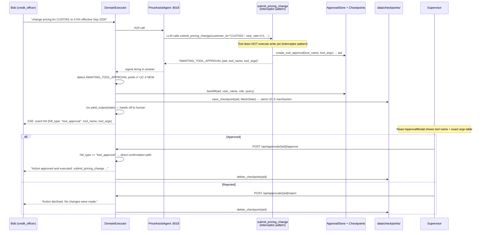

# UC-3 + UC-5 Combined: Tool-Level HITL with Durable Checkpointing

**Pattern:** MAF Agent-to-Human Handoff — checkpoint → yield → wait → resume  
**MAF Features Used:** `FileCheckpointStorage` concept (native implementation), `@tool(approval_mode)` concept (interceptor pattern)  
**Status:** Implemented  
**Branch:** `workflow_evaluations+v1`

---

## Context

The `credit_officer` HITL gate (the `if state.role == "credit_officer":` block in `ComplianceExecutor`) was deliberately added and is kept as-is — it is a demo-intentional feature.

Two problems are addressed together:

**Problem A (UC-5 — Durability):** The existing HITL gate stores state in an in-memory `asyncio.Event` with a hard 120-second timeout. Any server restart or supervisor who isn't at their desk within 2 minutes auto-rejects Bob's query. In a real bank, credit approvals take hours to days. This is a demo mechanism, not production infrastructure.

**Problem B (UC-3 — Precision):** When the LLM calls a write tool (e.g., `submit_pricing_change`), there is no gate that shows the approver the exact parameters of what is about to change. The approver currently only sees Bob's text query — not the precise `customer_id`, `new_rate`, and `effective_date` the LLM resolved to. They are approving intent, not action.

These must be implemented together: UC-3 without UC-5 means the new write-tool gate still loses state on restart. UC-5 without UC-3 means only the existing coarse gate is made durable, and write operations still lack parameter-level approval.

---

## Before vs After — Flow Diagrams

### BEFORE — Current State (Role-Level HITL, 120s timeout, no checkpointing)



### AFTER — Combined UC-5 (Durable) + UC-3 (Tool-Level)

**Part A: Existing role-level HITL gate — now durable (UC-5)**



**Part B: New tool-level HITL gate for write operations (UC-3)**



---

## How the MAF Handoff Pattern Applies Here

### What "Handoff" Means in MAF

In Microsoft Agent Framework, a **handoff** is the act of transferring control — ownership of the current task — from one entity to another. MAF supports two kinds:

1. **Agent-to-Agent handoff** (`HandoffBuilder`): Agent A finishes its turn and explicitly passes full conversation ownership to Agent B. Agent A is done; Agent B now drives.
2. **Agent-to-Human handoff** (HITL): The AI pipeline reaches a decision point requiring human judgment. The workflow STOPS and hands control to a human. When the human acts, control is returned to the AI to resume.

This implementation uses **type 2: Agent-to-Human handoff**. We do NOT use `HandoffBuilder` directly — the A2A multi-process architecture makes it incompatible (see `my_KB/architecture/plan_for_handoff_orchestration_maf.md`). Instead, the handoff PATTERN is implemented natively inside the `WorkflowBuilder` pipeline.

### The 4-Step Handoff Lifecycle

Every HITL event in this system follows the same lifecycle:

```
Step 1 — CHECKPOINT (save before handing off)
  "Before I stop, save everything to disk so it survives a server restart."
  → approval_store.save_checkpoint(aid, state)
  → data/checkpoints/{aid}.json written

Step 2 — HANDOFF (yield control to the human)
  "I am done for now. A human must decide before I can continue."
  → ctx.yield_output(state)  [pipeline pauses here]
  → SSE event: hitl fires → supervisor's browser shows approval card

Step 3 — WAIT (block until decision, no timeout)
  "I will wait indefinitely. The human will signal me when ready."
  → approval_store.wait_for_approval(aid)  [no timeout]
  → asyncio.Event waits for signal

Step 4 — HANDBACK (resume from checkpoint)
  "Human decided. Load the checkpoint, continue from where I left off."
  → build_hitl_resume_workflow(ask=ask_remote).run(state)
  → data/checkpoints/{aid}.json deleted after success
```

**UC-5** makes Steps 1 and 4 production-viable (checkpoint before handoff, restore after restart).  
**UC-3** adds Step 2 at the **tool invocation boundary** so write operations get a precision gate.

### MAF Concept → Our Code Mapping

| MAF Handoff Concept | Native MAF | Our Implementation |
|---------------------|-----------|-------------------|
| State persistence before pause | `FileCheckpointStorage` | `approval_store.save_checkpoint(aid, state)` → `data/checkpoints/{aid}.json` |
| Hand off control | `HandoffBuilder` yields to next participant | `ctx.yield_output(state)` — pipeline yields; orchestrator intercepts |
| Signal the handoff | Framework internal | SSE `event: hitl` → React `ApprovalModal.tsx` |
| Wait for human | Checkpoint + restart recovery | `asyncio.Event.wait()` (no timeout) in `wait_for_approval()` |
| Restore from checkpoint | `FileCheckpointStorage.load()` | `approval_store.load_checkpoint(aid)` in lifespan + approve endpoint |
| Resume after handback | `HandoffBuilder` resumes graph | `build_hitl_resume_workflow(ask=ask_remote).run(state)` |
| Tool-level approval gate | `@tool(approval_mode="always_require")` | Interceptor: tool returns `AWAITING_TOOL_APPROVAL:` signal string |

### Where Each Handoff Fires in the Pipeline

```
InputGuardrail → RBAC → Cache → ComplianceExecutor → DomainExecutor → OutputRedaction
                                        │                    │
                            EXISTING HANDOFF (kept)   NEW HANDOFF (UC-3)
                            role == credit_officer     LLM calls write tool
                                        │                    │
                            saves checkpoint           saves checkpoint
                            (UC-5 adds this)           (UC-5 same mechanism)
                                        │                    │
                            supervisor sees:           supervisor sees:
                            query text + role          EXACT tool name + args
                                        │                    │
                               [approve/reject]        [approve/reject]
                                        │                    │
                            Domain runs normally       Confirmation generated
                            (answer the read query)    (write was approved)
```

---

## Implementation: Phase 1 — Make Existing HITL Gate Durable (UC-5)

The existing `ComplianceExecutor` HITL gate is unchanged. Three code additions make it production-viable.

### `src/hitl/approval_store.py` — New fields + checkpoint methods

```python
# Extended ApprovalRequest
@dataclass
class ApprovalRequest:
    approval_id: str
    user_name: str
    role: str
    query: str
    compliance_verdict: str
    compliance_reasoning: list = field(default_factory=list)
    event: asyncio.Event = field(default_factory=asyncio.Event)
    approved: Optional[bool] = None
    hitl_type: str = "role_approval"   # NEW
    tool_name: str = ""                # NEW
    tool_args: dict = field(default_factory=dict)  # NEW

CHECKPOINT_DIR = Path("data/checkpoints")

class ApprovalStore:
    def __init__(self):
        self._pending: dict[str, ApprovalRequest] = {}
        self._live_waiters: set[str] = set()   # NEW — tracks active coroutines

    async def wait_for_approval(self, approval_id, timeout=None):  # timeout=None, no default
        ...
        self._live_waiters.add(approval_id)   # NEW
        try:
            if timeout:
                await asyncio.wait_for(req.event.wait(), timeout=timeout)
            else:
                await req.event.wait()        # NEW — no timeout
        finally:
            self._live_waiters.discard(approval_id)   # NEW
            self._pending.pop(approval_id, None)

    def is_live(self, approval_id: str) -> bool:   # NEW
        return approval_id in self._live_waiters

    def save_checkpoint(self, approval_id, state):   # NEW
        CHECKPOINT_DIR.mkdir(parents=True, exist_ok=True)
        path = CHECKPOINT_DIR / f"{approval_id}.json"
        path.write_text(json.dumps(dataclasses.asdict(state), default=str))

    def load_checkpoint(self, approval_id):   # NEW
        path = CHECKPOINT_DIR / f"{approval_id}.json"
        if not path.exists(): return None
        data = json.loads(path.read_text())
        return MeshState(**{k: v for k, v in data.items() if k in MeshState.__dataclass_fields__})

    def delete_checkpoint(self, approval_id):   # NEW
        (CHECKPOINT_DIR / f"{approval_id}.json").unlink(missing_ok=True)

    def restore(self, approval_id, state):   # NEW — cold-start re-hydration
        req = ApprovalRequest(
            approval_id=approval_id,
            user_name=state.user_name, role=state.role, query=state.query,
            compliance_verdict=state.compliance_verdict,
            hitl_type=getattr(state, "hitl_type", "role_approval"),
            tool_name=state.hitl_details.get("tool_name", "") if state.hitl_details else "",
            tool_args=state.hitl_details.get("tool_args", {}) if state.hitl_details else {},
        )
        self._pending[approval_id] = req
```

### `src/mesh/workflow.py` — Add checkpoint save in ComplianceExecutor

In the HITL gate block, add one line before `await ctx.yield_output(state)`:

```python
approval_store.save_checkpoint(aid, state)   # ← UC-5 NEW
await ctx.yield_output(state)
return
```

### `agent-mesh/api_server.py` — Startup re-hydration + cold-path resume

```python
# In _lifespan — scan checkpoints on startup
from src.hitl.approval_store import approval_store, CHECKPOINT_DIR
if CHECKPOINT_DIR.exists():
    for cp_file in CHECKPOINT_DIR.glob("*.json"):
        aid = cp_file.stem
        state = approval_store.load_checkpoint(aid)
        if state:
            approval_store.restore(aid, state)
            _log.info("Restored pending HITL approval %s from checkpoint", aid)

# In post_approve — detect cold path and resume
async def post_approve(request):
    aid = request.path_params.get("id", "").strip().upper()
    ok = approval_store.approve(aid)    # signals the event
    if not ok:
        return JSONResponse({"error": "not found"}, status_code=404)
    await asyncio.sleep(0)              # yield — let live coroutine consume event
    if not approval_store.is_live(aid): # cold path — no live coroutine
        state = approval_store.load_checkpoint(aid)
        if state:
            from src.mesh.workflow import build_hitl_resume_workflow
            resume_wf = build_hitl_resume_workflow(ask=ask_remote)
            result_state = await resume_wf.run(state)
            from src.memory import ConversationStore
            if state.session_id:
                ConversationStore(state.session_id).add_message(
                    "assistant", result_state.answer,
                    metadata={"resumed_from_checkpoint": aid}
                )
            approval_store.delete_checkpoint(aid)
            approval_store._pending.pop(aid, None)
            return JSONResponse({"success": True, "approval_id": aid,
                                 "decision": "approved", "resumed": True})
    return JSONResponse({"success": True, "approval_id": aid, "decision": "approved"})
```

---

## Implementation: Phase 2 — Tool-Level Precision Gate (UC-3)

### `src/mesh/workflow.py` — Add `hitl_type` to MeshState

```python
# After hitl_details in MeshState dataclass:
hitl_type: str = ""   # "role_approval" | "tool_approval"
```

### `src/tools/collaboration_tools.py` — Write tools with interceptor

```python
import json

APPROVAL_SIGNAL_PREFIX = "AWAITING_TOOL_APPROVAL:"

@tool(description="Submit a pricing rate change for a customer. Requires supervisor approval before execution.")
async def submit_pricing_change(customer_id: str, new_rate: float, effective_date: str) -> str:
    from src.hitl.approval_store import approval_store
    aid = approval_store.create_tool_approval(
        tool_name="submit_pricing_change",
        tool_args={"customer_id": customer_id, "new_rate": new_rate, "effective_date": effective_date},
    )
    payload = json.dumps({"approval_id": aid, "tool_name": "submit_pricing_change",
                          "tool_args": {"customer_id": customer_id, "new_rate": new_rate,
                                        "effective_date": effective_date}})
    return f"{APPROVAL_SIGNAL_PREFIX}{payload}"

@tool(description="Adjust the credit limit for a customer. Requires supervisor approval before execution.")
async def adjust_credit_limit(customer_id: str, new_limit: float, reason: str) -> str:
    from src.hitl.approval_store import approval_store
    aid = approval_store.create_tool_approval(
        tool_name="adjust_credit_limit",
        tool_args={"customer_id": customer_id, "new_limit": new_limit, "reason": reason},
    )
    payload = json.dumps({"approval_id": aid, "tool_name": "adjust_credit_limit",
                          "tool_args": {"customer_id": customer_id, "new_limit": new_limit,
                                        "reason": reason}})
    return f"{APPROVAL_SIGNAL_PREFIX}{payload}"

COORDINATION_TOOLS = [query_structured_data, query_knowledge_base,
                      submit_pricing_change, adjust_credit_limit]
```

**Note:** For the tool interceptor to work, PriceAssistAgent's system prompt must include:
> "If a tool returns a string starting with 'AWAITING_TOOL_APPROVAL:', include that exact string verbatim as your entire response. Do not paraphrase or summarize it."

### `src/hitl/approval_store.py` — Tool approval methods (Phase 2 additions)

```python
def create_tool_approval(self, tool_name: str, tool_args: dict) -> str:
    aid = uuid.uuid4().hex[:12].upper()
    self._pending[aid] = ApprovalRequest(
        approval_id=aid, user_name="", role="", query="",
        compliance_verdict="", hitl_type="tool_approval",
        tool_name=tool_name, tool_args=tool_args,
    )
    return aid

def backfill(self, approval_id: str, user_name: str, role: str, query: str) -> None:
    if req := self._pending.get(approval_id):
        req.user_name = user_name
        req.role = role
        req.query = query
```

### `src/mesh/workflow.py` — Signal detection in DomainExecutor

Add after `answer = await self._ask("price_assist", base_prompt)` and before `answer_visible = strip_reasoning_markers(answer or "")`:

```python
# Tool approval interceptor signal detection (UC-3)
_AWAITING_PREFIX = "AWAITING_TOOL_APPROVAL:"
if (answer or "").strip().startswith(_AWAITING_PREFIX):
    try:
        import json as _json
        from src.hitl.approval_store import approval_store as _astore
        _raw = answer.strip()[len(_AWAITING_PREFIX):]
        _payload = _json.loads(_raw)
        _aid = _payload["approval_id"]
        _astore.backfill(_aid, state.user_name, state.role, state.query)
        state.hitl_pending = True
        state.hitl_approval_id = _aid
        state.hitl_type = "tool_approval"
        state.hitl_details = {
            "hitl_type": "tool_approval",
            "tool_name": _payload["tool_name"],
            "tool_args": _payload["tool_args"],
            "user_name": state.user_name,
            "role": state.role,
        }
        state.trail.append(f"hitl_tool_pending:{_aid}:{_payload['tool_name']}")
        _emit_stream_event({"stage": "domain", "status": "hitl_pending",
                            "message": f"Tool approval required: {_payload['tool_name']}"})
        _astore.save_checkpoint(_aid, state)
        await ctx.yield_output(state)
        return
    except Exception as _exc:
        _log.warning("Tool approval signal parse error: %s", _exc)
        # Fall through to normal processing if signal is malformed
```

### `src/mesh/orchestrator.py` — HITL block updates

```python
# Change 1: Remove timeout from wait_for_approval call
approved = await approval_store.wait_for_approval(aid)   # was: timeout=120.0

# Change 2: Add hitl_type to SSE event
_emit_stream_event({
    "event_type": "hitl",
    "approval_id": aid,
    "hitl_type": getattr(final, "hitl_type", "role_approval"),   # NEW
    "details": final.hitl_details,
})

# Change 3: Check hitl_type on approval to choose resume path
if approved:
    final.hitl_pending = False
    if getattr(final, "hitl_type", "role_approval") == "tool_approval":
        # Direct confirmation — tool was already approved, write is committed
        tool_details = final.hitl_details
        tool_name = tool_details.get("tool_name", "unknown")
        tool_args = tool_details.get("tool_args", {})
        args_display = " | ".join(f"{k}: {v}" for k, v in tool_args.items())
        final.answer = (
            f"Action approved and executed.\n\n"
            f"**{tool_name.replace('_', ' ').title()}**\n{args_display}\n\n"
            f"The change has been applied and recorded in the audit trail."
        )
        final.trail.append(f"hitl_approved:tool:{tool_name}")
        approval_store.delete_checkpoint(aid)
    else:
        # Standard role-level approval resume
        resume_wf = build_hitl_resume_workflow(ask=ask_remote)
        resume_events = await resume_wf.run(final)
        resumed = _final_state(resume_events)
        if resumed is not None:
            final = resumed
        approval_store.delete_checkpoint(aid)
```

### `frontend/src/components/chat/ApprovalModal.tsx` — Tool args rendering

```tsx
{details.hitl_type === "tool_approval" ? (
  <div>
    <h4>Tool Approval Required</h4>
    <p>Requested by: {details.user_name} ({details.role})</p>
    <p>Tool: <code>{details.tool_name}</code></p>
    <table>
      <tbody>
        {Object.entries(details.tool_args || {}).map(([k, v]) => (
          <tr key={k}><td>{k}</td><td>{String(v)}</td></tr>
        ))}
      </tbody>
    </table>
  </div>
) : (
  // existing role-approval rendering — unchanged
  <div>...</div>
)}
```

---

## Complete File-by-File Changes

| File | Phase | Change |
|------|-------|--------|
| `src/hitl/approval_store.py` | 1+2 | Extend `ApprovalRequest` dataclass; add `_live_waiters`; modify `wait_for_approval` (no timeout, live tracking); add `save_checkpoint`, `load_checkpoint`, `delete_checkpoint`, `restore`, `is_live`, `create_tool_approval`, `backfill` methods |
| `src/mesh/workflow.py` | 1 | Add `hitl_type: str = ""` to `MeshState`; add `approval_store.save_checkpoint(aid, state)` before `yield_output` in `ComplianceExecutor` |
| `src/mesh/workflow.py` | 2 | Add signal detection block in `DomainExecutor.run()` after PriceAssistAgent A2A call |
| `agent-mesh/api_server.py` | 1 | Startup checkpoint re-hydration in `_lifespan`; cold-path resume logic in `post_approve` |
| `src/tools/collaboration_tools.py` | 2 | Add `APPROVAL_SIGNAL_PREFIX`, `submit_pricing_change`, `adjust_credit_limit` tools; update `COORDINATION_TOOLS` |
| `src/mesh/orchestrator.py` | 1+2 | Remove `timeout=120.0`; add `hitl_type` to SSE payload; add `hitl_type`-based resume branching; add `delete_checkpoint` on approval |
| `frontend/src/components/chat/ApprovalModal.tsx` | 2 | Conditional rendering for `hitl_type === "tool_approval"` showing tool name + args table |

---

## What Does NOT Change

- The existing `if state.role == "credit_officer":` block in `ComplianceExecutor` — kept as-is (demo feature)
- `approve()`, `reject()` method contracts — same external interface
- `GET /api/approvals/{id}`, `POST /api/approvals/{id}/reject` endpoints — unchanged
- `build_hitl_resume_workflow()` — unchanged function; used by both role-level resume and cold-path resume
- `query_structured_data` and `query_knowledge_base` tools — no gate, free to call
- A2A cross-process architecture (4 OS processes, all ports unchanged)
- Full 6-stage pipeline shape — unchanged
- All OTel spans, `audit_trail.jsonl`, `data/logs/state/` traces — unchanged
- `test_agent_mesh.py` — all tests mock at `ask_remote` seam, unchanged

---

## Verification

### Phase 1 — Existing Gate Now Durable
1. Bob (credit_officer) submits any query → HITL fires → check `data/checkpoints/{aid}.json` exists
2. Stop server while approval pending → restart → log shows "Restored pending HITL approval {aid}"
3. `GET /api/approvals/{aid}` → still listed (restored from disk)
4. Approve → cold path detected (no live waiter) → pipeline resumes → result in conversation history
5. `data/checkpoints/{aid}.json` deleted after approval
6. Reject → checkpoint deleted, no resume

### Phase 2 — Tool-Level Gate
1. Bob asks "submit a pricing change for CUST001 to 4.5% effective September 2026"
2. SSE fires `event: hitl` with `hitl_type: "tool_approval"` and `tool_args: {customer_id, new_rate, effective_date}`
3. React renders tool name + args table in `ApprovalModal`
4. Approve → confirmation answer generated with tool name and args; checkpoint deleted
5. Reject → "action declined, no changes made"

### Regression
1. Alice (relationship_manager) — any query → no HITL, no checkpoint written
2. Bob read-only query → role-level HITL fires (kept by design)
3. `test_agent_mesh.py` → all pass (mock at `ask_remote` seam unchanged)
4. After non-HITL queries: `data/checkpoints/` is empty

---

## Related Files

| File | Role |
|------|------|
| `src/hitl/approval_store.py` | Central HITL store — extended for checkpointing + tool approval |
| `src/mesh/workflow.py` | `MeshState` + both executor changes |
| `src/mesh/orchestrator.py` | HITL interception block |
| `agent-mesh/api_server.py` | Lifespan startup + approve endpoint cold-path |
| `src/tools/collaboration_tools.py` | Write tools with interceptor |
| `frontend/src/components/chat/ApprovalModal.tsx` | Approval UI |
| `my_KB/architecture/handoff_pattern_usecases.md` | Parent document |
| `my_KB/architecture/plan_for_handoff_orchestration_maf.md` | Why HandoffBuilder was not used wholesale |
