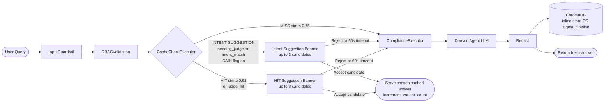
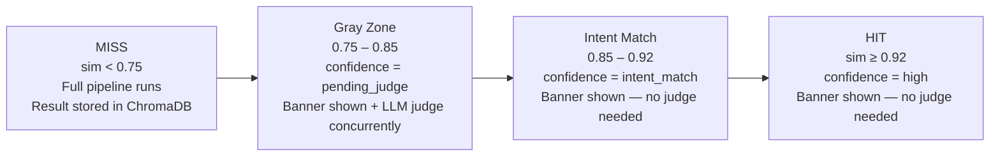
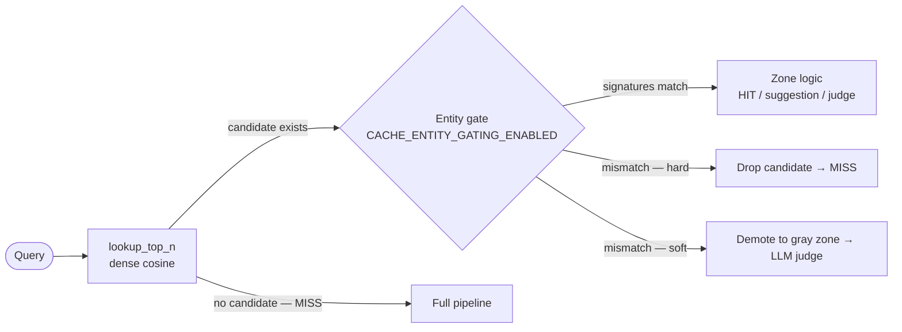
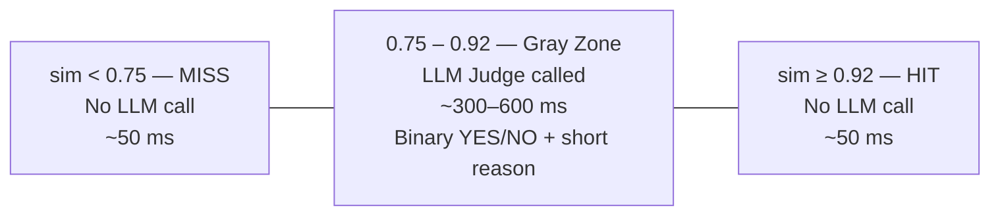
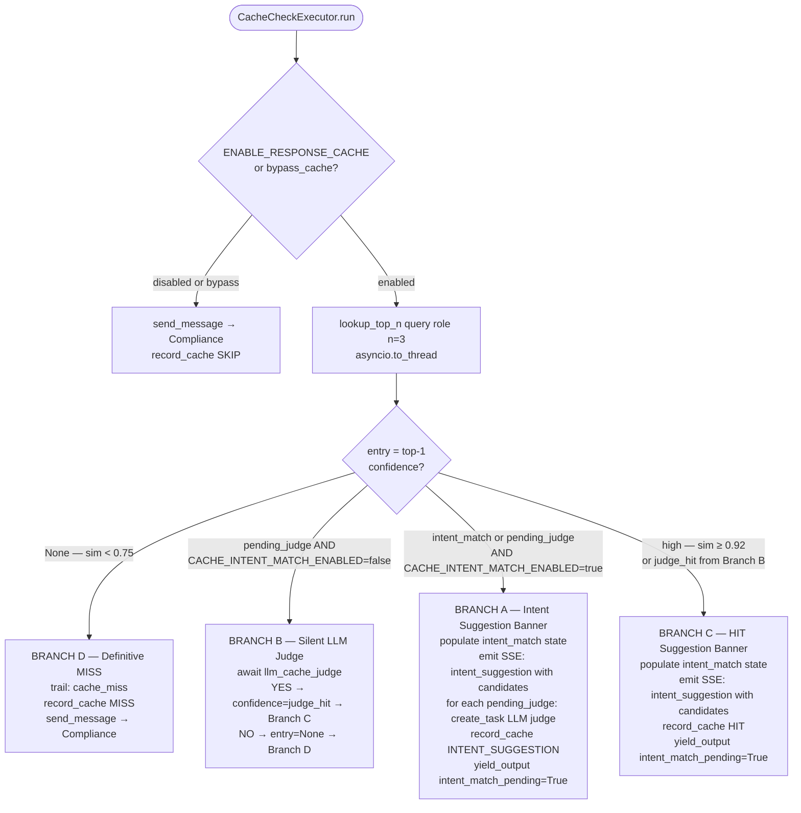
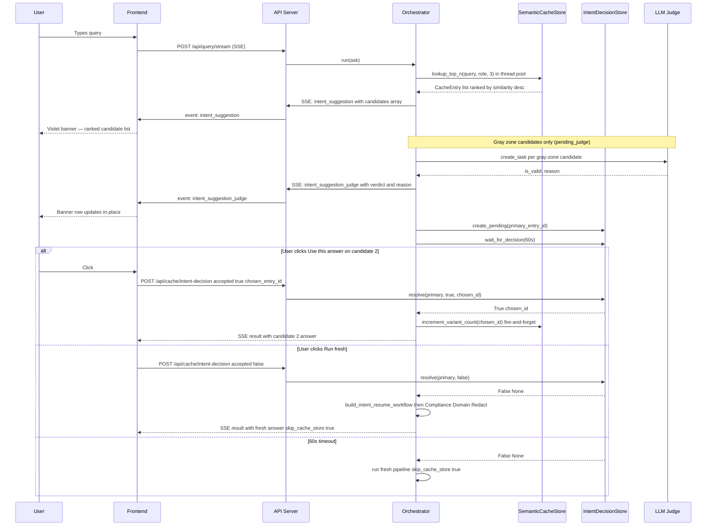
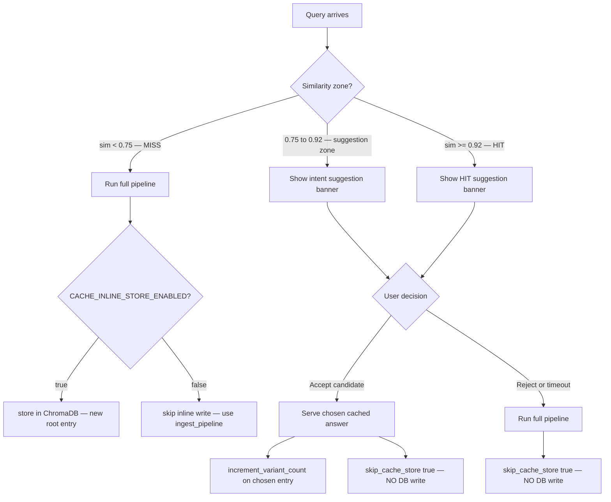
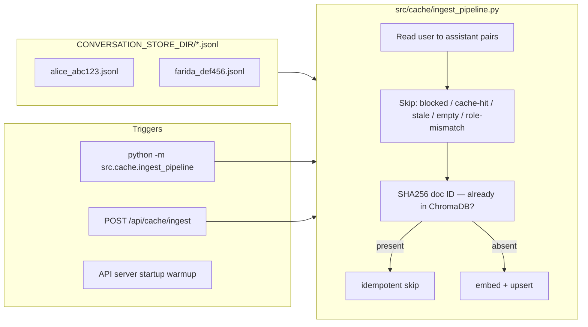

# Semantic Response Cache — Complete Implementation Reference

AgentMesh uses a **semantic vector cache** backed by ChromaDB to short-circuit the expensive LLM pipeline when a semantically similar question has already been answered for the same role. A full pipeline run costs 2–4 A2A LLM round-trips (~5–70 s). A cache hit costs one embedding call (~50 ms).

---

## Architecture

### High-Level Position in the Pipeline



> `CacheCheckExecutor` sits **after RBAC, before Compliance**.
> RBAC resolves first so the `role` is known — cache is role-scoped.
> Compliance and Domain are skipped on accepted cache hit — all LLM cost is saved.
> HITL resume workflows are excluded from caching — approved requests always run fresh.

---

## Similarity Zones

```
0.0           0.75              0.85              0.92            1.0
 |─────────────|──────────────────|──────────────────|──────────────|
      MISS         Gray Zone           Intent Match        HIT
                 (pending_judge)      (intent_match)      (high)
               LLM judge concurrent   Banner only      Banner only
               (advisory signal)
      ↑                    ↑                   ↑
CACHE_MISS_THRESHOLD  CACHE_INTENT_      CACHE_SIMILARITY_
   (default 0.75)   MATCH_THRESHOLD      THRESHOLD
                    (default 0.85)       (default 0.92)
```



| Zone | Similarity Range | Confidence Value | Action |
|---|---|---|---|
| **MISS** | `sim < 0.75` | — | Full pipeline; store result |
| **Gray Zone** | `0.75 ≤ sim < 0.85` | `pending_judge` | Banner + LLM judge fires concurrently (advisory) |
| **Intent Match** | `0.85 ≤ sim < 0.92` | `intent_match` | Banner shown (no judge) |
| **HIT** | `sim ≥ 0.92` | `high` | Banner shown (no judge) |

> Gray zone and intent match banners are only active when `CACHE_INTENT_MATCH_ENABLED=true`.
> When disabled, gray zone runs the LLM judge silently (Branch B) — no UI interaction.

---

## Entity-Aware Gating

Dense embeddings capture **intent**, not discrete identifiers. `"show customer profile for CUST001"` and `"...CUST002"` are ~90 % lexically identical, so cosine similarity lands **≥ 0.92 (HIT zone)** — bypassing the LLM judge (gray-zone only) and serving CUST001's answer for a CUST002 query. The **entity gate** fixes this by matching on entities *in addition to* intent.



**How it works** (`src/cache/entity_extractor.py`, gate in `CacheCheckExecutor.run`):
1. Runs **only when `lookup_top_n` already returned a candidate** — a definitive MISS pays zero extraction cost.
2. An LLM extracts the incoming query's entities (customer/account/deal IDs, people, products, time scope, amounts, other) into a normalized, order-independent **signature** (`frozenset` of `bucket:value` tokens). One call per query, **memoized** by normalized query text.
3. Each candidate's signature comes from its `entities` ChromaDB metadata (computed at store/ingest time). Pre-gating entries without that metadata are extracted from their stored query text on the fly.
4. `signatures_match` is **exact set equality** (both-empty ⇒ match, so entity-free queries still cache). Mismatch → **hard**: candidate dropped (MISS); **soft**: demoted to `pending_judge` for the LLM judge.

**Resilience:** on extractor timeout/error it falls back to a deterministic regex extractor for structured IDs (`CUST\d+`, `ACC\d+`, `DEAL\d+`) — so the CUST001/CUST002 case is caught even when the LLM is down. Trace tag `entity_gate:drop|demote:<id>:<sig>!=<sig>` + OTel attr `cache.entity_gate_dropped`.

**Backfill existing entries** (no re-embed): `python -m src.cache.ingest_pipeline --backfill-entities [--dry-run]`.

---

## Roadmap Phases — What Each One Is and Does

The cache was built in phases. Each phase solves one specific weakness of "plain
semantic caching" (embed the question, return the nearest stored answer). This
section explains each one in plain language: the problem it fixes, how it works,
and an example.

| Phase | In one line | Default | Status |
|---|---|---|---|
| **1 — Entity gate** | Don't reuse CUST001's answer for a CUST002 question | **on** | shipped |
| **2 — Canonicalization** | Make paraphrases of the same question look identical to the cache | **on** | shipped |
| **3 — Hybrid retrieval** | Also match on exact keywords, not just meaning | **on** | shipped (experimental) |
| **4 — Reranker** | A smarter, local model re-checks which stored question truly fits | **on** | shipped |
| **6 — Observability** | Count hits/misses/accepts/rejects so thresholds can be tuned from data | always | shipped |
| **7 — Negative guard + feedback** | Never cache "no data found"; learn from rejected suggestions | **on** | shipped |
| **5 — Invalidation** | Auto-expire a cached answer when its underlying data changes | — | deferred |

> The pipeline order inside `CacheCheckExecutor` is: dense retrieval → **(3)** hybrid
> fuse → **(1)** entity gate → **(4)** rerank → LLM judge → suggestion banner.
> **(2)** happens at embedding time; **(6)/(7)** wrap the accept/reject/store steps.

---

### Phase 1 — Entity-aware gate  *(the original fix)*
**Problem.** Embeddings capture *meaning*, not exact identifiers. "show profile for
CUST001" and "show profile for CUST002" are ~95% identical text, so their vectors
are nearly the same — the cache would happily serve **CUST001's** answer to a
**CUST002** question.
**What it does.** Extracts the *entities* each question is about (customer/account/deal
IDs, people, time periods, amounts) into a normalized signature, and only lets a
cached answer through if its entities **exactly match** the new question's. Different
entity → forced MISS.
**Example.** Cached: "profile for CUST001". New: "profile for CUST002" → entities
`{CUST002} ≠ {CUST001}` → **not served** (runs fresh). New: "get me CUST001's profile"
→ same entity + same intent → **served**.
*(Full detail in the [Entity-Aware Gating](#entity-aware-gating) section above.)*
Config: `CACHE_ENTITY_GATING_ENABLED`, `CACHE_ENTITY_GATE_MODE` (`hard`/`soft`).

### Phase 2 — Query canonicalization / templating
**Problem.** The same request phrased slightly differently ("pricing for CUST001" vs
"what pricing should I recommend for CUST001") produces different vectors, so a valid
cached answer can be *missed*.
**What it does.** Before embedding, it replaces the entities with placeholders — both
become **"pricing for `<CUSTOMER_ID>`"** — so paraphrases of the same intent collapse
onto (nearly) the same vector and match reliably. The *raw* question is still stored
and still keys the record, and Phase 1 still keeps different IDs apart, so nothing
gets over-merged.
**Example.** "CUST001 margin?" and "what is the margin for CUST001" both embed as
"margin for `<CUSTOMER_ID>`" → high similarity → the second reuses the first's answer.
⚠️ It changes what gets embedded, so **turning it on requires re-embedding** the
collection (`--overwrite` ingest) — otherwise old raw-embedded entries stop matching.
Config: `CACHE_CANONICALIZE_ENABLED`. Code: `entity_extractor.canonicalize_query`.

### Phase 3 — Hybrid dense + sparse retrieval
**Problem.** Pure "meaning" search can rank the right answer too low when a rare but
important keyword (a product name, a policy code) barely nudges the vector.
**What it does.** Runs the normal meaning-based (dense) search **and** a classic
keyword search (**BM25**, "sparse"), then blends the two rankings with Reciprocal Rank
Fusion. An entry that's a strong keyword match gets lifted even if its vector rank was
middling.
**Example.** Query "FAB-CRP-CONC-2024 limits" — the policy code is a weak signal to the
embedder but an exact keyword hit for BM25, so hybrid surfaces the right cached answer.
Needs the `rank-bm25` package. Marked **experimental** because Phase 1 already handles
the most common precision problem (IDs). Config: `CACHE_HYBRID_ENABLED`,
`CACHE_HYBRID_FETCH_K`. Code: `SemanticCacheStore._hybrid_rerank`.

### Phase 4 — Cross-encoder reranker
**Problem.** The fast embedding model scores the question and each stored question
*separately* (a "bi-encoder") — good enough to shortlist, but it can mis-order close
candidates. Deciding the tricky middle ground ("gray zone") was offloaded to a
**remote LLM judge**, which is slow and fails on rate limits / proxy SSL.
**What it does.** A **cross-encoder** reads the new question and a candidate *together*
and scores how well they match — far more accurate at ordering. It re-sorts the
shortlist and drops obviously-irrelevant candidates **before** the LLM judge runs.
Runs **locally** (no network → no 429/SSL failures) and, in *augment* mode, the LLM
judge still makes the final call on what's left.
**Example.** Two candidates look equally close by embedding; the cross-encoder
recognizes only one actually answers the question and ranks it first, so the user sees
the right suggestion at the top. Config: `CACHE_RERANKER_ENABLED`, `CACHE_RERANKER_MODEL`,
`CACHE_RERANK_MIN_SCORE`. Code: `src/cache/reranker.py`. Needs the model downloaded once
(HuggingFace) — falls back to plain dense order if unavailable.

### Phase 6 — Observability & tuning
**Problem.** You can't tune thresholds (0.75 / 0.85 / 0.92) or trust the cache without
knowing how often it hits, misses, and — crucially — how often a "hit" was actually
*wrong*.
**What it does.** Records every cache outcome as metrics (`HIT`, `MISS`,
`HIT_ACCEPTED`, `HIT_REJECTED`, `ENTITY_GATE_DROP`, …) and keeps running counters
(`entity_gate_drops`, `hit_accepted`, `hit_rejected`, `reranker_invocations`, …) that
show up in `GET /api/cache/stats`. The **HIT→reject rate** is a direct false-positive
signal — if it climbs, the thresholds are too loose. Code: `record_cache`
(`src/observability/metrics.py`), counters in `SemanticCacheStore.stats()`.

### Phase 7 — Negative-answer guard + reject-feedback loop
**Problem (7a).** If the system answers "No data found for CUST099" and that gets
cached, a *later* identical question — after the data exists — would be served the
stale "not found".
**What it does (7a).** Detects non-answers ("no … data found", "unable to retrieve")
and **refuses to cache them** on the live path. Config: `CACHE_SKIP_NEGATIVE` (on).
**Problem (7b).** When a user is shown a cached suggestion and clicks "run fresh"
instead, that rejection is a strong hint the match was wrong — but it was being thrown
away (and couldn't even be told apart from a 60-second timeout).
**What it does (7b).** Distinguishes an **explicit reject** from a silent **timeout**,
and logs explicit rejects of high-confidence hits to `data/cache_rejections.jsonl`
(`{ts, role, query, chosen_entry_id, similarity, confidence}`) as a durable
false-positive record for tuning / a future "demote" list. Code:
`intent_decision_store.wait_for_decision_ex`, `orchestrator._record_cache_rejection`.

### Phase 5 — Event-driven invalidation  *(deferred, not built)*
**Idea.** When the underlying data for an entity changes (e.g. CUST001's credit rating
updates), automatically delete every cached answer about CUST001 so no one is served a
stale figure — instead of relying only on the time-based `CACHE_MAX_AGE_HOURS` expiry.
**Why deferred.** The data lives in an external, static mock service
(`DATALAYER_MCP_URL`) with no "data changed" event to listen for, and the cache has no
delete-by-entity method yet. The Phase-1 `entities` metadata already makes this
feasible to add later — it just needs an event source + a `delete_by_entity` method.

---

## Storage: ChromaDB

| Property | Value |
|---|---|
| Backend | ChromaDB `PersistentClient` (SQLite on-disk) |
| Location | `data/cache/chroma/` (`CACHE_CHROMA_DIR`) |
| Collection | `mesh_response_cache` (`CACHE_COLLECTION_NAME`) |
| Distance metric | Cosine (`hnsw:space=cosine`) — `similarity = 1 - distance` |
| Embedding model | `all-MiniLM-L6-v2` via ChromaDB `DefaultEmbeddingFunction` (onnxruntime, no HuggingFace download) |
| Vector dimensions | 384 |
| Document ID | `uuid5(sha256(role + "::" + query))` — deterministic, idempotent upserts |
| Thread safety | `threading.Lock` serialises all writes; reads are concurrent |

### Per-Document Metadata Schema

| Field | Type | Purpose |
|---|---|---|
| `role` | string | Role isolation — `where={"role": {"$eq": role}}` |
| `answer` | string | Stored answer (capped at 8 192 chars) |
| `route` | string | Domain route (Data Layer / RAG / Hybrid) |
| `session_id` | string | Source session for audit trace-back |
| `request_id` | string | Source request ID |
| `ts_iso` | string | ISO timestamp when stored |
| `ts_unix` | float | Unix timestamp (fast age expiry check) |
| `reasoning` | string | JSON-serialized LLM reasoning entries (capped 8 192 chars) |
| `variant_count` | int | Times a variant query was accepted pointing to this root |
| `last_variant_ts` | float | Unix timestamp of last variant acceptance |
| `entities` | string | Serialized entity signature for the gate (`bucket:value` tokens, `\|`-joined). Absent on pre-gating entries. |

---

## Core Classes & Methods

### `@dataclass CacheEntry` (`src/cache/semantic_cache.py`)

```python
@dataclass
class CacheEntry:
    query_original: str    # stored query that matched
    answer: str            # stored redacted answer
    role: str              # role the answer was produced for
    route: str             # domain route
    session_id: str        # source session
    request_id: str        # source request
    ts_iso: str            # ISO timestamp
    similarity: float      # cosine similarity [0, 1]
    age_hours: float       # age at lookup time
    reasoning: List[dict]  # LLM reasoning entries from original run
    confidence: str = "high"
    # "high"          → sim ≥ CACHE_SIMILARITY_THRESHOLD
    # "intent_match"  → CACHE_INTENT_MATCH_THRESHOLD ≤ sim < CACHE_SIMILARITY_THRESHOLD
    # "pending_judge" → CACHE_MISS_THRESHOLD ≤ sim < CACHE_INTENT_MATCH_THRESHOLD
    # "judge_hit"     → set by CacheCheckExecutor (Branch B) after judge returns YES
    entry_id: str = ""     # ChromaDB document ID
```

### `class SemanticCacheStore` (`src/cache/semantic_cache.py`)

| Method | Signature | Description |
|---|---|---|
| `lookup` | `(query, role) → Optional[CacheEntry]` | Delegates to `lookup_with_id` |
| `lookup_with_id` | `(query, role) → Optional[CacheEntry]` | Calls `lookup_top_n(n=1)`, returns first or None |
| `lookup_top_n` | `(query, role, n=3) → List[CacheEntry]` | Four-zone logic; filters stale; returns up to n sorted by similarity desc |
| `store` | `(query, answer, role, route, session_id, request_id, ts=None, reasoning=None)` | Upserts via SHA256 doc ID; thread-safe |
| `increment_variant_count` | `(entry_id)` | Atomically increments `variant_count` + sets `last_variant_ts` under write lock |
| `stats` | `() → dict` | Returns stats dict for `/api/cache/stats` |
| `_warmup` | `()` | Pre-loads embedding model + opens collection; called at startup |
| `_doc_id` | `(role, query) → str` (static) | `uuid5(sha256(f"{role}::{query}"))` |

**`lookup_top_n` four-zone logic (from source):**
```python
if similarity >= self._threshold:                           # ≥ 0.92
    confidence = "high"
elif intent_enabled and similarity >= intent_threshold:     # ≥ 0.85
    confidence = "intent_match"
else:
    confidence = "pending_judge"                            # ≥ 0.75
# Below CACHE_MISS_THRESHOLD → filtered out entirely (never returned)
```

---

## LLM Judge — Gray Zone Validation (`src/cache/cache_judge.py`)

Pure cosine similarity has two failure modes:
- **False negatives**: "What is Alice's credit limit?" vs "List Alice's credit limit" → 0.89 — same intent, threshold misses it.
- **False positives**: "What is Alice's credit limit?" vs "Has Alice's credit limit changed recently?" → 0.88 — different intent.



### Judge Prompt (actual source)

```
You are a cache validation assistant for a financial services AI system.

User role: {role}
New query: "{new_query}"
Original cached query: "{cached_query}"
Cached answer (excerpt):
"""
{first 400 chars}
"""

Task: Decide whether the cached answer fully and accurately addresses the new query for this user role.
Consider: same intent, same scope, same subject — minor rephrasing is fine.
Reject if: different entity, different time scope, different intent, or the answer would not satisfy the new query.

Reply in this exact format — decision first, then a colon, then one short reason (max 12 words):
YES: <one short reason>
or
NO: <one short reason>

Examples:
YES: same customer and intent, only wording differs
NO: asks about a different time period than cached answer
```

### Judge Implementation Details

| Property | Value |
|---|---|
| Model | `CACHE_JUDGE_MODEL` (default: `openai/gpt-oss-20b`; active .env: `gemma-4-31b`) |
| `max_tokens` | `60` |
| `temperature` | `0` (deterministic) |
| Timeout | `5.0 s` — on timeout or error → returns `(False, "")` (graceful MISS) |
| Return type | `Tuple[bool, str]` — `(decision, reason)` |
| HTTP client | `httpx.AsyncClient` |

**Response parsing** (`_parse_judge_response`):
- Splits on first `:` — prefix decides `YES`/`NO`, rest is `reason` (capped 120 chars)
- Tolerates missing colon, extra whitespace, lowercase variants

**Branch A** (`CACHE_INTENT_MATCH_ENABLED=true`): judge fires as a **concurrent async task** per `pending_judge` candidate. Result emitted as `intent_suggestion_judge` SSE — **advisory only**, user still decides.

**Branch B** (`CACHE_INTENT_MATCH_ENABLED=false`): judge decides **synchronously** — `YES` → `entry.confidence = "judge_hit"` → Branch C. `NO` → `entry = None` → Branch D (MISS).

---

## MeshState Cache Fields (`src/mesh/workflow.py`)

```python
# Cache hit fields
cache_hit: bool = False
cache_answer: str = ""
cache_age_hours: float = 0.0
cache_similarity: float = 0.0
cache_reasoning: List[dict] = field(default_factory=list)
cache_judge_invoked: bool = False
cache_judge_decision: str = ""
cache_judge_reason: str = ""
bypass_cache: bool = False           # skips lookup; fresh answer still stored

# Intent-match suggestion fields
intent_match_pending: bool = False            # orchestrator pauses when True
intent_match_root_query: str = ""             # top-1 root question text
intent_match_entry_id: str = ""               # top-1 ChromaDB doc ID (keys IntentDecisionStore)
intent_match_similarity: float = 0.0
intent_match_answer: str = ""                 # top-1 cached answer
intent_match_age_hours: float = 0.0
intent_match_confidence: str = ""             # "high" | "intent_match" | "pending_judge"
intent_match_candidates: List[dict] = field(default_factory=list)
# each dict: {entry_id, root_query, similarity, age_hours, answer_preview, answer, confidence}

skip_cache_store: bool = False                # prevents variant from being re-stored
```

---

## CacheCheckExecutor — Execution Branches

`lookup_top_n(query, role, n=3)` is called first (in thread pool — CPU-bound embedding). `entry = all_candidates[0]` selects top-1 for zone decision.



### `_build_candidates_payload(entries)` — inline helper in `CacheCheckExecutor.run`

```python
def _build_candidates_payload(entries):
    return [
        {
            "entry_id": e.entry_id,
            "root_query": e.query_original,
            "similarity": e.similarity,
            "age_hours": e.age_hours,
            "answer_preview": e.answer[:200],
            "answer": e.answer,          # full answer kept server-side; omitted from SSE
            "confidence": e.confidence,
        }
        for e in entries
    ]
```

### Branch A — Intent Suggestion (`CACHE_INTENT_MATCH_ENABLED=true`, gray zone + intent match)

1. Populates all `intent_match_*` state fields; stores `candidates_payload`
2. Records trail: `"intent_suggestion:{confidence}:sim={sim:.3f}:n={count}"`
3. Records OTel metric: `record_cache("INTENT_SUGGESTION", role, elapsed_ms)`
4. Emits `event_type="intent_suggestion"` SSE — `candidates[]` list (answer omitted from SSE payload)
5. For each `pending_judge` candidate: `asyncio.create_task(_run_judge_and_emit())` — non-blocking; emits `intent_suggestion_judge` when ready
6. Sets `state.intent_match_pending = True`
7. Calls `ctx.yield_output(state)` — pauses; orchestrator awaits `IntentDecisionStore`

### Branch B — Silent LLM Judge (`CACHE_INTENT_MATCH_ENABLED=false`, gray zone only)

1. `(is_valid, judge_reason) = await llm_cache_judge(new_query, cached_query, cached_answer, role)`
2. `YES` → `entry.confidence = "judge_hit"` → falls through to Branch C
3. `NO` → `entry = None` → falls through to Branch D

### Branch C — HIT Banner (all `high` entries, and `judge_hit` from Branch B)

1. Populates `intent_match_entry_id/answer/similarity/candidates` on state
2. Emits stage SSE: `"Cache hit ({sim:.0%} match) — select an answer or run fresh"` with `judge_invoked/judge_decision/judge_reason`
3. Sets `state.intent_match_pending = True`
4. Emits `event_type="intent_suggestion"` SSE with all candidates (same payload as Branch A)
5. Calls `ctx.yield_output(state)` — pauses for user selection

### Branch D — Cache MISS

Records trail `"cache_miss"` (or `"cache_miss:judge_rejected"`) → `ctx.send_message(state)` continues to Compliance.

---

## Intent Decision Flow

### `IntentDecisionStore` (`src/cache/intent_decision_store.py`)

```python
@dataclass
class IntentDecision:
    entry_id: str
    event: asyncio.Event = field(default_factory=asyncio.Event)
    accepted: Optional[bool] = None
    chosen_entry_id: Optional[str] = None  # which candidate user picked

# Module-level singleton:
intent_decision_store = IntentDecisionStore()
```

| Method | Description |
|---|---|
| `create_pending(entry_id)` | Register a pending decision |
| `async wait_for_decision(entry_id, timeout=60.0) → tuple[bool, Optional[str]]` | Awaits `asyncio.Event`; returns `(accepted, chosen_entry_id)`; resolves `(False, None)` on timeout |
| `resolve(entry_id, accepted, chosen_entry_id=None) → bool` | Sets `dec.chosen_entry_id`, fires `event.set()`; returns `True` if found |
| `get_pending_ids() → list[str]` | Returns currently-pending entry IDs |

- Uses `asyncio.Event` — zero-polling
- 60 s timeout → `(False, None)` — pipeline never hangs permanently
- Single-process only; replace with Redis-backed store for multi-worker

### Orchestrator Interception (`src/mesh/orchestrator.py`)

```python
if getattr(final, "intent_match_pending", False):
    entry_id = final.intent_match_entry_id
    final.intent_match_pending = False
    intent_decision_store.create_pending(entry_id)       # register BEFORE waiting
    accepted, chosen_id = await intent_decision_store.wait_for_decision(entry_id, timeout=60.0)

    if accepted:
        chosen_id = chosen_id or entry_id
        candidates = getattr(final, "intent_match_candidates", [])
        chosen = next((c for c in candidates if c.get("entry_id") == chosen_id), None)
        final.answer           = chosen["answer"]     if chosen else final.intent_match_answer
        final.cache_hit        = True
        final.cache_similarity = chosen["similarity"] if chosen else final.intent_match_similarity
        final.cache_age_hours  = chosen["age_hours"]  if chosen else final.intent_match_age_hours
        final.skip_cache_store = True
        # Trail tag distinguishes HIT from intent-match zone
        trail_tag = "cache_hit_selected" if chosen_similarity >= 0.92 else "intent_match_accepted"
        final.trail.append(f"{trail_tag}:chosen={chosen_id}:sim={chosen_similarity:.3f}")
        asyncio.create_task(
            asyncio.to_thread(get_cache_store().increment_variant_count, chosen_id)
        )
    else:
        # Rejected or timed out — run fresh pipeline
        final.skip_cache_store = True
        final.trail.append("intent_match_rejected")
        resume_wf = build_intent_resume_workflow(ask=ask_remote)
        resume_events = await resume_wf.run(final)
        resumed = _final_state(resume_events)
        if resumed is not None:
            final = resumed
            final.skip_cache_store = True   # preserve through resume
```

---

## Full Suggestion Flow — Sequence Diagram



---

## Storage Invariant



**Only true MISS queries (sim < 0.75) can become new root entries in ChromaDB.**

---

## SSE Events

| Event | Key Fields |
|---|---|
| `stage` | `stage`, `status`, `message`, `judge_invoked?`, `judge_decision?`, `judge_reason?` |
| `intent_suggestion` | `event_type`, `root_query`, `entry_id`, `similarity`, `age_hours`, `answer_preview`, `confidence`, `judge_verdict`, `judge_reason`, `candidates[]` |
| `intent_suggestion_judge` | `event_type`, `entry_id`, `judge_verdict` (`"YES"`/`"NO"`), `judge_reason` |
| `reasoning` | `entries: [...]`, `replayed_from_cache?: true` |
| `result` | Full `MeshResult` JSON |
| `done` | `{}` |
| `error` | `{message}` |

### Example `intent_suggestion` payload

```json
{
  "event_type": "intent_suggestion",
  "root_query": "show details of cust001",
  "entry_id": "abc123",
  "similarity": 0.98,
  "age_hours": 3.2,
  "answer_preview": "Customer CUST001 is...",
  "confidence": "high",
  "judge_verdict": null,
  "judge_reason": null,
  "candidates": [
    {"entry_id": "abc123", "root_query": "show details of cust001",
     "similarity": 0.98, "age_hours": 3.2, "confidence": "high"},
    {"entry_id": "def456", "root_query": "cust001 details",
     "similarity": 0.80, "age_hours": 25.0, "confidence": "pending_judge"},
    {"entry_id": "ghi789", "root_query": "profile for cust001",
     "similarity": 0.76, "age_hours": 1.5, "confidence": "pending_judge"}
  ]
}
```

### Example `intent_suggestion_judge` payload

```json
{
  "event_type": "intent_suggestion_judge",
  "entry_id": "def456",
  "judge_verdict": "YES",
  "judge_reason": "same customer and intent, only wording differs"
}
```

---

## API Endpoints

| Endpoint | Method | Body | Purpose |
|---|---|---|---|
| `/api/cache/stats` | GET | — | Collection size, thresholds, judge counters |
| `/api/cache/intent-decision` | POST | `{entry_id, accepted, chosen_entry_id?}` | Resolve user accept/reject |
| `/api/cache/ingest` | POST | `{source?, source_dir?, audit_file?, entity_mode?, dry_run?, overwrite?, role?}` | Trigger background ingest job (conversations or audit) |
| `/api/cache/ingest/{job_id}` | GET | — | Poll ingest job status |

### `POST /api/cache/intent-decision`

```json
{
  "entry_id": "abc123",            // primary top-1 — keys IntentDecisionStore
  "chosen_entry_id": "def456",     // which candidate the user clicked
  "accepted": true
}
```

---

## Ingest Pipeline (`src/cache/ingest_pipeline.py`)

Batch embedding pipeline — idempotent via SHA256 doc ID.



### Fields Read from Each JSONL Assistant Record

| JSONL field | Maps to | Default if absent |
|---|---|---|
| `content` | `answer` | — (skip if empty) |
| `role_at_time` | `role` | Inferred via `login(username_from_filename)` |
| `route` | `route` | `"unknown"` |
| `request_id` | `request_id` | `""` |
| `ts` | timestamp | `datetime.now(timezone.utc)` |
| `blocked` | skip guard | `False` |
| `cache_hit` | skip guard | `False` |
| `reasoning` | reasoning JSON | `[]` |

### `IngestReport` Fields

| Field | Meaning |
|---|---|
| `total_scanned` | User→assistant pairs examined |
| `already_present` | SHA256 doc ID already in ChromaDB (idempotent skip) |
| `newly_stored` | Embedded and written |
| `skipped_stale` | Age exceeded `effective_max_age` |
| `skipped_empty` | Empty query/answer, blocked, cache-hit, or role-filtered |
| `skipped_cache_hit` | Assistant turn was itself a cache-hit replay |
| `skipped_negative` | **(audit source)** `status=ERROR` or negative answer ("no … data found", "unable to retrieve") |
| `skipped_role_invalid` | **(audit source)** extracted role not a valid `BankingRole` (e.g. junk `banker`/`administrator`) |
| `errors` | Files/traces that failed to parse |
| `elapsed_ms` | Total wall-clock time |

### Entity signatures during ingest

When `CACHE_ENTITY_GATING_ENABLED=true`, every stored entry also gets an **entity
signature** (`entities` metadata) so the [entity gate](#entity-aware-gating) can match on
entities at lookup. Ingest computes these via **batched** LLM extraction —
`extract_entities_batch_sync` sends `CACHE_ENTITY_BATCH_SIZE` (default 15) queries per call,
with retry/backoff on HTTP 429 / connection / SSL errors (`CACHE_ENTITY_MAX_RETRIES`,
default 3), falling back to regex per query on failure. This avoids the provider rate limits
that per-entry extraction would trip on a bulk run.

The audit CLI exposes `--entity-mode`:

| Mode | Behavior | When to use |
|---|---|---|
| `llm` (default) | Batched LLM extraction (few calls, high fidelity — IDs, names, time scope, amounts) | API healthy; richest gate |
| `regex` | Deterministic regex only (`CUST[_-]?\d+`, `ACC…`, `DEAL…`) — instant, **no API** | Rate-limited/offline; covers structured-ID collisions (the cust001/cust002 case) |
| `none` | No signatures written; lookup-time extraction fills them later | Fastest ingest; defers cost to first lookup |

### CLI Usage

All commands run from the `agent-mesh/` directory and require `ENABLE_RESPONSE_CACHE=true`
(set it in `.env` or inline, e.g. `ENABLE_RESPONSE_CACHE=true python -m …`).

**Full flag reference**

| Flag | Applies to | Meaning |
|---|---|---|
| `--source {conversations,audit}` | both | Ingest source (default `conversations`) |
| `--source-dir PATH` | conversations | JSONL directory (default `CONVERSATION_STORE_DIR`) |
| `--audit-file PATH` | audit | Audit log path (default `AUDIT_LOG_FILE` = `data/audit_trail.jsonl`) |
| `--entity-mode {llm,regex,none}` | audit | How to compute entity signatures (default `llm`; see table above) |
| `--dry-run` | both | Log what would be stored; no writes, no LLM calls |
| `--overwrite` | both | Re-embed/re-store existing entries (uniform refresh) |
| `--role ROLE` | both | Only ingest turns for this role |
| `--max-age-hours N` | both | Override `CACHE_MAX_AGE_HOURS` (e.g. `99999` = all history) |
| `--backfill-entities` | — | Backfill `entities` metadata on existing entries, then exit |

```bash
# ── Conversation store (data/conversations/*.jsonl) ──────────────────

# Preview without writing
python -m src.cache.ingest_pipeline --dry-run

# Full ingest (respects CACHE_MAX_AGE_HOURS from .env)
python -m src.cache.ingest_pipeline

# Ingest all history regardless of age
python -m src.cache.ingest_pipeline --max-age-hours 99999

# Re-embed existing entries (overwrite)
python -m src.cache.ingest_pipeline --overwrite

# Only ingest one role
python -m src.cache.ingest_pipeline --role relationship_manager

# Custom source directory
python -m src.cache.ingest_pipeline --source-dir /path/to/conversations

# ── Entity-signature backfill (existing entries missing the metadata) ─
# No re-embed — extracts from each stored query and updates metadata in place.
python -m src.cache.ingest_pipeline --backfill-entities --dry-run   # preview
python -m src.cache.ingest_pipeline --backfill-entities             # apply
```

### Ingest from `audit_trail.jsonl` (`--source audit`)

When `data/conversations/` is empty (e.g. rebuilding a fresh cache), the cache can be
bootstrapped from the audit trail. The audit trail is a **per-agent-span** log, so an
adapter (`run_ingest_audit_sync`) reconstructs one clean Q/A per request:

- Groups spans by `trace_id`; picks the **last `PriceAssistAgent` span** (the synthesizer;
  retries produce several — the last is the final answer).
- Recovers `role` + bare query from the `[User: x | Role: y]` input prefix (top-level `role`
  is unreliable — `"-"` ~46 % of the time). Roles not in `BankingRole` (junk `banker`/
  `administrator`) are **dropped**.
- **Re-strips `<llm_reasoning>`** and **re-runs full `redact_pii`** — the audit middleware
  only redacts EMAIL/SSN, so this adds the CREDIT_CARD/PHONE redaction the cache requires.
- Skips `status=ERROR` and negative answers ("no … data found", "unable to retrieve").
- `route` is inferred from which peer agent ran (Data / RAG / Hybrid).

```bash
# Preview (no writes, no LLM calls)
python -m src.cache.ingest_pipeline --source audit --dry-run --max-age-hours 99999

# RECOMMENDED bootstrap — instant, no API (regex signatures cover structured-ID collisions).
# --overwrite gives a clean, uniform collection even if a prior run was interrupted.
python -m src.cache.ingest_pipeline --source audit --entity-mode regex --overwrite --max-age-hours 99999

# Rich signatures (names, time scope, amounts) — batched LLM calls + 429 retry/backoff.
# Run when the LLM endpoint is healthy.
python -m src.cache.ingest_pipeline --source audit --entity-mode llm --overwrite --max-age-hours 99999

# Custom audit file
python -m src.cache.ingest_pipeline --source audit --audit-file /path/to/audit_trail.jsonl
```

> Note: audit records are older than the default `CACHE_MAX_AGE_HOURS` (144h), so a
> bootstrap needs `--max-age-hours 99999` or everything is `skipped_stale`. Many records
> share the same `(role, query)` → they upsert to the same doc ID, so the final collection
> count is the number of **unique** role+query pairs (e.g. 200 traces → ~40 unique entries).

Report adds `skipped_negative` and `skipped_role_invalid` counters. The API endpoint
`POST /api/cache/ingest` accepts `{"source": "audit", "audit_file"?: str, "entity_mode"?: "llm"|"regex"|"none"}`.
> ⚠️ Lower-fidelity than the conversation store (answers are reconstructed, route inferred).
> Prefer `data/conversations/` when populated; use audit only to bootstrap.

### Verifying a populated collection

```bash
python -c "
import chromadb
col = chromadb.PersistentClient('data/cache/chroma').get_collection('mesh_response_cache')
res = col.get(include=['documents','metadatas'])
print('entries:', col.count())
print('reasoning leaks:', sum('<llm_reasoning>' in (m.get('answer') or '') for m in res['metadatas']))
print('with entities:', sum('entities' in m for m in res['metadatas']))
for d, m in list(zip(res['documents'], res['metadatas']))[:8]:
    print(f\"[{m.get('role')}] ent={m.get('entities')!r} :: {d[:55]}\")
"
```

---

## Conversation Migration Script (`scripts/migrate_conversations.py`)

One-shot script to backfill enrichment fields on old JSONL files (older files only had bare `{role, content, ts}`).

```bash
python scripts/migrate_conversations.py --dry-run   # preview
python scripts/migrate_conversations.py              # apply
```

**Fields backfilled on assistant turns that are missing them:**

| Field | Value |
|---|---|
| `role_at_time` | Inferred from filename via `login(username)` |
| `blocked` | `false` |
| `cache_hit` | `false` |
| `route` | `"unknown"` |
| `request_id` | `""` |
| `reasoning` | `[]` |

Script is idempotent — only adds missing fields, never overwrites existing values. Uses content-based skip (not mtime-based) — safe to re-run anytime.

---

## Frontend: Intent Suggestion Banner (`MessageBubble.tsx`)

Violet-themed banner rendered above the thinking indicator. Shows **up to 3 ranked candidates**, each with similarity badge, age, and "Use this answer" button.

```
┌──────────────────────────────────────────────────────────────┐
│  ◈ Similar questions already answered        60s → auto fresh │
│                                                              │
│  #1  "show details of cust001"          98%   3.2h ago       │
│      [Use this answer]                                       │
│                                                              │
│  #2  "cust001 details"                  80%   25.0h ago      │
│      LLM: ✓ Likely a match — same customer and intent        │
│      [Use this answer]                                       │
│                                                              │
│  #3  "profile for cust001"              76%   1.5h ago       │
│      LLM: ⟳ Checking match…                                  │
│      [Use this answer]                                       │
│                                                              │
│                          [Run fresh — full pipeline]         │
└──────────────────────────────────────────────────────────────┘
```

**Confidence badge colours** (`confidenceBadge` function):
- `high` → **emerald** (`bg-emerald-100 text-emerald-700`)
- `intent_match` → **violet** (`bg-violet-100 text-violet-700`)
- `pending_judge` → **amber** (`bg-amber-100 text-amber-700`)

**LLM judge row** shown only for `pending_judge` candidates:
- Spinner "Checking match…" while awaiting `intent_suggestion_judge` SSE
- Updates in-place: `✓ Likely a match` (emerald) or `? Uncertain` (amber) + reason
- Advisory only — "Use this answer" available regardless of verdict

**`deciding` state flag** prevents double-submit on both Accept and Reject buttons.

### TypeScript Interfaces

```typescript
interface CandidateItem {
  entryId: string;
  rootQuery: string;
  similarity: number;
  ageHours: number;
  answerPreview: string;
  confidence: "high" | "intent_match" | "pending_judge";
  judgeVerdict: "YES" | "NO" | null;
  judgeReason: string | null;
}

interface IntentSuggestion {
  primaryEntryId: string;
  candidates: CandidateItem[];
}
```

### `useChat.ts` SSE Handlers

| Event | Action |
|---|---|
| `intent_suggestion` | Builds `CandidateItem[]` from `event.candidates` (backward-compat: wraps top-1 if no `candidates` array). Sets `message.intentSuggestion`, `streamingStage = "Waiting for your confirmation…"` |
| `intent_suggestion_judge` | Patches matching candidate's `judgeVerdict`/`judgeReason` in-place by `entryId` |
| `result` | Clears `intentSuggestion` from message |

`resolveIntentSuggestion(messageId, chosenEntryId, accepted)` → optimistically clears banner, calls `POST /api/cache/intent-decision`.

---

## LLM Reasoning Replay

When the cache was originally populated, reasoning entries were serialized (JSON) and stored in ChromaDB metadata.

On a cache HIT:
1. Reasoning deserialized from ChromaDB metadata
2. Injected into active execution tracer → populates **AI Reasoning tab** in UI
3. Emitted as SSE `reasoning` event with `replayed_from_cache: true`
4. AI Reasoning tab shows italic **"replayed"** label

Old cache entries (before reasoning storage) return `reasoning=[]` — handled gracefully.

---

## Configuration Reference (`src/config.py` + `.env`)

```bash
# Master switch
ENABLE_RESPONSE_CACHE=true                 # default: false

# ChromaDB storage
CACHE_CHROMA_DIR=data/cache/chroma
CACHE_COLLECTION_NAME=mesh_response_cache
CACHE_EMBED_MODEL=chromadb-default         # label only — always DefaultEmbeddingFunction

# Freshness
CACHE_MAX_AGE_HOURS=144.0                  # default: 24.0

# Similarity thresholds
CACHE_SIMILARITY_THRESHOLD=0.92            # sim >= this → HIT  (default: 0.92)
CACHE_MISS_THRESHOLD=0.75                  # sim < this → MISS  (default: 0.75)
CACHE_INTENT_MATCH_THRESHOLD=0.85          # gray/intent boundary (default: 0.85)

# LLM Judge
CACHE_JUDGE_ENABLED=true                   # default: true
CACHE_JUDGE_MODEL=gemma-4-31b              # default: openai/gpt-oss-20b

# Intent suggestion UX
CACHE_INTENT_MATCH_ENABLED=true            # show banner for all zones (default: false)

# Write mode
CACHE_INLINE_STORE_ENABLED=false           # false = batch ingest only (default: true)

# Entity-aware gating (prevents cross-entity false hits, e.g. CUST001 vs CUST002)
CACHE_ENTITY_GATING_ENABLED=true           # master switch (default: true)
CACHE_ENTITY_MODEL=gemma-4-31b             # extractor LLM (default: falls back to CACHE_JUDGE_MODEL)
CACHE_ENTITY_GATE_MODE=hard                # hard = drop mismatch | soft = demote to judge (default: hard)
CACHE_ENTITY_EXTRACT_TIMEOUT=5.0           # seconds; on timeout → regex fallback
CACHE_ENTITY_BATCH_SIZE=15                 # bulk ingest: queries per LLM extraction call (default: 15)
CACHE_ENTITY_MAX_RETRIES=3                 # retries on 429 / connection / SSL, exponential backoff (default: 3)

# Phase 4 — cross-encoder reranker (augment mode; local, no API)
CACHE_RERANKER_ENABLED=false               # default: false
CACHE_RERANKER_MODEL=cross-encoder/ms-marco-MiniLM-L-6-v2
CACHE_RERANK_MIN_SCORE=-5.0                # candidates below this are dropped before the judge

# Phase 2 — canonicalize (entities → placeholders) before embedding. Requires re-embed.
CACHE_CANONICALIZE_ENABLED=false           # default: false

# Phase 3 — hybrid dense + sparse (BM25) retrieval, fused via RRF (needs rank-bm25)
CACHE_HYBRID_ENABLED=false                 # default: false
CACHE_HYBRID_FETCH_K=20                     # dense candidate pool size before fusion

# Phase 7 — negative-answer guard (live store path) + rejected-HIT log
CACHE_SKIP_NEGATIVE=true                    # don't cache "no data found"/"unable to retrieve" (default: true)
CACHE_REJECTIONS_LOG=data/cache_rejections.jsonl
```

### Threshold Tuning Guide

| Threshold | Behaviour |
|---|---|
| `0.99+` | Only exact / near-exact phrase matches hit |
| `0.92` (default HIT) | Identical and very close paraphrases hit |
| `0.85` (intent boundary) | Broader paraphrases show suggestion banner |
| `0.75` (miss floor) | Below this → always fresh pipeline |
| `< 0.75` | Not recommended — too many false positives for banking context |

---

## Role Isolation

Every lookup and store passes `role`. ChromaDB filter: `where={"role": {"$eq": role}}`.

A `relationship_manager` will never receive a cached answer produced for a `credit_officer`. Each role has its own isolated cache space. The same query stored for 5 different roles = 5 separate ChromaDB entries with different SHA256 IDs.

---

## Key Files

| File | Role |
|---|---|
| `src/cache/semantic_cache.py` | `SemanticCacheStore` — lookup_top_n, store, embed, ChromaDB lifecycle |
| `src/cache/cache_judge.py` | `llm_cache_judge()` — async `Tuple[bool, str]` judge |
| `src/cache/entity_extractor.py` | LLM entity extraction → normalized signature; `signatures_match`; regex fallback; memoization; `canonicalize_query` (Phase 2) |
| `src/cache/reranker.py` | Cross-encoder reranker (Phase 4) — `rerank_entries`, lazy model load, `warmup` |
| `src/cache/negative_filter.py` | Shared `is_negative_answer` detector (Phase 7a) — used by live store path + audit ingest |
| `src/cache/intent_decision_store.py` | `IntentDecisionStore` — asyncio.Event pause-resume; module singleton |
| `src/cache/ingest_pipeline.py` | Batch embedding CLI + background API job; `--source conversations\|audit`, `--entity-mode`, `--backfill-entities`; audit-trail adapter (`run_ingest_audit_sync`) |
| `src/cache/cache_indexer.py` | Startup warmup only (`store._warmup()`) |
| `src/cache/__init__.py` | Package exports: `get_cache_store`, `CacheEntry`, `llm_cache_judge` |
| `src/mesh/workflow.py` | `CacheCheckExecutor` — four branches, candidate building, async judge tasks |
| `src/mesh/orchestrator.py` | Intent-match interception, candidate resolution, skip_cache_store guard |
| `src/config.py` | All `CACHE_*` config vars with defaults |
| `src/observability/metrics.py` | `record_cache(result, role, duration_ms)` — OTel counter + histogram |
| `api_server.py` | Cache endpoints, SSE forwarding, startup indexer task |
| `scripts/migrate_conversations.py` | One-shot backfill of enrichment fields on old JSONL files |

---

## Operational Playbook

### Enable cache with full suggestion UX

```bash
# .env
ENABLE_RESPONSE_CACHE=true
CACHE_INTENT_MATCH_ENABLED=true
CACHE_INLINE_STORE_ENABLED=false
```

### Populate cache from all historical conversations

```bash
# 1. Migrate old JSONL files (backfill missing fields)
python scripts/migrate_conversations.py --dry-run
python scripts/migrate_conversations.py

# 2. Ingest all history into ChromaDB (ignore age limit)
python -m src.cache.ingest_pipeline --max-age-hours 99999
```

### Check collection health

```bash
python -c "
import chromadb
c = chromadb.PersistentClient('data/cache/chroma')
col = c.get_collection('mesh_response_cache')
print('entries:', col.count())
res = col.get(include=['documents','metadatas'])
for doc, meta in zip(res['documents'], res['metadatas']):
    print(f'[{meta[\"role\"]}] {doc[:80]}')
"
```

### Delete specific noise entries

```bash
python -c "
import chromadb
c = chromadb.PersistentClient('data/cache/chroma')
col = c.get_collection('mesh_response_cache')
col.delete(ids=['id-1', 'id-2'])
print('remaining:', col.count())
"
```

### Reset the entire cache

```bash
rm -rf agent-mesh/data/cache/chroma
# Restart API server — collection recreated empty on next request
```

---

## Design Decisions & Trade-offs

| Decision | Rationale |
|---|---|
| User selects from candidates for ALL zones (including HIT) | Prevents false positives silently serving wrong answers |
| `skip_cache_store=true` on reject path | User rejection means different scope/entity — storing would add near-duplicates |
| `asyncio.Event` for pause-resume | Zero-polling; same pattern as HITL `approval_store.py` |
| 60 s timeout → run fresh | Pipeline never hangs permanently |
| SHA256 doc ID for dedup | Idempotent upserts — safe to re-run ingest pipeline anytime |
| `CACHE_INLINE_STORE_ENABLED` defaults `true` | Zero regression for existing deployments |
| `CACHE_INTENT_MATCH_ENABLED` defaults `false` | Feature flag — opt-in rollout |
| LLM judge fires concurrently in Branch A | Advisory signal in UI without blocking user interaction |
| Judge returns `(bool, str)` with reason | Reason surfaces in UI so users/auditors see why gray-zone was accepted/rejected |
| `lookup_top_n(n=3)` | User picks most relevant answer, not just closest vector |
| Role isolation per entry | Prevents cross-role data leakage in multi-role banking system |

---

## Known Limitations

| Limitation | Detail |
|---|---|
| Answer staleness | Cached answer does not reflect data changes. Use `CACHE_MAX_AGE_HOURS` to control freshness. |
| Reasoning truncation | Reasoning JSON capped at 8 192 chars. Truncation removes whole entries (never cuts mid-JSON). |
| Single-node only | ChromaDB `PersistentClient` uses SQLite — not safe for multi-process. Use `chromadb.HttpClient` for distributed deployments. |
| Cold-start | Embedding model loads lazily (~1–3 s). `_warmup()` at startup eliminates this from real requests. |
| In-memory decision store | `IntentDecisionStore` resets on server restart — pending decisions lost. In-flight suggestions auto-timeout on next 60 s check. |
| `run_ingest` async wrapper | The async `run_ingest()` wrapper does not forward `max_age_hours` to `run_ingest_sync` — use the CLI (`--max-age-hours`) or call `run_ingest_sync` directly for age override. |
