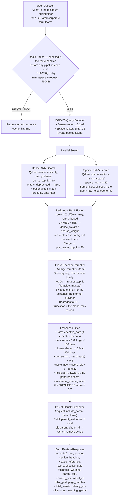
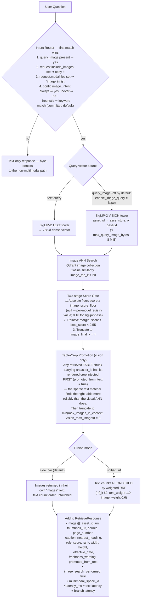
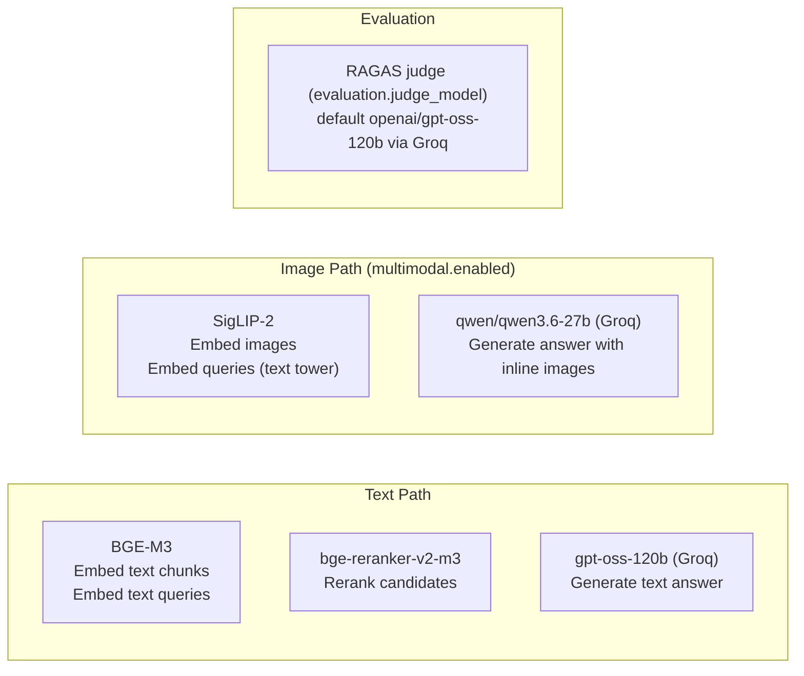

# GERNAS RAG — System Architecture & User Flow

> **Service:** Production-grade Hybrid Retrieval-Augmented Generation for regulatory and credit-policy Q&A
> **Version:** 1.0.0
> **Stack:** FastAPI · Qdrant · BGE-M3 · Groq LLMs · SigLIP-2 (multimodal, flag-gated)

---

## Table of Contents

1. [System Overview](#1-system-overview)
2. [High-Level Architecture Diagram](#2-high-level-architecture-diagram)
3. [Component Inventory](#3-component-inventory)
4. [Ingestion Pipeline (Document → Index)](#4-ingestion-pipeline-document--index)
5. [Retrieval &amp; Answer Pipeline (Question → Response)](#5-retrieval--answer-pipeline-question--response)
6. [Detailed User Flow — Question Handling](#6-detailed-user-flow--question-handling)
7. [Models Used](#7-models-used)
8. [Tools &amp; Libraries](#8-tools--libraries)
9. [API Reference](#9-api-reference)
10. [Configuration &amp; Environment](#10-configuration--environment)
11. [Evaluation Framework](#11-evaluation-framework)
12. [Failure Modes &amp; Degradation](#12-failure-modes--degradation)
13. [Data &amp; Security Design Decisions](#13-data--security-design-decisions)

---

## 1. System Overview

GERNAS RAG is a **hybrid multimodal retrieval service** that ingests PDF/DOCX policy documents, indexes them into a vector database with dense + sparse embeddings, and answers natural-language questions by retrieving the most relevant clauses and optionally generating a grounded LLM answer with source citations.

**Key capabilities:**

| Capability              | Details                                                                                                                                                       |
| ----------------------- | ------------------------------------------------------------------------------------------------------------------------------------------------------------- |
| Hybrid Retrieval        | Dense (BGE-M3, 1024-d) + SPLADE sparse with Reciprocal Rank Fusion                                                                                            |
| Hierarchical Chunking   | Parent/child splits; small-to-big expansion at query time                                                                                                     |
| Table-Atomic Chunking   | Tables lifted before splitting; never truncated mid-row; additionally dual-indexed as a rendered image when multimodal + the Docling image backend are active |
| Freshness Awareness     | Documents penalized for staleness; flagged`⚠ STALE` in the generated answer's context                                                                      |
| Multimodal (flag-gated) | Native text↔image retrieval via SigLIP-2; vision generation via Qwen3.6-27b, itself gated by`llm.vision_enabled`                                           |
| Grounded Generation     | System prompt enforcing citation, grounding, and staleness disclosure                                                                                         |
| Provider-Agnostic       | Every component (embedder, vectordb, LLM, chunker, extractor) is swappable via config                                                                         |
| Idempotent Ingestion    | Deterministic chunk IDs; re-ingesting the same document upserts, never duplicates                                                                             |

## 2. Component Inventory

### 2.1 Core Pipeline Components

| Component              | Class                           | Role                                                                                                                               |
| ---------------------- | ------------------------------- | ---------------------------------------------------------------------------------------------------------------------------------- |
| Extraction             | `DoclingExtractor` (primary)  | PDF/DOCX/PPTX/HTML/MD → structured Markdown + elements; OCR auto-enabled per PDF                                                  |
| Extraction (alternate) | `PyMuPDFExtractor`            | Fast text-only extraction — selected only by explicit strategy or unsupported format                                              |
| Extraction (alternate) | `UnstructuredExtractor`       | OCR via Unstructured.io — selected only by explicit strategy                                                                      |
| Chunking               | `HierarchicalChunker`         | Hierarchical + table-atomic splits                                                                                                 |
| Text Embedder          | `BGEM3Embedder`               | Dense 1024-d + SPLADE sparse                                                                                                       |
| Multimodal Embedder    | `HFDualEncoderEmbedder`       | SigLIP-2 image+text towers                                                                                                         |
| Vector DB              | `QdrantVectorDB` (async)      | Primary vector store (hybrid named vectors`dense` + `sparse`)                                                                  |
| Image Store            | `QdrantImageStore`            | Image vector collection (shares the text client)                                                                                   |
| Hybrid Search          | `HybridSearcher`              | Dense ANN + Sparse BM25, unweighted RRF merge                                                                                      |
| Reranker               | `Reranker`                    | Cross-encoder bge-reranker-v2-m3                                                                                                   |
| Freshness              | `FreshnessFilter`             | Staleness decay penalty, then re-sort by penalised score                                                                           |
| Intent Router          | `ImageIntentRouter`           | Decides whether a query runs the image branch — committed default`heuristic`; this deployment sets `always` in `local.yaml` |
| Retrieval Pipeline     | `RetrievalPipeline`           | Text retrieval orchestrator                                                                                                        |
| Multimodal Pipeline    | `MultimodalRetrievalPipeline` | Text + image retrieval, gating, table-crop promotion, fusion                                                                       |
| Generator              | `ResponseGenerator`           | Grounded prompt builder + LLM caller + citation validation                                                                         |
| Image Payload Builder  | `ImagePayloadBuilder`         | Asset fetch → RGB → resize → JPEG → base64 data URI                                                                            |
| Vision Router          | `VisionRouter`                | Routes text vs. vision LLM calls; degrades vision → text                                                                          |
| LLM (text)             | `GroqLLM`                     | Async Groq client — text model                                                                                                    |
| LLM (vision)           | `GroqLLM`                     | Async Groq client — vision model                                                                                                  |
| Cache                  | `RAGCache`                    | Redis/Valkey SHA-256 keyed cache, config-namespaced                                                                                |
| Evaluator              | `RAGEvaluator`                | RAGAS metrics (faithfulness etc.) over the text pipeline                                                                           |

---

## 3. Ingestion Pipeline (Document → Index)

### 3.1 Text Ingestion Flow

```mermaid
flowchart TD
    A["📄 Upload PDF / DOCX\nPOST /api/v1/ingest → 202 {job_id}\nSaved to a temp file; ingestion runs\nas a FastAPI background task"] --> C["Docling Extractor (step 1)\n• Heading hierarchy preserved\n• do_table_structure = true\n• OCR decided per PDF: pypdfium2 text-layer probe\n  (< ~50 chars/page ⇒ OCR on)\n• Exports raw_markdown + elements"]
    C --> B["Metadata Inferrer (step 2)\nRuns AFTER extraction — needs the text\n• document_name from the ORIGINAL upload filename\n• doc_type from filename keywords (if not supplied)\n• effective_date via regex over the first 2000 chars\n• product_applicability passed through, never inferred"]
    B --> F["Table-Atomic Handler (step 3a)\n1. Lift all markdown tables → [[TABLE_n]] placeholders\n2. Capture caption from the preceding prose window\n3. Chunk prose normally (splitter never sees a table)"]
    F --> D["Hierarchical Chunker — Parent pass\n• Splits on H1/H2 markdown headings, then blank lines\n• Budget: parent_chunk_size × 4 chars (~1500 tokens)\n• is_parent = True; parent-only-a-table ⇒ not indexed"]
    D --> E["Hierarchical Chunker — Child pass\n• Recursive split within each parent\n• Budget: chunk_size × 4 chars (~400 tokens), overlap 64\n• Fragments under min_chunk_size // 4 words dropped\n• parent_chunk_id linked"]
    E --> F2["Table chunks re-attached (step 3b)\n• One chunk per table, prefixed '[Table] {caption}'\n• Row-split at max_chunk_size × 4 chars,\n  header row repeated; table_part = 'i/n'\n• Inherits owning parent's heading + clause_reference"]
    F2 --> G["Chunk ID Assignment\nchunk_id = MD5(doc_name :: ref)\npoint id = UUIDv5(namespace, chunk_id)\nDeterministic — idempotent upserts"]
    G --> H["BGE-M3 Batch Embedder (step 3)\n• Dense vector: 1024-d\n• Sparse vector: SPLADE indices + values\n• Batch size: 32, thread-pooled"]
    H --> I["Qdrant Upsert (step 4)\nCollection: fab_gernas_docs\nNamed vectors: dense + sparse\nPayload: chunk metadata + text + is_parent + chunk_id\nPayload indexes: document_type, product_applicability,\ndeprecated, effective_date\nRetries 3× with backoff"]
    I --> J["Reconcile Stale Chunks\nDrop points this document left behind under other\nchunk ids (table toggle, extractor change).\nFailure here is logged, never fatal."]
    J --> IMG["Image sub-pipeline (step 5)\nOnly when multimodal is enabled → see §4.2\nAny error is logged; the text ingest still succeeds"]
    IMG --> K["✅ IngestionResult\n{chunks_created, images_indexed, figures_indexed,\ntable_crops_indexed, tables_found, status, error}"]
```



> **Note:** the extractor is constructed once at pipeline start-up under the `auto` strategy, so every uploaded file is handled by Docling. PyMuPDF and Unstructured are reachable only by setting `chunking.extraction_strategy` explicitly.

### 4.2 Image Ingestion Flow (multimodal.enabled = true)

**Backend selection.** `multimodal.extraction.backend` is `auto` by default, which
follows the *text* extraction strategy: both `docling` **and** `auto` text
strategies resolve to the **Docling** image backend, so the shipped configuration
(`chunking.extraction_strategy: auto`) extracts images with Docling, not PyMuPDF.

| `multimodal.extraction.backend` | `chunking.extraction_strategy`  | Image backend     |
| --------------------------------- | --------------------------------- | ----------------- |
| `auto` (default)                | `auto` (default) or `docling` | **Docling** |
| `auto`                          | `pymupdf` / `unstructured`    | PyMuPDF           |
| `docling`                       | any                               | Docling           |
| `pymupdf`                       | any                               | PyMuPDF           |

This is deliberate rather than incidental: only the Docling backend iterates
`doc.tables`, so selecting PyMuPDF would make `extract_table_crops` a silent
no-op — a PDF table is normally vector strokes plus live text, and PyMuPDF's
`get_images()` returns raster XObjects only. The factory logs a warning if table
crops are enabled while PyMuPDF is selected; tables are still indexed as text
chunks in that case, just without a rendered crop for the vision model.

```mermaid
flowchart TD
    A["Same PDF/DOCX from main ingestion.\nRuns AFTER text chunking, so each asset can be\nlinked to a chunk the chunker already produced."] --> B["Image Extractor (step 1)\nBackend = DOCLING on the default config (see below)\n• structure-aware figures with caption linkage\n• rendered table crops at 200 dpi from doc.tables"]
    B --> C["Image Filters (step 2a)\n• Min size: 96×96 px\n• Min area: 20,000 px²\n• Max aspect ratio: 12:1\n• Blankness: std deviation < 6.0 → reject\n• Max per-page: 8, per-doc: 200"]
    C --> E["Normalise (step 2b — before hashing)\n• EXIF rotation\n• Convert to RGB\n• Resize to max_side_px (1024)\n• Encode as WEBP (quality 90)\n• Undecodable images rejected here"]
    E --> D["Deduplication (step 2c)\n• Exact: SHA-256 of the NORMALISED bytes\n• Perceptual: dHash, Hamming ≤ 4 = near-dup\n• Same figure twice → indexed once"]
    D --> F["Context Resolution (step 3)\n• Caption from doc structure + surrounding prose\n  (caption_window_chars = 600)\n• nearest_heading, surrounding_text\n• page_number, bbox, role (figure / table_image)\n• parent_chunk_id ← owning prose chunk"]
    F --> G["Asset Store (step 4)\nContent-addressed on disk, plus a 320px thumbnail\nAsset ID = SHA-256[:32] of the stored bytes"]
    G --> H["Table-crop re-linking (D8)\nA crop with role = table_image is re-pointed at its\nTABLE chunk (same page, else caption match)\ninstead of the nearest prose chunk"]
    H --> I["SigLIP-2 Batch Embedder (step 5)\n• Image tower: 768-d dense vector\n• image_batch_size = 8\n• Thread-pooled (CPU-bound)\n• Skipped when no multimodal encoder is installed"]
    I --> J["Qdrant Upsert (step 6)\nCollection: fab_gernas_images__siglip2_base_patch16_224__d768\n(derived as {base}__{model_slug}__d{dim})\nPayload: asset id, caption, heading, page, role,\nsource, bbox, effective_date, space_id"]
    J --> K["Image Stub Chunks (step 7)\n'[Figure] caption / Section / Page / Context' written\nto the TEXT collection via BGE-M3 (≥ 40 chars).\nMakes figures reachable through the hybrid path and\ncitable in the caption-only fallback."]
    K --> L["✅ ImageIngestionResult\n{images_indexed, figures, table_crops,\nstubs_created, stats{rejected_* counters}}"]
```



---

## 5. Retrieval & Answer Pipeline (Question → Response)

### 5.1 Text Retrieval Flow



### 5.2 Image Retrieval Flow (multimodal.enabled = true)

The text and image branches run **concurrently** (`asyncio.gather`). A text failure
fails the request; an image-branch failure is logged and the response degrades to
text-only.



> **Why the query is encoded twice, by two different models.** §5.1 already
> encoded this same query text through BGE-M3 for the text branch — the image
> branch does **not** reuse that vector. BGE-M3 has no image tower, so it cannot
> embed a figure at any dimension, and its 1024-d text space was never trained
> to agree with anything visual. SigLIP-2 is a CLIP-style *dual* encoder: its
> text tower and image tower are trained jointly so that a caption and its
> matching figure land near each other in the **same** 768-d space — that joint
> training is the only thing that makes text→image cosine search meaningful.
> Each collection therefore dictates which encoder can query it: `fab_gernas_docs`
> only understands BGE-M3 vectors, `fab_gernas_images…` only understands SigLIP-2
> vectors. For the same reason, the two branches' scores are never blended
> numerically — fusion is rank-based (RRF), not score-based (§5.1, §8.7.6).
>
> Images are also reachable through BGE-M3, but only via their **caption text**:
> ingestion writes a short "image stub chunk" per figure into the text collection
> (§4.2, step 7), so a caption that lexically/semantically matches the query can
> surface an image through the ordinary text path even if the SigLIP-2 branch
> misses it. That is caption matching, not visual matching — it does not require
> the figure to actually *look like* what the query describes.

### 5.3 Answer Generation Flow

```mermaid
flowchart TD
    BUILD["RetrieveResponse\nchunks + images"] -->|"generate_answer = true\nAND (chunks OR images) non-empty"| GEN["Response Generator\nBuild grounded prompt"]
    GEN --> CTX["Context Assembly — one block per chunk\n  [N] Source: … · Section: … · Effective: … · ⚠ STALE\n  • content_type = table ⇒ '· TABLE', body fenced as a code block,\n    '(part i/n — header row repeated)' when row-split,\n    plus an instruction to flag ambiguous columns\n  • else if parent_text differs ⇒ show the PARENT text\n    followed by '[Matched passage: …300 chars]'\n  • else the chunk text\nBlocks joined by '---'"]
    GEN --> IMG_CTX["Figure Context (if images present)\nINTERLEAVED so a label cannot bind to the wrong picture:\n  [I1] Figure · Source · Page · Section · role\n  Caption: …\n  Image: <base64 data URI>\nVision off (or every asset unreadable) ⇒ caption-only\nblocks with the asset URI instead of pixels"]
    CTX --> SYS["System Prompt\n• Answer strictly from context; blocks numbered [1], [2] …\n• Cite every factual claim; append a 'Sources:' section\n• Say so explicitly if the context lacks the answer\n• Flag any context marked ⚠ STALE\n• + VISION addendum ('you can see the figure, read values\n  directly, never guess an illegible number')\n  OR TEXT-FALLBACK addendum ('you cannot see these images,\n  describe only what the caption states')\n• + weak-text hint when max chunk score < 0.15 and figures exist"]
    IMG_CTX --> SYS
    SYS --> VR["VisionRouter\nDecision: does any message carry an ImagePart?"]
    VR -->|"text only"| TLM["Groq: openai/gpt-oss-120b\n(text model)\ntemperature 0.0 · max_tokens 2048\ntimeout 30s · retries 3 (backoff ×2)"]
    VR -->|"images present"| VLM["Groq: qwen/qwen3.6-27b\n(vision model — preview)\nmax_tokens 3072 · timeout 60s · retries 3\nHard cap 3 images, each ≤ 768px JPEG q85"]
    VLM -->|"vision error ⇒ strip ImageParts, retry on text"| TLM
    TLM --> ANS["Generated Answer + 'Sources:' block\nCitations validated against the supplied ranges —\nout-of-range [N] / [In] are LOGGED, never rewritten"]
    VLM --> ANS
    ANS --> CSET["Cache SET\nFastAPI background task after the response is returned\nSHA-256 key, TTL 900s"]
    CSET --> FINAL["Final RetrieveResponse\n{\n  chunks: [...],\n  images: [...],\n  answer: '...',\n  cache_hit: false,\n  latency_ms: 124.5,\n  freshness_warning_global: false,\n  image_search_performed: …,\n  multimodal_space_id: …\n}"]
```



---

## 6. Detailed User Flow — Question Handling

This section maps every type of user question to the exact processing path taken end-to-end.

### 6.1 Flow Decision Tree

```mermaid
flowchart TD
    START["User sends POST /api/v1/retrieve\n{query, filters, top_k, include_parent,\ngenerate_answer, include_images, modalities, query_image}"]
    START --> MW["Middleware chain (runs first)\nCORS → RequestIDMiddleware → StructuredLoggingMiddleware"]
    MW --> VAL["Pydantic validation\nquery 3–2000 chars · top_k 1–20"]
    VAL --> AUTH["Auth — a route DEPENDENCY, not middleware\njwt_secret set ⇒ Bearer JWT required\nelse api_key set ⇒ X-API-Key must match\nelse open dev mode (no auth)"]
    AUTH --> CACHE_CHK{"Redis Cache\nSHA-256(config namespace + request JSON)\nnamespace = multimodal.enabled : fusion mode :\nspace_id : vision_enabled"}
    CACHE_CHK -->|"HIT"| RETURN_CACHE["Return 200\ncache_hit: true\n(skip all retrieval)"]
    CACHE_CHK -->|"MISS or Redis down"| INTENT{"Run the image branch?\nmultimodal.enabled AND encoder+store loaded\nAND fusion mode ≠ off\nAND intent router says yes (§5.2)"}

    INTENT -->|"NO"| TEXT_PIPE["Text Retrieval Pipeline\n→ see §5.1"]
    INTENT -->|"YES"| MM_PIPE["Multimodal Pipeline\nText + image branches CONCURRENTLY → gate →\ntable-crop promotion → fusion → see §5.2"]

    TEXT_PIPE --> GEN_CHK{"generate_answer = true\nAND any chunks or images?"}
    MM_PIPE --> GEN_CHK

    GEN_CHK -->|"NO"| RETURN_CHUNKS["Return 200\nchunks + images\nanswer: null"]
    GEN_CHK -->|"YES"| VIS_CHK{"Images present AND vision_enabled\nAND asset store available?"}

    VIS_CHK -->|"NO"| TEXT_GEN["Text Generation\nopenai/gpt-oss-120b via Groq\nFigures degrade to [In] caption descriptors"]
    VIS_CHK -->|"YES"| VIS_GEN["Vision Generation\n1. Fetch ≤ 3 assets from the store\n2. RGB → 768px → JPEG q85\n3. Base64 data URI, interleaved after each [In] label\n4. qwen/qwen3.6-27b via Groq\nA missing asset is skipped, not fatal"]

    VIS_GEN -->|"vision model error / not configured"| TEXT_GEN
    TEXT_GEN --> CITE["Validate citations\nOut-of-range [N] / [In] logged as a warning"]
    VIS_GEN --> CITE
    CITE --> RETURN_FULL["Return 200\nchunks + images + answer\ncache_hit: false · latency_ms: N"]
    RETURN_FULL --> CACHE_SET["Background task AFTER the response:\nCache SET, TTL 900s"]
```



> Any exception raised inside retrieval or generation is caught by the route and
> returned as **500 `{\"detail\": \"Retrieval failed\"}`** — the cause is logged, not
> surfaced to the caller.

### 6.2 Step-by-Step for Each Question Type

#### Type A: Pure Text Policy Question (most common)

> *"What is the approval authority threshold for unsecured exposures above AED 50M?"*

| Step | Component        | Action                                                                             |
| ---- | ---------------- | ---------------------------------------------------------------------------------- |
| 1    | Redis            | Cache miss — proceeds                                                             |
| 2    | BGE-M3           | Encode query → dense 1024-d + sparse SPLADE vectors                               |
| 3    | Qdrant (dense)   | ANN cosine search,`deprecated=false`, top 40                                     |
| 4    | Qdrant (sparse)  | BM25 lexical search, same filters, top 40 (parallel with step 3)                   |
| 5    | RRF Merger       | Merge up to 80 candidates by`Σ 1/(60+rank)` → top 20                           |
| 6    | Reranker         | bge-reranker-v2-m3 cross-encodes (query, chunk) →`request.top_k` (default 5)    |
| 7    | Freshness Filter | Penalise any chunk older than 180 days, then re-sort; flag when freshness < 0.7    |
| 8    | Parent Expander  | Fetch the ~1500-token parent of each result from Qdrant                            |
| 9    | Generator        | Build numbered context`[1]…[5]`; call openai/gpt-oss-120b; validate citations   |
| 10   | Response         | `{chunks, answer, latency_ms, cache_hit: false}` returned to the caller          |
| 11   | Cache SET        | Background task stores the response in Redis (TTL 900s) after the response is sent |

#### Type B: Table / Structured Data Question

> *"What are the eligible tenor brackets for syndicated loans?"*

| Step   | Component          | Action                                                                                                                                     |
| ------ | ------------------ | ------------------------------------------------------------------------------------------------------------------------------------------ |
| 1–5   | Same as Type A     | Hybrid search + RRF. The table was lifted whole at ingestion, so cell values are intact for sparse matching                                |
| 6      | Reranker           | Scores table chunks highly (table markdown contains cell values)                                                                           |
| 7–8   | Freshness + Parent | Same                                                                                                                                       |
| 9      | Generator          | Fences the grid in a code block, marks "part i/n — header row repeated" when row-split, and instructs the model to flag ambiguous columns |
| 9b     | Multimodal path    | If vision is on, the table chunk's rendered crop is promoted into`images[]` so the model can also *see* the grid                       |
| 10–11 | Same               | Return, then cache in the background                                                                                                       |

#### Type C: Any Question, image branch engaged

> *"What is the minimum pricing floor for a BB-rated corporate term loan?"*

| Step | Component             | Action                                                                                                                                 |
| ---- | --------------------- | -------------------------------------------------------------------------------------------------------------------------------------- |
| 1    | Redis                 | Cache miss                                                                                                                             |
| 2    | Intent Router         | `include_images` / `modalities` override, else `image_intent` decides                                                            |
| 3    | BGE-M3                | Encode for text retrieval (concurrent branch)                                                                                          |
| 4    | SigLIP-2 text tower   | Encode query for image retrieval (concurrent branch)                                                                                   |
| 5    | Qdrant (text)         | Hybrid search top 40+40 → RRF → rerank → top_k                                                                                      |
| 6    | Qdrant (images)       | ANN on the image collection, top 20 candidates                                                                                         |
| 7    | Score Gate            | Keep images with score ≥ registry floor (**0.10** for siglip2-base) AND ≥ best × 0.55, then truncate to `image_final_k` = 4 |
| 8    | Table-Crop Promotion  | Rendered crops of retrieved table chunks inserted first; list capped at 3                                                              |
| 9    | Fusion                | Side-car: text chunks in`chunks[]`, images in `images[]`                                                                           |
| 10   | Image Payload Builder | Fetch WEBP asset → RGB → resize 768px → JPEG q85 → base64 (hard cap 3)                                                             |
| 11   | VisionRouter          | Detects ImageParts → routes to qwen/qwen3.6-27b                                                                                       |
| 12   | Groq Vision           | Prompt interleaves`[I1]…[I3]` labels with their inline base64 images + text context                                                 |
| 13   | Generator             | Answer references`[I1]` for figures, `[N]` for text chunks, ends with 'Sources:'                                                   |
| 14   | Response + Cache      | `{chunks, images, answer, image_search_performed: true, multimodal_space_id}`                                                        |

## 7. Models Used

### 7.1 Embedding Models

Every multimodal model below is declared in `config/model_registry.yaml`, which
also carries its per-model `score_floor` starting point.

| Model                                     | Type                    | Dimensions            | Purpose                                                                                         | Registry floor |
| ----------------------------------------- | ----------------------- | --------------------- | ----------------------------------------------------------------------------------------------- | -------------- |
| **BAAI/bge-m3**                     | Dual encoder            | 1024-d dense + sparse | Primary text embedding (documents + queries) —`embedding.model_name`                         | n/a            |
| **google/siglip2-base-patch16-224** | CLIP-style dual encoder | 768-d dense           | Image + text embedding, the default`multimodal.embedding.model_name`                          | 0.10           |
| `google/siglip2-base-patch16-512`       | Higher-res variant      | 768-d                 | Alternative (~4× slower, better on dense charts)                                               | 0.10           |
| `google/siglip2-so400m-patch16-384`     | Larger variant          | 1152-d                | GPU-class; not CPU-viable                                                                       | 0.10           |
| `google/siglip-base-patch16-224`        | SigLIP v1               | 768-d                 | Alternative multimodal                                                                          | 0.10           |
| `openai/clip-vit-large-patch14`         | CLIP ViT-L/14           | 768-d                 | Alternative multimodal (softmax-trained ⇒ higher floor)                                        | 0.20           |
| `openai/clip-vit-base-patch32`          | CLIP ViT-B/32           | 512-d                 | Alternative multimodal                                                                          | 0.20           |
| `laion/CLIP-ViT-B-32-laion2B-…`        | OpenCLIP                | 512-d                 | Fastest CPU option (≤ 8 GB RAM machines)                                                       | 0.20           |
| `jinaai/jina-clip-v2`                   | Jina CLIP v2            | 1024-d                | Long text context (8192 tok), unified-index candidate —**non-commercial licence, gated** | 0.15           |
| `BAAI/BGE-VL-base`                      | BGE-VL                  | 512-d                 | Composed image retrieval (image + edit instruction)                                             | 0.20           |

### 7.2 Reranking Models

| Model                             | Type          | Purpose                                                                                               |
| --------------------------------- | ------------- | ----------------------------------------------------------------------------------------------------- |
| **BAAI/bge-reranker-v2-m3** | Cross-encoder | Rerank the 20 fused candidates down to`request.top_k`; reuses the embedder's device / fp16 settings |

### 7.3 LLM Models

| Model                         | Provider                             | Purpose                                                                                           | Max Tokens                      |
| ----------------------------- | ------------------------------------ | ------------------------------------------------------------------------------------------------- | ------------------------------- |
| **openai/gpt-oss-120b** | Groq                                 | Text answer generation (default,`llm.model_name`)                                               | 2048                            |
| **qwen/qwen3.6-27b**    | Groq (preview)                       | Vision answer generation when images are present                                                  | 3072                            |
| **openai/gpt-oss-120b** | Groq (`evaluation.judge_provider`) | RAGAS judge — configured via`evaluation.judge_model`; the judge must never be the vision model | `evaluation.judge_max_tokens` |

### 7.4 Alternative LLM Providers

Selected by `llm.provider` (`groq` | `anthropic` | `huggingface` | `openai_compat`).

| Provider                   | Class               | Status            | Vision                        |
| -------------------------- | ------------------- | ----------------- | ----------------------------- |
| Anthropic                  | `AnthropicLLM`    | Supported         | Not yet (raises on ImagePart) |
| HuggingFace Transformers   | `HuggingFaceLLM`  | Local/self-hosted | Not yet                       |
| OpenAI-compatible gateways | `OpenAICompatLLM` | Supported         | Not yet                       |

### 7.5 Model Selection Summary



---

## 8. Tools & Libraries

### 8.1 Core Framework

| Library                             | Version | Role                                               |
| ----------------------------------- | ------- | -------------------------------------------------- |
| **FastAPI**                   | latest  | Web framework, async routers, dependency injection |
| **Uvicorn**                   | latest  | ASGI server                                        |
| **Pydantic v2**               | ≥2.0   | Request/response validation, settings management   |
| **python-jose[cryptography]** | latest  | JWT authentication                                 |
| **python-multipart**          | latest  | Multipart form parsing (file upload)               |

### 8.2 Embedding & ML

| Library                              | Role                                                     |
| ------------------------------------ | -------------------------------------------------------- |
| **FlagEmbedding**              | BGE-M3 dense + SPLADE sparse, bge-reranker cross-encoder |
| **sentence-transformers**      | Alternative dense embedder                               |
| **transformers** (≥4.49,<5.0) | HuggingFace models (SigLIP-2, CLIP, Jina)                |
| **torch**                      | Inference backend for all local models                   |
| **open_clip_torch**            | OpenCLIP models (optional group)                         |
| **einops + timm**              | Jina CLIP v2 dependencies (optional group)               |

### 8.3 Vector Databases

| Library                         | Role                                            |
| ------------------------------- | ----------------------------------------------- |
| **qdrant-client** (async) | Primary vector database — hybrid named vectors |
| **pymilvus**              | Milvus alternative (billion-scale)              |
| **chromadb**              | ChromaDB alternative (dev/test)                 |

### 8.4 Document Extraction

| Library                  | Role                                                                            |
| ------------------------ | ------------------------------------------------------------------------------- |
| **docling**        | Primary PDF/DOCX extractor — heading hierarchy, table structure, reading order |
| **PyMuPDF (fitz)** | Fast text-only extraction + image raster extraction                             |
| **unstructured**   | Unstructured.io backend with OCR (hi_res mode)                                  |

### 8.5 Chunking

| Library                            | Role                                                         |
| ---------------------------------- | ------------------------------------------------------------ |
| **langchain-text-splitters** | `RecursiveCharacterTextSplitter` for hierarchical chunking |

### 8.6 Image Processing (multimodal group)

| Library          | Role                                                          |
| ---------------- | ------------------------------------------------------------- |
| **Pillow** | Image I/O, EXIF rotation, resize, JPEG/WEBP encode, thumbnail |
| **numpy**  | dHash perceptual deduplication, blankness detection           |

### 8.7 LLM & API Clients

| Library             | Role                  |
| ------------------- | --------------------- |
| **groq**      | Groq async Python SDK |
| **anthropic** | Anthropic Python SDK  |
| **httpx**     | Async HTTP client     |

### 8.8 Cache & Storage

| Library                 | Role                            |
| ----------------------- | ------------------------------- |
| **redis** (async) | Query result caching (TTL 900s) |

### 8.9 Evaluation

| Library            | Role                                                                |
| ------------------ | ------------------------------------------------------------------- |
| **ragas**    | RAG evaluation metrics (faithfulness, relevancy, precision, recall) |
| **datasets** | HuggingFace datasets library (test case management)                 |

### 8.10 Observability

| Library                     | Role                                |
| --------------------------- | ----------------------------------- |
| **opentelemetry-sdk** | Distributed tracing instrumentation |
| **structlog**         | Structured JSON logging             |

### 8.11 Infrastructure (Docker)

| Service                     | Image               | Role                                  |
| --------------------------- | ------------------- | ------------------------------------- |
| **Qdrant**            | `qdrant/qdrant`   | Vector database                       |
| **Redis / Valkey**    | `redis:alpine`    | Query cache                           |
| **Milvus** (optional) | `milvusdb/milvus` | Alternative vector DB                 |
| **RAG Service**       | locally built       | Main FastAPI application              |
| **Embedding Service** | locally built       | Separate embedding service (optional) |

> Qdrant can also run **embedded** (no server) by setting `vectordb.qdrant_path`;
> in that mode the image collection must share the text collection's client.

---

## 9. API Reference

### 9.1 POST /api/v1/retrieve

**Request:**

```json
{
  "query": "What is the minimum pricing floor for a BB-rated corporate term loan?",
  "filters": {
    "document_type": ["pricing_policy"],
    "product_applicability": ["corporate_lending"],
    "deprecated": false
  },
  "top_k": 5,
  "include_parent": true,
  "generate_answer": true,
  "include_images": false,
  "modalities": ["text"]
}
```

**Response:**

```json
{
  "chunks": [
    {
      "text": "BB-rated pricing: minimum floor of 260 bps...",
      "source": "Credit Pricing Policy v2.3",
      "section_heading": "4. Pricing Floors",
      "clause_reference": "4.2.1",
      "score": 0.87,
      "effective_date": "2026-01-15",
      "freshness_warning": false,
      "parent_text": "Section 4 governs minimum pricing floors...",
      "content_type": "text",
      "page_number": 12
    }
  ],
  "images": [],
  "total_results": 1,
  "latency_ms": 124.5,
  "cache_hit": false,
  "freshness_warning_global": false,
  "answer": "[1] The minimum pricing floor for a BB-rated corporate term loan is 260 basis points (bps) as stated in Section 4.2.1 of the Credit Pricing Policy (effective 2026-01-15).",
  "image_search_performed": false,
  "multimodal_space_id": null
}
```

### 9.2 POST /api/v1/ingest

**Request:** `multipart/form-data`

| Field                     | Type   | Required | Description                                                                                                 |
| ------------------------- | ------ | -------- | ----------------------------------------------------------------------------------------------------------- |
| `file`                  | File   | Yes      | PDF or DOCX document                                                                                        |
| `document_type`         | string | No       | `pricing_policy`, `regulatory`, `mrm`, `product_manual`, `risk_policy` (auto-inferred if omitted) |
| `product_applicability` | string | No       | Comma-separated:`corporate_lending,syndication`                                                           |
| `effective_date`        | string | No       | ISO date`YYYY-MM-DD` (auto-inferred if omitted)                                                           |

**Response:** HTTP `202 Accepted`

```json
{"job_id": "550e8400-e29b-41d4-a716-446655440000", "status": "accepted"}
```

### 9.3 GET /api/v1/ingest/

Returns `{"job_id": …, "status": "running"}` while the background task is in
flight, then the terminal result. The endpoint projects only four fields — the
richer counters (`images_indexed`, `figures_indexed`, `table_crops_indexed`,
`tables_found`) exist on the internal `IngestionResult` and are logged, but are
**not** exposed here. An unknown `job_id` returns 404, and the job table is
in-process memory, so it does not survive a restart or span multiple workers.

```json
{
  "job_id": "550e8400...",
  "status": "success",
  "chunks_created": 142,
  "error": null
}
```

---

## 10. Configuration & Environment

### 10.1 Configuration Precedence (last wins)

```
1. Pydantic model defaults
2. config/default.yaml
3. config/{environment}.yaml  (development / staging / production)
4. config/local.yaml          (machine-specific, .gitignored)
5. CONFIG_FILE env var         (path to additional YAML)
6. Environment variables / .env  (RAG__SECTION__FIELD)
```

Layers 2–5 are deep-merged, then any value explicitly set via env / `.env` is
merged on top. Top-level service fields accept both the bare name (`LOG_LEVEL`)
and the prefixed form (`RAG__LOG_LEVEL`).

### 10.2 Key Configuration Parameters

| Parameter                                         | Default                             | Description                                                  |
| ------------------------------------------------- | ----------------------------------- | ------------------------------------------------------------ |
| `embedding.model_name`                          | `BAAI/bge-m3`                     | Primary text embedding model                                 |
| `embedding.dense_dim`                           | `1024`                            | Dense vector dimension                                       |
| `embedding.batch_size`                          | `32`                              | Embedding batch size                                         |
| `vectordb.collection_name`                      | `fab_gernas_docs`                 | Qdrant text collection                                       |
| `retrieval.dense_top_k`                         | `40`                              | Dense ANN candidates                                         |
| `retrieval.sparse_top_k`                        | `40`                              | Sparse BM25 candidates                                       |
| `retrieval.rrf_k`                               | `60`                              | RRF smoothing constant                                       |
| `retrieval.pre_rerank_top_k`                    | `20`                              | Candidates fed to the cross-encoder                          |
| `retrieval.freshness_max_age_days`              | `180`                             | Age threshold before penalty                                 |
| `retrieval.freshness_max_penalty`               | `0.3`                             | Max score reduction (30%)                                    |
| `retrieval.freshness_penalty_enabled`           | `true`                            | Master switch for the staleness penalty                      |
| `llm.model_name`                                | `openai/gpt-oss-120b`             | Text generation model                                        |
| `llm.vision_enabled`                            | `false`                           | Send image pixels to the vision model                        |
| `llm.vision_model_name`                         | `qwen/qwen3.6-27b`                | Vision generation model                                      |
| `llm.vision_max_images`                         | `3`                               | Hard cap on images per vision prompt                         |
| `llm.vision_image_max_side_px`                  | `768`                             | Downscale ceiling before base64 encoding                     |
| `redis_cache_ttl_seconds`                       | `900`                             | Cache TTL in seconds (top-level, not nested)                 |
| `redis_url`                                     | `redis://localhost:6379`          | Cache endpoint (top-level)                                   |
| `chunking.chunk_size`                           | `400`                             | Child chunk token budget (×4 chars in practice)             |
| `chunking.parent_chunk_size`                    | `1500`                            | Parent chunk token budget (×4 chars in practice)            |
| `chunking.max_chunk_size`                       | `600`                             | Row-split budget for atomic tables                           |
| `chunking.protect_tables`                       | `true`                            | Table-atomic chunking (D8)                                   |
| `chunking.extraction_strategy`                  | `auto`                            | `auto` resolves to Docling for the service path            |
| `evaluation.judge_model`                        | `openai/gpt-oss-120b`             | RAGAS judge model                                            |
| `evaluation.top_k`                              | `3`                               | Chunks retrieved per evaluation question                     |
| `multimodal.enabled`                            | `false`                           | Enable image retrieval + vision                              |
| `multimodal.retrieval.mode`                     | `side_car`                        | `off` \| `side_car` \| `unified_rrf`                   |
| `multimodal.retrieval.image_intent`             | `heuristic`                       | `always` \| `never` \| `heuristic` (keyword-gated)     |
| `multimodal.retrieval.image_top_k`              | `20`                              | Image ANN candidates                                         |
| `multimodal.retrieval.image_final_k`            | `4`                               | Images kept after gating                                     |
| `multimodal.retrieval.image_score_floor`        | `null`                            | `null` ⇒ per-model registry floor (0.10 for siglip2-base) |
| `multimodal.retrieval.image_score_margin_ratio` | `0.55`                            | Relative gate against the best image score                   |
| `multimodal.retrieval.max_images_in_context`    | `3`                               | Image descriptors injected into the prompt                   |
| `multimodal.embedding.model_name`               | `google/siglip2-base-patch16-224` | Image embedding model                                        |

**Declared but not consumed by the retrieval pipeline** — the effective values
come from the request body instead, so changing these has no effect:

| Parameter                                      | Actual source of truth                             |
| ---------------------------------------------- | -------------------------------------------------- |
| `retrieval.final_top_k`                      | `RetrieveRequest.top_k` (default 5, range 1–20) |
| `retrieval.include_parent_chunks`            | `RetrieveRequest.include_parent` (default true)  |
| `retrieval.dense_weight` / `sparse_weight` | RRF merge is unweighted                            |

> **This deployment's overrides** (`config/local.yaml`, gitignored):
> `multimodal.retrieval.image_intent: always` — active, and the reason the image
> branch runs on every query; and `retrieval.final_top_k: 3` — inert, per the
> table above.

### 10.3 Environment Variables

```bash
# Required
export RAG__LLM__GROQ_API_KEY="gsk_..."

# Enable multimodal (image search on every query, with pixels sent to the VLM)
export RAG__MULTIMODAL__ENABLED=true
export RAG__MULTIMODAL__RETRIEVAL__IMAGE_INTENT=always
export RAG__LLM__VISION_ENABLED=true

# Override models
export RAG__LLM__MODEL_NAME="openai/gpt-oss-120b"
export RAG__MULTIMODAL__EMBEDDING__MODEL_NAME="google/siglip2-base-patch16-512"

# Redis (top-level fields — no CACHE section)
export RAG__REDIS_URL="redis://localhost:6379/0"
export RAG__REDIS_CACHE_TTL_SECONDS=900

# Qdrant
export RAG__VECTORDB__QDRANT_URL="http://localhost:6333"

# Auth (unset ⇒ open dev mode)
export RAG__API_KEY="..."        # or RAG__JWT_SECRET for Bearer JWT
```

---

## 11. Data & Security Design Decisions

| Decision                             | Implementation                                                                                                                                                                                                                                         |
| ------------------------------------ | ------------------------------------------------------------------------------------------------------------------------------------------------------------------------------------------------------------------------------------------------------ |
| **No URLs for images**         | Base64 data URIs only; images never sent as remote URLs, and`query_image` accepts an `asset_id` or base64 but deliberately **not** a URL (server-side fetch of a client URL is an SSRF primitive)                                            |
| **JWT / API key auth**         | Bearer JWT when`jwt_secret` is set, else `X-API-Key` when `api_key` is set, else **open dev mode**. Applied as a per-route dependency — `GET /api/v1/ingest/{job_id}` and `GET /multimodal/status` currently carry no auth dependency |
| **No secrets in code**         | API keys via environment variables /`.env` only; no keys in YAML or source                                                                                                                                                                           |
| **Content-addressed storage**  | Images stored by SHA-256 (asset id = first 32 hex chars); deduplication automatic; the store validates the id shape before any disk read                                                                                                               |
| **Deprecated soft-delete**     | `deprecated=true` filter on every query; hard deletes avoided; full audit trail preserved                                                                                                                                                            |
| **Space identity enforcement** | Embedding space ID encoded in collection name; swapping models creates new collection, preventing silent index corruption                                                                                                                              |
| **Deterministic chunk IDs**    | MD5(doc_name::ref) → UUIDv5; re-ingestion upserts safely                                                                                                                                                                                              |
| **Table-atomic chunking (D8)** | Tables never split mid-row; header repeated in each part; prevents nonsensical truncated table lookups                                                                                                                                                 |
| **Freshness transparency**     | Staleness score visible in each chunk;`⚠ STALE` marked on the context block and the system prompt requires the model to flag it; no silent serving of old data                                                                                      |
| **CORS**                       | Configurable allowed origins —`default.yaml` ships `"*"`; `production.yaml` narrows it to the service domain                                                                                                                                    |
| **Cache namespace isolation**  | SHA-256 key includes config state (multimodal.enabled, fusion mode, embedding space id, vision_enabled) plus a versioned key prefix; config changes never serve a wrong cached response                                                                |
| **Citation validation**        | Out-of-range`[N]` / `[In]` citations are logged as a warning, never silently rewritten — mis-citation stays observable                                                                                                                            |

---
