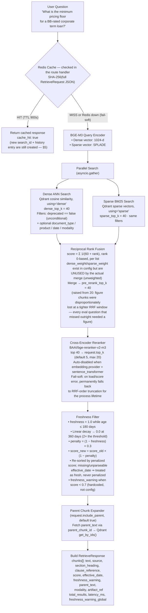
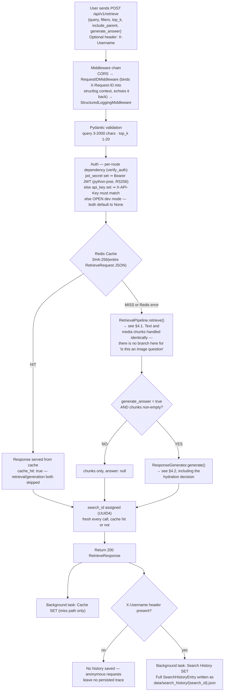
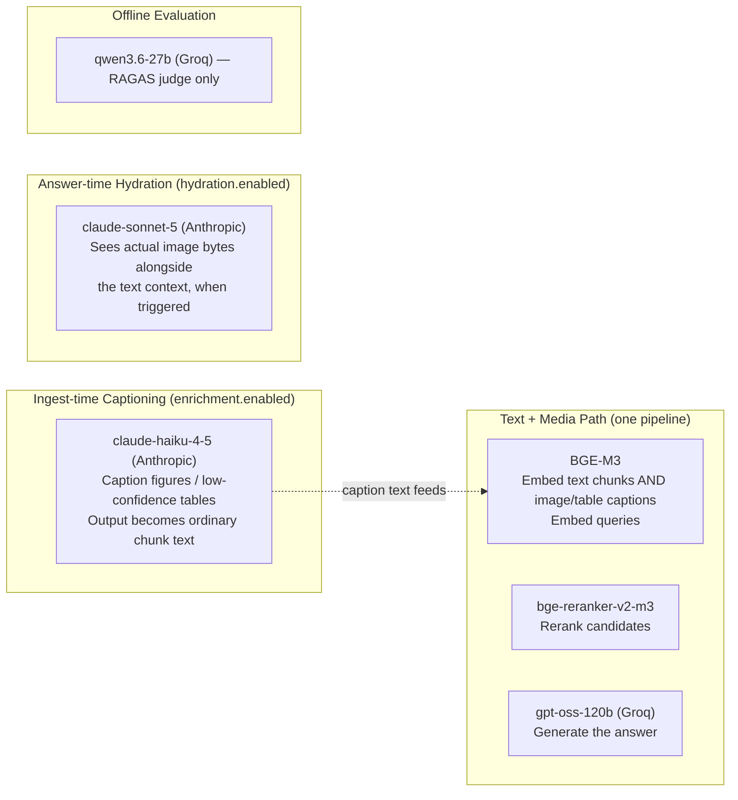

# GERNAS RAG — System Architecture & User Flow

---

## Table of Contents

1. [System Overview](#1-system-overview)
2. [Component Inventory](#2-component-inventory)
3. [Ingestion Pipeline (Document → Index)](#3-ingestion-pipeline-document--index)
4. [Retrieval &amp; Answer Pipeline (Question → Response)](#4-retrieval--answer-pipeline-question--response)
5. [Detailed User Flow — Question Handling](#5-detailed-user-flow--question-handling)
6. [Why Image-as-Text Instead of a CLIP-Style Encoder](#6-why-image-as-text-instead-of-a-clip-style-encoder)
7. [Models Used](#7-models-used)
8. [Tools &amp; Libraries](#8-tools--libraries)
9. [API Reference](#9-api-reference)
10. [Configuration &amp; Environment](#10-configuration--environment)
11. [Evaluation Framework](#11-evaluation-framework)
12. [Failure Modes &amp; Degradation](#12-failure-modes--degradation)
13. [Data &amp; Security Design Decisions](#13-data--security-design-decisions)
14. [Known Gaps vs. Implied/Designed Behavior](#14-known-gaps-vs-implieddesigned-behavior)

---

## 1. System Overview

GERNAS RAG is a **hybrid retrieval service** that ingests PDF/DOCX policy documents, indexes them into a vector database with dense + sparse embeddings, and answers natural-language questions by retrieving the most relevant clauses and optionally generating a grounded, cited LLM answer. On top of a stable text-only core, this branch adds **ingest-time figure/table captioning**, **content-addressed image storage**, **optional answer-time vision "hydration"**, **per-user search history**, and a large **offline stage-wise evaluation harness**.

**Key capabilities:**

| Capability                               | Details                                                                                                                                                                                                    |
| ---------------------------------------- | ---------------------------------------------------------------------------------------------------------------------------------------------------------------------------------------------------------- |
| Hybrid Retrieval                         | Dense (BGE-M3, 1024-d) + SPLADE sparse with Reciprocal Rank Fusion                                                                                                                                         |
| Hierarchical Chunking                    | Parent/child splits; small-to-big expansion (parent text) at query time                                                                                                                                    |
| Fragmented-Table Repair                  | A chunk holding orphaned table rows has the nearest preceding header block re-attached before indexing                                                                                                     |
| Freshness Awareness                      | Chunks penalized for staleness; flagged`⚠ STALE` in the generated answer's context                                                                                                                      |
| Multimodal — image-as-text (flag-gated) | Figures/tables are captioned by a vision LLM at ingest; the caption is embedded and retrieved as ordinary text; the original image bytes can optionally be re-attached ("hydrated") into the answer prompt |
| Grounded Generation                      | System prompt enforcing citation, grounding, verbatim-quantity restatement, and staleness disclosure                                                                                                       |
| Provider-Agnostic                        | Embedder, vector DB, LLM, chunker, extractor are all swappable via config                                                                                                                                  |
| Deterministic Chunk IDs                  | MD5(doc_name::ref) → UUIDv5; re-ingesting the same document (or the same image) upserts, never duplicates                                                                                                 |
| Per-User Search History                  | Every`/retrieve` call is persisted as a full replayable record, scoped by an `X-Username` header                                                                                                       |
| Offline Evaluation Suite                 | 5-stage pipeline (extraction → index integrity → caption fidelity → retrieval → generation) with ~35 named, threshold-gated metrics                                                                    |

---

## 2. Component Inventory

### 2.1 Core Pipeline Components

| Component              | Class                                                    | File                                                  | Role                                                                                                                                                             |
| ---------------------- | -------------------------------------------------------- | ----------------------------------------------------- | ---------------------------------------------------------------------------------------------------------------------------------------------------------------- |
| Extraction             | `DoclingExtractor` (primary)                           | `extraction/docling_extractor.py`                   | PDF/DOCX/PPTX/HTML/MD → structured Markdown + elements; OCR auto-enabled per PDF                                                                                |
| Extraction (alternate) | `PyMuPDFExtractor`                                     | `extraction/pymupdf_extractor.py`                   | Fast text-only extraction — selected only by explicit strategy                                                                                                  |
| Extraction (alternate) | `UnstructuredExtractor`                                | `extraction/unstructured_extractor.py`              | OCR via Unstructured.io (`hi_res`) — selected only by explicit strategy                                                                                       |
| Chunking               | `HierarchicalChunker`                                  | `chunking/hierarchical.py`                          | Hierarchical parent/child splits + atomic media chunks + fragmented-table repair                                                                                 |
| Chunking (alternate)   | `FixedSizeChunker`                                     | `chunking/fixed_size.py`                            | Fallback fixed-window chunker                                                                                                                                    |
| Text/Media Embedder    | `BGEM3Embedder`                                        | `embeddings/bgem3.py`                               | Dense 1024-d + SPLADE sparse — embeds text chunks**and** image captions in the same pass                                                                  |
| Embedder (alternate)   | `SentenceTransformerEmbedder`                          | `embeddings/sentence_transformer.py`                | Dense-only alternative; disables the reranker when selected                                                                                                      |
| Ingest-time Captioner  | `VisionLLMEnricher`                                    | `enrichment/vision_llm_enricher.py`                 | Sends a figure/low-confidence-table crop + surrounding context to a vision LLM, returns a structured caption                                                     |
| Table Confidence Gate  | `TableEnricher`                                        | `enrichment/table_enricher.py`                      | Skips the VLM when Docling's own table-structure confidence is high enough                                                                                       |
| Vector DB              | `QdrantVectorDB` (async)                               | `vectordb/qdrant_client.py`                         | Single collection, hybrid named vectors`dense` + `sparse`; text and media chunks share it, distinguished by `payload.modality`                             |
| Vector DB (alternates) | `MilvusVectorDB`, `ChromaVectorDB`                   | `vectordb/milvus_client.py`, `chromadb_client.py` | Swappable via`vectordb.provider`                                                                                                                               |
| Artifact (Image) Store | `LocalArtifactStore`                                   | `storage/artifact_store.py`                         | Content-addressed (`sha256:<hex>.<ext>`) disk store for raw image bytes; `s3` backend stubbed, not implemented                                               |
| Search History Store   | `LocalSearchHistoryStore`                              | `storage/search_history_store.py`                   | One JSON file per`/retrieve` call, keyed by `search_id`                                                                                                      |
| Hybrid Search          | `HybridSearcher`                                       | `retrieval/hybrid_search.py`                        | Concurrent dense ANN + sparse BM25, unweighted RRF merge                                                                                                         |
| Reranker               | `Reranker`                                             | `retrieval/reranker.py`                             | Cross-encoder`bge-reranker-v2-m3`; auto-disabled for the sentence-transformer embedder                                                                         |
| Freshness              | `FreshnessFilter`                                      | `retrieval/freshness.py`                            | Staleness decay penalty, then re-sort by penalized score                                                                                                         |
| Retrieval Pipeline     | `RetrievalPipeline`                                    | `retrieval/pipeline.py`                             | The**single** retrieval orchestrator — text and media chunks flow through identically; there is no separate image pipeline, intent router, or fusion mode |
| Ingestion Pipeline     | `IngestionPipeline`                                    | `ingestion/pipeline.py`                             | Extract → Enrich (conditional) → Chunk → Embed → Upsert                                                                                                      |
| Metadata Inference     | `MetadataExtractor`                                    | `ingestion/metadata.py`                             | Infers`document_type` / `effective_date` from filename + first-2000-chars text                                                                               |
| Generator              | `ResponseGenerator`                                    | `generation/generator.py`                           | Grounded prompt builder, hydration decision + execution, LLM call, citation validation                                                                           |
| LLM (text, primary)    | `GroqLLM`                                              | `llm/groq_llm.py`                                   | Async Groq client —**text-only**, always flattens any image content                                                                                       |
| LLM (vision-capable)   | `AnthropicLLM`, `OpenAICompatLLM`                    | `llm/anthropic_llm.py`, `llm/openai_compat.py`    | Accept mixed text+image content; used for hydration and enrichment                                                                                               |
| LLM (self-hosted)      | `HuggingFaceLLM`                                       | `llm/huggingface_llm.py`                            | Local`transformers` text-generation pipeline, text-only                                                                                                        |
| Cache                  | `RAGCache`                                             | `cache/redis_cache.py`                              | Redis/Valkey, SHA-256 request-hash key, fail-soft, TTL 900s                                                                                                      |
| Evaluator              | `eval/` (standalone package, not under `gernas_rag`) | `eval/core/`, `eval/stage{1,2a,2b,3,4}_*/`        | Offline, stage-wise RAGAS + deterministic metrics harness; run via`python -m eval <stage>`                                                                     |

### 2.2 Components That Do *Not* Exist in This Repo

Naming these explicitly because a reader coming from the CLIP-style branch's document will look for them:

| Expected-by-analogy name                                                | Status                      | What actually plays that role                                                                                                                                                                              |
| ----------------------------------------------------------------------- | --------------------------- | ---------------------------------------------------------------------------------------------------------------------------------------------------------------------------------------------------------- |
| A CLIP/SigLIP image embedder                                            | **Absent**            | None — images never get their own embedding; the VLM's*caption text* goes through `BGEM3Embedder` like any chunk                                                                                      |
| A dedicated image vector collection / "image store" (as a search index) | **Absent**            | Media chunks live in the*same* Qdrant collection as text, filterable via `payload.modality`                                                                                                            |
| `MultimodalRetrievalPipeline`                                         | **Absent**            | `RetrievalPipeline` handles text and media chunks identically; no separate scoring, gating, or fusion-mode logic                                                                                         |
| `ImageIntentRouter`                                                   | **Absent**            | A caller must explicitly pass`filters.modality` to restrict to figures/tables; there is no automatic query-intent classification                                                                         |
| `ImagePayloadBuilder` / `VisionRouter` (as classes)                 | **Absent as classes** | The equivalent logic (`_should_hydrate` / `_hydrate`) lives inline inside `ResponseGenerator`                                                                                                        |
| `assets.py` / `evaluate.py` API routers                             | **Absent**            | No REST endpoint serves image bytes at all; the artifact store is read only internally, by`ResponseGenerator._hydrate()`. Evaluation is 100% offline (`python -m eval`), never exposed as an API route |
| Stale-chunk reconciliation on re-ingest                                 | **Not implemented**   | Deterministic IDs cause re-ingested chunks to*overwrite* their previous points, but nothing deletes points that a shrunk re-ingest no longer regenerates                                                 |

---

## 3. Ingestion Pipeline (Document → Index)

### 3.1 Text + Media Ingestion Flow

```mermaid
flowchart TD
    A["📄 Upload PDF / DOCX\nPOST /api/v1/ingest → 202 {job_id}\nStreamed to a temp file; ingestion runs\nas a FastAPI BackgroundTask"] --> C["Docling Extractor (step 1)\n• Heading hierarchy preserved\n• OCR decided per PDF: pypdfium2 text-layer probe\n  (avg < ~50 chars/page ⇒ OCR on)\n• Picture/page-image rasterization ONLY enabled\n  when enrichment.enabled = true\n• Exports raw_markdown + typed elements\n  (HEADING, PARAGRAPH, TABLE, FIGURE, ...)"]
    C --> B["Metadata Inferrer (step 2)\n• document_name from the ORIGINAL upload filename\n  (never the staged temp path)\n• document_type from filename keywords, unless supplied\n• effective_date via regex over the first 2000 chars\n• product_applicability passed through, never inferred"]
    B --> ENR{"enrichment.enabled?\n(default: false)"}
    ENR -->|"false"| D
    ENR -->|"true"| IMG["Image sub-pipeline (step 2b)\nCaptions figures + low-confidence tables\nSee §3.2. Failures here never abort text ingest."]
    IMG --> D["Hierarchical Chunker — Parent pass\n• Splits on H1/H2 markdown headings, then blank lines\n• Budget: parent_chunk_size × 4 chars (~1500 tokens)"]
    D --> E["Hierarchical Chunker — Child pass\n• Recursive regex split within each parent:\n  markdown heading → sub-clause (4.2.1) → clause (4.2)\n  → 'Article N' → 'Section N' → paragraph → line → word\n• Budget: chunk_size × 4 chars (~400 tokens), overlap 64\n• Fragmented-table repair: a chunk holding table rows\n  with no header gets the nearest preceding header\n  block re-attached from the parent text"]
    E --> MC["Media chunks (step 2c, if enrichment produced captions)\nOne ATOMIC chunk per captioned figure/table —\nnever routed through the recursive splitter, so a long\ndense-table caption is never fragmented and its\nartifact_ref link is never broken.\nBest-effort parent link: nearest_heading matched\nagainst the parent chunks' own headings."]
    MC --> G["Chunk ID Assignment\nText:  chunk_id = MD5(doc_name :: 'p{i}_c{j}' / 'parent_{i}')\nMedia: chunk_id = MD5(doc_name :: '{modality}:{artifact_ref}')\npoint id = UUIDv5(fixed namespace, chunk_id)\nDeterministic — idempotent upserts, even for re-ingested images"]
    G --> H["BGE-M3 Batch Embedder (step 3)\nSAME embedder for text chunks AND caption chunks\n• Dense vector: 1024-d\n• Sparse vector: SPLADE indices + values\n• Batch size: 32"]
    H --> I["Qdrant Upsert (step 4)\nCollection: fab_gernas_docs (single collection)\nNamed vectors: dense + sparse\nPayload: chunk metadata + text + is_parent + chunk_id\n  + modality + artifact_ref (media chunks only)\nPayload indexes: document_type, product_applicability,\n  deprecated, effective_date, modality\nWrapped in @async_retry(3 attempts, backoff ×2)"]
    I --> K["✅ IngestionResult\n{file_path, chunks_created, status, error, created_at}"]
```



> **No stale-chunk cleanup.** Deterministic chunk IDs make re-ingestion an *overwrite* of the points a new pass regenerates, but nothing deletes points a shrunk re-ingest no longer produces (e.g. a table that goes from 5 row-chunks to 3 on re-ingest leaves the other 2 behind). See §14.

### 3.2 Image/Table Captioning Sub-Pipeline (`enrichment.enabled = true`)

This is the branch's actual multimodal mechanism — **not** a CLIP-style embedder. A vision-capable LLM looks at each figure/table crop once, at ingest time, and writes a caption. That caption is what gets embedded and searched; nothing about retrieval itself is aware an image was ever involved.

**Backend selection.** `enrichment.provider ∈ {anthropic, openai, openai_compat}`, credentials reused from the primary `LLMConfig` — no separate API key required. `openai_compat` lets `base_url` point at any OpenAI-compatible endpoint (e.g. Gemini's, as a free-tier alternative — an explicit config comment gives `gemini-flash-latest` as an example).

```mermaid
flowchart TD
    A["Same PDF, mid-extraction.\nDocling rasterizes picture + low-confidence-table\ncrops only because enrichment.enabled = true\n(images_scale = 2.0)"] --> B{"Candidate gate\nelement_type in (FIGURE, TABLE)\nAND image_bytes present\nAND len(image_bytes) ≥ min_image_bytes (2048)"}
    B -->|"TABLE"| CONF{"Docling table-structure\nconfidence ≥ table_confidence_threshold (0.7)?"}
    CONF -->|"yes"| SKIP["Not enriched.\nTable stays as Docling's own markdown text,\nflows through ordinary text chunking.\nAccepted tradeoff: low-confidence tables that DO get\nenriched still keep their garbled markdown in\nraw_markdown too — mild duplication, accepted for the POC."]
    CONF -->|"no"| C
    B -->|"FIGURE"| C["Context Resolution\n• Docling's own .captions link, resolved first\n• else nearest_heading (running tracker while\n  walking doc.iterate_items())\n• Rationale: get_image() crops exactly the bbox — a\n  caption sitting in an adjacent layout block is\n  otherwise invisible to the model, so it's handed in\n  as text context rather than asked to be 'read' visually"]
    C --> D["VisionLLMEnricher (step 1)\nStructured 4-section transcription prompt:\n  Summary (prose lead, for lexical retrieval match)\n  Reading (2-4 sentences on shape/trend, hallucination-bounded)\n  Details (verbatim transcription, [illegible] marker)\n  Plotted series ('Approximate readings:' — position-encoded\n    values only; deltas/averages/growth rates still forbidden)\nWrapped in @async_retry(3×, backoff ×2) — added after a single\nnetwork timeout permanently dropped an otherwise-fine figure.\nBounded by asyncio.Semaphore(max_concurrent=4) per document."]
    D --> E{"Success?"}
    E -->|"truncated\n(stop_reason=max_tokens)"| F["Caption kept, but logged loudly\nas a warning — not silently accepted"]
    E -->|"total failure,\nno caption text"| DROP["Element dropped from indexing.\nImage already written to the artifact store\n⇒ becomes a detectable 'orphan artifact'\n(caught by eval stage 2a's orphan_artifact_count)"]
    E -->|"ok"| G
    F --> G["Artifact Store (step 2)\nLocalArtifactStore.put_bytes()\nsha256(bytes) → sha256:<hex>.<ext>\nIdempotent write: identical bytes across ANY two\ndocuments are stored — and referenced — once"]
    G --> H["TableEnricher re-check (defense-in-depth)\nRe-verifies the same confidence gate in case a\nhigh-confidence crop leaked through"]
    H --> I["Atomic Media Chunk (step 3)\nCaption text → HierarchicalChunker._build_media_chunks()\nNEVER passed through the recursive splitter —\na long dense-table caption is never fragmented,\nso its artifact_ref link is never severed.\nChunk carries: modality, artifact_ref, nearest_heading,\nbest-effort parent_chunk_id"]
    I --> J["BGE-M3 embeds the caption (step 4)\nSame batch pass, same model, as ordinary text —\nno separate image-embedding step exists"]
    J --> K["Qdrant Upsert (step 5)\nSame collection, same dense+sparse named vectors,\ndistinguished only by payload.modality ∈\n{figure, table, page_image} and payload.artifact_ref"]
```



> **Config values carry their own changelog.** Several defaults in `config/default.yaml`/`config/enrichment.py` are annotated with the specific eval failure that drove them: `enrichment.max_tokens` was raised **4096 → 8192 → 16384** because dense multi-series charts kept clipping mid-transcription (cited failure count: "3/21 captions... CAPTION_TRUNCATED"); `enrichment.timeout_seconds` was raised to **45s** alongside it, with the reasoning made explicit: doubling the completion budget without raising the wall-clock budget just trades a clean "clipped at max_tokens" failure for a "Request timed out" one.

## 4. Retrieval & Answer Pipeline (Question → Response)

### 4.1 Retrieval Flow — Text and Media Chunks, Identically

There is exactly **one** retrieval pipeline. A figure's caption chunk and an ordinary policy-text chunk compete for the same slots through the same dense/sparse/RRF/rerank/freshness path, purely on embedding and BM25 similarity to their text — there is no modality-aware boosting, gating, or visual-similarity scoring anywhere in retrieval.



> **Modality is a filter, not a search mode.** A caller can pass `filters.modality: [\"table\"]` to restrict to tables/figures only — a hard Qdrant `MatchAny` condition applied identically to the dense and sparse queries. There is no automatic "does this question want a chart" classifier; the caller (or a UI layer) decides.

---

## 5. Detailed User Flow — Question Handling

### 5.1 Flow Decision Tree



> Any exception raised inside retrieval or generation is caught by the route and returned as **500 `{"detail": "Retrieval failed"}"`** — the cause is logged, not surfaced to the caller.

### 5.2 Search History — New in This Branch

`search_history.py` persists **one JSON file per `/retrieve` call**, not a multi-turn conversation. Its own docstring is explicit about the design: *"SearchPage is a single-shot Q&A tool, so each entry captures exactly the request that produced it... so reopening it later replays the original result rather than re-querying live."*

| Property           | Detail                                                                                                                                                                                                                                                                                    |
| ------------------ | ----------------------------------------------------------------------------------------------------------------------------------------------------------------------------------------------------------------------------------------------------------------------------------------- |
| Storage            | `LocalSearchHistoryStore`, one `{search_id}.json` per entry under `search_history.local_path` (default `./data/search_history`); filenames sanitized against path traversal                                                                                                       |
| What's persisted   | The**entire** `SearchHistoryEntry`: `search_id`, `username`, `title`, `query`, `filters`, `top_k`, `generate_answer`, the full `RetrieveResponse` (chunks + answer + latency), `created_at` — a full duplicate of the response, independent of the Redis cache |
| Identity           | `username` arrives via an `X-Username` **header**, not a `RetrieveRequest` field — deliberately, so it never gets hashed into the cache key and silently prevents two different users from sharing a cache hit on an identical question                                      |
| Anonymous requests | No`X-Username` header ⇒ `_save_history` is a no-op; nothing is persisted                                                                                                                                                                                                             |
| Ownership          | `username == ""` (legacy/unowned) is **permissive** — any requester passes the ownership check; otherwise strict equality is enforced. `rename`, `delete`, and `get`-with-username all 403 on mismatch                                                                     |
| Cache independence | Every call — hit or miss — gets a fresh`search_id` and its own history entry; a cache hit does not reuse or skip history persistence                                                                                                                                                  |
| Endpoints          | `GET /api/v1/search-history?username=` (list, newest-first, capped at 200), `GET /{search_id}?username=`, `PATCH /{search_id}` (rename), `DELETE /{search_id}?username=` — no admin/bulk listing or export across users                                                          |

---

## 6. Why Image-as-Text Instead of a CLIP-Style Encoder

This is the central architectural decision that separates this branch from the CLIP-style sibling document. It is not incidental — it's laid out explicitly in `documentation/MULTIMODAL_RAG_DESIGN.md` and implemented in detail in `design/multimodal-image-as-text.md`, which weighs three approaches:

| Approach                                                       | Description                                                                                                                                                                | Verdict in this repo                                                                                                                                                                                |
| -------------------------------------------------------------- | -------------------------------------------------------------------------------------------------------------------------------------------------------------------------- | --------------------------------------------------------------------------------------------------------------------------------------------------------------------------------------------------- |
| **(A) Image-as-text**                                    | A vision LLM captions each figure/table once at ingest; the caption is embedded through the existing text embedder and searched like any chunk                             | **Implemented** — this document describes it throughout §3–§5                                                                                                                             |
| **(B) Native multimodal / shared-space embedding**       | A CLIP-family dual encoder (SigLIP, jina-clip-v2, nomic-embed-multimodal) embeds images and queries into one shared vector space — the CLIP-style sibling branch's design | Explicitly assessed and**rejected as a primary path**: "weak on dense text/numbers... avoid as a primary path; keep it only if a pure visual-similarity use case appears"                     |
| **(C) Page-as-image late interaction (ColPali/ColQwen)** | Whole pages embedded as images with late-interaction scoring                                                                                                               | Flagged as a possible future "optional escalation." No code exists —`ElementType.PAGE_IMAGE` and `HydrationConfig.trigger_modalities` reserve the modality name, but nothing produces it today |

The practical consequence: a policy question about a chart is answered by matching against a **prose description of that chart**, not by embedding the chart's pixels and comparing them to a query embedding. This trades away pure visual-similarity search (e.g. "find images that look like this one") for something the rest of the pipeline — hybrid dense+sparse search, the cross-encoder reranker, freshness scoring, parent expansion — already knows how to do well on text, at the cost of depending on the captioning VLM's transcription accuracy (which is exactly what eval stage 2b measures).

---

## 7. Models Used

There is no `model_registry.yaml` in this repo; models are declared per-domain across separate config sections. **Four independently-configured LLM surfaces exist** — a detail worth calling out because it's easy to conflate them:

| Model                                               | Config field                                | Purpose                                                                                                  | Notes                                                                                              |
| --------------------------------------------------- | ------------------------------------------- | -------------------------------------------------------------------------------------------------------- | -------------------------------------------------------------------------------------------------- |
| **BAAI/bge-m3**                               | `embedding.model_name` (default)          | Primary embedder — dense 1024-d + SPLADE sparse, for**both** text chunks and image/table captions | `max_length=512` tok/encode, `batch_size=32`, `use_fp16=true`, self-hosted via FlagEmbedding |
| `intfloat/e5-large-v2` or similar                 | `embedding.provider=sentence_transformer` | Dense-only alternative embedder                                                                          | Dimension read dynamically from the model; disables the reranker when selected                     |
| **BAAI/bge-reranker-v2-m3**                   | `RerankerConfig.model_name`               | Cross-encoder reranker                                                                                   | Reuses the embedder's device/fp16 settings via FlagEmbedding`FlagReranker`                       |
| **openai/gpt-oss-120b** (via Groq)            | `llm.model_name` (default)                | **Primary text answer generation**                                                                 | `temperature=0.0`, `max_tokens=2048`, `timeout=30s`                                          |
| `mistralai/Mistral-7B-Instruct-v0.2`              | `llm.hf_model_id`                         | Self-hosted/air-gapped alternative LLM                                                                   | Local`transformers` pipeline, CPU                                                                |
| **claude-haiku-4-5-20251001** (via Anthropic) | `enrichment.vlm_model_name`               | **Ingest-time** figure/table captioning                                                            | `max_tokens=16384`, `timeout=45s` — cheap/fast model, used only during ingestion              |
| **claude-sonnet-5** (via Anthropic)           | `hydration.vision_model_name`             | **Answer-time** vision hydration                                                                   | Separate call path from the primary text LLM;`max_image_bytes=5,000,000` cap per artifact        |
| **qwen/qwen3.6-27b** (via Groq)               | `evaluation.judge_model`                  | **Offline RAGAS/LLM-judge model** — evaluation only                                               | Not used for live answer generation or hydration;`judge_max_tokens=4096`                         |
| `sentence-transformers/all-MiniLM-L6-v2`          | `evaluation.embeddings_model`             | Fallback embedder for RAGAS's`answer_relevancy` metric                                                 | Tiny (22MB), avoids an OpenAI dependency in eval                                                   |

### 7.1 Alternative LLM Providers

Selected by `llm.provider` (`groq` | `anthropic` | `huggingface` | `openai_compat`):

| Provider            | Class               | Vision-capable?                       |
| ------------------- | ------------------- | ------------------------------------- |
| Groq                | `GroqLLM`         | No — always flattens content to text |
| Anthropic           | `AnthropicLLM`    | Yes                                   |
| OpenAI-compatible   | `OpenAICompatLLM` | Yes                                   |
| HuggingFace (local) | `HuggingFaceLLM`  | No                                    |

### 7.2 Model Selection Summary



---

## 8. Tools & Libraries

### 8.1 Core Framework

| Library                                                                 | Role                                               |
| ----------------------------------------------------------------------- | -------------------------------------------------- |
| **FastAPI** (≥0.115.0)                                           | Web framework, async routers, dependency injection |
| **Uvicorn** (`[standard]`, ≥0.30.0)                            | ASGI server                                        |
| **Pydantic v2** (≥2.7.0) + **pydantic-settings** (≥2.3.0) | Request/response validation, layered settings      |
| **python-jose[cryptography]** (≥3.3.0)                           | JWT authentication                                 |
| **python-multipart** (≥0.0.9)                                    | Multipart form parsing (file upload)               |

### 8.2 Embedding & ML

| Library                                             | Role                                                                                                                                                                                                                                                                                                        |
| --------------------------------------------------- | ----------------------------------------------------------------------------------------------------------------------------------------------------------------------------------------------------------------------------------------------------------------------------------------------------------- |
| **FlagEmbedding** (≥1.2.9)                   | BGE-M3 dense + SPLADE sparse,`bge-reranker-v2-m3` cross-encoder                                                                                                                                                                                                                                           |
| **sentence-transformers** (≥3.0.0)           | Alternative dense embedder                                                                                                                                                                                                                                                                                  |
| **transformers** (≥4.44.2, **<5.0.0**) | Pinned — FlagEmbedding's`FlagReranker` calls `tokenizer.prepare_for_model()` directly, and transformers 5.x splits tokenizers into a `PythonBackend` (keeps it) vs `TokenizersBackend` (drops it, and `bge-reranker-v2-m3`'s tokenizer now uses that backend); pin stays until upstream fixes it |
| **torch** (≥2.3.0)                           | Inference backend for all local models                                                                                                                                                                                                                                                                      |

### 8.3 Vector Databases

| Library                                   | Role                                                               |
| ----------------------------------------- | ------------------------------------------------------------------ |
| **qdrant-client** (async, ≥1.10.0) | Primary vector database — single collection, hybrid named vectors |
| **pymilvus** (≥2.4.0)              | Milvus alternative                                                 |
| **chromadb** (≥0.5.0)              | ChromaDB alternative (dev/test)                                    |

### 8.4 Document Extraction

| Library                                           | Role                                                                                          |
| ------------------------------------------------- | --------------------------------------------------------------------------------------------- |
| **docling** (≥2.0.0)                       | Primary extractor — heading hierarchy, table structure, reading order, picture rasterization |
| **unstructured** (`[pdf,docx]`, ≥0.14.0) | OCR fallback (`hi_res`)                                                                     |
| **pymupdf** (≥1.24.0)                      | Fast text-only extraction fallback                                                            |

### 8.5 Chunking

| Library                                      | Role                                                                                                  |
| -------------------------------------------- | ----------------------------------------------------------------------------------------------------- |
| **langchain-text-splitters** (≥0.2.0) | `RecursiveCharacterTextSplitter` for hierarchical text chunking (media chunks bypass this entirely) |

### 8.6 Multimodal (image-as-text)

| Library                     | Role                                                      |
| --------------------------- | --------------------------------------------------------- |
| **Pillow** (≥10.4.0) | Image encode/decode for VLM payloads and artifact storage |

### 8.7 LLM & API Clients

| Library                                                                                                                 | Role                                                                         |
| ----------------------------------------------------------------------------------------------------------------------- | ---------------------------------------------------------------------------- |
| **groq** (≥0.9.0)                                                                                                | Groq async Python SDK — primary text LLM, RAGAS judge                       |
| **anthropic** (≥0.30.0)                                                                                          | Anthropic SDK — ingest-time captioning, answer-time hydration               |
| **openai** (≥1.35.0)                                                                                             | OpenAI-compatible client (used for`openai_compat` LLM/enrichment provider) |
| **langchain-groq**, **langchain-anthropic**, **langchain-huggingface**, **langchain-community** | LangChain provider integrations                                              |
| **httpx** (≥0.27.0)                                                                                              | Async HTTP client                                                            |

### 8.8 Cache & Storage

| Library                                  | Role                            |
| ---------------------------------------- | ------------------------------- |
| **redis** (`[hiredis]`, ≥5.0.0) | Query result caching (TTL 900s) |

### 8.9 Evaluation

| Library                       | Role                                                                |
| ----------------------------- | ------------------------------------------------------------------- |
| **ragas** (≥0.1.14)    | RAG evaluation metrics (faithfulness, relevancy, precision, recall) |
| **datasets** (≥2.20.0) | HuggingFace datasets library (gold-set management)                  |

### 8.10 Observability

| Library                                                                       | Role                                                       |
| ----------------------------------------------------------------------------- | ---------------------------------------------------------- |
| **opentelemetry-sdk** + **opentelemetry-instrumentation-fastapi** | Distributed tracing instrumentation                        |
| **structlog** (≥24.2.0)                                                | Structured JSON logging, request-scoped via`contextvars` |

### 8.11 Other

| Library                      | Role                                                                                                                      |
| ---------------------------- | ------------------------------------------------------------------------------------------------------------------------- |
| **mcp[cli]** (≥1.2.0) | Agent tool integration — not wired into`src/gernas_rag` itself; used elsewhere in the mono-repo (`mcp_integration/`) |

---

## 9. API Reference

All routers except `health`/`ready` require `Depends(verify_auth)` (see §13).

| Method & Path                                 | Router                | Purpose                                                          |
| --------------------------------------------- | --------------------- | ---------------------------------------------------------------- |
| `GET /health`                               | `health.py`         | Liveness —`{"status": "ok"}`, no auth                         |
| `GET /ready`                                | `health.py`         | Readiness — checks`vectordb.health_check()`, no auth          |
| `POST /api/v1/retrieve`                     | `retrieve.py`       | Hybrid retrieval + optional generation (see below)               |
| `POST /api/v1/ingest`                       | `ingest.py`         | Multipart upload → background ingestion job                     |
| `GET /api/v1/ingest/{job_id}`               | `ingest.py`         | Poll job status                                                  |
| `POST /api/v1/admin/reindex`                | `admin.py`          | Drop + recreate the Qdrant collection                            |
| `DELETE /api/v1/admin/collection`           | `admin.py`          | Delete the collection                                            |
| `GET /api/v1/search-history`                | `search_history.py` | List a user's search history (query param`username`, required) |
| `GET /api/v1/search-history/{search_id}`    | `search_history.py` | Fetch one full entry (replays the original response)             |
| `PATCH /api/v1/search-history/{search_id}`  | `search_history.py` | Rename (blank title clears the override)                         |
| `DELETE /api/v1/search-history/{search_id}` | `search_history.py` | Delete one entry                                                 |

### 9.1 POST /api/v1/retrieve

**Request** (`RetrieveRequest`):

```json
{
  "query": "What is the minimum pricing floor for a BB-rated corporate term loan?",
  "filters": {
    "document_type": ["pricing_policy"],
    "product_applicability": ["corporate_lending"],
    "effective_date_from": null,
    "deprecated": false,
    "modality": null
  },
  "top_k": 5,
  "include_parent": true,
  "generate_answer": true
}
```

Header `X-Username` (optional) enables search-history persistence for the call.

**Response** (`RetrieveResponse`):

```json
{
  "chunks": [
    {
      "text": "BB-rated pricing: minimum floor of 260 bps...",
      "source": "Credit Pricing Policy v2.3",
      "section_heading": "4. Pricing Floors",
      "clause_reference": "4.2.1",
      "score": 0.87,
      "effective_date": "2026-01-15",
      "freshness_warning": false,
      "parent_text": "Section 4 governs minimum pricing floors...",
      "modality": "text",
      "artifact_ref": null
    }
  ],
  "total_results": 1,
  "latency_ms": 124.5,
  "freshness_warning_global": false,
  "answer": "[1] The minimum pricing floor for a BB-rated corporate term loan is 260 basis points (bps) as stated in Section 4.2.1 of the Credit Pricing Policy (effective 2026-01-15).\n\nSources:\n[1] Credit Pricing Policy v2.3, Section 4.2.1",
  "cache_hit": false,
  "search_id": "6f3a1c2e-..."
}
```

> `RetrievedChunk.artifact_ref` and `.modality` are the only multimodal-visible fields here — a caller sees *that* a chunk came from a figure/table and can hydrate its image separately if needed, but the response never embeds image bytes directly; only the generator's internal hydration path reads raw bytes.

### 9.2 POST /api/v1/ingest

**Request:** `multipart/form-data`

| Field                     | Type          | Required | Description                                             |
| ------------------------- | ------------- | -------- | ------------------------------------------------------- |
| `file`                  | File          | Yes      | PDF or DOCX document                                    |
| `document_type`         | string (Form) | No       | Auto-inferred from filename if omitted (`""` default) |
| `product_applicability` | string (Form) | No       | Comma-separated                                         |
| `effective_date`        | string (Form) | No       | ISO`YYYY-MM-DD`; auto-inferred if omitted             |

**Response:** HTTP `202 Accepted` — `{"job_id": "...", "status": "accepted"}`

### 9.3 GET /api/v1/ingest/

Returns `{"job_id", "status", "chunks_created", "error"}` or `404`. Job tracking is an **in-memory, module-level dict** — not durable across restarts, not shared across workers (`api_workers` defaults to `1`, consistent with this being an explicitly POC-grade mechanism per the README).

### 9.4 Search History Endpoints

| Endpoint                                                | Behavior                                                                                                                                      |
| ------------------------------------------------------- | --------------------------------------------------------------------------------------------------------------------------------------------- |
| `GET /api/v1/search-history?username=`                | `SearchHistoryListResponse` — summaries only (no chunks/answer payload), newest-first, capped at `search_history.max_list_results` (200) |
| `GET /api/v1/search-history/{search_id}?username=`    | Full`SearchHistoryEntry`; 404 if missing; 403 if `username` given and doesn't match the entry's owner                                     |
| `PATCH /api/v1/search-history/{search_id}`            | Body`{username, title}` — sets/clears a custom title; 403 on ownership mismatch                                                            |
| `DELETE /api/v1/search-history/{search_id}?username=` | 403 on ownership mismatch                                                                                                                     |

---

## 10. Configuration & Environment

### 10.1 Configuration Precedence (last wins)

```
1. Pydantic model defaults
2. config/default.yaml
3. config/{environment}.yaml   (only production.yaml exists today —
                                 there is no development.yaml or staging.yaml;
                                 "development" runs on default.yaml + local.yaml alone)
4. config/local.yaml            (machine-specific, gitignored, empty template)
5. CONFIG_FILE env var          (path to an additional YAML)
6. Environment variables / .env  (RAG__SECTION__FIELD; only EXPLICITLY-SET
                                 env vars override YAML — pydantic's exclude_unset=True)
```

Nested keys use a double-underscore delimiter (`RAG__EMBEDDING__MODEL_NAME`); top-level scalar fields accept both the bare name (`LOG_LEVEL`) and the prefixed form (`RAG__LOG_LEVEL`).

### 10.2 Key Configuration Parameters

| Parameter                                                            | Default                                        | Description                                                                                                                       |
| -------------------------------------------------------------------- | ---------------------------------------------- | --------------------------------------------------------------------------------------------------------------------------------- |
| `embedding.model_name`                                             | `BAAI/bge-m3`                                | Primary text + caption embedding model                                                                                            |
| `embedding.dense_dim`                                              | `1024`                                       | Dense vector dimension                                                                                                            |
| `embedding.batch_size`                                             | `32`                                         | Embedding batch size                                                                                                              |
| `vectordb.collection_name`                                         | `fab_gernas_docs`                            | The single Qdrant collection (text + media share it)                                                                              |
| `retrieval.dense_top_k` / `sparse_top_k`                         | `40` / `40`                                | Candidates per branch                                                                                                             |
| `retrieval.rrf_k`                                                  | `60`                                         | RRF smoothing constant                                                                                                            |
| `retrieval.pre_rerank_top_k`                                       | `40`                                         | Candidates fed to the cross-encoder (raised from 20 to stop figure chunks being disproportionately lost)                          |
| `retrieval.final_top_k`                                            | `5`                                          | Config value — but`RetrieveRequest.top_k` (request field) is the actual source of truth at request time                        |
| `retrieval.freshness_max_age_days`                                 | `180`                                        | Age threshold before penalty begins                                                                                               |
| `retrieval.freshness_max_penalty`                                  | `0.3`                                        | Max score reduction (30%)                                                                                                         |
| `retrieval.include_parent_chunks`                                  | `true`                                       | Declared, but**not consumed** in `pipeline.py` — only the per-request `include_parent` field is actually checked       |
| `retrieval.dense_weight` / `sparse_weight`                       | `0.6` / `0.4`                              | Declared, but**unused** — the RRF merge is unweighted                                                                      |
| `chunking.chunk_size` / `parent_chunk_size` / `max_chunk_size` | `400` / `1500` / `600`                   | Token budgets (×4 chars in practice)                                                                                             |
| `chunking.chunk_overlap`                                           | `64`                                         | Child-chunk overlap                                                                                                               |
| `chunking.extraction_strategy`                                     | `auto`                                       | Resolves to Docling                                                                                                               |
| `llm.model_name`                                                   | `openai/gpt-oss-120b`                        | Primary text generation model                                                                                                     |
| `llm.temperature` / `max_tokens` / `timeout_seconds`           | `0.0` / `2048` / `30`                    | Primary LLM call params                                                                                                           |
| `enrichment.enabled`                                               | `false`                                      | Master switch — ingest-time captioning                                                                                           |
| `enrichment.vlm_model_name`                                        | `claude-haiku-4-5-20251001`                  | Captioning model                                                                                                                  |
| `enrichment.table_confidence_threshold`                            | `0.7`                                        | Below this, a table also gets a VLM pass                                                                                          |
| `enrichment.min_image_bytes`                                       | `2048`                                       | Skip decorative crops below this size                                                                                             |
| `enrichment.max_concurrent`                                        | `4`                                          | Concurrent VLM calls per document (semaphore)                                                                                     |
| `enrichment.max_media_chunk_tokens`                                | `0`                                          | Designed for oversized-table row-splitting —**not implemented**; `0` = always atomic                                     |
| `hydration.enabled`                                                | `false`                                      | Master switch — answer-time image hydration                                                                                      |
| `hydration.mode`                                                   | `conditional`                                | `off` \| `conditional` (gated by `trigger_modalities`) \| `always`                                                        |
| `hydration.trigger_modalities`                                     | `[figure, table, page_image]`                | Which chunk modalities qualify under`conditional`                                                                               |
| `hydration.vision_model_name`                                      | `claude-sonnet-5`                            | Answer-time vision LLM                                                                                                            |
| `hydration.max_image_bytes`                                        | `5,000,000`                                  | Per-artifact size cap for hydration                                                                                               |
| `artifact_store.backend` / `local_path`                          | `local` / `./artifacts`                    | Image byte storage;`s3` is stubbed, not implemented                                                                             |
| `search_history.enabled` / `local_path` / `max_list_results`   | `true` / `./data/search_history` / `200` | Defined only as Pydantic field defaults —**has no corresponding block in `default.yaml`**, unlike every other sub-config |
| `evaluation.judge_model`                                           | `qwen/qwen3.6-27b`                           | RAGAS/LLM-judge model — offline evaluation only                                                                                  |
| `redis_cache_ttl_seconds`                                          | `900`                                        | Cache TTL (top-level field, not nested)                                                                                           |
| `redis_url`                                                        | `redis://localhost:6379`                     | Cache endpoint (top-level field)                                                                                                  |
| `cors_origins`                                                     | `["*"]`                                      | `production.yaml` narrows to `https://gernas.fab.ae`                                                                          |

### 10.3 Environment Variables

```bash
# Required for the primary LLM
export RAG__LLM__GROQ_API_KEY="gsk_..."

# Enable ingest-time captioning + answer-time hydration
export RAG__ENRICHMENT__ENABLED=true
export RAG__ENRICHMENT__ANTHROPIC_API_KEY="sk-ant-..."   # or reuse llm.anthropic_api_key
export RAG__HYDRATION__ENABLED=true
export RAG__HYDRATION__MODE=conditional

# Override models
export RAG__LLM__MODEL_NAME="openai/gpt-oss-120b"
export RAG__ENRICHMENT__VLM_MODEL_NAME="claude-haiku-4-5-20251001"
export RAG__HYDRATION__VISION_MODEL_NAME="claude-sonnet-5"

# Redis (top-level fields — no CACHE section)
export RAG__REDIS_URL="redis://localhost:6379/0"
export RAG__REDIS_CACHE_TTL_SECONDS=900

# Qdrant
export RAG__VECTORDB__QDRANT_URL="http://localhost:6333"

# Auth (unset ⇒ open dev mode)
export RAG__API_KEY="..."          # or RAG__JWT_SECRET for Bearer JWT
```

---

## 11. Evaluation Framework

Evaluation is entirely **offline**, run via `python -m eval <stage>` from the standalone `eval/` package (not importable as `gernas_rag.eval`, and not exposed as any API route). Rather than one end-to-end score, the pipeline is scored **stage by stage** so a quality regression can be traced to its root cause instead of requiring manual debugging.

```
Stage 1            Stage 2a             Stage 2b             Stage 3              Stage 4
Extraction    -->   Index/artifact  -->  Image captioning -->  Retrieval      -->   Answer
(Docling)           integrity            (vision model)        (hybrid search)      generation
```

| Stage                  | What It Checks                                                                                      | Measured Against                                                                                                                 |
| ---------------------- | --------------------------------------------------------------------------------------------------- | -------------------------------------------------------------------------------------------------------------------------------- |
| 1 — Extraction        | Did Docling find every figure, table, and heading in the source PDFs?                               | Source PDFs + a manually reviewed layout manifest                                                                                |
| 2a — Index Integrity  | Is every chunk stored correctly, uniquely identified, correctly linked to its source and artifacts? | The live Qdrant collection + artifact store (includes`orphan_artifact_count` — an image on disk with no chunk pointing to it) |
| 2b — Caption Fidelity | Are the VLM-generated captions numerically accurate?                                                | Human transcriptions of each figure                                                                                              |
| 3 — Retrieval         | Does hybrid search return the right passages, in a useful order?                                    | Curated gold question/answer set + the live vector DB                                                                            |
| 4 — Generation        | Is the final answer correct, grounded, properly cited, and appropriately silent when unsupported?   | The same gold question/answer set (optionally RAGAS + an LLM judge)                                                              |

Every stage produces the same two outputs plus an exit code (`0` pass, `1` a required metric failed or errored): a machine-readable `data/eval/runs/<stage>.json` and a human-readable `data/eval/reports/<stage>.md`.

```bash
python -m eval                       # list all stages
python -m eval stage1 --init-manifest
python -m eval stage2a
python -m eval stage2b --init
python -m eval stage3
python -m eval stage4 --judge --ragas
python -m eval all                   # stage2a -> stage2b -> stage3 -> stage4, in dependency order (skips stage1)
```

Ground truth is curated/human-reviewed and never derived from the system's own output: `data/eval/layout_manifest.json` (stage 1), `data/eval/figure_transcriptions.json` (stage 2b), `data/eval/gold_qa.json` (stages 3–4, built via `scripts/build_gold_set.py`). All quality bars live in one reviewable file, `eval/core/thresholds.py`, so raising or lowering a bar is a visible, deliberate change rather than a silent one. Design principles: deterministic scoring wherever a rule-based check can do the job (numeric-fact matching, character-error rate, structural validation); LLM judgment only where a rule can't, cached separately from generation so re-scoring never re-runs the expensive generation step.

---

## 12. Failure Modes & Degradation

The codebase consistently favors **fail-soft degradation over hard failure** for anything not on the critical path of returning *some* answer:

| Component                                             | Failure                                                        | Degradation                                                                                                                                                                                                                                                 |
| ----------------------------------------------------- | -------------------------------------------------------------- | ----------------------------------------------------------------------------------------------------------------------------------------------------------------------------------------------------------------------------------------------------------- |
| Redis cache                                           | Connection error,`ImportError`, or `redis_enabled=false`   | Silent no-op — treated as a cache miss, never raises                                                                                                                                                                                                       |
| Reranker                                              | Model load/score exception                                     | Permanently falls back to RRF-order truncation for the rest of the process lifetime (no retry)                                                                                                                                                              |
| Ingest-time captioning (`VisionLLMEnricher`)        | API error after 3 retries                                      | The affected figure/table is either kept as a warning-logged truncated caption, or dropped from indexing entirely (image stays on disk as an "orphan artifact," caught by eval stage 2a) — the surrounding document's text ingestion always still succeeds |
| Answer-time hydration                                 | Artifact resolve error, or artifact exceeds`max_image_bytes` | That image is skipped (logged); generation proceeds text-only for that chunk                                                                                                                                                                                |
| Vision-capable LLM unavailable (no vision LLM wired)  | Hydration eligible but no vision client configured             | Falls through to the primary text-only LLM, byte-for-byte the same request shape as if hydration were off                                                                                                                                                   |
| Citation validation                                   | Answer cites an out-of-range`[N]`                            | Logged as a warning; the answer text is never auto-rewritten (mangling a grounded sentence to "fix" a citation is judged riskier than leaving it)                                                                                                           |
| All 4 LLM clients                                     | Transient API error                                            | `@async_retry(max_attempts=3, backoff_factor=2.0)` — exponential backoff (1s/2s/4s)                                                                                                                                                                      |
| Qdrant upsert                                         | Transient write error                                          | Same`@async_retry` pattern (3 attempts, backoff ×2)                                                                                                                                                                                                      |
| Any exception in`/retrieve` retrieval or generation | Unhandled exception                                            | Route-level catch →`500 {"detail": "Retrieval failed"}`; full cause logged server-side, not surfaced to the caller                                                                                                                                       |
| Search history save                                   | (implicit — background task)                                  | Runs as a`BackgroundTask` after the response is already sent, so a failure here cannot affect the returned answer                                                                                                                                         |

---

## 13. Data & Security Design Decisions

| Decision                                              | Implementation                                                                                                                                                                                                                                                                                                                                                                                      |
| ----------------------------------------------------- | --------------------------------------------------------------------------------------------------------------------------------------------------------------------------------------------------------------------------------------------------------------------------------------------------------------------------------------------------------------------------------------------------- |
| **JWT / API key auth**                          | Bearer JWT (RS256 via`python-jose`) when `jwt_secret` is set, else `X-API-Key` exact match when `api_key` is set, else **open dev mode** — both default to `None`, so an unconfigured deployment is fully open                                                                                                                                                                     |
| **No secrets in code**                          | API keys via environment variables/`.env` only; no keys in YAML or source                                                                                                                                                                                                                                                                                                                         |
| **Content-addressed image storage**             | `sha256(bytes)` keys every artifact (`sha256:<hex>.<ext>`); idempotent writes (a byte-identical image across two different documents is stored, and referenced, once); the store's own comment states the security property directly: "the ref *is* the content address, so a chunk can never resolve to the wrong image"                                                                     |
| **Deterministic chunk IDs**                     | `MD5(doc_name::ref) → UUIDv5(fixed namespace)`; applies uniformly to text, parent, and media chunks — re-ingesting the same document, or the same image, upserts rather than duplicating                                                                                                                                                                                                        |
| **Fragmented-table repair**                     | A table-row chunk missing its header gets the nearest preceding header block re-attached before indexing, so it's never left uninterpretable at retrieval time                                                                                                                                                                                                                                      |
| **Deprecated field exists but has no producer** | `ChunkMetadata.deprecated` is unconditionally filtered out (`must: deprecated == false`) on every dense and sparse Qdrant query, but no code path in this repo ever sets it `true` — no admin endpoint, no ingestion flag. It functions purely as an available filter mechanism today                                                                                                        |
| **Cache namespace via full request hash**       | `SHA-256(entire RetrieveRequest JSON)` — query, filters, `top_k`, `include_parent`, `generate_answer` all participate, so any field difference is a different cache key; `username` deliberately stays **outside** the request body (an `X-Username` header instead) specifically so it never affects cache-key hashing and two users can share a cache hit on the same question |
| **Search history scoping**                      | Ownership enforced by exact`username` string match (header-supplied, not JWT-derived); legacy entries with `username=""` are permissively readable/writable by anyone — see §5.2                                                                                                                                                                                                              |
| **CORS**                                        | Configurable allowed origins —`default.yaml` ships `["*"]`; `production.yaml` narrows origins to `https://gernas.fab.ae`, but methods and headers stay `["*"]` even in production                                                                                                                                                                                                        |
| **Citation validation**                         | Out-of-range`[N]` citations are logged, never silently rewritten — mis-citation stays observable rather than being masked                                                                                                                                                                                                                                                                        |
| **Ingestion upload handling**                   | Uploaded file streamed to a`NamedTemporaryFile`, processed as a `BackgroundTask`, unlinked in a `finally` block regardless of outcome; job status lives in an in-memory dict — explicitly a POC-grade mechanism, not durable across restarts or multiple workers                                                                                                                             |
| **Request tracing**                             | `RequestIDMiddleware` reads or generates `X-Request-ID`, binds it into `structlog` context for the request's duration, and echoes it back in the response header                                                                                                                                                                                                                              |
