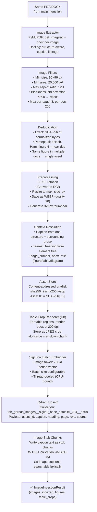
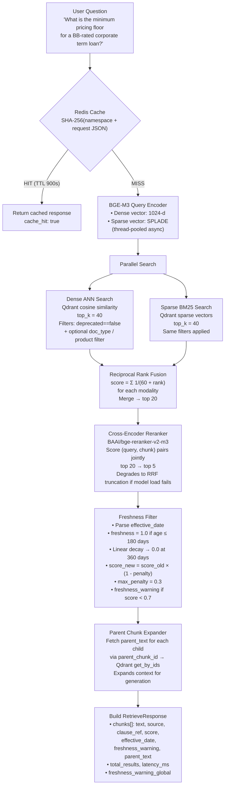
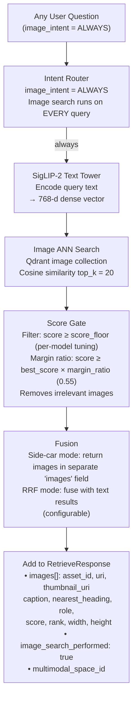
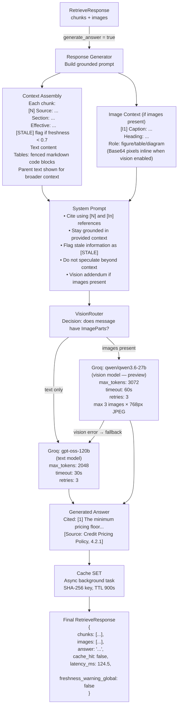
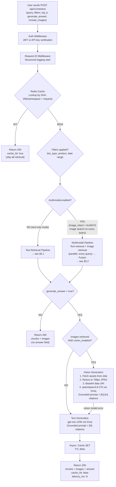
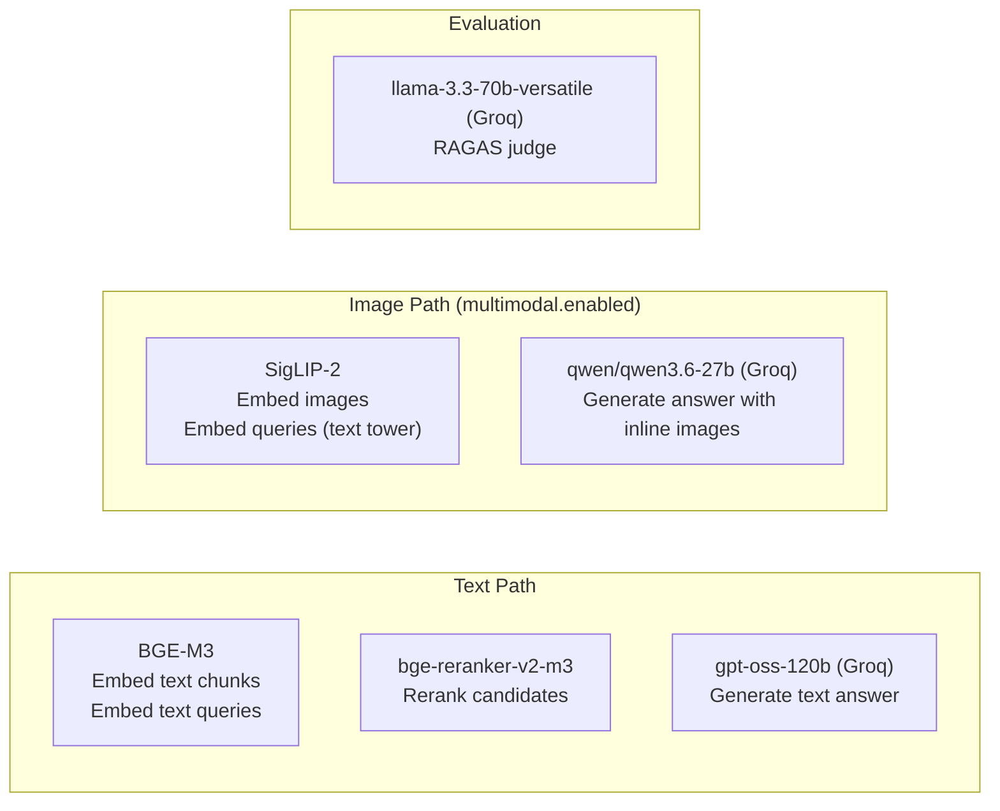

# GERNAS RAG — System Architecture & User Flow

> **Service:** Production-grade Hybrid Retrieval-Augmented Generation for regulatory and credit-policy Q&A
> **Version:** 1.0.0
> **Stack:** FastAPI · Qdrant · BGE-M3 · Groq LLMs · SigLIP-2 (multimodal, flag-gated)

---

## Table of Contents

1. [System Overview](#1-system-overview)
2. [High-Level Architecture Diagram](#2-high-level-architecture-diagram)
3. [Component Inventory](#3-component-inventory)
4. [Ingestion Pipeline (Document → Index)](#4-ingestion-pipeline-document--index)
5. [Retrieval &amp; Answer Pipeline (Question → Response)](#5-retrieval--answer-pipeline-question--response)
6. [Detailed User Flow — Question Handling](#6-detailed-user-flow--question-handling)
7. [Models Used](#7-models-used)
8. [Tools &amp; Libraries](#8-tools--libraries)
9. [API Reference](#9-api-reference)
10. [Configuration &amp; Environment](#10-configuration--environment)
11. [Evaluation Framework](#11-evaluation-framework)
12. [Failure Modes &amp; Degradation](#12-failure-modes--degradation)
13. [Data &amp; Security Design Decisions](#13-data--security-design-decisions)

---

## 1. System Overview

GERNAS RAG is a **hybrid multimodal retrieval service** that ingests PDF/DOCX policy documents, indexes them into a vector database with dense + sparse embeddings, and answers natural-language questions by retrieving the most relevant clauses and optionally generating a grounded LLM answer with source citations.

**Key capabilities:**

| Capability              | Details                                                                                        |
| ----------------------- | ---------------------------------------------------------------------------------------------- |
| Hybrid Retrieval        | Dense (BGE-M3, 1024-d) + SPLADE sparse with Reciprocal Rank Fusion                             |
| Hierarchical Chunking   | Parent/child splits; small-to-big expansion at query time                                      |
| Table-Atomic Chunking   | Tables lifted before splitting; never truncated mid-row; dual-indexed as text + rendered image |
| Freshness Awareness     | Documents penalized for staleness; flagged STALE in generated answers                          |
| Multimodal (flag-gated) | Native text↔image retrieval via SigLIP-2; vision generation via Qwen3.6-27b                   |
| Grounded Generation     | System prompt enforcing citation, grounding, and staleness disclosure                          |
| Provider-Agnostic       | Every component (embedder, vectordb, LLM, chunker, extractor) is swappable via config          |
| Idempotent Ingestion    | Deterministic chunk IDs; re-ingesting the same document upserts, never duplicates              |

---

## 2. High-Level Architecture Diagram

---

## 3. Component Inventory

### 3.1 API Routers

| Endpoint                            | File                        | Purpose                                                             |
| ----------------------------------- | --------------------------- | ------------------------------------------------------------------- |
| `POST /api/v1/retrieve`           | `api/routers/retrieve.py` | Core Q&A endpoint — retrieves chunks + optionally generates answer |
| `POST /api/v1/ingest`             | `api/routers/ingest.py`   | Async document upload; returns`job_id` immediately                |
| `GET /api/v1/ingest/{job_id}`     | `api/routers/ingest.py`   | Poll ingestion job status                                           |
| `GET /api/v1/assets/{id}`         | `api/routers/assets.py`   | Serve full-resolution stored image (auth required)                  |
| `GET /api/v1/assets/{id}/thumb`   | `api/routers/assets.py`   | Serve 320px thumbnail                                               |
| `GET /health`                     | `api/routers/health.py`   | Liveness probe                                                      |
| `GET /ready`                      | `api/routers/health.py`   | Readiness probe                                                     |
| `GET /multimodal/status`          | `api/routers/health.py`   | Active embedding space ID, vision model, table protection status    |
| `POST /api/v1/admin/reindex`      | `api/routers/admin.py`    | Drop + recreate collection                                          |
| `DELETE /api/v1/admin/collection` | `api/routers/admin.py`    | Delete collection                                                   |
| `POST /api/v1/evaluate`           | `api/routers/evaluate.py` | RAGAS evaluation over FAB test set                                  |
| `POST /api/v1/evaluate/answer`    | `api/routers/evaluate.py` | Reference-free single-answer scoring                                |
| `GET /api/v1/evaluate/test-cases` | `api/routers/evaluate.py` | List 7 curated FAB test questions                                   |

### 3.2 Core Pipeline Components

| Component             | Class                           | Source                                       | Role                                                                 |
| --------------------- | ------------------------------- | -------------------------------------------- | -------------------------------------------------------------------- |
| Extraction            | `DoclingExtractor` (primary)  | `extraction/docling_extractor.py`          | PDF/DOCX → structured Markdown + elements                           |
| Extraction fallback   | `PyMuPDFExtractor`            | `extraction/pymupdf_extractor.py`          | Fast text-only extraction                                            |
| Extraction fallback   | `UnstructuredExtractor`       | `extraction/unstructured_extractor.py`     | OCR via Unstructured.io                                              |
| Chunking              | `HierarchicalChunker`         | `chunking/hierarchical.py`                 | Hierarchical + table-atomic splits                                   |
| Text Embedder         | `BGEM3Embedder`               | `embeddings/bgem3.py`                      | Dense 1024-d + SPLADE sparse                                         |
| Multimodal Embedder   | `HFDualEncoderEmbedder`       | `embeddings/multimodal/hf_dual_encoder.py` | SigLIP-2 image+text towers                                           |
| Vector DB             | `AsyncQdrantClient`           | `vectordb/qdrant_client.py`                | Primary vector store (hybrid)                                        |
| Image Store           | `QdrantImageStore`            | `vectordb/qdrant_image_store.py`           | Image vector collection                                              |
| Hybrid Search         | `HybridSearcher`              | `retrieval/hybrid_search.py`               | Dense ANN + Sparse BM25, RRF merge                                   |
| Reranker              | `Reranker`                    | `retrieval/reranker.py`                    | Cross-encoder bge-reranker-v2-m3                                     |
| Freshness             | `FreshnessFilter`             | `retrieval/freshness.py`                   | Staleness decay penalty                                              |
| Intent Router         | `ImageIntentRouter`           | `retrieval/intent.py`                      | Routes to image search — configured`ALWAYS` (runs on every query) |
| Retrieval Pipeline    | `RetrievalPipeline`           | `retrieval/pipeline.py`                    | Text retrieval orchestrator                                          |
| Multimodal Pipeline   | `MultimodalRetrievalPipeline` | `retrieval/multimodal_pipeline.py`         | Text + image retrieval + fusion                                      |
| Generator             | `ResponseGenerator`           | `generation/generator.py`                  | Grounded prompt builder + LLM caller                                 |
| Image Payload Builder | `ImagePayloadBuilder`         | `generation/image_payload.py`              | Asset fetch → resize → base64                                      |
| Vision Router         | `VisionRouter`                | `llm/router.py`                            | Routes text vs. vision LLM calls                                     |
| LLM (text)            | `GroqLLM`                     | `llm/groq_llm.py`                          | Async Groq client — text model                                      |
| LLM (vision)          | `GroqLLM`                     | `llm/groq_llm.py`                          | Async Groq client — vision model                                    |
| Cache                 | `RAGCache`                    | `cache/redis_cache.py`                     | Redis/Valkey SHA-256 keyed cache                                     |
| Evaluator             | `RAGEvaluator`                | `evaluation/evaluator.py`                  | RAGAS metrics (faithfulness etc.)                                    |

---

## 4. Ingestion Pipeline (Document → Index)

### 4.1 Text Ingestion Flow

```mermaid
flowchart TD
    A["📄 Upload PDF / DOCX\nPOST /api/v1/ingest"] --> B["Metadata Inferrer\n• doc_type from filename keywords\n• effective_date via regex\n• product_applicability"]
    B --> C["Docling Extractor\n• Heading hierarchy preserved\n• Tables detected with structure\n• Exports raw_markdown + elements\n• Fallback: PyMuPDF → fast text-only"]
    C --> D["Hierarchical Chunker\nPass 1 — Parent split\n• Split at top-level headings\n• ~1500 token sections\n• is_parent = True"]
    D --> E["Hierarchical Chunker\nPass 2 — Child split\n• Split at headings → clauses → paragraphs\n• ~400 token sub-clauses\n• parent_chunk_id linked"]
    E --> F["Table-Atomic Handler\n1. Lift all markdown tables → [[TABLE_n]] placeholders\n2. Chunk prose normally (splitter never sees table)\n3. Re-attach tables as own atomic chunks\n4. Row-split if > budget (header repeated in each part)"]
    F --> G["Chunk ID Assignment\nMD5(doc_name :: clause_ref) → UUIDv5\nDeterministic — idempotent upserts"]
    G --> H["BGE-M3 Batch Embedder\n• Dense vector: 1024-d float32\n• Sparse vector: SPLADE indices + values\n• Batch size: 32, thread-pooled"]
    H --> I["Qdrant Upsert\nCollection: fab_gernas_docs\nNamed vectors: dense + sparse\nPayload: all chunk metadata\nFilters indexed: doc_type, product, deprecated, effective_date"]
    I --> J["Reconcile Stale Chunks\nClean up stale chunk IDs if\nboundaries changed (table toggle, extractor change)"]
    J --> K["✅ IngestionResult\n{chunks_created, status, tables_found}"]
```



### 4.2 Image Ingestion Flow (multimodal.enabled = true)



---

## 5. Retrieval & Answer Pipeline (Question → Response)

### 5.1 Text Retrieval Flow



### 5.2 Image Retrieval Flow (multimodal.enabled = true)



### 5.3 Answer Generation Flow



---

## 6. Detailed User Flow — Question Handling

This section maps every type of user question to the exact processing path taken end-to-end.

### 6.1 Flow Decision Tree



### 6.2 Step-by-Step for Each Question Type

#### Type A: Pure Text Policy Question (most common)

> *"What is the approval authority threshold for unsecured exposures above AED 50M?"*

| Step | Component        | Action                                                     |
| ---- | ---------------- | ---------------------------------------------------------- |
| 1    | Redis            | Cache miss — proceeds                                     |
| 2    | BGE-M3           | Encode query → dense 1024-d + sparse SPLADE vectors       |
| 3    | Qdrant (dense)   | ANN cosine search,`deprecated=false`, top 40             |
| 4    | Qdrant (sparse)  | BM25 lexical search, same filters, top 40                  |
| 5    | RRF Merger       | Merge 80 candidates by`Σ 1/(60+rank)` → top 20         |
| 6    | Reranker         | bge-reranker-v2-m3 cross-encodes (query, chunk) → top 5   |
| 7    | Freshness Filter | Penalty any chunk older than 180 days; flag if score < 0.7 |
| 8    | Parent Expander  | Fetch 1500-token parent of each result from Qdrant         |
| 9    | Generator        | Build numbered context`[1]...[5]`; call gpt-oss-120b     |
| 10   | Cache SET        | Store response in Redis (async)                            |
| 11   | Response         | `{chunks, answer, latency_ms, cache_hit: false}`         |

#### Type B: Table / Structured Data Question

> *"What are the eligible tenor brackets for syndicated loans?"*

| Step   | Component          | Action                                                                                           |
| ------ | ------------------ | ------------------------------------------------------------------------------------------------ |
| 1–5   | Same as Type A     | Hybrid search + RRF                                                                              |
| 6      | Reranker           | Scores table chunks highly (table markdown contains cell values)                                 |
| 7–8   | Freshness + Parent | Same                                                                                             |
| 9      | Generator          | Fences table in markdown code block; marks "part N/M" if row-split; model reads structured table |
| 10–11 | Same               | Cache + return                                                                                   |

#### Type C: Any Question (multimodal enabled, image_intent = ALWAYS)

> *"What is the minimum pricing floor for a BB-rated corporate term loan?"* — images searched alongside text on every query

| Step | Component             | Action                                                             |
| ---- | --------------------- | ------------------------------------------------------------------ |
| 1    | Redis                 | Cache miss                                                         |
| 2    | Intent Router         | `image_intent = ALWAYS` → image search runs unconditionally     |
| 3    | BGE-M3                | Encode for text retrieval (parallel)                               |
| 4    | SigLIP-2 text tower   | Encode query for image retrieval (parallel)                        |
| 5    | Qdrant (text)         | Hybrid search top 40+40 → RRF → Rerank → top 5                  |
| 6    | Qdrant (images)       | ANN on image collection, top 20 candidates                         |
| 7    | Score Gate            | Filter images: score ≥ floor (0.25) AND score ≥ best × 0.55     |
| 8    | Fusion                | Side-car: text chunks in`chunks[]`, images in `images[]`       |
| 9    | Image Payload Builder | Fetch WEBP asset → resize 768px → JPEG → base64                 |
| 10   | VisionRouter          | Detects ImageParts → routes to qwen/qwen3.6-27b                   |
| 11   | Groq Vision           | Prompt includes`[I1]...[I3]` inline base64 images + text context |
| 12   | Generator             | Answer references`[I1]` for image, `[N]` for text chunks       |
| 13   | Cache + Response      | `{chunks, images, answer, image_search_performed: true}`         |


## 7. Models Used

### 7.1 Embedding Models

| Model                                     | Type                    | Dimensions            | Purpose                                         | Config Key                          |
| ----------------------------------------- | ----------------------- | --------------------- | ----------------------------------------------- | ----------------------------------- |
| **BAAI/bge-m3**                     | Dual encoder            | 1024-d dense + sparse | Primary text embedding (documents + queries)    | `embedding.model_name`            |
| **google/siglip2-base-patch16-224** | CLIP-style dual encoder | 768-d dense           | Image + text embedding for multimodal retrieval | `multimodal.embedding.model_name` |
| `google/siglip2-base-patch16-512`       | Higher-res variant      | 768-d                 | Alternative (4× slower, higher recall)         | model_registry.yaml                 |
| `google/siglip2-so400m-patch14-384`     | Larger variant          | 1152-d                | GPU-only, best quality                          | model_registry.yaml                 |
| `openai/clip-vit-l-patch14`             | CLIP ViT-L/14           | 768-d                 | Alternative multimodal                          | model_registry.yaml                 |
| `jinaai/jina-clip-v2`                   | Jina CLIP v2            | 768-d                 | Long text context, unified index candidate      | model_registry.yaml                 |

### 7.2 Reranking Models

| Model                             | Type          | Purpose                                | Config                       |
| --------------------------------- | ------------- | -------------------------------------- | ---------------------------- |
| **BAAI/bge-reranker-v2-m3** | Cross-encoder | Rerank top-20 → top-5 text candidates | `retrieval.reranker_model` |

### 7.3 LLM Models (Groq)

| Model                             | Provider       | Purpose                                   | Context | Max Tokens |
| --------------------------------- | -------------- | ----------------------------------------- | ------- | ---------- |
| **openai/gpt-oss-120b**     | Groq           | Text answer generation (default)          | 128k    | 2048       |
| **qwen/qwen3.6-27b**        | Groq (preview) | Vision answer generation (images present) | 131k    | 3072       |
| **llama-3.3-70b-versatile** | Groq           | RAGAS judge for evaluation                | 128k    | 2048       |

### 7.4 Alternative LLM Providers

| Provider                   | Class               | Status            | Vision                        |
| -------------------------- | ------------------- | ----------------- | ----------------------------- |
| Anthropic                  | `AnthropicLLM`    | Supported         | Not yet (raises on ImagePart) |
| HuggingFace Transformers   | `HuggingFaceLLM`  | Local/self-hosted | Not yet                       |
| OpenAI-compatible gateways | `OpenAICompatLLM` | Supported         | Not yet                       |

### 7.5 Model Selection Summary



---

## 8. Tools & Libraries

### 8.1 Core Framework

| Library                             | Version | Role                                               |
| ----------------------------------- | ------- | -------------------------------------------------- |
| **FastAPI**                   | latest  | Web framework, async routers, dependency injection |
| **Uvicorn**                   | latest  | ASGI server                                        |
| **Pydantic v2**               | ≥2.0   | Request/response validation, settings management   |
| **python-jose[cryptography]** | latest  | JWT authentication                                 |
| **python-multipart**          | latest  | Multipart form parsing (file upload)               |

### 8.2 Embedding & ML

| Library                              | Role                                                     |
| ------------------------------------ | -------------------------------------------------------- |
| **FlagEmbedding**              | BGE-M3 dense + SPLADE sparse, bge-reranker cross-encoder |
| **sentence-transformers**      | Alternative dense embedder                               |
| **transformers** (≥4.49,<5.0) | HuggingFace models (SigLIP-2, CLIP, Jina)                |
| **torch**                      | Inference backend for all local models                   |
| **open_clip_torch**            | OpenCLIP models (optional group)                         |
| **einops + timm**              | Jina CLIP v2 dependencies (optional group)               |

### 8.3 Vector Databases

| Library                         | Role                                            |
| ------------------------------- | ----------------------------------------------- |
| **qdrant-client** (async) | Primary vector database — hybrid named vectors |
| **pymilvus**              | Milvus alternative (billion-scale)              |
| **chromadb**              | ChromaDB alternative (dev/test)                 |

### 8.4 Document Extraction

| Library                  | Role                                                                            |
| ------------------------ | ------------------------------------------------------------------------------- |
| **docling**        | Primary PDF/DOCX extractor — heading hierarchy, table structure, reading order |
| **PyMuPDF (fitz)** | Fast text-only extraction + image raster extraction                             |
| **unstructured**   | Unstructured.io backend with OCR (hi_res mode)                                  |

### 8.5 Chunking

| Library                            | Role                                                         |
| ---------------------------------- | ------------------------------------------------------------ |
| **langchain-text-splitters** | `RecursiveCharacterTextSplitter` for hierarchical chunking |

### 8.6 Image Processing (multimodal group)

| Library          | Role                                                          |
| ---------------- | ------------------------------------------------------------- |
| **Pillow** | Image I/O, EXIF rotation, resize, JPEG/WEBP encode, thumbnail |
| **numpy**  | dHash perceptual deduplication, blankness detection           |

### 8.7 LLM & API Clients

| Library             | Role                  |
| ------------------- | --------------------- |
| **groq**      | Groq async Python SDK |
| **anthropic** | Anthropic Python SDK  |
| **httpx**     | Async HTTP client     |

### 8.8 Cache & Storage

| Library                 | Role                            |
| ----------------------- | ------------------------------- |
| **redis** (async) | Query result caching (TTL 900s) |

### 8.9 Evaluation

| Library            | Role                                                                |
| ------------------ | ------------------------------------------------------------------- |
| **ragas**    | RAG evaluation metrics (faithfulness, relevancy, precision, recall) |
| **datasets** | HuggingFace datasets library (test case management)                 |

### 8.10 Observability

| Library                     | Role                                |
| --------------------------- | ----------------------------------- |
| **opentelemetry-sdk** | Distributed tracing instrumentation |
| **structlog**         | Structured JSON logging             |

### 8.11 Infrastructure (Docker)

| Service                     | Image                    | Role                                  |
| --------------------------- | ------------------------ | ------------------------------------- |
| **Qdrant**            | `qdrant/qdrant`        | Vector database                       |
| **Redis / Valkey**    | `redis:alpine`         | Query cache                           |
| **Milvus** (optional) | `milvusdb/milvus`      | Alternative vector DB                 |
| **RAG Service**       | `Dockerfile`           | Main FastAPI application              |
| **Embedding Service** | `Dockerfile.embedding` | Separate embedding service (optional) |

---

## 9. API Reference

### 9.1 POST /api/v1/retrieve

**Request:**

```json
{
  "query": "What is the minimum pricing floor for a BB-rated corporate term loan?",
  "filters": {
    "document_type": ["pricing_policy"],
    "product_applicability": ["corporate_lending"],
    "deprecated": false
  },
  "top_k": 5,
  "include_parent": true,
  "generate_answer": true,
  "include_images": false,
  "modalities": ["text"]
}
```

**Response:**

```json
{
  "chunks": [
    {
      "text": "BB-rated pricing: minimum floor of 260 bps...",
      "source": "Credit Pricing Policy v2.3",
      "section_heading": "4. Pricing Floors",
      "clause_reference": "4.2.1",
      "score": 0.87,
      "effective_date": "2026-01-15",
      "freshness_warning": false,
      "parent_text": "Section 4 governs minimum pricing floors...",
      "content_type": "text",
      "page_number": 12
    }
  ],
  "images": [],
  "total_results": 1,
  "latency_ms": 124.5,
  "cache_hit": false,
  "freshness_warning_global": false,
  "answer": "[1] The minimum pricing floor for a BB-rated corporate term loan is 260 basis points (bps) as stated in Section 4.2.1 of the Credit Pricing Policy (effective 2026-01-15).",
  "image_search_performed": false,
  "multimodal_space_id": null
}
```

### 9.2 POST /api/v1/ingest

**Request:** `multipart/form-data`

| Field                     | Type   | Required | Description                                                                                                 |
| ------------------------- | ------ | -------- | ----------------------------------------------------------------------------------------------------------- |
| `file`                  | File   | Yes      | PDF or DOCX document                                                                                        |
| `document_type`         | string | No       | `pricing_policy`, `regulatory`, `mrm`, `product_manual`, `risk_policy` (auto-inferred if omitted) |
| `product_applicability` | string | No       | Comma-separated:`corporate_lending,syndication`                                                           |
| `effective_date`        | string | No       | ISO date`YYYY-MM-DD` (auto-inferred if omitted)                                                           |

**Response:**

```json
{"job_id": "550e8400-e29b-41d4-a716-446655440000", "status": "accepted"}
```

### 9.3 GET /api/v1/ingest/

```json
{
  "job_id": "550e8400...",
  "status": "success",
  "chunks_created": 142,
  "images_indexed": 8,
  "tables_found": 14,
  "error": null
}
```

---

## 10. Configuration & Environment

### 10.1 Configuration Precedence (last wins)

```
1. Pydantic model defaults
2. config/default.yaml
3. config/{environment}.yaml  (dev / staging / production)
4. config/local.yaml          (machine-specific, .gitignored)
5. CONFIG_FILE env var         (path to additional YAML)
6. Environment variables       (RAG__SECTION__FIELD)
```

### 10.2 Key Configuration Parameters

| Parameter                             | Default                             | Description                                          |
| ------------------------------------- | ----------------------------------- | ---------------------------------------------------- |
| `embedding.model_name`              | `BAAI/bge-m3`                     | Primary text embedding model                         |
| `embedding.dense_dim`               | `1024`                            | Dense vector dimension                               |
| `embedding.batch_size`              | `32`                              | Embedding batch size                                 |
| `vectordb.collection_name`          | `fab_gernas_docs`                 | Qdrant text collection                               |
| `retrieval.dense_top_k`             | `40`                              | Dense ANN candidates                                 |
| `retrieval.sparse_top_k`            | `40`                              | Sparse BM25 candidates                               |
| `retrieval.rrf_k`                   | `60`                              | RRF smoothing constant                               |
| `retrieval.pre_rerank_top_k`        | `20`                              | Candidates fed to cross-encoder                      |
| `retrieval.final_top_k`             | `5`                               | Results returned to user                             |
| `retrieval.freshness_max_age_days`  | `180`                             | Age threshold before penalty                         |
| `retrieval.freshness_max_penalty`   | `0.3`                             | Max score reduction (30%)                            |
| `llm.model`                         | `openai/gpt-oss-120b`             | Text generation model                                |
| `llm.vision_model_name`             | `qwen/qwen3.6-27b`                | Vision generation model                              |
| `llm.vision_max_images`             | `3`                               | Max images per vision prompt                         |
| `cache.ttl`                         | `900`                             | Cache TTL in seconds                                 |
| `chunking.chunk_size`               | `400`                             | Child chunk token budget                             |
| `chunking.parent_chunk_size`        | `1500`                            | Parent chunk token budget                            |
| `chunking.protect_tables`           | `true`                            | Table-atomic chunking (D8)                           |
| `multimodal.enabled`                | `false`                           | Enable image retrieval + vision                      |
| `multimodal.retrieval.image_intent` | `always`                          | Image search runs on every query (not keyword-gated) |
| `multimodal.embedding.model_name`   | `google/siglip2-base-patch16-224` | Image embedding model                                |

### 10.3 Environment Variables

```bash
# Required
export RAG__LLM__GROQ_API_KEY="gsk_..."

# Enable multimodal (image search runs on every query)
export RAG__MULTIMODAL__ENABLED=true
export RAG__MULTIMODAL__RETRIEVAL__IMAGE_INTENT=always
export RAG__LLM__VISION_ENABLED=true

# Override models
export RAG__LLM__MODEL="openai/gpt-oss-120b"
export RAG__MULTIMODAL__EMBEDDING__MODEL_NAME="google/siglip2-base-patch16-512"

# Redis
export RAG__CACHE__REDIS_URL="redis://localhost:6379/0"

# Qdrant
export RAG__VECTORDB__QDRANT_URL="http://localhost:6333"
```

---

## 11. Evaluation Framework

### 11.1 RAGAS Metrics

| Metric                        | Threshold | Description                                   |
| ----------------------------- | --------- | --------------------------------------------- |
| **Faithfulness**        | ≥ 0.85   | Answer claims supported by retrieved context  |
| **Answer Relevancy**    | ≥ 0.80   | Answer addresses the question                 |
| **Context Precision**   | ≥ 0.75   | Retrieved context is relevant to the question |
| **Context Recall**      | ≥ 0.80   | Ground truth covered by retrieved context     |
| **Context Utilization** | —        | Reference-free: how well context is used      |

### 11.2 FAB Test Set (7 curated questions)

| # | Domain               | Sample Question                                        |
| - | -------------------- | ------------------------------------------------------ |
| 1 | Pricing              | Minimum pricing floor for BB-rated corporate term loan |
| 2 | Approval Authority   | Approval thresholds for unsecured exposures            |
| 3 | CBUAE AI Governance  | AI governance requirements per CBUAE circular          |
| 4 | MRM Evidence         | Model risk management evidence requirements            |
| 5 | Concentration Limits | Sector concentration limits                            |
| 6 | Eligible Tenors      | Eligible tenor brackets for syndicated loans           |
| 7 | Documentation        | Documentation requirements for credit facilities       |

### 11.3 Evaluation Flow


---

## 12. Failure Modes & Degradation

| Component                     | Failure            | Graceful Degradation                                          |
| ----------------------------- | ------------------ | ------------------------------------------------------------- |
| Redis Cache                   | Unavailable        | Cache miss; re-compute every request; no error surfaced       |
| bge-reranker                  | Model load failure | Skip reranking; truncate RRF list to top-k; log warning       |
| Multimodal Embedder           | Load failure       | Log error; text-only retrieval continues unaffected           |
| Image Collection (Qdrant)     | Unavailable        | Image retrieval skipped; text retrieval continues             |
| Vision LLM (qwen/qwen3.6-27b) | Error / rate-limit | Drop ImageParts; fallback to gpt-oss-120b with captions only  |
| Image Ingestion Pipeline      | Any error          | Log error; text ingestion succeeds; images simply not indexed |
| Document Extractor (Docling)  | Parse failure      | Fallback to PyMuPDF fast text extraction                      |
| Groq LLM (text)               | API error          | Retry 3× with exponential backoff; surface error after       |
| Qdrant Vector DB              | Unavailable        | Retry with backoff; surface 503 to client                     |

---

## 13. Data & Security Design Decisions

| Decision                             | Implementation                                                                                                                           |
| ------------------------------------ | ---------------------------------------------------------------------------------------------------------------------------------------- |
| **No URLs for images**         | Base64 data URIs only; images never sent as remote URLs (auth required for asset access)                                                 |
| **JWT / API key auth**         | All endpoints behind`auth.py` token verification                                                                                       |
| **No secrets in code**         | API keys via environment variables only; no keys in YAML or source                                                                       |
| **Content-addressed storage**  | Images stored by SHA-256; deduplication automatic; no path traversal risk                                                                |
| **Deprecated soft-delete**     | `deprecated=true` filter on every query; hard deletes avoided; full audit trail preserved                                              |
| **Space identity enforcement** | Embedding space ID encoded in collection name; swapping models creates new collection, preventing silent index corruption                |
| **Deterministic chunk IDs**    | MD5(doc_name::ref) → UUIDv5; re-ingestion upserts safely                                                                                |
| **Table-atomic chunking (D8)** | Tables never split mid-row; header repeated in each part; prevents nonsensical truncated table lookups                                   |
| **Freshness transparency**     | Staleness score visible in each chunk;`[STALE]` flag added to generated answer; no silent serving of old data                          |
| **CORS**                       | Configurable allowed origins; defaults to restrictive                                                                                    |
| **Cache namespace isolation**  | SHA-256 key includes config state (multimodal.enabled, retrieval.mode, vision_enabled); config changes never serve wrong cached response |

---
