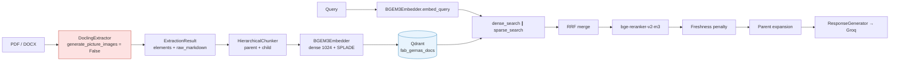
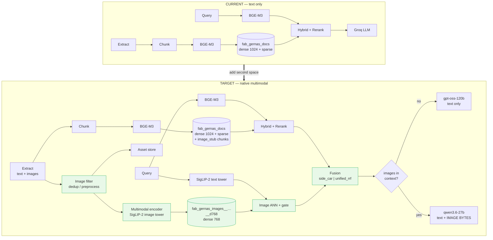
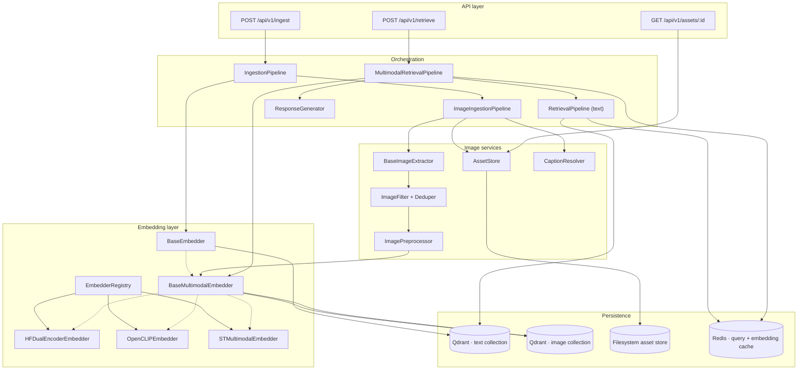
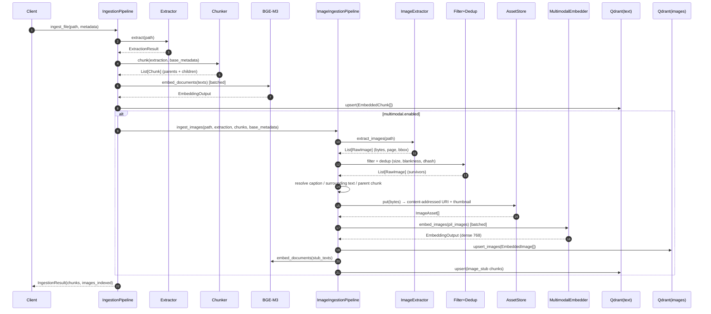
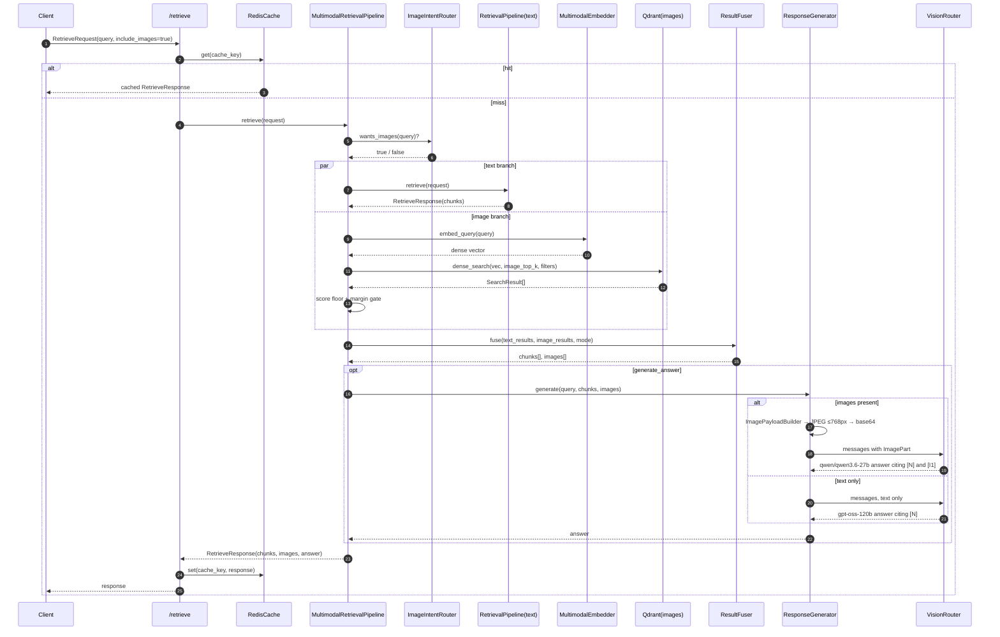
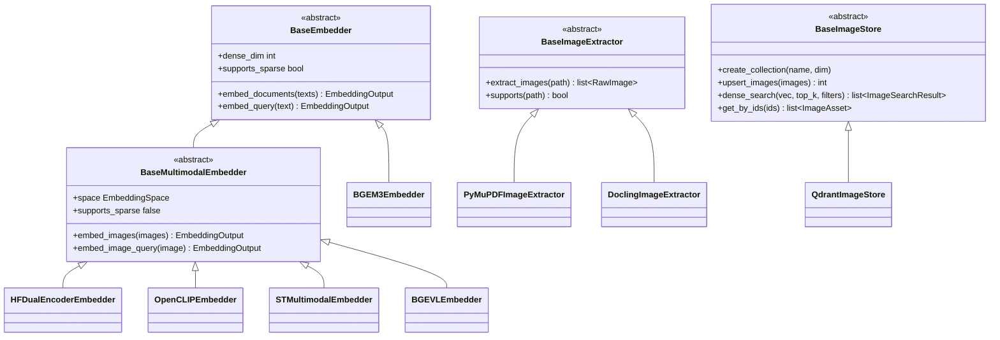
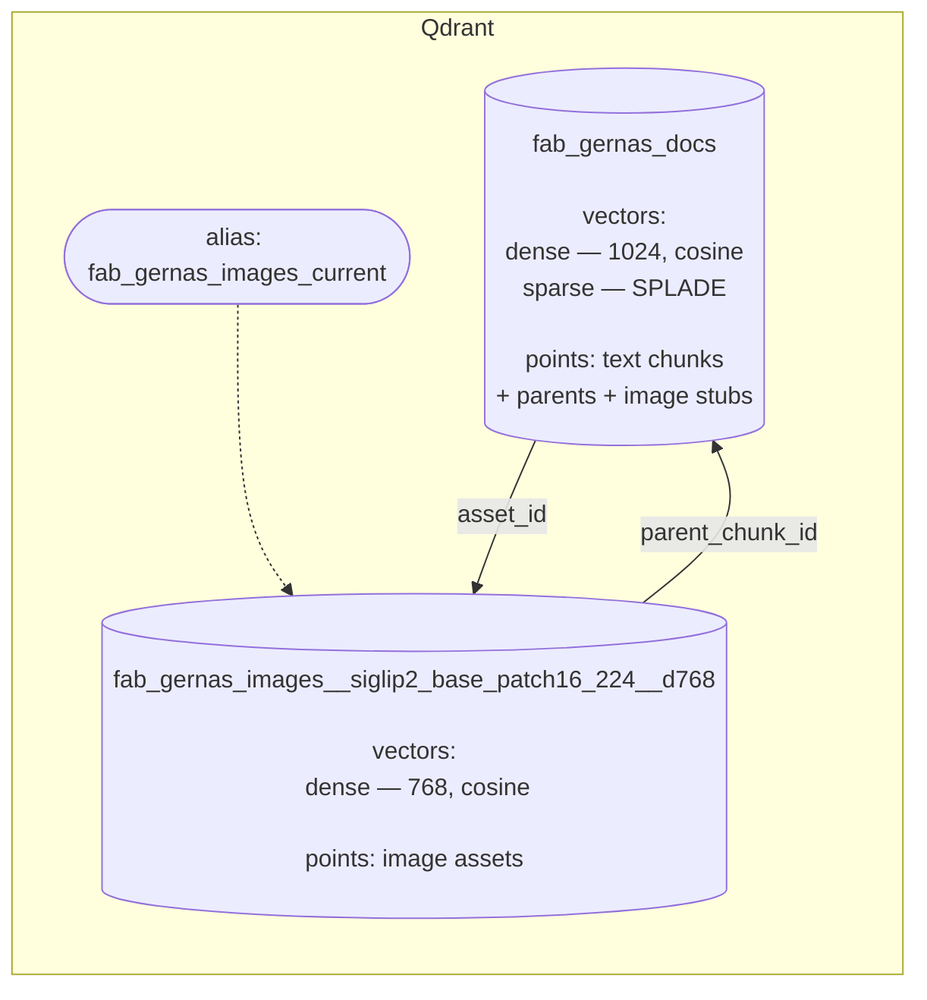
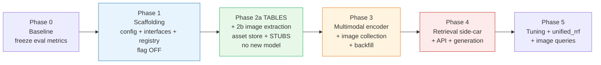

# Technical Design Document — Native Multimodal RAG (CLIP-style) for GERNAS RAG

| Field                     | Value                                                     |
| ------------------------- | --------------------------------------------------------- |
| **Status**          | Proposed — for review                                    |
| **Author**          | Platform / RAG Engineering                                |
| **Date**            | 2026-08-05                                                |
| **Target branch**   | `multimodal-rag-poc-clip-style`                         |
| **Baseline commit** | `30ed674`                                               |
| **Service**         | `gernas-rag` v1.0.0                                     |
| **Scope**           | Proof of Concept, CPU-only, fully open-source model stack |

---

## 0. Executive summary

### 0.1 What we are building

The GERNAS RAG service today is a **text-only** hybrid retrieval pipeline built on `BAAI/bge-m3` (dense 1024-d + SPLADE sparse) over Qdrant, with Docling extraction, hierarchical parent/child chunking, cross-encoder reranking, and Groq-hosted generation. Figures, charts, org-diagrams, rate tables rendered as images, and scanned exhibits inside our policy PDFs are **invisible** to retrieval — Docling's picture items are discarded and only the text layer survives into the index.

This document specifies the addition of a **second, CLIP-style embedding space** in which text queries and images live together, so that:

- `text → image` retrieval works natively ("show me the credit approval authority matrix diagram"),
- `image → image` and `image → text` are structurally supported and gated behind a flag,
- the existing `text → text` path is **bit-for-bit unchanged** when the feature flag is off.

### 0.2 The decisions that define this design

Numbering matches §4, where each is argued in full.

| #            | Decision                                                      | Summary                                                                                                                                                                                                                                                                                                                                        |
| ------------ | ------------------------------------------------------------- | ---------------------------------------------------------------------------------------------------------------------------------------------------------------------------------------------------------------------------------------------------------------------------------------------------------------------------------------------- |
| **D1** | **Keep BGE-M3.**                                        | BGE-M3 vectors and CLIP-style vectors are**not** in a shared space and never will be — different dimensionality (1024 vs 768) and, more fundamentally, no joint training objective. Cosine similarity between them is noise. BGE-M3 remains the sole encoder for the text corpus.                                                       |
| **D2** | **Dual index, not unified index.**                      | Text chunks stay in the existing collection (BGE-M3, dense+sparse, reranked). Images go into a**new, separate collection** embedded with a multimodal encoder. A query is encoded **twice** — once per space — and results are fused by **rank**, not by score.                                                            |
| **D3** | **Default model: `google/siglip2-base-patch16-224`.** | Apache-2.0, native`transformers` support with no `trust_remote_code`, 768-d, base-sized towers that run comfortably on a laptop CPU, and materially better text-rich-image alignment than CLIP ViT-B/32 or SigLIP-1. `jinaai/jina-clip-v2` is a first-class configurable alternative but is **CC-BY-NC-4.0** and ~4x the CPU cost. |
| **D7** | **Retrieved images are sent as pixels to a vision LLM.** (§4.7) | Text chunks **and** image bytes both enter the generation prompt. Groq's `qwen/qwen3.6-27b` (preview) accepts image input, so the model reads the chart rather than paraphrasing its caption. The CPU-only constraint applies to *embedding*, which runs locally — it never applied to *generation*, which was always a remote API call. Model routing is dynamic: text-only queries stay on the cheaper text model. |
| **D8** | **Tables are atomic, labelled, and dual-indexed.** (§4.8) | A table is **never split mid-table** — today's chunker shreds them (verified defect, §4.8.1). Each table is indexed **twice**: as a markdown text chunk for BGE-M3 + sparse lexical matching, and as a **rendered bbox crop** in the image space so the vision LLM can read merged cells and multi-level headers that markdown flattening destroys. |

### 0.3 Why not one unified index?

This is the crux of the design, so it is stated up front rather than buried in §4.

A single shared index requires **one encoder pair** to embed both the text corpus and the images. Every CPU-viable candidate except one has a **text tower with a 64–77 token limit** trained on image captions. Our chunks are ~400 tokens of dense regulatory prose. Forcing them through SigLIP-2's 64-token text encoder would:

1. **truncate ~85% of every chunk**,
2. destroy clause-level precision (the entire value of the current system),
3. **eliminate sparse retrieval** — CLIP-style encoders produce no lexical/SPLADE vector, and exact-term matching on identifiers like `4.2.1`, `BB-rated`, `260 bps` is doing a lot of work in the current hybrid pipeline,
4. break the existing `BAAI/bge-reranker-v2-m3` cross-encoder pairing.

The one exception is **Jina CLIP v2**, whose text tower is a genuine 8192-token multilingual retriever (Jina-XLM-RoBERTa, 561M params) trained multi-task so that text-text quality survives alongside text-image alignment. It is the only credible path to a *true* unified index — and it is licensed CC-BY-NC-4.0 and weighs 0.9B params. See §4.3 for the full argument and §15 for the migration path if the licence is cleared.

**Therefore: dual index for the PoC.** The architecture is deliberately built so that collapsing to a unified index later is a configuration change plus a reindex, not a rewrite.

### 0.4 Deliverables of this PoC

- A provider-agnostic **embedding registry + factory** where swapping the multimodal model is a one-line YAML change (§7, §8.2).
- An **image extraction → filtering → dedup → asset store** ingestion sub-pipeline (§8.4).
- A **second Qdrant collection** keyed by embedding-space identity, so a model swap can never silently corrupt an index (§9).
- A **multimodal retriever** with rank-based fusion and an intent router (§8.6).
- A **vision generation path** that sends retrieved image bytes plus text chunks to `qwen/qwen3.6-27b`, with dynamic model routing and a text-only fallback (§4.7, §8.7).
- **Feature-flagged rollout**, backfill script, benchmark script, and a deterministic alignment test suite (§12, §13).

### 0.5 Explicit non-goals

| Non-goal                             | Rationale                                                                                                                                                                                             |
| ------------------------------------ | ----------------------------------------------------------------------------------------------------------------------------------------------------------------------------------------------------- |
| Self-hosted / local vision generation | Generation runs on Groq. A local VLM on CPU (~2–5 s/image) is viable for *batch ingest-time captioning* (§15.4) but not for interactive generation. |
| Video input | `qwen/qwen3.6-27b` accepts video; our corpus has none. |
| ColPali / ColQwen page embeddings    | 3B-parameter VLMs; not CPU-viable. Interfaces are shaped to accommodate them (§15.5).                                                                                                                |
| Replacing BGE-M3                     | See D1.                                                                                                                                                                                               |
| GPU tuning                           | CPU-only PoC; device is configurable and the code is device-agnostic (§14.1).                                                                                                                        |
| Production-grade object storage      | Local content-addressed filesystem store with an`S3` seam (§8.5).                                                                                                                                  |

---

## 1. Glossary

| Term                      | Definition                                                                                                                                                                                                                                              |
| ------------------------- | ------------------------------------------------------------------------------------------------------------------------------------------------------------------------------------------------------------------------------------------------------- |
| **Embedding space** | The (model, revision, dim, normalisation, metric) tuple. Two vectors are comparable**iff** they come from the same space. Identified by `space_id`.                                                                                             |
| **Dual encoder**    | A model with two towers (text, vision) trained contrastively so matched pairs are close. CLIP, SigLIP, SigLIP-2, Jina CLIP.                                                                                                                             |
| **Asset**           | An image extracted from a source document, content-addressed and stored on disk.                                                                                                                                                                        |
| **Image stub**      | A short**text** chunk describing an image (caption + surrounding prose + heading), written into the **existing BGE-M3 text collection**. Gives images reachability from the legacy hybrid path and a citable handle when the vision path is unavailable (§4.7.4). |
| **Side-car mode**   | Retrieval mode where images are returned in a separate response field rather than interleaved into the ranked text list. Default.                                                                                                                       |
| **RRF**             | Reciprocal Rank Fusion,`score = Σ 1/(k + rank)`. Already implemented at `src/gernas_rag/retrieval/hybrid_search.py:52`.                                                                                                                            |
| **Matryoshka**      | Training that makes a vector's leading`d` dimensions independently usable, enabling truncation (Jina CLIP v2: 1024 → 64).                                                                                                                            |

---

## 2. Current system (as-built)

Everything below was read from the repository at `30ed674`, not assumed.

### 2.1 Component inventory

| Concern            | Implementation                                                                                       | Path                                         |
| ------------------ | ---------------------------------------------------------------------------------------------------- | -------------------------------------------- |
| Config root        | Pydantic Settings v2, 3-layer YAML merge then env override                                           | `src/gernas_rag/config/settings.py`        |
| Embedding          | `BGEM3Embedder` (FlagEmbedding), lazy load, thread-pool dispatch                                   | `src/gernas_rag/embeddings/bgem3.py`       |
| Embedding contract | `BaseEmbedder` → `embed_documents`, `embed_query`, `dense_dim`, `supports_sparse`         | `src/gernas_rag/embeddings/base.py`        |
| Factory            | `match` on `EmbeddingProvider` enum, lazy imports                                                | `src/gernas_rag/embeddings/factory.py`     |
| Extraction         | Docling primary (OCR auto-detected via pypdfium2 text-layer probe), Unstructured + PyMuPDF fallbacks | `src/gernas_rag/extraction/`               |
| Chunking           | `HierarchicalChunker` — parent/child, clause-ref regex, deterministic MD5 ids                     | `src/gernas_rag/chunking/hierarchical.py`  |
| Vector DB          | `QdrantVectorDB`, named vectors `dense` + `sparse`, UUIDv5 point ids                           | `src/gernas_rag/vectordb/qdrant_client.py` |
| Retrieval          | Encode → dense ANN ∥ sparse → RRF → cross-encoder rerank → freshness → parent expand           | `src/gernas_rag/retrieval/pipeline.py`     |
| Generation         | Numbered-context prompt with mandatory`[N]` citations                                              | `src/gernas_rag/generation/generator.py`   |
| DI                 | Constructed in`lifespan`, stashed on `app.state`, read via `deps.py`                           | `src/gernas_rag/main.py:24`                |

### 2.2 Current data flow



The red node is where images are lost today. `docling_extractor.py:40-41` sets:

```python
opts.images_scale = 1.0
opts.generate_page_images = False
```

with the comment *"Caps page-rasterization memory when OCR is on, preventing the std::bad_alloc that heavy pages trigger at the default scale."* That memory constraint is real and the new image pipeline must not regress it — see §8.4.2.

### 2.3 Constraints inherited from the current code

These shape the design and are non-negotiable without a wider refactor:

1. **`BaseVectorDB` is single-collection.** Every method on `QdrantVectorDB` reads `self._config.collection_name` (lines 102, 116, 138, 152). There is no collection parameter. A second collection therefore **cannot** be addressed through the existing ABC without changing its signature — which would break `FakeVectorDB` in `tests/conftest.py:59` and the Milvus/Chroma clients. → We introduce a **separate `BaseImageStore` ABC** (§8.7).
2. **`EmbeddingOutput` is dense+sparse only.** It is modality-agnostic already, so multimodal embedders can reuse it unchanged (sparse lists left empty).
3. **`settings.embedding` is a flat block** consumed in four places (`main.py:32`, `retrieval/pipeline.py:34`, `ingestion/pipeline.py:108`, `evaluation/`). Adding nested `embedding.text` / `embedding.multimodal` sub-keys would break all of them. → The multimodal config becomes a **new top-level `multimodal:` block** (§7.1).
4. **`ChunkMetadata` is `frozen=True`** with a fixed field set, and `QdrantVectorDB._payload_to_chunk` filters payload keys against `ChunkMetadata.model_fields` (line 204). New metadata fields must be added to the model or they will be silently dropped on read-back.
5. **Reranker selection is provider-conditional** (`retrieval/pipeline.py:34`: reranker is disabled only for `SENTENCE_TRANSFORMER`). Adding a new provider enum value to `EmbeddingProvider` would enable the cross-encoder for it implicitly. → Multimodal providers get their **own enum**, not entries in `EmbeddingProvider`.

---

## 3. Requirements

### 3.1 Functional

| ID  | Requirement                                                                      | Priority                |
| --- | -------------------------------------------------------------------------------- | ----------------------- |
| F1  | Extract images from PDF/DOCX during ingestion, with page number and bounding box | Must                    |
| F2  | Filter out logos, rules, icons, near-blank and duplicate images                  | Must                    |
| F3  | Embed images into a CLIP-style shared space                                      | Must                    |
| F4  | Encode a text query into that same space and retrieve images                     | Must                    |
| F5  | Preserve existing text→text behaviour exactly when the flag is off              | Must                    |
| F6  | Return images as structured citations (asset URI, page, caption, score)          | Must                    |
| F7  | Swap embedding model via config only                                             | Must                    |
| F8  | Accept an image as the query (image→image, image→text)                         | Should (flagged)        |
| F9  | Serve stored assets over HTTP                                                    | Should                  |
| F10 | Fuse text and image results into one ranked list                                 | Could (mode-selectable) |

### 3.2 Non-functional

| ID | Requirement                                    | Target                                    |
| -- | ---------------------------------------------- | ----------------------------------------- |
| N1 | CPU-only, laptop-class hardware                | 8-core / 16 GB                            |
| N2 | Fully open-source models, no proprietary APIs  | Hard constraint                           |
| N3 | Licence compatible with commercial banking use | Apache-2.0 / MIT preferred; NC flagged    |
| N4 | Added query latency in side-car mode           | < 250 ms p50 (see §14.6)                 |
| N5 | Service cold start increase                    | < 6 s with warmup, < 0.5 s with lazy load |
| N6 | Resident memory increase                       | < 1.5 GB                                  |
| N7 | No`trust_remote_code` in the default path    | Supply-chain policy                       |

---

## 4. Design decisions and trade-offs

### 4.1 D1 — Can BGE-M3 stay? Are BGE and CLIP embeddings compatible?

**Decision: BGE-M3 stays as the sole text-corpus encoder. It is not compatible with CLIP-style image vectors, and no amount of engineering makes it so.**

Three independent reasons, in increasing order of importance:

1. **Dimensional mismatch.** BGE-M3 emits 1024-d; SigLIP-2 base emits 768-d. A vector index requires a fixed dimension per named vector. Mechanically incompatible.
2. **No shared geometry.** Even at equal dimensionality, similarity is only meaningful between vectors produced by encoders **trained jointly against a common objective**. BGE-M3 was trained on text-text relevance; SigLIP-2 on image-text contrastive alignment. Their coordinate systems have no relationship. `cos(bge_vec, siglip_vec)` is a number, not a signal.
3. **"Alignment adapters" don't rescue this at PoC scale.** One could train a projection `W: R^1024 → R^768` to map BGE vectors into SigLIP's space (a linear probe on paired data). This is a real technique, but it needs a domain-paired corpus (tens of thousands of caption/image pairs from *our* documents), a training loop, and a validation harness — and it converts a config change into an ML project with its own drift and retraining lifecycle. Out of scope; noted in §15.6 as a possible optimisation if the dual index proves insufficient.

**Corollary — does a shared space require the same encoder for text and images?** Yes. A shared space *is* the pair of towers of one jointly-trained model. There is exactly one narrow exception: models explicitly released as an aligned pair against a frozen partner (e.g. `nomic-embed-vision-v1.5` is trained to be compatible with `nomic-embed-text-v1.5`). Those are still "the same model family, one training objective" — the principle holds.

### 4.2 D2 — Unified index vs hybrid (dual) index

| Dimension                         | Unified single index                                                                                      | **Dual index (chosen)**             |
| --------------------------------- | --------------------------------------------------------------------------------------------------------- | ----------------------------------------- |
| Encoder                           | One multimodal model for everything                                                                       | BGE-M3 for text, SigLIP-2 for images      |
| Text chunk fidelity               | Capped at the model's text limit (64 tok for SigLIP-2, 77 for CLIP) → catastrophic for 400-token clauses | Full 512-token BGE-M3 encoding, unchanged |
| Sparse / lexical matching         | **Lost** — no CLIP-family model emits SPLADE vectors                                               | Preserved                                 |
| Cross-encoder reranking           | `bge-reranker-v2-m3` is paired with BGE-M3 semantics; would need re-validation                          | Preserved untouched                       |
| Ranking across modalities         | Native — one score scale                                                                                 | Requires rank fusion (§4.5)              |
| Query cost                        | 1 encode                                                                                                  | 2 encodes (parallelisable)                |
| Blast radius of a model swap      | Entire corpus reindex (hours)                                                                             | Image collection only (minutes)           |
| Regression risk to today's system | **High**                                                                                            | **Near zero** (flag-gated)          |

**When would unified be the right call?** Three conditions must hold simultaneously:

1. the multimodal model's text tower is a *bona fide* long-context retriever (today: only Jina CLIP v2 qualifies),
2. lexical/sparse matching is not load-bearing for the corpus (ours: it is — clause numbers, bps figures, ratings),
3. the corpus is image-dominant, e.g. slide decks or scanned forms where text chunks are short captions anyway.

Our corpus is text-dominant regulatory prose with occasional figures. **Dual index.**

### 4.3 D3 — Model selection

#### 4.3.1 Candidate evaluation

Scores are `1`(poor) → `5`(excellent). CPU figures are **indicative for laptop-class 8-core x86 CPU, fp32, batched**, and must be confirmed with the benchmark script in §8.11 — do not treat them as measured results for your hardware.

| Model                                                | Params                  | Dim                    | Text ctx                 | Licence                      | CPU img/s (est.)  | RAM fp32          | Text→Img   | Text-rich imgs | Text→Text                 | Integration                                             | Prod-ready          |
| ---------------------------------------------------- | ----------------------- | ---------------------- | ------------------------ | ---------------------------- | ----------------- | ----------------- | ----------- | -------------- | -------------------------- | ------------------------------------------------------- | ------------------- |
| **`google/siglip2-base-patch16-224`** ⭐     | 0.4B card / base towers | **768**          | 64 tok                   | **Apache-2.0**         | ~15–30           | ~0.9 GB           | **5** | **4**    | 1                          | **5** (`AutoModel`)                             | **5**         |
| `google/siglip2-base-patch16-512`                  | same                    | 768                    | 64 tok                   | Apache-2.0                   | ~4–8             | ~1.0 GB           | 5           | **5**    | 1                          | 5                                                       | 5                   |
| `google/siglip2-so400m-patch16-384`                | 0.9B+                   | 1152                   | 64 tok                   | Apache-2.0                   | ~1–3             | ~3.5 GB           | 5           | 5              | 1                          | 5                                                       | 4 (too slow on CPU) |
| `google/siglip-base-patch16-224` (v1)              | 0.2B                    | 768                    | 64 tok                   | Apache-2.0                   | ~20–35           | ~0.8 GB           | 4           | 3              | 1                          | 5                                                       | 5                   |
| `laion/CLIP-ViT-B-32-laion2B-s34B-b79K` (OpenCLIP) | 0.15B                   | 512                    | 77 tok                   | MIT                          | **~40–70** | ~0.6 GB           | 3           | 2              | 1                          | 4 (`open_clip_torch`)                                 | 5                   |
| `openai/clip-vit-large-patch14`                    | 0.43B                   | 768                    | 77 tok                   | MIT                          | ~3–6             | ~1.7 GB           | 4           | 3              | 1                          | 5                                                       | 4                   |
| `jinaai/jina-clip-v2`                              | **0.9B**          | 1024 (Matryoshka →64) | **8192 tok**       | **CC-BY-NC-4.0** ⚠    | ~1–2             | **~3.6 GB** | 5           | 4              | **5**                | 3 (`trust_remote_code`, `einops`, `timm`)         | 4                   |
| `BAAI/BGE-VL-base`                                 | ~0.15B                  | 512                    | 77 tok                   | MIT                          | ~35–60           | ~0.6 GB           | 4           | 3              | 1                          | 3 (`trust_remote_code`, custom `set_processor` API) | 3                   |
| `BAAI/BGE-VL-MLLM-S1`                              | ~7B                     | —                     | long                     | MIT (weights), LLaVA lineage | ✗ not CPU-viable | ~28 GB            | 5           | 5              | 4                          | 2                                                       | 2                   |
| `nomic-ai/nomic-embed-vision-v1.5`                 | 0.09B                   | 768                    | (text via partner model) | verify — NC variants exist  | ~30–50           | ~0.4 GB           | 4           | 3              | 4 (via partner text model) | 3                                                       | 3                   |

⚠ **Licence caution.** `jina-clip-v2` is CC-BY-NC-4.0 — **non-commercial**. Jina offers commercial terms via their API/cloud marketplaces, but the *weights* under that licence cannot back a production banking workload. Treat it as a research/benchmark alternative until Legal clears it. `nomic-embed-vision` licence terms have varied by version — **verify the model card before adopting**, do not rely on this table.

#### 4.3.2 Recommendation

> **Default: `google/siglip2-base-patch16-224`.**

Justification against the criteria the brief asked for:

- **CPU inference.** ViT-B/16 at 224×224 is 196 patches — the sweet spot for CPU. Roughly 2× the cost of CLIP ViT-B/32 for a large quality gain, and ~10× cheaper than `so400m@384`. The text tower is tiny and query-time encoding is negligible (~10–20 ms).
- **Embedding quality / text-image alignment.** SigLIP-2 improves on SigLIP-1 and OpenCLIP through its combined sigmoid + captioning + self-distillation training recipe, with notably better handling of **text-rich images** — charts, tables-as-images, labelled diagrams, which is exactly our corpus's image population.
- **Document retrieval capability.** Honest framing: *no* CLIP-family model is a document retriever. It is a **figure retriever**. Document-level retrieval stays with BGE-M3. Choosing SigLIP-2 costs us nothing there because we never asked it to do that job (D2).
- **Memory.** ~0.9 GB resident fp32, within N6, and ~0.5 GB with dynamic int8 quantisation.
- **Ease of integration.** `AutoModel` + `AutoProcessor`, `get_text_features()` / `get_image_features()`. **No `trust_remote_code`** — satisfies N7, which `jina-clip-v2` and `BGE-VL` both violate.
- **HF ecosystem / production readiness.** First-party Google release, in-tree `transformers` support (requires `transformers >= 4.49`), Apache-2.0, many sizes sharing one code path so scaling up is a config change.

**Configured alternatives shipped in the registry from day one** (all switchable by YAML alone):

| Alias                | When to use                                                                                                     |
| -------------------- | --------------------------------------------------------------------------------------------------------------- |
| `siglip2-base`     | Default.                                                                                                        |
| `siglip2-base-512` | Corpus is chart/table-image heavy and ingestion throughput is not the bottleneck.                               |
| `openclip-b32`     | Low-RAM machine or you need max ingestion throughput; accept quality loss.                                      |
| `jina-clip-v2`     | Benchmarking the unified-index hypothesis, or non-commercial research. Licence gate enforced in code (§8.2.4). |
| `bge-vl-base`      | Evaluating composed-image retrieval ("this diagram, but for retail lending").                                   |

### 4.4 D4 — Separate collection, keyed by embedding-space identity

Qdrant supports multiple **named vectors of different dimensions inside one collection**, so co-locating text and image vectors is technically possible. We reject it:

| Option                                                        | Pros                                                                                                                                | Cons                                                                                                                                                                                                                                                                                                                                                         |
| ------------------------------------------------------------- | ----------------------------------------------------------------------------------------------------------------------------------- | ------------------------------------------------------------------------------------------------------------------------------------------------------------------------------------------------------------------------------------------------------------------------------------------------------------------------------------------------------------ |
| One collection, named vectors`dense`(1024) + `image`(768) | One filter surface; one lifecycle                                                                                                   | Every point carries an unused vector slot or needs optional-vector handling;**changing the image model changes a vector's dimension, which Qdrant cannot do in place → full collection rebuild including all text vectors**; payload schema becomes a union of two entity types; `QdrantVectorDB` would need collection-aware refactoring (§2.3-1) |
| **Two collections (chosen)**                            | Independent lifecycle, dimension, distance metric, and reindex cost; text index literally untouched; image collection is disposable | Two clients; fusion must be rank-based; filters implemented twice                                                                                                                                                                                                                                                                                            |

**Collection naming carries the space identity.** A collection is named:

```
{base}__{model_slug}__d{dim}
# e.g. fab_gernas_images__siglip2_base_patch16_224__d768
```

`space_id` is derived deterministically from `(provider, model_name, revision, dim, normalize, metric)`. Consequences:

- Switching the model in YAML produces a **different collection name** → the old index is never read with the wrong encoder. This eliminates the single most dangerous silent failure in multimodal RAG: querying a SigLIP index with CLIP vectors and getting plausible-looking garbage.
- Old and new spaces can coexist during a model migration; cut over with a **Qdrant alias** (`fab_gernas_images_current`) for zero downtime.
- Startup asserts `probe_dim == collection_dim` and refuses to serve on mismatch (§8.2.3).

### 4.5 D5 — Fusion strategy

Text scores (BGE-M3 cosine, post-cross-encoder) and image scores (SigLIP-2 cosine) are **not comparable**. SigLIP-2 similarities cluster in a narrow band (typically ~0.0–0.3 for sigmoid-trained models) with no absolute meaning; a "0.22" is not "22% relevant". Two mechanisms handle this:

**(a) Rank-based fusion.** RRF discards score magnitude entirely and uses only within-list rank — exactly the trick already used to merge dense and sparse at `hybrid_search.py:52`. We reuse the same formula with per-modality weights:

```
fused(d) = w_text · 1/(k + rank_text(d)) + w_image · 1/(k + rank_image(d))
```

**(b) Calibrated relevance gating.** RRF will happily rank the best of a set of *irrelevant* images at position 1. So the image branch applies a **score floor** plus a **relative-margin check** before fusion:

```
keep image i  ⟺  s_i ≥ floor        AND     s_i ≥ margin_ratio · s_max
```

with `floor` empirically calibrated per model on the golden set (§13.4) — this is the single most important tunable and it **must be recalibrated whenever the model changes**. The registry therefore stores a per-model default floor.

**Three modes, config-selectable:**

| Mode            | Behaviour                                                              | Default?        |
| --------------- | ---------------------------------------------------------------------- | --------------- |
| `off`         | Image branch disabled entirely                                         | —              |
| `side_car`    | Text results as today; images returned in a separate`images[]` field | ✅**Yes** |
| `unified_rrf` | Text and images fused into one ranked list                             | No              |

`side_car` is the default because it keeps the two citation namespaces clean: text chunks are `[1..N]`, figures are `[I1..I3]`. Interleaving them into one ranked list (`unified_rrf`) means an image can displace a text chunk from the context budget, which is sometimes right and sometimes destroys a factual answer. Side-car makes images **additive** — the text answer is never worse than today's.

### 4.6 D6 — Text surrogates for every image

Independent of whether the generator can see pixels, every image carries **three text surrogates**, in descending order of reliability:

1. **Caption** — the document's own figure caption, extracted structurally by Docling (`PictureItem.captions`) or heuristically as the nearest `Figure N:` line.
2. **Surrounding text** — ±`caption_window_chars` of prose around the image anchor, plus the nearest heading.
3. **OCR text** — optional; only for images detected as text-rich. Off by default (cost).

These are concatenated into an **image stub chunk** written into the *existing text collection* with `modality="image_stub"`. This is a deliberately high-value, low-cost move:

- images become findable through the **existing** hybrid+rerank path immediately, before any multimodal model is installed (Phase 2 of the rollout ships value on its own),
- the text-only fallback generator (§4.7) still has a citable handle on every figure,
- it degrades gracefully — if the multimodal branch is off, image knowledge is still partially present.

### 4.7 D7 — Vision-capable generation

**Decision: retrieved images are sent as pixels to `qwen/qwen3.6-27b` on Groq, alongside the text chunks, in a single generation call. Model selection is dynamic.**

#### 4.7.1 Why this reverses an earlier assumption

The original draft treated a text-only generator as a fixed constraint and pushed vision generation into "future work". That was wrong, and the error is worth naming because it distorted the value case for the whole feature:

> The **CPU-only** requirement (N1) applies to the *embedding* models, which run locally on a developer laptop. **Generation was never local** — `llm.provider: groq` is a remote HTTP call. A vision-capable generator therefore costs **zero local compute**.

Without this decision, the multimodal encoder buys retrieval reach only: SigLIP-2 decides which figure the *UI* renders, while the LLM reads nothing but a caption it could have obtained from the PDF text layer for free. That is a defensible product, but it makes Phase 3 hard to justify against Phase 2 alone (§4.7.5).

With it, the chain closes:

```
SigLIP-2 embedding  →  decides WHICH images are relevant
gated top-3 images  →  actual bytes enter the prompt
qwen3.6-27b         →  reads the chart, extracts the values, cites [I1]
```

**And the retrieval layer becomes *more* important, not less.** The model accepts at most 3 images. Choosing the right 3 out of a corpus of thousands is exactly what the image embedding does. A caption-only pipeline cannot rank uncaptioned figures at all.

#### 4.7.2 Verified platform capability

Confirmed against Groq's documentation (checked 2026-08-05 — **re-verify before implementation**, this is a preview model):

| Property | Value | Source |
|---|---|---|
| Vision-capable models on Groq | **`qwen/qwen3.6-27b` only** | [vision docs](https://console.groq.com/docs/vision) |
| Status | **Preview** | [models](https://console.groq.com/docs/models) |
| Context window | 131,072 tokens | [model page](https://console.groq.com/docs/model/qwen/qwen3.6-27b) |
| Max output | 16,384 tokens | model page |
| Max input images | **3** (model page) vs **5** (vision docs) — ⚠️ **conflicting; design to 3** | both |
| Max request size with image URL | 20 MB | vision docs |
| Base64 input | Supported, `data:image/jpeg;base64,{...}` | vision docs |
| Tool use with images | ✅ | vision docs |
| JSON mode with images | ✅ | vision docs |
| Free-tier rate limits | **Not documented** — verify in the Groq console under Settings → Limits | — |

#### 4.7.3 Base64, not URL

Groq accepts either an image URL or an inline base64 data URI. **We use base64 exclusively.**

A URL requires the asset to be fetchable by Groq's servers, i.e. publicly reachable on the internet. Our assets are figures extracted from internal credit and regulatory policy documents, served behind `verify_auth` (§8.8.1). Making them anonymously fetchable to satisfy an API contract would be a data-exposure incident, not an implementation convenience.

Cost of the decision: base64 inflates payload by ~33 %, and the bytes traverse the request rather than being fetched out-of-band. At ≤3 images of ~60–150 KB each this is immaterial.

#### 4.7.4 Dynamic model routing

Sending every query to the vision model would be wasteful: the large majority are pure-text questions that `openai/gpt-oss-120b` answers faster and more cheaply, and `qwen/qwen3.6-27b` is a **preview** model whose availability is not guaranteed.

```
images in final context?
  ├─ no  → llm.model_name           (openai/gpt-oss-120b)   ← unchanged path
  └─ yes → llm.vision_model_name    (qwen/qwen3.6-27b)
             └─ on error / unavailable → fall back to llm.model_name
                                          with [I1] text descriptors (D6)
```

Three properties this buys:

1. **Text-only queries are completely unaffected** — same model, same latency, same cost, same prompt. The regression guarantee in §12.3 survives.
2. **Preview-model risk is contained.** If `qwen/qwen3.6-27b` is deprecated or rate-limited, the service degrades to caption-based answers rather than failing. The D6 surrogates are the fallback, which is why they stay in the design.
3. **The vision model is swappable by config** — `vision_model_name` is just a string; if Groq ships a better VLM, it is a YAML edit.

#### 4.7.5 What this changes about the phase plan

Phase 3 (the multimodal encoder) was previously justifiable only by retrieval reach. It is now on the critical path to generation quality, and the **figure-caption audit** (§16, Phase 0) changes meaning:

| Audit result | Old reading | New reading |
|---|---|---|
| >70 % figures well-captioned | Phase 3 marginal — stubs suffice | Phase 3 still worthwhile: the LLM reads the *chart*, not the caption. Captions never contain the tier values. |
| <40 % well-captioned | Phase 3 essential for retrieval | Phase 3 essential, **and** vision generation is the only way those figures are ever usable |

#### 4.7.6 Costs and risks accepted

| | |
|---|---|
| **Preview status** | `qwen/qwen3.6-27b` may change or be withdrawn with short notice. Mitigated by routing + fallback (§4.7.4). |
| **Judge collision** | `evaluation.judge_model` is *already* `qwen/qwen3.6-27b` (`config/default.yaml:91`). Using one model as both generator and RAGAS judge is self-evaluation. **The judge must move to a different model** — see §13.8 and R11. |
| **New hallucination surface** | The model can now misread a chart. This is a *different* failure from confabulating from a caption, and needs its own evaluation (§13.9). |
| **Token cost** | ~600–1,600 tokens per image on top of the text context. At 3 images this is a few thousand tokens against a 131k window — not a context problem, but it is a rate-limit consideration on a free tier. |
| **Latency** | +0.5–2 s on image-bearing queries (§14.5). Text-only queries unchanged. |

### 4.8 D8 — Table handling

**Decision: tables are treated as a first-class content type — never split, explicitly labelled, and indexed in both the text space and the image space.**

For this corpus this is arguably higher-value than figure retrieval. Pricing floors, delegated-authority matrices and concentration limits are *tabular*. A RAG system over credit policy that mangles tables fails at its primary job regardless of how well it handles diagrams.

#### 4.8.1 The current defect

Verified in the repository, not assumed:

- All three extractors correctly emit `ElementType.TABLE` (`unstructured_extractor.py:21`, `docling_extractor.py:99`).
- **Both chunkers then discard it.** `hierarchical.py:50` and `fixed_size.py:31` both do `text = extraction.raw_markdown` and never read `extraction.elements`.
- Tables therefore survive only as markdown pipe-tables inside `raw_markdown`, where `RecursiveCharacterTextSplitter` meets them with `\n\n` and `\n` in its separator list (`config/chunking.py:35-46`). Markdown rows are `\n`-separated, so **the splitter breaks tables between rows.**

The resulting failure is specific: chunk *n* gets the header plus 8 rows; chunk *n+1* gets 12 rows and **no header**. A retrieved fragment reading `| BBB | 3-5y | 310 |` is uninterpretable — nothing states what column `310` sits in, and an LLM asked to answer from it will guess rather than abstain.

Two secondary defects:

- **`ChunkMetadata` has no content-type field** (`models/chunk.py:22-35`). Nothing downstream — filter, reranker, generator, evaluation — can tell a table from prose.
- **Docling's `TABLE` elements are probably empty.** `docling_extractor.py:106` reads `item.text if hasattr(item, "text")`. A Docling `TableItem` carries its content as structured cell data, not `.text`; the content comes from `export_to_markdown(doc)` / `export_to_dataframe()`. So even a chunker that *did* read `elements` would get blanks. **Confirm this with a one-line debug print against your installed Docling version before implementing** (§17.1 R15).

#### 4.8.2 Three kinds of table

| Kind | Frequency in policy PDFs | Today | Handled by |
|---|---|---|---|
| Digital table with a text layer | Most common | In `raw_markdown`, split mid-table, unlabelled | **Fix A** — table-atomic chunking |
| Table drawn as **vector lines + text** | Very common | Same | **Fix C** — bbox crop render. PyMuPDF `get_images()` finds only raster XObjects and `doc.pictures` **excludes** `doc.tables`, so neither image backend catches these as written |
| Table pasted as a raster screenshot | Scanned / mixed docs | Invisible | Fix C, plus the filter exemption in Fix D |

#### 4.8.3 Why dual representation, not one or the other

| | Text chunk (BGE-M3 + SPLADE) | Rendered crop (SigLIP-2 + vision LLM) |
|---|---|---|
| Lexical match on `260 bps`, `BB-rated`, `4.2.1` | ✅ **essential** — no vision model gives you this | ❌ |
| Retrievable by the existing hybrid + rerank path | ✅ | via the image branch only |
| Merged cells / multi-level headers | ❌ **flattened or scrambled** | ✅ preserved |
| Cell-to-column association | ❌ ambiguous once flattened | ✅ visually unambiguous |
| Cost | ~0 | one crop render + one embedding |

Markdown flattening is genuinely lossy on the structures that matter most:

```
| Tenor | AED  |      | USD  |      |     ← merged column-group header
|       | BB   | BBB  | BB   | BBB  |     ← second header row
```

Which column is `310` in? The text chunk gets the table **retrieved**; the image lets the vision model answer **which column**. Unlike figures — whose presence in a given corpus is uncertain (§16 Phase 0 audit) — tables are guaranteed to be there, so this is the most reliable payoff from D7.

#### 4.8.4 Render the crop, don't extract the image

Table crops are produced by **rasterising the bbox region** (`page.get_pixmap(clip=bbox)`), not by pulling an embedded image object. This is what makes the vector-drawn case work: you are rendering a *region of the page*, so it is irrelevant whether the table is a raster XObject, vector strokes, or live text. The same technique is the fallback for any figure Docling detects but PyMuPDF cannot extract.

---

## 5. Target architecture

### 5.1 Before → after



### 5.2 Component / layering view



### 5.3 Ingestion sequence



### 5.4 Retrieval sequence



---

## 6. Folder structure

### 6.1 Target tree

Legend: 🆕 new · ✏️ modified · ▪️ unchanged · ⚠️ deprecated

```
rag-as-a-service/
├── config/
│   ├── default.yaml                          ✏️  + multimodal: block
│   ├── local.yaml                            ✏️  dev overrides (flag on, small model)
│   ├── production.yaml                       ✏️  flag off until Phase 5
│   └── model_registry.yaml                   🆕  known models → provider/dim/preproc/floor
│
├── design/
│   └── multimodal-rag-poc.md                 🆕  this document
│
├── image_store/                              🆕  content-addressed asset root (gitignored)
│   └── {sha256[:2]}/{sha256}.webp
│
├── scripts/
│   ├── ingest_docs.py                        ✏️  --with-images flag
│   ├── setup_vectordb.py                     ✏️  also create image collection
│   ├── backfill_images.py                    🆕  index images for already-ingested docs
│   ├── benchmark_embedders.py                🆕  CPU latency/throughput/RAM per model
│   ├── eval_multimodal.py                    🆕  Recall@k / MRR for text→image
│   ├── audit_tables.py                       🆕  D8 corpus gate — no chunk lacks a header
│   ├── audit_figures.py                      🆕  Phase 0 gate: figure count + caption rate
│   └── ...                                   ▪️
│
├── src/gernas_rag/
│   ├── config/
│   │   ├── settings.py                       ✏️  + multimodal: MultimodalConfig
│   │   ├── embedding.py                      ▪️  untouched (text path)
│   │   ├── multimodal.py                     🆕  all multimodal config models
│   │   └── ...                               ▪️
│   │
│   ├── embeddings/
│   │   ├── base.py                           ✏️  + EmbeddingSpace dataclass
│   │   ├── bgem3.py                          ▪️
│   │   ├── factory.py                        ▪️  text factory unchanged
│   │   └── multimodal/                       🆕  package
│   │       ├── __init__.py                   🆕
│   │       ├── base.py                       🆕  BaseMultimodalEmbedder, ImageInput
│   │       ├── registry.py                   🆕  decorator registry + alias resolution
│   │       ├── factory.py                    🆕  get_multimodal_embedder(config)
│   │       ├── loader.py                     🆕  torch/thread/dtype/quantisation setup
│   │       ├── hf_dual_encoder.py            🆕  SigLIP/SigLIP2/CLIP via AutoModel
│   │       ├── open_clip_embedder.py         🆕  open_clip_torch backend
│   │       ├── st_embedder.py                🆕  sentence-transformers (jina-clip-v2)
│   │       └── cache.py                      🆕  content-hash embedding cache
│   │
│   ├── images/                               🆕  package — image domain services
│   │   ├── __init__.py                       🆕
│   │   ├── base.py                           🆕  BaseImageExtractor, RawImage
│   │   ├── pymupdf_images.py                 🆕  fast raster + bbox extraction
│   │   ├── docling_images.py                 🆕  structure-aware, caption-linked
│   │   ├── factory.py                        🆕  backend selection
│   │   ├── filters.py                        🆕  size/blank/aspect rejection
│   │   ├── dedup.py                          🆕  sha256 + dHash near-duplicate
│   │   ├── preprocess.py                     🆕  EXIF, RGB, resize, thumbnails
│   │   ├── captions.py                       🆕  caption / surrounding-text resolution
│   │   ├── region_render.py                  🆕  bbox → raster; tables + vector figures (D8)
│   │   └── store.py                          🆕  AssetStore (local FS, S3 seam)
│   │
│   ├── chunking/
│   │   ├── base.py                           ✏️  shared table mask/restore helpers (D8)
│   │   ├── hierarchical.py                   ✏️  TABLE-ATOMIC — never split a table
│   │   ├── fixed_size.py                     ✏️  same table protection
│   │   └── factory.py                        ▪️
│   │
│   ├── ingestion/
│   │   ├── pipeline.py                       ✏️  optional image sub-pipeline hook
│   │   ├── image_pipeline.py                 🆕  ImageIngestionPipeline + table crops
│   │   └── metadata.py                       ▪️
│   │
│   ├── retrieval/
│   │   ├── pipeline.py                       ▪️  text pipeline untouched
│   │   ├── multimodal_pipeline.py            🆕  orchestrates both branches
│   │   ├── fusion.py                         🆕  RRF across modalities + gating
│   │   ├── intent.py                         🆕  ImageIntentRouter
│   │   ├── hybrid_search.py                  ▪️
│   │   └── reranker.py                       ▪️
│   │
│   ├── vectordb/
│   │   ├── base.py                           ▪️  ABC untouched (see §2.3-1)
│   │   ├── image_store.py                    🆕  BaseImageStore ABC
│   │   ├── qdrant_image_store.py             🆕  Qdrant impl
│   │   ├── image_factory.py                  🆕
│   │   └── qdrant_client.py                  ▪️
│   │
│   ├── models/
│   │   ├── chunk.py                          ✏️  + modality, asset_id fields
│   │   ├── asset.py                          🆕  ImageAsset, EmbeddedImage, Modality
│   │   ├── retrieval.py                      ✏️  + RetrievedImage, request/response fields
│   │   └── ingestion.py                      ✏️  + images_indexed counter
│   │
│   ├── generation/
│   │   ├── generator.py                      ✏️  content parts, prompt split, citation validator
│   │   └── image_payload.py                  🆕  asset → JPEG ≤768px → base64 ImagePart
│   │
│   ├── llm/
│   │   ├── base.py                           ✏️  TextPart/ImagePart, Message.content union
│   │   ├── groq_llm.py                       ✏️  multimodal content serialisation
│   │   ├── router.py                         🆕  VisionRouter — dynamic model selection
│   │   ├── factory.py                        ✏️  wraps text+vision in the router
│   │   ├── anthropic_llm.py                  ✏️  raise on ImagePart (clear error)
│   │   ├── huggingface_llm.py                ✏️  raise on ImagePart
│   │   └── openai_compat.py                  ✏️  raise on ImagePart
│   │
│   ├── api/
│   │   ├── deps.py                           ✏️  + get_multimodal_pipeline, get_asset_store
│   │   ├── routers/
│   │   │   ├── assets.py                     🆕  GET /assets/{id}, /assets/{id}/thumb
│   │   │   ├── retrieve.py                   ✏️  route to multimodal pipeline
│   │   │   ├── health.py                     ✏️  report image collection + space_id
│   │   │   └── admin.py                      ✏️  reindex-images endpoint
│   │   └── ...
│   │
│   ├── utils/
│   │   ├── hashing.py                        ✏️  + make_asset_id, make_space_id
│   │   └── ...                               ▪️
│   │
│   └── main.py                               ✏️  lifespan wiring, flag-gated
│
├── tests/
│   ├── conftest.py                           ✏️  + FakeMultimodalEmbedder, FakeImageStore
│   ├── fixtures/                             🆕
│   │   ├── images/                           🆕  6 synthetic golden images
│   │   ├── multimodal_golden.yaml            🆕  query → expected asset ids
│   │   └── sample_with_figures.pdf           🆕
│   ├── unit/
│   │   ├── test_multimodal_config.py         🆕
│   │   ├── test_embedder_registry.py         🆕
│   │   ├── test_image_filters.py             🆕
│   │   ├── test_image_dedup.py               🆕
│   │   ├── test_table_chunking.py            🆕  atomicity + header repetition (D8)
│   │   ├── test_region_render.py             🆕  bbox clamping, padding, dpi
│   │   ├── test_fusion.py                    🆕
│   │   ├── test_intent_router.py             🆕
│   │   ├── test_asset_store.py               🆕
│   │   └── test_embeddings.py                ▪️
│   └── integration/
│       ├── test_multimodal_ingestion.py      🆕
│       ├── test_multimodal_retrieval.py      🆕
│       ├── test_table_retrieval.py           🆕  cell accuracy + merged-header gate (D8)
│       ├── test_embedder_contract.py         🆕  @pytest.mark.slow — real weights
│       ├── test_alignment_golden.py          🆕  @pytest.mark.slow — Recall@1 gate
│       ├── test_vision_generation.py         🆕  payload shape, budget, fallback, chart reading
│       └── test_text_regression.py           🆕  flag-off byte-equality guard
│
└── pyproject.toml                            ✏️  [multimodal] optional-dependency group
```

**Deprecated: none.** No file is removed or superseded. This is strictly additive — a hard requirement for F5/rollback.

### 6.2 Why each new package exists

| Package                                 | Responsibility                                                                                                                     | Integration point                                                                                                       |
| --------------------------------------- | ---------------------------------------------------------------------------------------------------------------------------------- | ----------------------------------------------------------------------------------------------------------------------- |
| `embeddings/multimodal/`              | Everything about turning text-or-pixels into a vector in one shared space. Knows nothing about documents, Qdrant, or FastAPI.      | Consumed by`ImageIngestionPipeline` and `MultimodalRetrievalPipeline` via the `BaseMultimodalEmbedder` interface. |
| `images/`                             | Everything about getting images*out* of documents and into a normalised, stored, described form. Knows nothing about embeddings. | Produces`ImageAsset` + PIL images; hands them to the embedder.                                                        |
| `vectordb/image_store.py` + impl      | Second-collection persistence, deliberately separate from`BaseVectorDB` because that ABC is single-collection (§2.3-1).         | Injected into both pipelines.                                                                                           |
| `retrieval/fusion.py` + `intent.py` | Pure functions over ranked lists — no I/O, trivially unit-testable, where the tuning lives.                                       | Called by`MultimodalRetrievalPipeline`.                                                                               |
| `models/asset.py`                     | Domain models for the new entity type, mirroring`models/chunk.py` conventions (Pydantic, frozen where appropriate).              | Serialised into Qdrant payloads and the API response.                                                                   |

The split between `images/` and `embeddings/multimodal/` is the load-bearing modularity decision: swapping the encoder must not touch image extraction, and changing the PDF backend must not touch embedding code.

---

## 7. Configuration

### 7.1 Pydantic models — `src/gernas_rag/config/multimodal.py` 🆕

```python
"""Multimodal (image + text shared-space) configuration."""

from enum import Enum
from typing import Literal

from pydantic import BaseModel, Field, model_validator


# ── Providers ────────────────────────────────────────────────────────────
class MultimodalProvider(str, Enum):
    """Backend that knows how to load and call a family of dual encoders.

    Deliberately a SEPARATE enum from ``EmbeddingProvider``: adding values there
    would silently change reranker selection in ``retrieval/pipeline.py:34``.
    """

    HF_DUAL_ENCODER = "hf_dual_encoder"   # SigLIP, SigLIP-2, CLIP via transformers.AutoModel
    OPEN_CLIP = "open_clip"               # open_clip_torch (LAION checkpoints)
    SENTENCE_TRANSFORMER = "st"           # sentence-transformers (jina-clip-v2, ST CLIP)
    BGE_VL = "bge_vl"                     # BAAI BGE-VL custom API


class ImageExtractionBackend(str, Enum):
    PYMUPDF = "pymupdf"   # fast, raster + bbox, no caption linkage
    DOCLING = "docling"   # structure-aware, caption linkage, heavier
    AUTO = "auto"         # docling when the text extractor is docling, else pymupdf


class FusionMode(str, Enum):
    OFF = "off"
    SIDE_CAR = "side_car"
    UNIFIED_RRF = "unified_rrf"


class ImageIntent(str, Enum):
    ALWAYS = "always"
    NEVER = "never"
    HEURISTIC = "heuristic"


# ── Embedding ────────────────────────────────────────────────────────────
class MultimodalEmbeddingConfig(BaseModel):
    """The ONLY block an operator must edit to swap models."""

    type: Literal["multimodal"] = "multimodal"

    # ``provider`` may be omitted — it is then resolved from model_registry.yaml.
    provider: MultimodalProvider | None = None
    model_name: str = "google/siglip2-base-patch16-224"
    revision: str | None = None          # Pin for reproducibility; None = main

    # ── Runtime ──────────────────────────────────────────────────────
    device: str = "cpu"                  # 'cpu' | 'cuda' | 'mps'
    dtype: str = "float32"               # 'float32' | 'bfloat16' | 'float16'
    torch_num_threads: int | None = None  # None => min(8, cpu_count // 2)
    quantize_dynamic_int8: bool = False  # CPU-only speedup for Linear layers
    trust_remote_code: bool = False      # N7: must be explicit per model
    local_files_only: bool = False       # Air-gapped operation
    cache_dir: str | None = None         # HF cache override

    # ── Vector semantics ─────────────────────────────────────────────
    embedding_dim: int | None = None     # None => probed at load, then asserted
    truncate_dim: int | None = None      # Matryoshka truncation (jina-clip-v2)
    normalize: bool = True               # L2-normalise => cosine == dot
    distance_metric: str = "cosine"

    # ── Throughput ───────────────────────────────────────────────────
    text_batch_size: int = 16
    image_batch_size: int = 8
    max_text_length: int | None = None   # None => model default (SigLIP-2: 64)

    # ── Lifecycle ────────────────────────────────────────────────────
    lazy_load: bool = True               # Load weights on first use, not at boot
    warmup_on_start: bool = False        # Pay the first-call cost at startup instead
    embedding_cache_enabled: bool = True
    embedding_cache_ttl_seconds: int = 604800  # 7 days

    @model_validator(mode="after")
    def _validate_device_dtype(self) -> "MultimodalEmbeddingConfig":
        if self.device == "cpu" and self.dtype == "float16":
            # fp16 on x86 CPU is emulated and typically SLOWER than fp32.
            raise ValueError(
                "dtype=float16 is not supported on CPU; use float32 "
                "(or bfloat16 on AVX512-BF16 hardware)."
            )
        return self


# ── Image extraction ─────────────────────────────────────────────────────
class ImageExtractionConfig(BaseModel):
    enabled: bool = True
    backend: ImageExtractionBackend = ImageExtractionBackend.AUTO

    # Rejection thresholds — tuned to drop logos, rules, bullets, icons.
    min_width: int = 96
    min_height: int = 96
    min_area_px: int = 20_000            # ~ 140x140
    max_aspect_ratio: float = 12.0       # Rejects header rules / separator bars
    near_uniform_std_threshold: float = 6.0   # Rejects blank / solid-fill blocks

    # Volume caps — protect ingestion latency on pathological documents.
    max_images_per_page: int = 8
    max_images_per_document: int = 200

    # Deduplication.
    dedup_exact: bool = True             # sha256 of normalised bytes
    dedup_perceptual: bool = True        # dHash
    phash_hamming_threshold: int = 4     # <= threshold => near-duplicate

    # Context resolution.
    caption_window_chars: int = 600
    write_image_stub_chunks: bool = True  # Text-collection stubs (§4.6)

    # Full-page renders (ColPali-style groundwork). Off — expensive.
    include_page_renders: bool = False
    page_render_dpi: int = 144


# ── Storage ──────────────────────────────────────────────────────────────
class AssetStorageConfig(BaseModel):
    backend: Literal["local", "s3"] = "local"
    root: str = "./image_store"
    image_format: str = "WEBP"           # WEBP ~30% smaller than PNG at q=90
    quality: int = 90
    max_side_px: int = 1024              # Stored asset ceiling
    thumbnail_side_px: int = 320
    serve_base_url: str = "/api/v1/assets"
    # s3_bucket / s3_prefix / s3_endpoint_url reserved for the S3 backend.


# ── Retrieval ────────────────────────────────────────────────────────────
class MultimodalRetrievalConfig(BaseModel):
    mode: FusionMode = FusionMode.SIDE_CAR

    image_top_k: int = 20                # Candidates pulled from the image ANN
    image_final_k: int = 4               # Returned after gating
    image_score_floor: float | None = None    # None => registry default per model
    image_score_margin_ratio: float = 0.55    # Keep i iff s_i >= ratio * s_max

    # unified_rrf only
    rrf_k: int = 60
    text_weight: float = 1.0
    image_weight: float = 0.6

    # Query routing
    image_intent: ImageIntent = ImageIntent.HEURISTIC
    intent_keywords: list[str] = Field(
        default_factory=lambda: [
            "diagram", "chart", "figure", "graph", "image", "picture", "screenshot",
            "flow", "flowchart", "workflow", "matrix", "illustration", "exhibit",
            "annexure", "appendix", "map", "layout", "architecture", "show me",
            "what does it look like", "visual", "plot", "table image", "org chart",
        ]
    )

    # Generation
    max_images_in_context: int = 3       # Image descriptors injected into the prompt

    # Image-as-query (F8)
    enable_image_query: bool = False
    max_query_image_bytes: int = 8_388_608   # 8 MiB


# ── Root ─────────────────────────────────────────────────────────────────
class MultimodalConfig(BaseModel):
    """Top-level feature block. ``enabled=False`` => the service behaves
    exactly as it does today, with no new model loaded and no new collection."""

    enabled: bool = False

    image_collection_base: str = "fab_gernas_images"
    # Explicit override; normally the name is derived: {base}__{slug}__d{dim}
    image_collection_name: str | None = None

    embedding: MultimodalEmbeddingConfig = Field(default_factory=MultimodalEmbeddingConfig)
    extraction: ImageExtractionConfig = Field(default_factory=ImageExtractionConfig)
    storage: AssetStorageConfig = Field(default_factory=AssetStorageConfig)
    retrieval: MultimodalRetrievalConfig = Field(default_factory=MultimodalRetrievalConfig)
```

### 7.2 `config/default.yaml` ✏️ — appended block

The existing `embedding:` block is **left exactly as-is** (it is the text path). A new sibling block is added:

```yaml
# ── Multimodal (text ⇄ image shared embedding space) ────────────────────
# Master switch. false => byte-identical behaviour to the text-only pipeline.
multimodal:
  enabled: false

  image_collection_base: fab_gernas_images
  image_collection_name:      # null => derived as {base}__{model_slug}__d{dim}

  # ══ THE ONLY BLOCK YOU EDIT TO SWAP MODELS ══════════════════════════
  embedding:
    type: multimodal
    provider:                 # null => resolved from config/model_registry.yaml
    model_name: google/siglip2-base-patch16-224
    revision:                 # pin a commit sha for reproducible indexes
    device: cpu
    dtype: float32            # NEVER float16 on CPU — emulated, slower
    torch_num_threads:        # null => min(8, cpu_count // 2)
    quantize_dynamic_int8: false
    trust_remote_code: false
    local_files_only: false
    cache_dir:
    embedding_dim:            # null => probed at load and asserted vs collection
    truncate_dim:             # Matryoshka (jina-clip-v2 only)
    normalize: true
    distance_metric: cosine
    text_batch_size: 16
    image_batch_size: 8
    max_text_length:          # null => model default (SigLIP-2 = 64 tokens)
    lazy_load: true
    warmup_on_start: false
    embedding_cache_enabled: true
    embedding_cache_ttl_seconds: 604800

  extraction:
    enabled: true
    backend: auto             # auto | pymupdf | docling
    min_width: 96
    min_height: 96
    min_area_px: 20000
    max_aspect_ratio: 12.0
    near_uniform_std_threshold: 6.0
    max_images_per_page: 8
    max_images_per_document: 200
    dedup_exact: true
    dedup_perceptual: true
    phash_hamming_threshold: 4
    caption_window_chars: 600
    write_image_stub_chunks: true
    include_page_renders: false
    page_render_dpi: 144

  storage:
    backend: local
    root: ./image_store
    image_format: WEBP
    quality: 90
    max_side_px: 1024
    thumbnail_side_px: 320
    serve_base_url: /api/v1/assets

  retrieval:
    mode: side_car            # off | side_car | unified_rrf
    image_top_k: 20
    image_final_k: 4
    image_score_floor:        # null => per-model default from the registry
    image_score_margin_ratio: 0.55
    rrf_k: 60
    text_weight: 1.0
    image_weight: 0.6
    image_intent: heuristic   # always | never | heuristic
    max_images_in_context: 3
    enable_image_query: false
    max_query_image_bytes: 8388608
```

### 7.2.1 ✏️ `llm:` block — vision routing

`LLMConfig` (`src/gernas_rag/config/llm.py`) gains a vision sub-section. All fields are additive with defaults, so the text-only path is untouched.

```python
class LLMConfig(BaseModel):
    provider: str = "groq"
    model_name: str = "openai/gpt-oss-120b"      # Text generator — UNCHANGED
    temperature: float = 0.0
    max_tokens: int = 2048
    timeout_seconds: int = 30
    # ... existing provider keys unchanged ...

    # ── NEW: vision generation ───────────────────────────────────────
    vision_enabled: bool = False                  # Master switch for D7
    vision_model_name: str = "qwen/qwen3.6-27b"   # Only Groq VLM as of 2026-08
    vision_max_images: int = 3                    # Conservative: docs conflict 3 vs 5
    vision_max_tokens: int = 3072                 # Higher: figure answers are longer
    vision_timeout_seconds: int = 60              # Image prefill is slower than text
    vision_fallback_to_text: bool = True          # Degrade, never fail (§4.7.4)
    # Payload shaping — applied to the STORED asset before base64 encoding.
    vision_image_max_side_px: int = 768           # Caps image tokens
    vision_image_format: str = "JPEG"             # Groq examples use image/jpeg
    vision_image_quality: int = 85
```

```yaml
# config/default.yaml — modified llm block
llm:
  provider: groq
  model_name: openai/gpt-oss-120b        # text path, unchanged
  temperature: 0.0
  max_tokens: 2048
  timeout_seconds: 30
  hf_model_id: mistralai/Mistral-7B-Instruct-v0.2
  hf_device: cpu

  # ── NEW ───────────────────────────────────────────────────────────
  vision_enabled: false                  # flip to true in Phase 4
  vision_model_name: qwen/qwen3.6-27b    # PREVIEW model — see §4.7.2
  vision_max_images: 3
  vision_max_tokens: 3072
  vision_timeout_seconds: 60
  vision_fallback_to_text: true
  vision_image_max_side_px: 768
  vision_image_format: JPEG
  vision_image_quality: 85
```

```yaml
# config/default.yaml — evaluation block MUST change (§4.7.6, R11)
evaluation:
  judge_provider: groq
  judge_model: openai/gpt-oss-120b       # ← WAS qwen/qwen3.6-27b, which is now
                                         #   the generator. A model must not
                                         #   grade its own output.
```

```bash
# Environment overrides
RAG__LLM__VISION_ENABLED=true
RAG__LLM__VISION_MODEL_NAME=qwen/qwen3.6-27b
RAG__LLM__VISION_MAX_IMAGES=3
RAG__EVALUATION__JUDGE_MODEL=openai/gpt-oss-120b
```

> ⚠️ `vision_image_max_side_px: 768` is a **cost lever, not a quality setting**. Vision models tokenise images into patches, so halving the long side roughly quarters the image tokens. 768 px is a starting point; if the model misreads small axis labels on dense rate tables, raise it to 1024 and measure both accuracy and token spend. Note the stored asset is capped at 1024 px (§7.1 `AssetStorageConfig.max_side_px`), so 1024 is the ceiling without re-extraction.

### 7.3 `config/model_registry.yaml` 🆕

Declarative catalogue so `model_name` alone is enough. Adding a *known* model is a YAML edit; adding a new *family* is one new provider class.

```yaml
# Known multimodal encoders. Keys are aliases; `model_name` may also be given
# verbatim and will be matched against `hf_id`.
#
# score_floor values are STARTING POINTS calibrated on tests/fixtures — they
# MUST be re-tuned per corpus with scripts/eval_multimodal.py.

version: 1

defaults:
  provider: hf_dual_encoder
  normalize: true
  distance_metric: cosine
  score_floor: 0.10

models:
  siglip2-base:
    hf_id: google/siglip2-base-patch16-224
    provider: hf_dual_encoder
    dim: 768
    image_size: 224
    max_text_length: 64
    trust_remote_code: false
    licence: apache-2.0
    commercial_use: true
    score_floor: 0.10
    notes: "Default. Best quality/CPU trade-off. transformers>=4.49."

  siglip2-base-512:
    hf_id: google/siglip2-base-patch16-512
    provider: hf_dual_encoder
    dim: 768
    image_size: 512
    max_text_length: 64
    trust_remote_code: false
    licence: apache-2.0
    commercial_use: true
    score_floor: 0.10
    notes: "~4x slower per image; better on dense charts and small labels."

  siglip2-so400m-384:
    hf_id: google/siglip2-so400m-patch16-384
    provider: hf_dual_encoder
    dim: 1152
    image_size: 384
    max_text_length: 64
    trust_remote_code: false
    licence: apache-2.0
    commercial_use: true
    score_floor: 0.10
    notes: "GPU-class. Listed for completeness; not CPU-viable."

  siglip-base:
    hf_id: google/siglip-base-patch16-224
    provider: hf_dual_encoder
    dim: 768
    image_size: 224
    max_text_length: 64
    trust_remote_code: false
    licence: apache-2.0
    commercial_use: true
    score_floor: 0.10

  clip-vit-l14:
    hf_id: openai/clip-vit-large-patch14
    provider: hf_dual_encoder
    dim: 768
    image_size: 224
    max_text_length: 77
    trust_remote_code: false
    licence: mit
    commercial_use: true
    score_floor: 0.20
    notes: "Softmax-trained: similarity band differs from SigLIP; higher floor."

  openclip-b32:
    hf_id: laion/CLIP-ViT-B-32-laion2B-s34B-b79K
    provider: open_clip
    open_clip_arch: ViT-B-32
    open_clip_pretrained: laion2b_s34b_b79k
    dim: 512
    image_size: 224
    max_text_length: 77
    licence: mit
    commercial_use: true
    score_floor: 0.20
    notes: "Fastest CPU option. Use on <=8 GB RAM machines."

  jina-clip-v2:
    hf_id: jinaai/jina-clip-v2
    provider: st
    dim: 1024
    image_size: 512
    max_text_length: 8192
    trust_remote_code: true          # REQUIRED by this model
    licence: cc-by-nc-4.0
    commercial_use: false            # ⚠ gated in code — see §8.2.4
    truncate_dim_supported: true
    score_floor: 0.15
    notes: >
      Only candidate whose text tower is a real long-context retriever, i.e. the
      only path to a UNIFIED single index. 0.9B params (~3.6 GB fp32) — slow on
      CPU. Non-commercial licence: requires Legal sign-off before any prod use.

  bge-vl-base:
    hf_id: BAAI/BGE-VL-base
    provider: bge_vl
    dim: 512
    image_size: 224
    max_text_length: 77
    trust_remote_code: true          # REQUIRED
    licence: mit
    commercial_use: true
    score_floor: 0.20
    notes: "Composed image retrieval (image + edit instruction). Custom set_processor API."
```

### 7.4 Environment variables

The existing `RAG__` prefix with `__` nesting works unchanged for the new block:

```bash
# ── Feature flag ────────────────────────────────────────────────────────
RAG__MULTIMODAL__ENABLED=true

# ── Model swap without touching YAML ────────────────────────────────────
RAG__MULTIMODAL__EMBEDDING__MODEL_NAME=google/siglip2-base-patch16-512
RAG__MULTIMODAL__EMBEDDING__REVISION=a1b2c3d4
RAG__MULTIMODAL__EMBEDDING__DEVICE=cpu
RAG__MULTIMODAL__EMBEDDING__IMAGE_BATCH_SIZE=4
RAG__MULTIMODAL__EMBEDDING__QUANTIZE_DYNAMIC_INT8=true

# ── Retrieval tuning ────────────────────────────────────────────────────
RAG__MULTIMODAL__RETRIEVAL__MODE=side_car
RAG__MULTIMODAL__RETRIEVAL__IMAGE_SCORE_FLOOR=0.12
RAG__MULTIMODAL__RETRIEVAL__IMAGE_INTENT=heuristic

# ── Storage ─────────────────────────────────────────────────────────────
RAG__MULTIMODAL__STORAGE__ROOT=/var/lib/gernas/image_store

# ── Hugging Face / Torch (read by the libraries themselves) ─────────────
HF_HOME=/var/cache/huggingface
HF_HUB_OFFLINE=0                  # 1 for air-gapped after cache warm
TRANSFORMERS_VERBOSITY=error
TOKENIZERS_PARALLELISM=false      # Avoids fork warnings under uvicorn workers
OMP_NUM_THREADS=4
MKL_NUM_THREADS=4
```

Add to `.env.example`. Note the repo currently has a typo'd `.env.examp,e` — worth renaming while touching this area.

### 7.5 Environment-specific overlays

```yaml
# config/local.yaml — developer laptop
multimodal:
  enabled: true
  embedding:
    model_name: laion/CLIP-ViT-B-32-laion2B-s34B-b79K   # fastest for the inner loop
    image_batch_size: 4
    warmup_on_start: false
  extraction:
    max_images_per_document: 50
  retrieval:
    mode: side_car
```

```yaml
# config/production.yaml — flag stays off until Phase 5 of the rollout
multimodal:
  enabled: false
  embedding:
    revision: "<pinned-commit-sha>"     # reproducibility is mandatory in prod
    local_files_only: true              # weights pre-baked into the image
    warmup_on_start: true               # no first-request latency cliff
  storage:
    root: /var/lib/gernas/image_store
```

---

## 8. File-level implementation plan

### 8.0 Class hierarchy



**Key inheritance decision:** `BaseMultimodalEmbedder` **extends** `BaseEmbedder`. It therefore satisfies every existing call site that expects a text embedder, which is what makes `text → image` (encode query with `embed_query`) and future `image → text` (encode with `embed_images`, search a text-stub index in the same space) fall out of the type system rather than needing special cases.

---

### 8.1 Domain models

#### 8.1.1 🆕 `src/gernas_rag/models/asset.py`

```python
"""Image asset domain models — mirrors the conventions in models/chunk.py."""

from datetime import datetime, timezone
from enum import Enum

from pydantic import BaseModel, ConfigDict, Field

from .chunk import DocumentType


def _utcnow() -> datetime:
    return datetime.now(timezone.utc)


class Modality(str, Enum):
    TEXT = "text"
    IMAGE = "image"
    IMAGE_STUB = "image_stub"   # A text chunk that DESCRIBES an image


class ImageRole(str, Enum):
    """Coarse classification, used for filtering and prompt phrasing."""

    FIGURE = "figure"
    CHART = "chart"
    TABLE_IMAGE = "table_image"
    DIAGRAM = "diagram"
    PAGE_RENDER = "page_render"
    UNKNOWN = "unknown"


class ImageAsset(BaseModel):
    """An image extracted from a source document.

    ``id`` is content-addressed (sha256 of the NORMALISED bytes), so the same
    figure appearing in two documents is stored once and re-ingestion is
    idempotent — mirroring the deterministic chunk-id contract in utils/hashing.py.
    """

    model_config = ConfigDict(frozen=True)

    id: str                                  # sha256[:32] of normalised bytes
    content_sha256: str                      # Full digest (integrity/audit)
    phash: str                               # 64-bit dHash, hex — near-dup detection

    # ── Provenance ───────────────────────────────────────────────────
    document_name: str
    document_type: DocumentType
    page_number: int | None = None
    bbox: tuple[float, float, float, float] | None = None   # x0,y0,x1,y1 in PDF pts
    image_index_on_page: int = 0

    # ── Pixels ───────────────────────────────────────────────────────
    width: int
    height: int
    image_format: str = "WEBP"
    byte_size: int = 0
    role: ImageRole = ImageRole.UNKNOWN

    # ── Storage ──────────────────────────────────────────────────────
    uri: str                                 # Servable URI, e.g. /api/v1/assets/<id>
    storage_path: str                        # Local FS path (never exposed to clients)
    thumbnail_uri: str | None = None

    # ── Textual context (feeds generation + image-stub chunks) ───────
    caption: str = ""
    surrounding_text: str = ""
    nearest_heading: str = ""
    ocr_text: str = ""
    parent_chunk_id: str | None = None       # Links back to the text collection

    # ── Filtering / freshness — MIRRORS ChunkMetadata so the same
    #     DocumentFilter can be applied to both collections ───────────
    product_applicability: list[str] = Field(default_factory=list)
    effective_date: str = ""
    last_indexed_at: datetime = Field(default_factory=_utcnow)
    freshness_score: float = 1.0
    deprecated: bool = False

    # ── Space identity — guards against cross-space contamination ────
    space_id: str = ""

    def descriptor(self, max_chars: int = 400) -> str:
        """Human/LLM-readable one-liner used for prompt injection and stubs."""
        parts = [p for p in (self.caption, self.nearest_heading, self.surrounding_text) if p]
        body = " · ".join(parts) or "(no caption available)"
        return body[:max_chars]


class EmbeddedImage(BaseModel):
    asset: ImageAsset
    dense_vector: list[float]
    space_id: str
```

#### 8.1.2 ✏️ `src/gernas_rag/models/chunk.py`

Two additive fields on `ChunkMetadata`. Both **must** be added to the model, because `QdrantVectorDB._payload_to_chunk` (line 204) filters payload keys against `ChunkMetadata.model_fields` and would otherwise drop them on read-back.

```python
class ChunkMetadata(BaseModel):
    model_config = ConfigDict(frozen=True)
    # ... existing fields unchanged ...

    # ── NEW ──────────────────────────────────────────────────────────
    modality: str = "text"          # 'text' | 'image_stub'  (Modality enum value)
    asset_id: str | None = None     # Set on image_stub chunks AND table chunks that
                                    # have a rendered crop; links to ImageAsset
    content_type: str = "text"      # 'text' | 'table' | 'list' | 'image_stub'  (D8)
    table_rows: int | None = None   # Row count — lets the generator size the block
    table_part: str | None = None   # "2/3" when an oversized table was row-split
```

All five default to today's values, so **existing points deserialise unchanged** — Pydantic fills the defaults for payloads written before this change. No backfill required for the text collection.

`content_type` is what makes tables addressable downstream: a payload index on it enables table-only filtering, lets `ResponseGenerator` wrap table chunks in a fenced block so the LLM does not reflow them into prose, and turns *"did we retrieve the table?"* into a measurable evaluation property (§13.8) rather than a manual read-through.

#### 8.1.3 ✏️ `src/gernas_rag/models/retrieval.py`

```python
class RetrievedImage(BaseModel):
    model_config = ConfigDict(frozen=True)

    asset_id: str
    uri: str
    thumbnail_uri: str | None = None
    source: str                     # document_name
    page_number: int | None = None
    caption: str = ""
    nearest_heading: str = ""
    score: float                    # Raw similarity in the multimodal space
    rank: int = 0
    width: int = 0
    height: int = 0
    effective_date: str = ""
    freshness_warning: bool = False


class ImageQuery(BaseModel):
    """F8 — image-as-query. Exactly one field must be set."""

    asset_id: str | None = None     # Re-query using an already-indexed asset
    image_base64: str | None = None
    image_url: str | None = None    # Restricted to allow-listed hosts (SSRF guard)


class RetrieveRequest(BaseModel):
    # ... existing fields unchanged ...
    include_images: bool | None = None   # None => decided by image_intent router
    query_image: ImageQuery | None = None
    modalities: list[str] | None = None  # e.g. ["text"], ["image"], ["text","image"]


class RetrieveResponse(BaseModel):
    # ... existing fields unchanged ...
    images: list[RetrievedImage] = Field(default_factory=list)
    image_search_performed: bool = False
    multimodal_space_id: str | None = None   # Observability: which space answered
```

All new fields are optional with defaults → **existing API clients are unaffected**, and cached `RetrieveResponse` JSON from before the change still validates.

#### 8.1.4 ✏️ `src/gernas_rag/utils/hashing.py`

```python
def make_asset_id(image_bytes: bytes) -> str:
    """Content-addressed asset id: first 32 hex chars of sha256.

    Deduplicates identical figures across documents and makes re-ingestion
    idempotent, matching the contract of make_chunk_id.
    """
    return hashlib.sha256(image_bytes).hexdigest()[:32]


def make_space_id(provider: str, model_name: str, revision: str | None,
                  dim: int, normalize: bool, metric: str) -> str:
    """Stable identity for an embedding space.

    Any change to the tuple yields a different id -> a different collection
    name -> no possibility of querying an index with an incompatible encoder.
    """
    raw = f"{provider}|{model_name}|{revision or 'main'}|{dim}|{int(normalize)}|{metric}"
    return hashlib.sha256(raw.encode()).hexdigest()[:16]


def slugify_model(model_name: str) -> str:
    """'google/siglip2-base-patch16-224' -> 'siglip2_base_patch16_224'."""
    tail = model_name.rsplit("/", 1)[-1]
    return re.sub(r"[^a-zA-Z0-9]+", "_", tail).strip("_").lower()
```

---

### 8.2 Embedding layer

#### 8.2.1 ✏️ `src/gernas_rag/embeddings/base.py`

Additive only — `BaseEmbedder` and `EmbeddingOutput` keep their exact current shape.

```python
@dataclass(frozen=True)
class EmbeddingSpace:
    """Identity of a vector space. Two vectors are comparable iff same space_id."""

    space_id: str
    provider: str
    model_name: str
    revision: str | None
    dim: int
    metric: str = "cosine"
    normalized: bool = True
    modalities: frozenset[str] = frozenset({"text"})

    def collection_name(self, base: str) -> str:
        from ..utils.hashing import slugify_model
        return f"{base}__{slugify_model(self.model_name)}__d{self.dim}"
```

#### 8.2.2 🆕 `src/gernas_rag/embeddings/multimodal/base.py`

```python
"""Multimodal embedder contract — text and images in ONE shared space."""

from abc import ABC, abstractmethod
from io import BytesIO
from pathlib import Path
from typing import TYPE_CHECKING, Sequence, Union

from ..base import BaseEmbedder, EmbeddingOutput, EmbeddingSpace

if TYPE_CHECKING:
    from PIL.Image import Image as PILImage

# Anything we can turn into a PIL image.
ImageInput = Union[str, Path, bytes, "PILImage"]


class BaseMultimodalEmbedder(BaseEmbedder, ABC):
    """A dual-encoder that maps text AND images into the same vector space.

    Inherits BaseEmbedder so it is drop-in usable anywhere a text embedder is
    expected: ``embed_query`` uses the TEXT tower, ``embed_images`` the VISION
    tower, and both land in the same space. That single fact is what makes all
    four retrieval directions (t2t, t2i, i2i, i2t) fall out of one interface.
    """

    # ── Vision tower ─────────────────────────────────────────────────
    @abstractmethod
    async def embed_images(self, images: Sequence[ImageInput]) -> EmbeddingOutput:
        """Embed a batch of images for indexing."""

    async def embed_image_query(self, image: ImageInput) -> EmbeddingOutput:
        """Embed a single image used AS a query (image→image, image→text)."""
        return await self.embed_images([image])

    # ── Space identity ───────────────────────────────────────────────
    @property
    @abstractmethod
    def space(self) -> EmbeddingSpace:
        """Resolved AFTER weights load (dim may be probed)."""

    @property
    def dense_dim(self) -> int:
        return self.space.dim

    @property
    def supports_sparse(self) -> bool:
        return False   # No CLIP-family model emits lexical vectors.

    # ── Lifecycle ────────────────────────────────────────────────────
    @abstractmethod
    def load(self) -> None:
        """Force weight loading. Called by warmup; otherwise lazy on first use."""

    @abstractmethod
    async def health_check(self) -> bool: ...


def to_pil(image: ImageInput) -> "PILImage":
    """Normalise any accepted input into an RGB PIL image.

    Guards against decompression bombs — PIL.Image.MAX_IMAGE_PIXELS is enforced
    by the caller in images/preprocess.py before this point for untrusted input.
    """
    from PIL import Image

    if hasattr(image, "convert"):                 # already a PIL image
        return image.convert("RGB")               # type: ignore[union-attr]
    if isinstance(image, bytes):
        return Image.open(BytesIO(image)).convert("RGB")
    return Image.open(str(image)).convert("RGB")
```

#### 8.2.3 🆕 `src/gernas_rag/embeddings/multimodal/registry.py`

```python
"""Provider registry + model catalogue resolution.

Two levels of indirection, both config-driven:

  1. MODEL CATALOGUE (config/model_registry.yaml) — alias/hf_id -> ModelSpec
     (provider, dim, image_size, licence, score_floor, ...). Adding a KNOWN
     model is a YAML edit; zero code.
  2. PROVIDER REGISTRY (this module, @register_provider) — provider name ->
     embedder class. Adding a new model FAMILY is one new class + decorator.
"""

from dataclasses import dataclass
from pathlib import Path
from typing import Any, Callable, Type

import yaml

from ...utils.logging import get_logger

logger = get_logger(__name__)

_REGISTRY_PATH = Path(__file__).resolve().parents[4] / "config" / "model_registry.yaml"


@dataclass(frozen=True)
class ModelSpec:
    alias: str
    hf_id: str
    provider: str
    dim: int | None = None
    image_size: int | None = None
    max_text_length: int | None = None
    trust_remote_code: bool = False
    licence: str = "unknown"
    commercial_use: bool = True
    score_floor: float = 0.10
    normalize: bool = True
    distance_metric: str = "cosine"
    extra: dict[str, Any] | None = None       # e.g. open_clip_arch / pretrained
    notes: str = ""


# ── Provider registry ────────────────────────────────────────────────────
_PROVIDERS: dict[str, Type] = {}


def register_provider(name: str) -> Callable[[Type], Type]:
    def _decorator(cls: Type) -> Type:
        if name in _PROVIDERS:
            raise ValueError(f"Duplicate multimodal provider: {name}")
        _PROVIDERS[name] = cls
        return cls
    return _decorator


def get_provider_class(name: str) -> Type:
    # Import for side effects: each module self-registers on import.
    from . import hf_dual_encoder, open_clip_embedder, st_embedder  # noqa: F401
    try:
        from . import bge_vl_embedder  # noqa: F401
    except ImportError:
        pass                                  # Optional backend.
    if name not in _PROVIDERS:
        raise ValueError(
            f"Unknown multimodal provider '{name}'. Registered: {sorted(_PROVIDERS)}"
        )
    return _PROVIDERS[name]


# ── Model catalogue ──────────────────────────────────────────────────────
_CATALOGUE: dict[str, ModelSpec] | None = None


def _load_catalogue() -> dict[str, ModelSpec]:
    global _CATALOGUE
    if _CATALOGUE is not None:
        return _CATALOGUE
    if not _REGISTRY_PATH.exists():
        logger.warning("model_registry.yaml not found; catalogue empty",
                       path=str(_REGISTRY_PATH))
        _CATALOGUE = {}
        return _CATALOGUE

    raw = yaml.safe_load(_REGISTRY_PATH.read_text(encoding="utf-8")) or {}
    defaults = raw.get("defaults", {})
    catalogue: dict[str, ModelSpec] = {}
    for alias, entry in (raw.get("models") or {}).items():
        merged = {**defaults, **entry}
        known = ModelSpec.__dataclass_fields__.keys()
        spec = ModelSpec(
            alias=alias,
            extra={k: v for k, v in merged.items() if k not in known},
            **{k: v for k, v in merged.items() if k in known and k != "alias"},
        )
        catalogue[alias] = spec
        catalogue[spec.hf_id] = spec          # Resolvable by either key.
    _CATALOGUE = catalogue
    return catalogue


def resolve_spec(model_name: str, provider_override: str | None = None) -> ModelSpec:
    """Resolve a config `model_name` to a ModelSpec.

    Unknown models are NOT an error — they fall back to hf_dual_encoder with a
    probed dimension, so a brand-new SigLIP/CLIP checkpoint works the day it
    lands on the Hub without a code or registry change.
    """
    catalogue = _load_catalogue()
    spec = catalogue.get(model_name)
    if spec is None:
        logger.info("Model not in registry; using generic defaults", model=model_name)
        spec = ModelSpec(
            alias=model_name,
            hf_id=model_name,
            provider=provider_override or "hf_dual_encoder",
        )
    if provider_override and provider_override != spec.provider:
        logger.info("Provider overridden by config",
                    model=model_name, registry=spec.provider, override=provider_override)
        spec = ModelSpec(**{**spec.__dict__, "provider": provider_override})
    return spec
```

#### 8.2.4 🆕 `src/gernas_rag/embeddings/multimodal/factory.py`

```python
"""Multimodal embedder factory — the single construction seam."""

import os

from ...config.multimodal import MultimodalEmbeddingConfig
from ...utils.logging import get_logger
from .base import BaseMultimodalEmbedder
from .registry import get_provider_class, resolve_spec

logger = get_logger(__name__)

# Set RAG__ALLOW_NON_COMMERCIAL_MODELS=1 to acknowledge a non-commercial licence.
_NC_OVERRIDE_ENV = "RAG__ALLOW_NON_COMMERCIAL_MODELS"


def get_multimodal_embedder(config: MultimodalEmbeddingConfig) -> BaseMultimodalEmbedder:
    spec = resolve_spec(
        config.model_name,
        config.provider.value if config.provider else None,
    )

    # ── Licence gate (N3) ────────────────────────────────────────────
    if not spec.commercial_use and os.getenv(_NC_OVERRIDE_ENV) != "1":
        raise ValueError(
            f"Model '{spec.hf_id}' is licensed '{spec.licence}' (non-commercial). "
            f"Set {_NC_OVERRIDE_ENV}=1 to use it for research/benchmarking only, "
            "after Legal sign-off."
        )

    # ── trust_remote_code gate (N7) ──────────────────────────────────
    if spec.trust_remote_code and not config.trust_remote_code:
        raise ValueError(
            f"Model '{spec.hf_id}' requires trust_remote_code=True. Set "
            "multimodal.embedding.trust_remote_code: true explicitly to accept "
            "executing model-authored code from the Hub."
        )

    cls = get_provider_class(spec.provider)
    logger.info("Building multimodal embedder",
                provider=spec.provider, model=spec.hf_id, licence=spec.licence)
    return cls(config, spec)
```

> **Design note.** The licence and `trust_remote_code` gates live in the factory, not in a doc footnote. In a bank, a config typo that silently pulls a non-commercial model into production is a real incident; failing closed at startup is cheap insurance.

#### 8.2.5 🆕 `src/gernas_rag/embeddings/multimodal/loader.py`

```python
"""Torch/CPU runtime setup — shared by every provider."""

import os
from typing import Any

from ...config.multimodal import MultimodalEmbeddingConfig
from ...utils.logging import get_logger

logger = get_logger(__name__)

_DTYPES = {"float32": "float32", "bfloat16": "bfloat16", "float16": "float16"}


def configure_torch_cpu(config: MultimodalEmbeddingConfig) -> None:
    """Pin thread counts BEFORE the first forward pass.

    Oversubscription is the #1 cause of bad CPU embedding latency: torch's
    intra-op pool fights uvicorn workers and the ThreadPoolExecutor we dispatch
    into. Half the cores, capped at 8, is a good default.
    """
    import torch

    if config.device != "cpu":
        return
    threads = config.torch_num_threads or min(8, max(1, (os.cpu_count() or 4) // 2))
    torch.set_num_threads(threads)
    torch.set_num_interop_threads(1)
    os.environ.setdefault("OMP_NUM_THREADS", str(threads))
    os.environ.setdefault("MKL_NUM_THREADS", str(threads))
    os.environ.setdefault("TOKENIZERS_PARALLELISM", "false")
    logger.info("Torch CPU configured", intra_op_threads=threads)


def resolve_dtype(config: MultimodalEmbeddingConfig) -> Any:
    import torch
    return getattr(torch, _DTYPES.get(config.dtype, "float32"))


def maybe_quantize(model: Any, config: MultimodalEmbeddingConfig) -> Any:
    """Dynamic int8 quantisation of Linear layers.

    Typically 1.3-2x faster on CPU for the transformer blocks with a small
    quality cost. MUST be paired with a re-run of the golden alignment test:
    quantisation shifts the similarity distribution, so the score floor needs
    recalibrating (§13.4).
    """
    if not config.quantize_dynamic_int8 or config.device != "cpu":
        return model
    import torch
    quantized = torch.ao.quantization.quantize_dynamic(
        model, {torch.nn.Linear}, dtype=torch.qint8
    )
    logger.info("Applied dynamic int8 quantisation")
    return quantized


def l2_normalize(tensor: Any) -> Any:
    import torch.nn.functional as F
    return F.normalize(tensor, p=2, dim=-1)
```

#### 8.2.6 🆕 `src/gernas_rag/embeddings/multimodal/hf_dual_encoder.py` — the default provider

Covers SigLIP, SigLIP-2, CLIP and any `transformers` model exposing `get_text_features` / `get_image_features`.

```python
"""HF dual-encoder provider — SigLIP / SigLIP-2 / CLIP via transformers.AutoModel."""

import asyncio
from functools import partial
from typing import Any, Sequence

from ...config.multimodal import MultimodalEmbeddingConfig
from ...utils.hashing import make_space_id
from ...utils.logging import get_logger
from ..base import EmbeddingOutput, EmbeddingSpace
from .base import BaseMultimodalEmbedder, ImageInput, to_pil
from .loader import configure_torch_cpu, l2_normalize, maybe_quantize, resolve_dtype
from .registry import ModelSpec, register_provider

logger = get_logger(__name__)


@register_provider("hf_dual_encoder")
class HFDualEncoderEmbedder(BaseMultimodalEmbedder):
    """Lazy-loading, thread-pool-dispatched dual encoder.

    Follows the exact concurrency pattern already used by BGEM3Embedder: the
    model is CPU-bound, so every forward pass runs in the default executor via
    ``loop.run_in_executor`` and never blocks the event loop.
    """

    def __init__(self, config: MultimodalEmbeddingConfig, spec: ModelSpec) -> None:
        self._config = config
        self._spec = spec
        self._model: Any = None
        self._processor: Any = None
        self._space: EmbeddingSpace | None = None
        self._lock = asyncio.Lock()
        logger.info("Initialising HF dual encoder",
                    model=spec.hf_id, dim_hint=spec.dim, device=config.device)

    # ── Loading ──────────────────────────────────────────────────────
    def load(self) -> None:
        if self._model is not None:
            return
        import torch
        from transformers import AutoModel, AutoProcessor

        configure_torch_cpu(self._config)
        kwargs: dict[str, Any] = {
            "trust_remote_code": self._config.trust_remote_code,
            "local_files_only": self._config.local_files_only,
        }
        if self._config.revision:
            kwargs["revision"] = self._config.revision
        if self._config.cache_dir:
            kwargs["cache_dir"] = self._config.cache_dir

        self._processor = AutoProcessor.from_pretrained(self._spec.hf_id, **kwargs)
        model = AutoModel.from_pretrained(
            self._spec.hf_id, dtype=resolve_dtype(self._config), **kwargs
        )
        model.eval()
        model.to(self._config.device)
        self._model = maybe_quantize(model, self._config)

        dim = self._probe_dim()
        self._assert_dim(dim)
        self._space = EmbeddingSpace(
            space_id=make_space_id(
                self._spec.provider, self._spec.hf_id, self._config.revision,
                dim, self._config.normalize, self._config.distance_metric,
            ),
            provider=self._spec.provider,
            model_name=self._spec.hf_id,
            revision=self._config.revision,
            dim=dim,
            metric=self._config.distance_metric,
            normalized=self._config.normalize,
            modalities=frozenset({"text", "image"}),
        )
        logger.info("Multimodal model loaded",
                    model=self._spec.hf_id, dim=dim, space_id=self._space.space_id)

    def _probe_dim(self) -> int:
        """Discover the true output dim by encoding one token.

        Never trust the config: a wrong dim silently produces an unusable index.
        """
        import torch

        inputs = self._processor(
            text=["probe"], padding="max_length",
            max_length=self._effective_max_len(), return_tensors="pt",
        )
        with torch.inference_mode():
            feats = self._model.get_text_features(**inputs)
        return int(feats.shape[-1])

    def _assert_dim(self, probed: int) -> None:
        declared = self._config.embedding_dim or self._spec.dim
        if declared and declared != probed and not self._config.truncate_dim:
            raise ValueError(
                f"Embedding dim mismatch for {self._spec.hf_id}: config/registry "
                f"declares {declared}, model produces {probed}. Fix the config or "
                "the registry — a mismatch corrupts the index."
            )

    def _effective_max_len(self) -> int:
        return (self._config.max_text_length
                or self._spec.max_text_length
                or getattr(self._processor.tokenizer, "model_max_length", 64))

    # ── Encoding (sync, runs in executor) ────────────────────────────
    def _sync_embed_texts(self, texts: list[str]) -> list[list[float]]:
        import torch

        self.load()
        out: list[list[float]] = []
        bs = self._config.text_batch_size
        for i in range(0, len(texts), bs):
            batch = texts[i:i + bs]
            # SigLIP REQUIRES padding='max_length' — it is trained with fixed-length
            # text sequences and dynamic padding measurably degrades quality.
            inputs = self._processor(
                text=batch, padding="max_length", truncation=True,
                max_length=self._effective_max_len(), return_tensors="pt",
            ).to(self._config.device)
            with torch.inference_mode():
                feats = self._model.get_text_features(**inputs)
            out.extend(self._postprocess(feats))
        return out

    def _sync_embed_images(self, images: Sequence[ImageInput]) -> list[list[float]]:
        import torch

        self.load()
        out: list[list[float]] = []
        bs = self._config.image_batch_size
        pil = [to_pil(im) for im in images]
        for i in range(0, len(pil), bs):
            inputs = self._processor(
                images=pil[i:i + bs], return_tensors="pt"
            ).to(self._config.device)
            with torch.inference_mode():
                feats = self._model.get_image_features(**inputs)
            out.extend(self._postprocess(feats))
        return out

    def _postprocess(self, feats: Any) -> list[list[float]]:
        if self._config.truncate_dim:                 # Matryoshka
            feats = feats[..., : self._config.truncate_dim]
        if self._config.normalize:                    # cosine == dot product
            feats = l2_normalize(feats)
        return feats.float().cpu().tolist()

    # ── Async surface ────────────────────────────────────────────────
    async def embed_documents(self, texts: list[str]) -> EmbeddingOutput:
        loop = asyncio.get_running_loop()
        dense = await loop.run_in_executor(None, partial(self._sync_embed_texts, texts))
        return EmbeddingOutput(dense_vectors=dense)

    async def embed_query(self, text: str) -> EmbeddingOutput:
        return await self.embed_documents([text])

    async def embed_images(self, images: Sequence[ImageInput]) -> EmbeddingOutput:
        loop = asyncio.get_running_loop()
        dense = await loop.run_in_executor(
            None, partial(self._sync_embed_images, list(images))
        )
        return EmbeddingOutput(dense_vectors=dense)

    @property
    def space(self) -> EmbeddingSpace:
        if self._space is None:
            self.load()
        assert self._space is not None
        return self._space

    async def health_check(self) -> bool:
        try:
            out = await self.embed_query("health")
            return len(out.dense_vectors[0]) == self.space.dim
        except Exception as exc:
            logger.error("Multimodal embedder unhealthy", error=str(exc))
            return False
```

#### 8.2.7 🆕 `open_clip_embedder.py` and `st_embedder.py` (abridged)

Same contract, different loading. Only the deltas are shown.

```python
@register_provider("open_clip")
class OpenCLIPEmbedder(BaseMultimodalEmbedder):
    def load(self) -> None:
        import open_clip
        extra = self._spec.extra or {}
        self._model, _, self._preprocess = open_clip.create_model_and_transforms(
            extra.get("open_clip_arch", "ViT-B-32"),
            pretrained=extra.get("open_clip_pretrained", "laion2b_s34b_b79k"),
            device=self._config.device,
        )
        self._model.eval()
        self._tokenizer = open_clip.get_tokenizer(extra.get("open_clip_arch", "ViT-B-32"))
        # ... probe dim, build EmbeddingSpace (identical to §8.2.6) ...

    def _sync_embed_texts(self, texts):
        tokens = self._tokenizer(texts).to(self._config.device)
        with torch.inference_mode():
            return self._postprocess(self._model.encode_text(tokens))

    def _sync_embed_images(self, images):
        batch = torch.stack([self._preprocess(to_pil(i)) for i in images])
        with torch.inference_mode():
            return self._postprocess(self._model.encode_image(batch.to(self._config.device)))


@register_provider("st")
class STMultimodalEmbedder(BaseMultimodalEmbedder):
    """sentence-transformers backend — covers jina-clip-v2 and ST-packaged CLIPs.

    ST's `encode` accepts a mixed list of strings and PIL images and routes each
    to the right tower, so both methods reduce to one call.
    """

    def load(self) -> None:
        from sentence_transformers import SentenceTransformer
        self._model = SentenceTransformer(
            self._spec.hf_id,
            device=self._config.device,
            trust_remote_code=self._config.trust_remote_code,
            truncate_dim=self._config.truncate_dim,      # Matryoshka
            model_kwargs={"torch_dtype": resolve_dtype(self._config)},
        )
        # ... probe dim, build EmbeddingSpace ...

    def _encode(self, items):
        return self._model.encode(
            items,
            batch_size=self._config.image_batch_size,
            normalize_embeddings=self._config.normalize,
            convert_to_numpy=True,
            show_progress_bar=False,
        ).tolist()
```

`bge_vl_embedder.py` follows the same shape but calls BGE-VL's `model.set_processor(hf_id)` then `model.encode(text=..., images=...)`. It is optional and imported defensively in `registry.get_provider_class`.

#### 8.2.8 🆕 `src/gernas_rag/embeddings/multimodal/cache.py`

```python
"""Content-addressed embedding cache.

Keyed by (space_id, sha256(content)). Because the key includes space_id, a model
swap can never return stale vectors from a different space — the cache simply
misses. Backed by the Redis instance the service already runs (RAGCache), with a
process-local LRU in front for hot query embeddings.
"""

class EmbeddingCache:
    def __init__(self, redis_cache, space_id: str, ttl: int, enabled: bool = True): ...

    def _key(self, content_hash: str) -> str:
        return f"emb:{self._space_id}:{content_hash}"

    async def get_many(self, hashes: list[str]) -> dict[str, list[float]]: ...
    async def set_many(self, items: dict[str, list[float]]) -> None: ...
```

**Impact:** re-ingesting an unchanged document costs ~0 embedding time. Given that image embedding dominates ingestion cost (§14.4), this is the single highest-leverage performance feature in the design.

---

### 8.3 Image services layer

#### 8.3.1 🆕 `src/gernas_rag/images/base.py`

```python
"""Image extraction contract."""

from abc import ABC, abstractmethod
from dataclasses import dataclass, field
from pathlib import Path
from typing import Any


@dataclass
class RawImage:
    """An image as pulled from a document, BEFORE filtering/normalisation."""

    data: bytes
    width: int
    height: int
    source_format: str                     # 'png' | 'jpeg' | 'raw' ...
    page_number: int | None = None
    bbox: tuple[float, float, float, float] | None = None
    index_on_page: int = 0
    caption: str = ""                      # Populated by structure-aware backends
    metadata: dict[str, Any] = field(default_factory=dict)


class BaseImageExtractor(ABC):
    @abstractmethod
    async def extract_images(self, file_path: Path) -> list[RawImage]: ...

    @abstractmethod
    def supports(self, file_path: Path) -> bool: ...
```

#### 8.3.2 🆕 `src/gernas_rag/images/pymupdf_images.py` — default backend

```python
"""PyMuPDF image extraction — fast, gives page number and bbox.

Chosen as the DEFAULT because it is decoupled from the Docling converter: it
adds zero memory pressure to the text pipeline, which matters given the
std::bad_alloc comment in extraction/docling_extractor.py:38-41.
"""

class PyMuPDFImageExtractor(BaseImageExtractor):
    async def extract_images(self, file_path: Path) -> list[RawImage]:
        loop = asyncio.get_running_loop()
        return await loop.run_in_executor(None, partial(self._sync_extract, file_path))

    def _sync_extract(self, file_path: Path) -> list[RawImage]:
        import fitz  # pymupdf

        out: list[RawImage] = []
        doc = fitz.open(str(file_path))
        try:
            for page_index, page in enumerate(doc):
                per_page = 0
                for img_index, info in enumerate(page.get_images(full=True)):
                    if per_page >= self._config.max_images_per_page:
                        break
                    xref = info[0]
                    pix = fitz.Pixmap(doc, xref)
                    # Normalise exotic colour spaces (CMYK, separation) to RGB.
                    if pix.n - pix.alpha >= 4:
                        pix = fitz.Pixmap(fitz.csRGB, pix)
                    # bbox lets us later render a higher-quality crop and lets the
                    # UI highlight the figure in the source page.
                    rects = page.get_image_rects(xref)
                    bbox = tuple(rects[0]) if rects else None
                    out.append(RawImage(
                        data=pix.tobytes("png"),
                        width=pix.width, height=pix.height, source_format="png",
                        page_number=page_index + 1, bbox=bbox, index_on_page=img_index,
                    ))
                    pix = None            # Release C-side buffer promptly.
                    per_page += 1
                    if len(out) >= self._config.max_images_per_document:
                        return out
        finally:
            doc.close()
        return out
```

#### 8.3.3 🆕 `src/gernas_rag/images/docling_images.py` — structure-aware backend

```python
"""Docling image extraction — slower, but gives real figure CAPTIONS.

Requires a converter configured with generate_picture_images=True, which is
exactly what the existing text converter disables for memory reasons. We
therefore build a SEPARATE converter instance rather than mutating the shared
one in DoclingExtractor — the text path keeps its current memory profile.
"""

def _build_converter(config) -> "DocumentConverter":
    opts = PdfPipelineOptions()
    opts.do_ocr = False                    # Text path already handled OCR.
    opts.do_table_structure = False        # Not needed for picture extraction.
    opts.generate_picture_images = True    # ← the switch that unlocks images
    opts.generate_page_images = config.include_page_renders
    opts.images_scale = 2.0                # 2x render for legible small labels
    return DocumentConverter(format_options={InputFormat.PDF: PdfFormatOption(pipeline_options=opts)})


class DoclingImageExtractor(BaseImageExtractor):
    def _sync_extract(self, file_path):
        doc = self._converter.convert(str(file_path)).document
        out = []
        for i, picture in enumerate(doc.pictures):
            pil = picture.get_image(doc)
            if pil is None:
                continue
            caption = picture.caption_text(doc) or ""     # ← the value-add
            prov = picture.prov[0] if picture.prov else None
            out.append(RawImage(
                data=_to_png_bytes(pil), width=pil.width, height=pil.height,
                source_format="png",
                page_number=getattr(prov, "page_no", None),
                bbox=_bbox_of(prov), index_on_page=i, caption=caption,
            ))
        return out
```

**Backend trade-off, stated for the implementer:**

|                     | PyMuPDF                            | Docling                                   |
| ------------------- | ---------------------------------- | ----------------------------------------- |
| Speed               | ~10× faster                       | Full layout model re-run                  |
| Memory              | Low                                | High (the`images_scale` bad_alloc risk) |
| Captions            | ✗ (heuristic fallback only)       | ✅ structural                             |
| Bounding boxes      | ✅                                 | ✅                                        |
| Vector-drawn charts | ✗ misses them (no raster XObject) | ✅ picture regions                        |
| DOCX/PPTX           | limited                            | ✅                                        |

`backend: auto` resolves to `docling` when `chunking.extraction_strategy` is `docling`, else `pymupdf`. Start on `pymupdf` for the PoC; switch to `docling` if caption quality proves to be the bottleneck in evaluation.

#### 8.3.4 🆕 `src/gernas_rag/images/filters.py`

```python
"""Reject images that are not worth indexing.

Without this, a 40-page policy PDF yields ~40 copies of the bank logo, ~40
header rules, and a handful of bullet glyphs — swamping the real figures and
poisoning retrieval.
"""

@dataclass
class FilterVerdict:
    keep: bool
    reason: str = ""


class ImageFilter:
    def __init__(self, config: ImageExtractionConfig) -> None:
        self._c = config

    def evaluate(self, raw: RawImage) -> FilterVerdict:
        c = self._c
        if raw.width < c.min_width or raw.height < c.min_height:
            return FilterVerdict(False, "too_small")
        if raw.width * raw.height < c.min_area_px:
            return FilterVerdict(False, "area_below_threshold")
        ar = max(raw.width, raw.height) / max(1, min(raw.width, raw.height))
        if ar > c.max_aspect_ratio:
            return FilterVerdict(False, "extreme_aspect_ratio")   # rules, separators
        if self._is_near_uniform(raw):
            return FilterVerdict(False, "near_uniform")           # blank / solid fill
        return FilterVerdict(True)

    def _is_near_uniform(self, raw: RawImage) -> bool:
        """Std-dev of a downsampled greyscale copy. Cheap and effective."""
        import numpy as np
        from PIL import Image
        im = Image.open(BytesIO(raw.data)).convert("L").resize((32, 32))
        return float(np.asarray(im, dtype="float32").std()) < self._c.near_uniform_std_threshold
```

Every rejection is logged with its reason and counted, so `images_rejected_by_reason` becomes a tunable-quality metric rather than a black box.

#### 8.3.5 🆕 `src/gernas_rag/images/dedup.py`

```python
"""Two-tier deduplication: exact (sha256) then perceptual (dHash).

Exact catches the identical logo XObject repeated per page. Perceptual catches
the same figure re-rendered at a different scale, or a watermark that differs by
a few pixels of anti-aliasing.
"""

def dhash(image: "PILImage", hash_size: int = 8) -> str:
    """64-bit difference hash. ~20 lines, no extra dependency."""
    import numpy as np
    small = image.convert("L").resize((hash_size + 1, hash_size), Image.LANCZOS)
    pixels = np.asarray(small, dtype="int16")
    bits = pixels[:, 1:] > pixels[:, :-1]
    value = 0
    for bit in bits.flatten():
        value = (value << 1) | int(bit)
    return f"{value:016x}"


def hamming(a: str, b: str) -> int:
    return bin(int(a, 16) ^ int(b, 16)).count("1")


class Deduper:
    """Per-document dedup; ALSO consults the store for cross-document exact hits,
    because the asset id IS the content hash — the same figure in two policies is
    stored and embedded once."""

    def is_duplicate(self, content_sha: str, phash: str) -> tuple[bool, str | None]:
        if self._c.dedup_exact and content_sha in self._seen_sha:
            return True, self._seen_sha[content_sha]
        if self._c.dedup_perceptual:
            for known_hash, asset_id in self._seen_phash.items():
                if hamming(phash, known_hash) <= self._c.phash_hamming_threshold:
                    return True, asset_id
        return False, None
```

#### 8.3.6 🆕 `src/gernas_rag/images/preprocess.py`

```python
"""Normalisation applied before hashing, storing and embedding.

Order matters: normalise FIRST, then hash — otherwise two encodings of the same
picture produce different asset ids and dedup fails.
"""

from PIL import Image, ImageOps

# Decompression-bomb guard for untrusted uploads (a 100x100 PNG can decode to
# gigapixels). Roughly 4x a 4K frame.
Image.MAX_IMAGE_PIXELS = 64_000_000


def normalize(raw_bytes: bytes, config: AssetStorageConfig) -> tuple[bytes, "PILImage"]:
    im = Image.open(BytesIO(raw_bytes))
    im = ImageOps.exif_transpose(im)          # Honour EXIF rotation
    im = im.convert("RGB")                    # Drop alpha/palette/CMYK variance
    if max(im.size) > config.max_side_px:
        im.thumbnail((config.max_side_px, config.max_side_px), Image.LANCZOS)
    buf = BytesIO()
    im.save(buf, format=config.image_format, quality=config.quality, method=4)
    return buf.getvalue(), im


def make_thumbnail(im: "PILImage", side: int) -> bytes: ...
```

> Note: the **stored** asset (max 1024px) is not the tensor fed to the model — the HF processor resizes to the model's native `image_size` (224). Storing at 1024 keeps assets useful for the UI and for a future higher-resolution model without re-extraction.

#### 8.3.7 🆕 `src/gernas_rag/images/captions.py`

```python
"""Resolve the textual context of an image.

Serves three consumers: the image-stub chunk (retrieval), the [IN] label that
precedes each image in the vision prompt, and the caption-only fallback when
the vision model is unavailable.

Priority order (highest reliability first):
  1. Structural caption from Docling (PictureItem.caption_text)
  2. Regex 'Figure N: ...' / 'Exhibit N: ...' / 'Chart N: ...' near the anchor
  3. Surrounding prose window from the same page's markdown
  4. Nearest preceding heading

Also selects the parent chunk to link the asset back into the text collection —
reusing the chunk ids the HierarchicalChunker already produced.
"""

_CAPTION_RE = re.compile(
    r"^\s*(figure|fig\.?|exhibit|chart|table|annex(?:ure)?|diagram)\s*"
    r"([0-9]+(?:\.[0-9]+)*)?\s*[:.\-–]\s*(.{3,300})$",
    re.IGNORECASE | re.MULTILINE,
)


class CaptionResolver:
    def resolve(self, raw: RawImage, extraction: ExtractionResult,
                chunks: list[Chunk]) -> ImageContext:
        """Returns caption, surrounding_text, nearest_heading, parent_chunk_id."""
        if raw.caption:
            caption = raw.caption
        else:
            caption = self._regex_caption_near_page(extraction, raw.page_number)
        window = self._page_window(extraction, raw.page_number,
                                   self._c.caption_window_chars)
        heading = self._nearest_heading(extraction, raw.page_number)
        parent = self._best_chunk(chunks, raw.page_number, window)
        return ImageContext(caption, window, heading, parent.id if parent else None)
```

**Known limitation, stated honestly:** page-level context association is coarse. A page with three figures gives all three the same surrounding window. Improving this requires bbox-to-text-block geometry matching (Docling provides the coordinates for both) — worth doing in Phase 5+, tracked in §17.

#### 8.3.8 🆕 `src/gernas_rag/images/store.py`

```python
"""Content-addressed asset store.

Layout:  {root}/{sha[:2]}/{sha}.webp   and   {root}/{sha[:2]}/{sha}_thumb.webp

Sharding by the first byte keeps directory sizes sane. Because the filename IS
the content hash, `put` is idempotent and cross-document dedup is free.
"""

class BaseAssetStore(ABC):
    @abstractmethod def put(self, data: bytes, thumb: bytes | None) -> StoredAsset: ...
    @abstractmethod def get(self, asset_id: str) -> bytes: ...
    @abstractmethod def exists(self, asset_id: str) -> bool: ...
    @abstractmethod def delete(self, asset_id: str) -> None: ...


class LocalAssetStore(BaseAssetStore):
    _ID_RE = re.compile(r"^[a-f0-9]{32}$")     # Path-traversal guard

    def _path(self, asset_id: str) -> Path:
        if not self._ID_RE.match(asset_id):
            raise ValueError(f"Invalid asset id: {asset_id!r}")
        return self._root / asset_id[:2] / f"{asset_id}.{self._ext}"

    def put(self, data: bytes, thumb: bytes | None = None) -> StoredAsset:
        asset_id = make_asset_id(data)
        path = self._path(asset_id)
        if not path.exists():                  # Idempotent
            path.parent.mkdir(parents=True, exist_ok=True)
            tmp = path.with_suffix(".tmp")     # Atomic write
            tmp.write_bytes(data)
            tmp.replace(path)
        ...
```

The `_ID_RE` guard is not optional: `asset_id` arrives from an HTTP path parameter in `GET /api/v1/assets/{id}` and would otherwise be a directory-traversal primitive.

---

#### 8.3.9 🆕 `src/gernas_rag/images/region_render.py` — bbox crop rendering (D8)

Implements Fix C. Renders a region of a page rather than extracting an embedded object, which is what makes vector-drawn tables and Docling-detected figures work (§4.8.4).

```python
"""Rasterise an arbitrary page region.

Used for:
  * TABLES  — Docling TableItems are NOT in doc.pictures, and most PDF tables
              are vector strokes + live text, so there is no image object to
              extract. Rendering the bbox sidesteps both problems.
  * FIGURES — fallback when Docling detects a picture that PyMuPDF's
              get_images() cannot pull (vector-drawn charts).
"""

class RegionRenderer:
    def __init__(self, config: ImageExtractionConfig) -> None:
        self._c = config

    def render(self, file_path: Path, page_number: int,
               bbox: tuple[float, float, float, float],
               pad_pt: float = 4.0) -> RawImage | None:
        """Render one page region at table_render_dpi.

        `pad_pt` adds a small margin so outer table rules are not clipped —
        a table whose border is shaved reads as ambiguous to the vision model.
        """
        import fitz

        doc = fitz.open(str(file_path))
        try:
            page = doc[page_number - 1]                    # bbox pages are 1-based
            clip = fitz.Rect(*bbox) + (-pad_pt, -pad_pt, pad_pt, pad_pt)
            clip = clip & page.rect                        # never exceed the page
            if clip.is_empty or clip.width < 8 or clip.height < 8:
                return None
            zoom = self._c.table_render_dpi / 72.0         # PDF user space is 72 dpi
            pix = page.get_pixmap(matrix=fitz.Matrix(zoom, zoom), clip=clip)
            return RawImage(
                data=pix.tobytes("png"), width=pix.width, height=pix.height,
                source_format="png", page_number=page_number,
                bbox=tuple(clip), metadata={"render": "region"},
            )
        finally:
            doc.close()
```

Two configuration additions to `ImageExtractionConfig`:

```python
    # ── Tables (D8) ──────────────────────────────────────────────────
    extract_table_crops: bool = True
    table_render_dpi: int = 200        # Higher than figures: small cell text
                                       # must stay legible after the 768px
                                       # downscale in the vision payload
    table_crop_pad_pt: float = 4.0
```

`table_render_dpi: 200` is deliberately above the figure default of 144. A rate table's cell text is the smallest type on the page and it has to survive two downscales — the 1024 px asset-store cap and the 768 px vision-payload cap. If the model misreads cells, raise this before raising anything else.

#### 8.3.10 ✏️ Table-aware corrections to the image pipeline (Fix D)

Three defects in the image path as first specified, all table-related:

| Defect | Fix |
|---|---|
| `docling_images.py` iterates `doc.pictures` only — **Docling classifies tables as `TableItem` in `doc.tables`, a separate collection**, so every structurally-detected table is skipped | Iterate `doc.tables` as well; render each via `RegionRenderer` using `TableItem.prov[0].bbox` |
| `ImageRole.TABLE_IMAGE` is declared but **never populated** — `role` defaults to `UNKNOWN` and nothing sets it | Populate at extraction: `TableItem → TABLE_IMAGE`; `PictureItem` + caption matching `/chart\|graph\|plot/i → CHART`; `/diagram\|flow\|process/i → DIAGRAM`; else `FIGURE`. PyMuPDF backend has no structure, so it sets `UNKNOWN` and relies on the caption regex only |
| `near_uniform_std_threshold: 6.0` will **reject sparse tables** — a mostly-white table with thin rules and small text can fall under the std-dev threshold of a 32×32 greyscale downsample and be discarded as "blank" | Exempt any image with `role == TABLE_IMAGE` or `metadata["render"] == "region"` from the blankness check. Structure detection already vouched for the region; the pixel heuristic exists to catch *unclassified* junk |

```python
# images/filters.py
    def evaluate(self, raw: RawImage, role: ImageRole = ImageRole.UNKNOWN) -> FilterVerdict:
        # A structurally-detected table region has already been vouched for by
        # the layout model. Sparse tables are legitimately low-variance.
        if role is ImageRole.TABLE_IMAGE or raw.metadata.get("render") == "region":
            if raw.width < 32 or raw.height < 32:
                return FilterVerdict(False, "degenerate_region")
            return FilterVerdict(True)
        ...  # existing size / area / aspect / blankness checks unchanged
```

---

### 8.4 Vector store layer

#### 8.4.1 🆕 `src/gernas_rag/vectordb/image_store.py`

```python
"""Image collection contract.

Deliberately SEPARATE from BaseVectorDB: every method on QdrantVectorDB reads
self._config.collection_name (lines 102/116/138/152) and takes no collection
argument. Widening that ABC would break FakeVectorDB in tests/conftest.py and
both alternative clients. A narrow, purpose-built interface is the lower-risk
change and keeps the text path provably untouched.
"""

@dataclass
class ImageSearchResult:
    asset_id: str
    score: float
    payload: dict[str, Any]
    rank: int = 0


class BaseImageStore(ABC):
    @abstractmethod async def create_collection(self, name: str, dim: int,
                                                metric: str = "cosine") -> None: ...
    @abstractmethod async def upsert_images(self, images: list[EmbeddedImage]) -> int: ...
    @abstractmethod async def dense_search(self, query_vector: list[float], top_k: int,
                                           filters: DocumentFilter | None = None,
                                           ) -> list[ImageSearchResult]: ...
    @abstractmethod async def get_by_ids(self, asset_ids: list[str]) -> list[ImageAsset]: ...
    @abstractmethod async def count(self) -> int: ...
    @abstractmethod async def delete_by_document(self, document_name: str) -> int: ...
    @abstractmethod async def health_check(self) -> bool: ...
```

#### 8.4.2 🆕 `src/gernas_rag/vectordb/qdrant_image_store.py`

```python
class QdrantImageStore(BaseImageStore):
    """Mirrors QdrantVectorDB's conventions: AsyncQdrantClient, UUIDv5 point ids,
    @async_retry on write/read paths, payload indexes for filter fields."""

    async def create_collection(self, name: str, dim: int, metric: str = "cosine") -> None:
        if await self._client.collection_exists(name):
            # Dimension drift check — refuse to serve a mismatched collection.
            info = await self._client.get_collection(name)
            existing = info.config.params.vectors["dense"].size
            if existing != dim:
                raise ValueError(
                    f"Collection '{name}' has dim {existing} but the configured "
                    f"model produces {dim}. Delete/recreate or change the model."
                )
            return

        await self._client.create_collection(
            collection_name=name,
            # Single unnamed-role 'dense' vector; NO sparse config — CLIP-family
            # encoders emit no lexical vector.
            vectors_config={"dense": VectorParams(size=dim, distance=Distance.COSINE)},
            on_disk_payload=self._config.on_disk_payload,
            replication_factor=self._config.replication_factor,
        )
        # Same filter fields as the text collection, so one DocumentFilter works
        # against both indexes unchanged.
        for field, ftype in [
            ("document_name", "keyword"), ("document_type", "keyword"),
            ("product_applicability", "keyword"), ("deprecated", "bool"),
            ("effective_date", "keyword"), ("page_number", "integer"),
            ("space_id", "keyword"),
        ]:
            await self._client.create_payload_index(name, field, ftype)

    @async_retry(max_attempts=3, backoff_factor=2.0)
    async def upsert_images(self, images: list[EmbeddedImage]) -> int:
        points = [
            PointStruct(
                id=make_point_uuid(f"{img.space_id}:{img.asset.id}"),
                vector={"dense": img.dense_vector},
                payload={**img.asset.model_dump(mode="json"), "space_id": img.space_id},
            )
            for img in images
        ]
        if not points:
            return 0
        await self._client.upsert(collection_name=self._collection, points=points)
        return len(points)
```

Point id is `uuid5(space_id + ":" + asset_id)` — not just `asset_id` — so the same image indexed under two spaces cannot collide if collections are ever merged.

---

### 8.5 Ingestion layer

#### 8.5.1 🆕 `src/gernas_rag/ingestion/image_pipeline.py`

```python
"""ImageIngestionPipeline — Extract → Filter → Dedup → Normalise → Store →
Embed → Upsert (+ optional text stubs).

Runs AFTER text chunking so it can link each asset to the parent chunk the
HierarchicalChunker already produced.
"""

class ImageIngestionPipeline:
    def __init__(self, settings, multimodal_embedder, text_embedder,
                 image_store, vectordb, asset_store) -> None: ...

    async def ingest_images(
        self, file_path: Path, extraction: ExtractionResult,
        chunks: list[Chunk], base_metadata: dict,
    ) -> ImageIngestionResult:
        cfg = self._settings.multimodal.extraction
        if not cfg.enabled:
            return ImageIngestionResult(images_indexed=0)

        # 1. Extract ---------------------------------------------------
        raws = await self._extractor.extract_images(file_path)
        stats = Counter(total_extracted=len(raws))

        # 2. Filter + normalise + dedup --------------------------------
        deduper = Deduper(cfg)
        assets: list[ImageAsset] = []
        pils: list["PILImage"] = []
        for raw in raws:
            verdict = self._filter.evaluate(raw)
            if not verdict.keep:
                stats[f"rejected_{verdict.reason}"] += 1
                continue

            norm_bytes, pil = normalize(raw.data, self._settings.multimodal.storage)
            sha = hashlib.sha256(norm_bytes).hexdigest()
            ph = dhash(pil)
            is_dup, _ = deduper.is_duplicate(sha, ph)
            if is_dup:
                stats["rejected_duplicate"] += 1
                continue
            deduper.remember(sha, ph, sha[:32])

            # 3. Context ----------------------------------------------
            ctx = self._captions.resolve(raw, extraction, chunks)

            # 4. Store -------------------------------------------------
            stored = self._asset_store.put(
                norm_bytes,
                make_thumbnail(pil, self._settings.multimodal.storage.thumbnail_side_px),
            )

            assets.append(ImageAsset(
                id=stored.asset_id, content_sha256=sha, phash=ph,
                document_name=base_metadata["document_name"],
                document_type=base_metadata["document_type"],
                page_number=raw.page_number, bbox=raw.bbox,
                index_on_page=raw.index_on_page,
                width=pil.width, height=pil.height,
                image_format=self._settings.multimodal.storage.image_format,
                byte_size=len(norm_bytes),
                uri=stored.uri, storage_path=stored.path, thumbnail_uri=stored.thumb_uri,
                caption=ctx.caption, surrounding_text=ctx.surrounding_text,
                nearest_heading=ctx.nearest_heading, parent_chunk_id=ctx.parent_chunk_id,
                product_applicability=base_metadata.get("product_applicability", []),
                effective_date=base_metadata.get("effective_date", ""),
                space_id=self._embedder.space.space_id,
            ))
            pils.append(pil)

        if not assets:
            return ImageIngestionResult(images_indexed=0, stats=dict(stats))

        # 5. Embed (batched, cache-aware) ------------------------------
        vectors = await self._embed_with_cache(assets, pils)

        # 6. Upsert into the image collection --------------------------
        indexed = await self._image_store.upsert_images([
            EmbeddedImage(asset=a, dense_vector=v, space_id=a.space_id)
            for a, v in zip(assets, vectors)
        ])

        # 7. Image-stub chunks into the EXISTING text collection --------
        if cfg.write_image_stub_chunks:
            await self._upsert_stubs(assets, base_metadata)

        return ImageIngestionResult(images_indexed=indexed, stats=dict(stats))

    async def _upsert_stubs(self, assets, base_metadata) -> None:
        """Text-searchable descriptions of images, embedded with BGE-M3 into the
        text collection. Gives images reachability through the legacy hybrid path
        AND a citable handle for the caption-only fallback path (§4.6)."""
        stubs: list[Chunk] = []
        for a in assets:
            text = (
                f"[Figure] {a.caption}\n"
                f"Section: {a.nearest_heading}\n"
                f"Page {a.page_number} of {a.document_name}\n"
                f"Context: {a.surrounding_text}"
            ).strip()
            if len(text) < 40:
                continue                       # Not enough signal to be useful.
            stubs.append(Chunk(
                id=make_chunk_id(a.document_name, f"imgstub_{a.id}"),
                text=text,
                metadata=ChunkMetadata(**{
                    **base_metadata,
                    "clause_reference": f"figure_p{a.page_number}",
                    "section_heading": a.nearest_heading,
                    "source_page": a.page_number,
                    "parent_chunk_id": a.parent_chunk_id,
                    "modality": Modality.IMAGE_STUB.value,
                    "asset_id": a.id,
                }),
            ))
        if stubs:
            out = await self._text_embedder.embed_documents([c.text for c in stubs])
            await self._vectordb.upsert([
                EmbeddedChunk(chunk=c, dense_vector=out.dense_vectors[i],
                              sparse_indices=out.sparse_indices[i] if out.sparse_indices else [],
                              sparse_values=out.sparse_values[i] if out.sparse_values else [])
                for i, c in enumerate(stubs)
            ])
```

#### 8.5.2 ✏️ `src/gernas_rag/ingestion/pipeline.py`

Minimal, additive diff. The constructor gains one **optional** parameter, so every existing construction site keeps working unchanged.

```python
class IngestionPipeline:
    def __init__(
        self,
        settings: Settings,
        embedder: BaseEmbedder,
        vectordb: BaseVectorDB,
        image_pipeline: "ImageIngestionPipeline | None" = None,   # ← NEW, optional
    ) -> None:
        ...
        self._image_pipeline = image_pipeline

    async def ingest_file(self, file_path, document_type, ...) -> IngestionResult:
        try:
            extraction = await self._extractor.extract(file_path)
            base_metadata = self._metadata.build_base_metadata(...)
            chunks = self._chunker.chunk(extraction, base_metadata)
            embedded_chunks = await self._embed_chunks_in_batches(chunks)
            count = await self._vectordb.upsert(embedded_chunks)

            # ── NEW: image sub-pipeline ─────────────────────────────
            images_indexed = 0
            if self._image_pipeline is not None:
                try:
                    img_result = await self._image_pipeline.ingest_images(
                        file_path, extraction, chunks, base_metadata
                    )
                    images_indexed = img_result.images_indexed
                except Exception as exc:
                    # Image indexing NEVER fails a text ingestion. Degrading to
                    # the current behaviour is always acceptable; losing the
                    # document is not.
                    logger.error("Image ingestion failed; text ingestion stands",
                                 file=str(file_path), error=str(exc))

            return IngestionResult(
                file_path=str(file_path), chunks_created=count,
                images_indexed=images_indexed,                     # ← NEW field
                status=IngestionStatus.SUCCESS.value,
            )
        except Exception as exc:
            ...  # unchanged
```

The `try/except` around the image sub-pipeline is a deliberate reliability boundary and mirrors the existing philosophy in this file (*"Never crash the pipeline — log and report"*, line 78) and in `reranker.py:70` (*"The reranker is an enhancement, not a hard dependency"*).

---

### 8.5.3 ✏️ `src/gernas_rag/chunking/hierarchical.py` — table-atomic chunking (Fix A)

The highest-value change in this document, and the only one that needs **no model at all**. It fixes the defect in §4.8.1 and belongs in Phase 2.

#### Approach: protect table blocks in the markdown, don't rely on `elements`

The obvious implementation — read `extraction.elements`, pull out `ElementType.TABLE`, chunk the rest — is fragile here for a concrete reason: Docling's table elements are likely empty (§4.8.1), and aligning element text back to its position in `raw_markdown` is guesswork.

Instead, detect contiguous pipe-table blocks **in the markdown itself** and protect them. This works identically for Docling, Unstructured and PyMuPDF, needs no element alignment, and degrades safely — a false positive is just a slightly odd chunk boundary.

```python
"""Table-aware hierarchical chunking.

Tables are ATOMIC. A markdown pipe-table is never split across chunks; if one
exceeds the size budget it is split BY ROWS with the header repeated in every
part, so no chunk ever contains rows whose columns are unlabelled.
"""

import re

# A pipe-table block: a run of >=2 consecutive lines that both start and end
# with '|'. The delimiter row (|---|---|) is required to avoid matching prose
# that merely happens to contain pipes.
_TABLE_BLOCK = re.compile(
    r"(?:^[ \t]*\|.*\|[ \t]*$\n)"          # header row
    r"(?:^[ \t]*\|[\s:\-|]+\|[ \t]*$\n)"   # delimiter row — the real signal
    r"(?:^[ \t]*\|.*\|[ \t]*$\n?)+",       # >=1 body rows
    re.MULTILINE,
)


class HierarchicalChunker(BaseChunker):

    def chunk(self, extraction: ExtractionResult, base_metadata: dict) -> list[Chunk]:
        text = extraction.raw_markdown
        doc_name = base_metadata["document_name"]

        # ── 1. Extract and MASK tables before any splitting ──────────
        tables: dict[str, str] = {}
        def _mask(m: re.Match) -> str:
            key = f"\n\n[[TABLE::{len(tables)}]]\n\n"
            tables[f"TABLE::{len(tables)}"] = m.group(0)
            return key

        masked = _TABLE_BLOCK.sub(_mask, text) if self._config.protect_tables else text

        # ── 2. Chunk the prose exactly as today ──────────────────────
        chunks = self._chunk_prose(masked, base_metadata, doc_name)   # existing logic

        # ── 3. Re-attach tables as their OWN atomic chunks ───────────
        for key, table_md in tables.items():
            parent = self._parent_containing(chunks, key)   # placeholder's parent
            chunks.extend(self._table_chunks(table_md, key, parent, base_metadata, doc_name))

        # ── 4. Strip leftover placeholders from prose chunk text ─────
        chunks = [self._strip_placeholders(c) for c in chunks]
        return chunks

    def _table_chunks(self, table_md, key, parent, base_metadata, doc_name) -> list[Chunk]:
        """One chunk per table, or several row-groups WITH REPEATED HEADERS."""
        budget = self._config.max_chunk_size * _CHARS_PER_TOKEN
        parts = self._split_table_by_rows(table_md, budget)
        heading = parent.metadata.section_heading if parent else ""
        out = []
        for i, part in enumerate(parts):
            caption = self._table_caption(table_md, heading)
            out.append(Chunk(
                id=make_chunk_id(doc_name, f"{key}_p{i}"),
                # Prefix restores context that the table itself does not carry:
                # a bare grid of numbers is not retrievable by a semantic query.
                text=f"[Table] {caption}\n\n{part}",
                metadata=ChunkMetadata(**{
                    **base_metadata,
                    "section_heading": heading,
                    "clause_reference": (parent.metadata.clause_reference if parent
                                         else f"table_{key}"),
                    "parent_chunk_id": parent.id if parent else None,
                    "content_type": "table",                       # ← D8 label
                    "table_rows": part.count("\n") - 1,
                    "table_part": f"{i + 1}/{len(parts)}" if len(parts) > 1 else None,
                }),
            ))
        return out

    @staticmethod
    def _split_table_by_rows(table_md: str, budget: int) -> list[str]:
        """Split by rows, REPEATING the header + delimiter in every part.

        This is the entire point of the fix: a part containing rows without
        their header is worse than useless — it invites a confident wrong answer.
        """
        lines = [ln for ln in table_md.strip().split("\n") if ln.strip()]
        if len(lines) < 3 or len(table_md) <= budget:
            return [table_md.strip()]

        header, delim, rows = lines[0], lines[1], lines[2:]
        prefix = f"{header}\n{delim}\n"
        parts, current = [], []
        for row in rows:
            candidate = prefix + "\n".join(current + [row])
            if current and len(candidate) > budget:
                parts.append(prefix + "\n".join(current))
                current = [row]
            else:
                current.append(row)
        if current:
            parts.append(prefix + "\n".join(current))
        return parts
```

New chunking config:

```python
class ChunkingConfig(BaseModel):
    # ── Tables (D8) ──────────────────────────────────────────────────
    protect_tables: bool = True        # false restores today's behaviour exactly
    table_caption_window_chars: int = 200   # prose scanned above a table for its title
```

#### Why the `[Table] {caption}` prefix matters

A bare markdown grid embeds poorly. `| BBB | 3-5y | 310 |` has almost no semantic signal for BGE-M3 — the retrievable content is in the *title* and the *section*, which the grid does not contain. Prefixing with the caption and heading is what makes the table chunk findable by *"what is the pricing floor for a BBB-rated 3–5 year facility"*. The sparse/SPLADE side then handles the exact-token match on `310` and `BBB`.

#### Linking the text chunk to its rendered crop

`ImageIngestionPipeline` renders the table crop (§8.3.9) and sets, on both sides:

- table **chunk** → `asset_id` = the crop's asset id
- table **crop asset** → `parent_chunk_id` = the table chunk's id

So a retrieval hit on either representation can pull the other. When the text chunk is retrieved and vision is enabled, the pipeline can *promote* its crop into `images[]` even if the image branch did not independently surface it — the highest-precision path to putting the right table in front of the vision model.

#### Same change for `fixed_size.py`

`FixedSizeChunker` has the identical defect (`fixed_size.py:31`). The mask/restore helpers live on `BaseChunker` so both chunkers share them; the fallback chunker gets table protection for roughly ten lines of code.

---

### 8.6 Retrieval layer

#### 8.6.1 🆕 `src/gernas_rag/retrieval/intent.py`

```python
"""Decide whether a query wants images at all.

Running the image branch on every query wastes ~30-60 ms and risks polluting
answers for pure-text questions ("what is the pricing floor for BB-rated
loans?"). Explicit request > heuristic > config default.
"""

class ImageIntentRouter:
    def wants_images(self, request: RetrieveRequest) -> bool:
        if request.query_image is not None:
            return True                                   # Image query ⇒ image search
        if request.include_images is not None:
            return request.include_images                 # Explicit client override
        mode = self._config.image_intent
        if mode is ImageIntent.ALWAYS:
            return True
        if mode is ImageIntent.NEVER:
            return False
        q = request.query.lower()
        return any(kw in q for kw in self._config.intent_keywords)
```

Deliberately a keyword heuristic, not a classifier: it is inspectable, zero-latency, and trivially tunable by editing YAML. An embedding-based or LLM router is a §15 upgrade with a clean seam here.

#### 8.6.2 🆕 `src/gernas_rag/retrieval/fusion.py`

```python
"""Pure functions over ranked lists. No I/O — the tuning surface lives here and
is exhaustively unit-testable."""

def gate_images(results: list[ImageSearchResult], floor: float,
                margin_ratio: float, final_k: int) -> list[ImageSearchResult]:
    """Two-stage relevance gate.

    ANN always returns top_k neighbours regardless of relevance, so without a
    gate a query about interest rates returns the 'least irrelevant' org chart
    at rank 1 with full confidence. Absolute floor removes globally weak
    matches; the relative margin removes the long tail behind a strong hit.
    """
    if not results:
        return []
    kept = [r for r in results if r.score >= floor]
    if not kept:
        return []
    s_max = kept[0].score
    kept = [r for r in kept if r.score >= margin_ratio * s_max]
    return kept[:final_k]


def rrf_fuse(text_results: list[SearchResult], image_results: list[ImageSearchResult],
             k: int, w_text: float, w_image: float) -> list[FusedResult]:
    """Rank-based fusion — the ONLY sound way to combine two incomparable score
    scales. Identical in form to HybridSearcher._rrf_merge (hybrid_search.py:52),
    with per-modality weights added."""
    scored: dict[str, float] = defaultdict(float)
    for rank, r in enumerate(text_results):
        scored[("text", r.chunk_id)] += w_text / (k + rank)
    for rank, r in enumerate(image_results):
        scored[("image", r.asset_id)] += w_image / (k + rank)
    return [FusedResult(kind, ident, score)
            for (kind, ident), score in sorted(scored.items(), key=lambda x: -x[1])]
```

#### 8.6.3 🆕 `src/gernas_rag/retrieval/multimodal_pipeline.py`

```python
"""MultimodalRetrievalPipeline — orchestrates the text and image branches.

WRAPS the existing RetrievalPipeline rather than modifying it. With images off
it is a pass-through, so the text path is provably unchanged (§13.6 asserts this
with a byte-equality regression test).
"""

class MultimodalRetrievalPipeline:
    def __init__(self, settings, text_pipeline: RetrievalPipeline,
                 multimodal_embedder: BaseMultimodalEmbedder | None,
                 image_store: BaseImageStore | None) -> None: ...

    async def retrieve(self, request: RetrieveRequest) -> RetrieveResponse:
        cfg = self._settings.multimodal.retrieval
        want_images = (
            self._enabled
            and cfg.mode is not FusionMode.OFF
            and self._router.wants_images(request)
        )
        if not want_images:
            return await self._text.retrieve(request)     # ← exact current behaviour

        # Branches are independent ⇒ run concurrently. On CPU they contend for
        # the same thread pool, so the wall-clock saving is partial but real
        # (the image ANN and Qdrant round-trip overlap the text rerank).
        text_task = asyncio.create_task(self._text.retrieve(request))
        image_task = asyncio.create_task(self._image_branch(request))
        text_response, image_results = await asyncio.gather(
            text_task, image_task, return_exceptions=True
        )

        # Image branch failure degrades to text-only — never 500 the request.
        if isinstance(image_results, Exception):
            logger.warning("Image branch failed; returning text-only",
                           error=str(image_results))
            image_results = []
        if isinstance(text_response, Exception):
            raise text_response                          # Text failure IS fatal.

        if cfg.mode is FusionMode.UNIFIED_RRF:
            return self._fuse_unified(request, text_response, image_results)
        return text_response.model_copy(update={
            "images": [self._to_retrieved_image(r, i) for i, r in enumerate(image_results)],
            "image_search_performed": True,
            "multimodal_space_id": self._embedder.space.space_id,
        })

    async def _image_branch(self, request: RetrieveRequest) -> list[ImageSearchResult]:
        cfg = self._settings.multimodal.retrieval

        # Query vector: TEXT tower for t2i, VISION tower for i2i — same space.
        if request.query_image is not None:
            if not cfg.enable_image_query:
                raise ValueError("Image queries are disabled (enable_image_query)")
            pil = await self._load_query_image(request.query_image)
            out = await self._embedder.embed_image_query(pil)
        else:
            out = await self._embedder.embed_query(request.query)

        raw = await self._image_store.dense_search(
            out.dense_vectors[0], cfg.image_top_k, request.filters
        )
        floor = cfg.image_score_floor if cfg.image_score_floor is not None \
            else self._registry_floor
        return gate_images(raw, floor, cfg.image_score_margin_ratio, cfg.image_final_k)
```

**Note on `_load_query_image`:** `image_url` must be validated against an allow-list before fetching — an unvalidated server-side fetch of a client-supplied URL is an SSRF primitive. For the PoC, `image_url` is rejected outright and only `asset_id` / `image_base64` are accepted.

---

### 8.7 Generation layer — vision path

This is where D7 (§4.7) is implemented. Four files change; the guiding constraint is that **a text-only query must produce a byte-identical request to the one it produces today**.

#### 8.7.1 ✏️ `src/gernas_rag/llm/base.py` — multimodal message content

`Message.content` is currently `str`. It becomes a union, which is the minimal change that supports image parts while leaving every existing `Message(role=..., content="...")` construction valid.

```python
"""LLM abstract base class."""

from abc import ABC, abstractmethod
from dataclasses import dataclass, field
from typing import Literal, Union


@dataclass
class TextPart:
    text: str
    type: Literal["text"] = "text"


@dataclass
class ImagePart:
    """An image as an inline base64 data URI.

    We never send a bare URL: our assets sit behind auth and must not be made
    anonymously fetchable just to satisfy the API contract (§4.7.3).
    """

    data_uri: str                       # "data:image/jpeg;base64,...."
    type: Literal["image"] = "image"

    def __repr__(self) -> str:          # Keep base64 blobs out of logs/tracebacks
        return f"ImagePart(bytes≈{len(self.data_uri) * 3 // 4})"


ContentPart = Union[TextPart, ImagePart]


@dataclass
class Message:
    role: str                           # 'system' | 'user' | 'assistant'
    content: Union[str, list[ContentPart]]   # ← str keeps every existing call valid

    @property
    def has_images(self) -> bool:
        return isinstance(self.content, list) and any(
            isinstance(p, ImagePart) for p in self.content
        )


class BaseLLM(ABC):
    @abstractmethod
    async def generate(self, messages: list[Message]) -> str: ...

    @abstractmethod
    async def health_check(self) -> bool: ...

    @property
    def supports_vision(self) -> bool:
        """Providers that accept ImagePart override this."""
        return False
```

`AnthropicLLM`, `HuggingFaceLLM` and `OpenAICompatLLM` need a one-line guard that raises a clear error if handed an `ImagePart`, rather than silently stringifying it.

#### 8.7.2 ✏️ `src/gernas_rag/llm/groq_llm.py` — image serialisation

```python
class GroqLLM(BaseLLM):
    """Groq chat completions. Handles both text-only and vision requests."""

    def __init__(self, config: LLMConfig, model_override: str | None = None) -> None:
        from groq import AsyncGroq
        self._config = config
        # The router constructs TWO instances: one for model_name, one for
        # vision_model_name. Timeouts differ — image prefill is slower.
        self._model = model_override or config.model_name
        self._is_vision = model_override == config.vision_model_name
        timeout = (config.vision_timeout_seconds if self._is_vision
                   else config.timeout_seconds)
        self._client = AsyncGroq(api_key=config.groq_api_key, timeout=timeout)

    @staticmethod
    def _serialise(message: Message) -> dict:
        """Message -> Groq/OpenAI chat format.

        A plain string stays a plain string: text-only requests are byte-identical
        to the ones this service sends today.
        """
        if isinstance(message.content, str):
            return {"role": message.role, "content": message.content}

        parts: list[dict] = []
        for part in message.content:
            if isinstance(part, TextPart):
                parts.append({"type": "text", "text": part.text})
            else:
                parts.append({"type": "image_url",
                              "image_url": {"url": part.data_uri}})
        return {"role": message.role, "content": parts}

    @async_retry(max_attempts=3, backoff_factor=2.0)
    async def generate(self, messages: list[Message]) -> str:
        has_images = any(m.has_images for m in messages)
        if has_images and not self._is_vision:
            raise ValueError(
                f"Model '{self._model}' cannot accept images. Route through "
                "VisionRouter, or set llm.vision_model_name."
            )
        response = await self._client.chat.completions.create(
            model=self._model,
            messages=[self._serialise(m) for m in messages],
            temperature=self._config.temperature,
            max_tokens=(self._config.vision_max_tokens if has_images
                        else self._config.max_tokens),
        )
        content = response.choices[0].message.content or ""
        logger.info("Groq generation complete", model=self._model,
                    images=has_images, chars=len(content))
        return content

    @property
    def supports_vision(self) -> bool:
        return self._is_vision
```

#### 8.7.3 🆕 `src/gernas_rag/llm/router.py` — dynamic model selection

```python
"""Routes each generation to the cheapest model that can serve it (§4.7.4)."""

class VisionRouter(BaseLLM):
    """Presents the BaseLLM interface; picks the backend per call.

    Implementing BaseLLM means ResponseGenerator is unaware routing exists —
    it holds one `BaseLLM` exactly as it does today.
    """

    def __init__(self, text_llm: BaseLLM, vision_llm: BaseLLM | None,
                 fallback_to_text: bool = True) -> None:
        self._text = text_llm
        self._vision = vision_llm
        self._fallback = fallback_to_text

    async def generate(self, messages: list[Message]) -> str:
        needs_vision = any(m.has_images for m in messages)
        if not needs_vision:
            return await self._text.generate(messages)          # ← unchanged path

        if self._vision is None:
            if not self._fallback:
                raise ValueError("Vision generation requested but not configured")
            logger.warning("Vision model not configured; degrading to text")
            return await self._text.generate(_strip_images(messages))

        try:
            return await self._vision.generate(messages)
        except Exception as exc:
            # Preview-model risk (§4.7.6): deprecation, rate limit, outage.
            # Degrading to a caption-based answer beats failing the request.
            if not self._fallback:
                raise
            logger.warning("Vision generation failed; falling back to text",
                           model=getattr(self._vision, "_model", "?"), error=str(exc))
            return await self._text.generate(_strip_images(messages))


def _strip_images(messages: list[Message]) -> list[Message]:
    """Replace every ImagePart with its D6 text descriptor placeholder.

    The descriptor text is ALREADY interleaved before each image (§8.7.5), so
    dropping the ImagePart leaves a coherent caption-only prompt — exactly the
    text-only design that D6 specifies.
    """
    out = []
    for m in messages:
        if not m.has_images:
            out.append(m)
            continue
        text_only = [p for p in m.content if isinstance(p, TextPart)]
        out.append(Message(role=m.role, content=text_only))
    return out
```

#### 8.7.4 🆕 `src/gernas_rag/generation/image_payload.py`

```python
"""Turn a RetrievedImage into an ImagePart.

Three jobs, all of which matter:
  1. FORMAT — the asset store holds WEBP; Groq's documented example uses
     image/jpeg. Convert rather than gamble on WEBP support.
  2. SIZE — downscale to vision_image_max_side_px. This is the main lever on
     image token cost (§7.2.1).
  3. BUDGET — hard-cap the number of images at vision_max_images (3).
"""

class ImagePayloadBuilder:
    def __init__(self, asset_store: BaseAssetStore, config: LLMConfig) -> None: ...

    def build(self, image: RetrievedImage) -> ImagePart | None:
        try:
            raw = self._store.get(image.asset_id)
        except (FileNotFoundError, ValueError):
            logger.warning("Asset missing; skipping in prompt", asset_id=image.asset_id)
            return None                     # Never fail generation over one image

        im = Image.open(BytesIO(raw)).convert("RGB")
        if max(im.size) > self._c.vision_image_max_side_px:
            im.thumbnail((self._c.vision_image_max_side_px,) * 2, Image.LANCZOS)

        buf = BytesIO()
        im.save(buf, format=self._c.vision_image_format,
                quality=self._c.vision_image_quality)
        b64 = base64.b64encode(buf.getvalue()).decode()
        mime = f"image/{self._c.vision_image_format.lower()}"
        return ImagePart(data_uri=f"data:{mime};base64,{b64}")

    def build_all(self, images: list[RetrievedImage]) -> list[tuple[RetrievedImage, ImagePart]]:
        out = []
        for im in images[: self._c.vision_max_images]:     # HARD cap — 3
            part = self.build(im)
            if part is not None:
                out.append((im, part))
        return out
```

#### 8.7.5 ✏️ `src/gernas_rag/generation/generator.py`

```python
_SYSTEM_PROMPT = "... existing text, unchanged ..."

# Used when the VISION model is serving the request.
_VISION_ADDENDUM = (
    "Some context blocks are FIGURES from the source documents, labelled [I1], "
    "[I2], etc. The figure image itself follows each label — you can see it. "
    "Read values, axis labels and cell contents directly from the image and cite "
    "them as [I1]. If a value is illegible or ambiguous in the image, say so "
    "explicitly rather than guessing. Do not state a number you cannot actually "
    "read. If the figure contradicts the text context, report both and flag the "
    "discrepancy."
)

# Used when the TEXT model is serving a request that HAD figures (fallback path).
_TEXT_FALLBACK_ADDENDUM = (
    "Some context blocks are FIGURES, labelled [I1], [I2], etc. You cannot see "
    "these images — you have only their caption and surrounding text. Refer to a "
    "figure when relevant and cite it as [I1], but describe only what the caption "
    "and context state. Never describe visual details you were not told about."
)


class ResponseGenerator:
    def __init__(self, settings: Settings, llm: BaseLLM,
                 payload_builder: "ImagePayloadBuilder | None" = None) -> None:
        self._payload = payload_builder          # None => vision disabled

    async def generate(self, query: str, chunks: list[RetrievedChunk],
                       images: list[RetrievedImage] | None = None) -> str:
        vision_on = bool(images) and self._payload is not None

        # ── Weak-text rescue (see §8.7.6) ────────────────────────────
        if not chunks and not images:
            return "I could not find any relevant policy context to answer this question."

        system = _SYSTEM_PROMPT
        if images:
            system += " " + (_VISION_ADDENDUM if vision_on else _TEXT_FALLBACK_ADDENDUM)

        parts: list[ContentPart] = [
            TextPart(f"Context:\n{self._build_context(chunks)}")
        ]

        if images:
            built = self._payload.build_all(images) if vision_on else []
            if built:
                parts.append(TextPart("\nFigures:"))
                for i, (im, img_part) in enumerate(built, start=1):
                    # INTERLEAVE: label immediately precedes its image so the
                    # model cannot mis-associate [I2] with the wrong picture.
                    parts.append(TextPart(self._image_header(i, im)))
                    parts.append(img_part)
            else:
                # No payload builder, or every asset failed to load.
                parts.append(TextPart(f"\nFigures:\n{self._build_image_context(images)}"))

        parts.append(TextPart(
            f"\nQuestion: {query}\n\n"
            "Answer using only the context and figures above. Cite text with [N] "
            "and figures with [IN], and end with a 'Sources:' block."
        ))

        answer = await self._llm.generate([
            Message(role="system", content=system),
            Message(role="user", content=parts),
        ])
        return self._validate_citations(answer, len(chunks), len(images or []))

    def _image_header(self, i: int, im: RetrievedImage) -> str:
        h = f"\n[I{i}] Figure · Source: {im.source}"
        if im.page_number:
            h += f" · Page {im.page_number}"
        if im.nearest_heading:
            h += f" · Section: {im.nearest_heading}"
        if im.caption:
            h += f"\nCaption: {im.caption}"
        return h + "\nImage:"
```

**Citation validator** — new, and warranted: mixing `[1..N]` and `[I1..I3]` in one prompt is the one thing 27B–70B models reliably get slightly wrong.

```python
    def _validate_citations(self, answer: str, n_chunks: int, n_images: int) -> str:
        """Log (do not rewrite) citations outside the supplied ranges.

        Rewriting risks corrupting a correct answer; logging turns silent
        mis-citation into an observable metric feeding §13.9.
        """
        bad = [c for c in re.findall(r"\[I?(\d+)\]", answer) ...]
        if bad:
            logger.warning("Answer cites out-of-range sources",
                           bad=bad, n_chunks=n_chunks, n_images=n_images)
        return answer
```

**Table blocks in the prompt (D8).** `_build_context` renders a chunk with `content_type == "table"` inside a fenced block so the model does not reflow the grid into prose, and states explicitly when it is looking at a fragment:

```python
    def _build_context(self, chunks: list[RetrievedChunk]) -> str:
        for i, c in enumerate(chunks, start=1):
            ...
            if c.content_type == "table":
                header += " · TABLE"
                if c.table_part:                     # e.g. "2/3"
                    header += f" (part {c.table_part} — header row repeated)"
                body = f"```\n{c.text}\n```"
                # Column-association ambiguity is the #1 table failure mode, so
                # say so rather than letting the model resolve it silently.
                body += ("\nIf a value's column is ambiguous in this flattened "
                         "table, say so rather than guessing.")
```

When vision is enabled and the retrieved table chunk carries an `asset_id`, its rendered crop is **promoted** into the image budget (§8.7.6 step 5) — the flattened grid and the true layout then both reach the model, which is the whole point of D8's dual representation.

#### 8.7.6 Context assembly — how the final set is decided

This rule was under-specified in the first draft and is stated explicitly here. It governs all three query shapes (text-only match, image-only match, both).

```python
def assemble_context(request, text_response, image_results, cfg):
    # 1. Text side is ALREADY final: hybrid → RRF → cross-encoder rerank →
    #    freshness → parent expansion have all run. side_car NEVER reorders it.
    chunks = text_response.chunks                      # ≤ request.top_k (default 5)

    # 2. Join on asset_id. If an image's STUB chunk is already in `chunks`, the
    #    image still goes to the model (the pixels are the new information) but
    #    its caption prose is not repeated.
    stub_assets = {c.asset_id for c in chunks if c.modality == "image_stub"}
    for img in image_results:
        img.text_already_in_context = img.asset_id in stub_assets

    # 3. Image budget: min(gated results, max_images_in_context, vision_max_images)
    images = image_results[: min(cfg.max_images_in_context, llm_cfg.vision_max_images)]

    # 4. WEAK-TEXT RESCUE — the "image-only match" case.
    #    Without this, a query answerable only by an uncaptioned figure hits the
    #    hardcoded "I could not find any relevant policy context" early return
    #    even though the image branch retrieved exactly the right figure.
    text_is_weak = not chunks or max(c.score for c in chunks) < cfg.weak_text_threshold
    if text_is_weak and images:
        system_hint = ("The text context is weak for this question. The figures "
                       "below may answer it directly — prioritise them.")

    # 5. TABLE CROP PROMOTION (D8). A retrieved table chunk carries the asset_id
    #    of its rendered crop. Promote that crop into the image budget even if
    #    the image branch did not independently surface it — this is the
    #    highest-precision way to get the right table in front of the model,
    #    because the TEXT retriever (with sparse matching on '310', 'BBB')
    #    is better at finding the right table than the visual retriever is.
    if vision_enabled:
        for c in chunks:
            if c.content_type == "table" and c.asset_id and not _already(images, c.asset_id):
                images.insert(0, promote(c.asset_id))     # highest confidence first
        images = images[: min(cfg.max_images_in_context, llm_cfg.vision_max_images)]

    return Context(chunks, images, text_is_weak, system_hint)
```

Applied to the three cases:

| Query shape | Text branch | Image branch | Sent to LLM | Model used |
|---|---|---|---|---|
| **Text only** — *"minimum pricing floor for a BB-rated AED term loan?"* | 5 chunks, strong | gate empties it | 5 text blocks | `gpt-oss-120b` — **identical to today** |
| **Image only** — *"show me the approval authority matrix"* | stub chunk + parent §5.1 | 1 figure @ 0.31 | text blocks + `[I1]` + **pixels** | `qwen3.6-27b` |
| **Both** — *"pricing floors, and show me the tiering chart"* | 5 chunks, strong | 1–2 figures | 5 text blocks + up to 3 `[I1..]` + pixels | `qwen3.6-27b` |
| **Table** — *"what is the floor for a BBB-rated 3–5y AED facility?"* | table chunk wins on **sparse** match (`BBB`, `3-5`, `AED`) | usually nothing — a table crop is visually unremarkable | fenced markdown table **+ its promoted crop** (§8.7.6 step 5) | `qwen3.6-27b` |

The table row is the case that most justifies D8: the **text** retriever finds it (lexical match on the cell values), and the **image** representation disambiguates which column the number sits in. Neither alone is sufficient.

Note that images are **additive** — they never consume the text `top_k` budget in `side_car` mode. That is what preserves the regression guarantee in §12.3.

#### 8.7.7 ✏️ `src/gernas_rag/llm/factory.py` and `main.py`

```python
def get_llm(config: LLMConfig) -> BaseLLM:
    text_llm = _build(config, model_override=None)          # unchanged behaviour
    if not config.vision_enabled:
        return text_llm                                      # ← identical to today
    if config.provider != "groq":
        logger.warning("Vision generation is only implemented for Groq; "
                       "falling back to text-only", provider=config.provider)
        return text_llm
    vision_llm = GroqLLM(config, model_override=config.vision_model_name)
    return VisionRouter(text_llm, vision_llm, config.vision_fallback_to_text)
```

`main.py` additionally constructs the payload builder and passes it to the generator — flag-gated, so with `vision_enabled: false` the generator receives `None` and behaves exactly as it does today:

```python
payload_builder = (
    ImagePayloadBuilder(asset_store, settings.llm)
    if settings.llm.vision_enabled and asset_store is not None
    else None
)
app.state.generator = ResponseGenerator(settings, llm, payload_builder)
```

---

### 8.8 API layer

#### 8.8.1 🆕 `src/gernas_rag/api/routers/assets.py`

```python
@router.get("/assets/{asset_id}")
async def get_asset(asset_id: str, store: BaseAssetStore = Depends(get_asset_store),
                    _: None = Depends(verify_auth)) -> Response:
    """Serve a stored image.

    Auth REQUIRED: assets are extracted from internal policy documents and may
    contain confidential or personal data. They must not be publicly readable
    just because the id is unguessable.
    """
    try:
        data = store.get(asset_id)                 # Validates the id shape internally
    except (ValueError, FileNotFoundError):
        raise HTTPException(404, "Asset not found")
    return Response(content=data, media_type="image/webp",
                    headers={"Cache-Control": "private, max-age=3600"})


@router.get("/assets/{asset_id}/thumb")
async def get_thumbnail(...): ...
```

#### 8.8.2 ✏️ `retrieve.py`, `deps.py`, `health.py`, `admin.py`

| File            | Change                                                                                                                                                                                                                            |
| --------------- | --------------------------------------------------------------------------------------------------------------------------------------------------------------------------------------------------------------------------------- |
| `deps.py`     | `get_multimodal_pipeline`, `get_asset_store`, `get_image_store` reading `app.state` — same trivial pattern as the existing accessors.                                                                                    |
| `retrieve.py` | Depend on`get_multimodal_pipeline` instead of `get_retrieval_pipeline`. When the flag is off that object *is* a pass-through wrapper, so behaviour is unchanged. Pass `response.images` into `generator.generate(...)`. |
| `health.py`   | Report`multimodal.enabled`, `space_id`, image collection name, image count, and embedder `health_check()`. Essential for confirming which space is live in a given environment.                                             |
| `admin.py`    | `POST /admin/reindex-images` (backfill without touching text) and `DELETE /admin/images/{document_name}`.                                                                                                                     |

#### 8.8.2.1 Cache correctness — a real bug waiting to happen

`RAGCache.make_key` (`cache/redis_cache.py:35`) hashes `request.model_dump_json()` — the **whole** model. Two consequences, one benign and one not:

- ✅ **Benign.** Adding `include_images` / `query_image` / `modalities` changes every serialised request, so all existing cache keys rotate on deploy. One cold-cache period; no stale data.
- 🔴 **Not benign.** With `image_intent: heuristic|always` and `include_images` left `None`, the request JSON is **identical** whether the multimodal flag is on or off. Flipping the flag therefore serves cached, image-free responses until the TTL (900 s) expires — and a rollback serves cached responses *containing* images.

**Required fix** — make the key depend on the retrieval configuration, not just the request:

```python
# cache/redis_cache.py
_KEY_PREFIX = "gernas:retrieve:v2:"    # bump on any response-shape change

class RAGCache:
    def __init__(self, redis_url, ttl_seconds, enabled=True, key_namespace: str = "") -> None:
        # key_namespace = f"{multimodal.enabled}:{mode}:{space_id}" — supplied by main.py
        self._ns = key_namespace

    def make_key(self, request: RetrieveRequest) -> str:   # note: no longer @staticmethod
        payload = f"{self._ns}|{request.model_dump_json()}"
        return f"{_KEY_PREFIX}{hashlib.sha256(payload.encode()).hexdigest()}"
```

`make_key` becomes an instance method; the only call site is `api/routers/retrieve.py:30` (`cache.make_key(request)`), which already calls it on the instance, so **no call-site change is needed**.

#### 8.8.3 ✏️ `src/gernas_rag/main.py`

```python
@asynccontextmanager
async def lifespan(app: FastAPI):
    settings = get_settings()
    ...
    embedder = get_embedder(settings.embedding)          # unchanged
    vectordb = get_vectordb(settings.vectordb)           # unchanged
    ...
    await vectordb.create_collection(settings.vectordb.collection_name, embedder.dense_dim)

    # ── NEW: multimodal wiring, entirely flag-gated ──────────────────
    mm_embedder = image_store = asset_store = image_pipeline = None
    if settings.multimodal.enabled:
        mm_embedder = get_multimodal_embedder(settings.multimodal.embedding)
        if settings.multimodal.embedding.warmup_on_start:
            # Pay model load + first-forward cost now, not on the first request.
            await asyncio.get_running_loop().run_in_executor(None, mm_embedder.load)

        space = mm_embedder.space                       # triggers lazy load if needed
        collection = (settings.multimodal.image_collection_name
                      or space.collection_name(settings.multimodal.image_collection_base))
        image_store = get_image_store(settings.vectordb, collection)
        await image_store.create_collection(collection, space.dim, space.metric)
        asset_store = get_asset_store(settings.multimodal.storage)
        image_pipeline = ImageIngestionPipeline(
            settings, mm_embedder, embedder, image_store, vectordb, asset_store
        )
        logger.info("Multimodal enabled", model=space.model_name,
                    dim=space.dim, space_id=space.space_id, collection=collection)

    app.state.multimodal_embedder = mm_embedder
    app.state.image_store = image_store
    app.state.asset_store = asset_store
    app.state.ingestion_pipeline = IngestionPipeline(settings, embedder, vectordb, image_pipeline)
    text_pipeline = RetrievalPipeline(settings, embedder, vectordb)
    app.state.retrieval_pipeline = text_pipeline
    app.state.multimodal_pipeline = MultimodalRetrievalPipeline(
        settings, text_pipeline, mm_embedder, image_store
    )
    ...
```

> ⚠ **Startup ordering trap.** `space.collection_name(...)` needs the probed `dim`, which forces the model to load — defeating `lazy_load` and adding ~3 s to boot. Two ways out: (a) set `warmup_on_start: true` in production and accept the cost, or (b) let the registry supply the declared `dim` for known models and defer collection creation to first use. **Recommendation:** use the registry dim when present (fast boot), and have the embedder assert `probed == declared` on first real use (§8.2.6 `_assert_dim`), which fails loudly rather than silently.

---

### 8.9 Scripts

| Script                               | Purpose                                                                                                                                                                                                                                   |
| ------------------------------------ | ----------------------------------------------------------------------------------------------------------------------------------------------------------------------------------------------------------------------------------------- |
| 🆕`scripts/backfill_images.py`     | Re-parse already-ingested documents and index**only** images + stubs. Text collection untouched. `--path`, `--dry-run`, `--limit`, `--since`. This is what makes Phase 3 non-disruptive.                                    |
| 🆕`scripts/benchmark_embedders.py` | Measure**on your hardware**: model load time, RSS delta, text and image throughput at several batch sizes, with and without int8. Emits a markdown table to paste into §14. **Run this before trusting any number in §14.** |
| 🆕`scripts/eval_multimodal.py`     | Recall@1/3/5 and MRR for text→image over`tests/fixtures/multimodal_golden.yaml`; also sweeps `image_score_floor` and prints the precision/recall curve used to pick it.                                                              |
| 🆕`scripts/audit_tables.py`        | **D8 corpus gate.** Scans every `content_type=table` point for a `\|---\|` delimiter row, and checks header repetition across `table_part` groups. `--strict` exits non-zero on any violation so it can run in CI. Also reports tables per document and split counts. **No LLM, no model, runs in seconds.** |
| 🆕`scripts/audit_figures.py`       | Phase 0 gate on Phase 3 (§16): counts images surviving filtering per document and what fraction carry an extractable caption — determines whether the multimodal encoder earns its cost on *this* corpus.                            |
| ✏️`scripts/setup_vectordb.py`    | Also create the image collection when the flag is on; print`space_id` and both collection names.                                                                                                                                        |
| ✏️`scripts/ingest_docs.py`       | `--with-images` to force the flag on for a run; report `images_indexed`.                                                                                                                                                              |

### 8.10 Modified-file summary

| File                                    | Change                                                                         | Risk                                                          |
| --------------------------------------- | ------------------------------------------------------------------------------ | ------------------------------------------------------------- |
| `config/settings.py`                  | + one field:`multimodal: MultimodalConfig`                                   | 🟢 additive                                                   |
| `config/default.yaml`                 | +`multimodal:` block, `enabled: false`                                     | 🟢 additive                                                   |
| `models/chunk.py`                     | +`modality`, `asset_id`, `content_type`, `table_rows`, `table_part` on `ChunkMetadata` (defaults preserve behaviour) | 🟢 additive                                                   |
| `chunking/base.py`                    | + shared `_TABLE_BLOCK` mask/restore and row-split helpers (D8)          | 🟢 additive                                                   |
| `chunking/hierarchical.py`            | **table-atomic chunking** — mask tables, chunk prose, re-attach as atomic chunks | 🔴 **changes chunk boundaries ⇒ full text-corpus reindex (R17)**; gated by `protect_tables` |
| `chunking/fixed_size.py`              | same table protection via the shared helpers                             | 🟡 fallback chunker; same flag                                 |
| `config/chunking.py`                  | +`protect_tables`, `table_caption_window_chars`                          | 🟢 additive                                                   |
| `models/retrieval.py`                 | +`RetrievedImage`, `ImageQuery`, 3 request / 3 response fields             | 🟢 additive                                                   |
| `models/ingestion.py`                 | +`images_indexed: int = 0`                                                   | 🟢 additive                                                   |
| `utils/hashing.py`                    | + 3 functions                                                                  | 🟢 additive                                                   |
| `embeddings/base.py`                  | +`EmbeddingSpace` dataclass                                                  | 🟢 additive                                                   |
| `ingestion/pipeline.py`               | + optional ctor arg, + guarded image call                                      | 🟡 touches the hot path; guarded by try/except and the flag   |
| `generation/generator.py`             | + optional`images` arg, content parts, prompt split, citation validator                          | 🟡 prompt change — must be A/B'd against the eval harness    |
| `llm/base.py`                          | `Message.content: str \| list[ContentPart]` — the union keeps every existing call valid | 🟡 core type change; all four providers must be touched |
| `llm/groq_llm.py`                      | serialise content parts; per-model timeout and `max_tokens`             | 🟡 text-only path must stay byte-identical (asserted in §13.9) |
| `llm/factory.py`                       | wrap text + vision LLMs in `VisionRouter` when `vision_enabled`        | 🟢 returns the plain text LLM when the flag is off |
| `llm/{anthropic,huggingface,openai_compat}.py` | raise a clear error if handed an `ImagePart`                   | 🟢 defensive only |
| `config/llm.py`                        | + 8 vision fields, all defaulted                                        | 🟢 additive |
| `config/default.yaml` → `evaluation.judge_model` | **moved off `qwen/qwen3.6-27b`**                              | 🔴 **R11 — silently inflates eval scores if missed** |
| `api/routers/retrieve.py`             | swap dependency to the wrapper pipeline                                        | 🟡 pass-through when flag off; covered by the regression test |
| `api/deps.py`, `main.py`            | DI wiring                                                                      | 🟢 flag-gated                                                 |
| `api/routers/health.py`, `admin.py` | reporting + admin ops                                                          | 🟢 additive                                                   |
| `cache/redis_cache.py`                | verify`make_key` covers new fields; bump version prefix                      | 🔴**silent-staleness risk if missed**                   |
| `tests/conftest.py`                   | + fakes                                                                        | 🟢 test-only                                                  |
| `pyproject.toml`                      | +`[multimodal]` extra                                                        | 🟢 opt-in                                                     |

---

## 9. Vector database design

### 9.1 Collection topology



The two collections are cross-linked by id, so a retrieved image can pull its surrounding text chunk and a retrieved image-stub chunk can pull its asset — without either collection knowing the other's schema.

### 9.2 Text collection — `fab_gernas_docs` (modified, additively)

| Field                                                                                                   | Type    | Status | Notes                                                                               |
| ------------------------------------------------------------------------------------------------------- | ------- | ------ | ----------------------------------------------------------------------------------- |
| `chunk_id`, `text`, `is_parent`                                                                   | —      | ▪️   | Unchanged                                                                           |
| `document_name`, `document_type`, `section_heading`, `clause_reference`                         | —      | ▪️   | Unchanged                                                                           |
| `product_applicability`, `effective_date`, `last_indexed_at`, `freshness_score`, `deprecated` | —      | ▪️   | Unchanged                                                                           |
| `parent_chunk_id`, `source_page`                                                                    | —      | ▪️   | Unchanged                                                                           |
| **`modality`**                                                                                  | keyword | 🆕     | `text` \| `image_stub`. Default `text` ⇒ existing points read back correctly |
| **`asset_id`**                                                                                  | keyword | 🆕     | Set on image stubs **and** on table chunks that have a rendered crop (D8)           |
| **`content_type`**                                                                              | keyword | 🆕     | `text` \| `table` \| `list` \| `image_stub` — the D8 label                    |
| **`table_rows`**                                                                                | integer | 🆕     | Row count; lets the generator budget the block                                      |
| **`table_part`**                                                                                | keyword | 🆕     | `"2/3"` when an oversized table was row-split; `null` otherwise                     |

New payload indexes: `modality` (keyword), `asset_id` (keyword), `content_type` (keyword). All three are cheap and enable "text chunks only", "figures only", or **"tables only"** filtering.

**Table chunks are the join point between the two collections.** A table indexed under D8 has a row in *both*: a text chunk carrying `content_type=table` + `asset_id`, and an image point carrying `role=table_image` + `parent_chunk_id`. Retrieving either lets you fetch the other in one hop.

**Vector dimensions unchanged (1024 dense + sparse).** No reindex of the text collection is required at any point in this project. That property is what makes the rollout safe.

### 9.3 Image collection — `{base}__{model_slug}__d{dim}` 🆕

| Field                                                                | Type                           | Indexed             | Purpose                                            |
| -------------------------------------------------------------------- | ------------------------------ | ------------------- | -------------------------------------------------- |
| `id` (point id)                                                    | UUIDv5 of`space_id:asset_id` | pk                  | Idempotent upsert                                  |
| `dense` (vector)                                                   | float32[768]                   | HNSW cosine         | The image embedding                                |
| `asset_id`                                                         | keyword                        | ✅                  | Content hash; joins to the asset store             |
| `content_sha256`, `phash`                                        | keyword                        | —                  | Integrity + near-dup audit                         |
| `document_name`                                                    | keyword                        | ✅                  | Filter + citation                                  |
| `document_type`                                                    | keyword                        | ✅                  | Mirrors the text filter surface                    |
| `page_number`                                                      | integer                        | ✅                  | Citation + UI deep link                            |
| `bbox`                                                             | float[4]                       | —                  | Source-page highlighting                           |
| `width`, `height`, `byte_size`, `image_format`               | int/keyword                    | —                  | Rendering                                          |
| `role`                                                             | keyword                        | —                  | `figure` \| `chart` \| `diagram` \| …       |
| `uri`, `thumbnail_uri`, `storage_path`                         | keyword                        | —                  | Serving (`storage_path` never leaves the server) |
| `caption`, `surrounding_text`, `nearest_heading`, `ocr_text` | text                           | —                  | LLM context                                        |
| `parent_chunk_id`                                                  | keyword                        | ✅                  | Join back to the text collection                   |
| `product_applicability`                                            | keyword[]                      | ✅                  | Same filter as text                                |
| `effective_date`                                                   | keyword                        | ✅                  | Freshness                                          |
| `freshness_score`, `deprecated`                                  | float/bool                     | ✅ (`deprecated`) | Same semantics as text                             |
| `last_indexed_at`                                                  | datetime                       | —                  | Audit                                              |
| `space_id`                                                         | keyword                        | ✅                  | Defence in depth against cross-space contamination |

**Why the payload deliberately duplicates the text collection's filter fields:** `DocumentFilter` (`models/retrieval.py:6`) can then be translated by the same `_build_filter` logic against either collection. A caller filtering to `document_type=["regulatory"]` gets consistent behaviour across modalities for free.

### 9.4 Indexing strategy

| Aspect                   | Choice                | Rationale                                                                                                              |
| ------------------------ | --------------------- | ---------------------------------------------------------------------------------------------------------------------- |
| Index type               | HNSW (Qdrant default) | Corpus is thousands of images, not billions                                                                            |
| `m` / `ef_construct` | Defaults (16 / 100)   | Recall is not the bottleneck at this scale                                                                             |
| Distance                 | Cosine                | Vectors are L2-normalised, so cosine ≡ dot; cosine is stated explicitly for safety if`normalize` is ever turned off |
| Quantisation             | None                  | Collection is small (10k images × 768 × 4B ≈ 30 MB); scalar quantisation is a later lever                           |
| `on_disk_payload`      | `true` (inherited)  | Captions and surrounding text are the bulk of the payload                                                              |
| Replication              | 1 for PoC             | Follows the existing`vectordb.replication_factor`                                                                    |

### 9.5 Retrieval strategy per direction

| Direction      | Query encoder                  | Target collection                                         | Notes                                                                                               |
| -------------- | ------------------------------ | --------------------------------------------------------- | --------------------------------------------------------------------------------------------------- |
| text → text   | BGE-M3                         | `fab_gernas_docs`                                       | Existing hybrid + rerank;**image stubs participate**, so figures surface here too             |
| text → image  | SigLIP-2**text** tower   | image collection                                          | Dense-only + gate                                                                                   |
| image → image | SigLIP-2**vision** tower | image collection                                          | Same index, different tower — F8                                                                   |
| image → text  | SigLIP-2**vision** tower | image collection →`parent_chunk_id` → text collection | Two-hop: find visually similar figures, then pull their text. Avoids needing text in the CLIP space |

The image→text two-hop is worth highlighting: it delivers the capability **without** putting corpus text through SigLIP-2's 64-token tower, which would be useless. This is a direct consequence of D2 and the `parent_chunk_id` link.

### 9.6 Sizing

For the current 5-document corpus, and extrapolated:

| Corpus        | Images (after filtering, est.) | Vectors | Payload | Assets on disk |
| ------------- | ------------------------------ | ------- | ------- | -------------- |
| 5 policy PDFs | ~40–120                       | ~0.3 MB | ~1 MB   | ~10–30 MB     |
| 500 documents | ~4k–12k                       | ~35 MB  | ~100 MB | ~1–3 GB       |
| 10k documents | ~80k–240k                     | ~700 MB | ~2 GB   | ~20–60 GB     |

At 10k documents the **asset store**, not the vector index, is the capacity concern — that is when the S3 backend seam in `AssetStorageConfig` gets used.

---

## 10. End-to-end lifecycle

### 10.1 Ingestion, step by step

```
Document (PDF/DOCX)
  │
  ├─ 1. Extract text ......... DoclingExtractor          → ExtractionResult(elements, raw_markdown)
  │        └ OCR auto-decided via pypdfium2 text-layer probe  [UNCHANGED]
  │
  ├─ 2. Chunk ............... HierarchicalChunker         → parents + children, deterministic ids
  │      ├─ 2a. MASK tables ....... _TABLE_BLOCK regex → placeholders     [NEW · D8]
  │      ├─ 2b. Split prose ....... RecursiveCharacterTextSplitter   [unchanged]
  │      └─ 2c. Re-attach tables .. atomic chunks; oversized → row-split
  │                                 with the HEADER REPEATED in each part
  │                                 content_type=table, table_part="2/3"  [NEW · D8]
  ├─ 3. Embed text .......... BGE-M3, batch 32            → dense 1024 + SPLADE  [UNCHANGED]
  ├─ 4. Upsert text ......... Qdrant fab_gernas_docs                             [UNCHANGED]
  │
  └─ 5. IMAGE SUB-PIPELINE (new; skipped entirely when multimodal.enabled = false)
         ├─ 5.0 Render TABLE crops . doc.tables → prov[0].bbox → RegionRenderer @200dpi
         │                           role=TABLE_IMAGE; linked to its table chunk
         │                           by asset_id ⇄ parent_chunk_id        [NEW · D8]
         ├─ 5.1 Extract images ..... PyMuPDF (default) or Docling  → RawImage[bytes, page, bbox]
         ├─ 5.2 Filter ............. size / area / aspect / near-uniform  → reasons counted
         ├─ 5.3 Normalise .......... EXIF → RGB → ≤1024px → WEBP q90
         ├─ 5.4 Dedup .............. sha256 exact, then dHash ≤4 Hamming
         ├─ 5.5 Resolve context .... caption → surrounding window → heading → parent chunk
         ├─ 5.6 Store .............. content-addressed FS + thumbnail  → uri
         ├─ 5.7 Embed images ....... SigLIP-2 vision tower, batch 8, cache-aware → 768-d
         ├─ 5.8 Upsert images ...... Qdrant image collection
         └─ 5.9 Stub chunks ........ BGE-M3 over "[Figure] caption + context"
                                     → Qdrant fab_gernas_docs (modality=image_stub)
```

Step 5 is wrapped in `try/except` (§8.5.2): any failure inside it is logged and the ingestion still reports success for the text it did index.

### 10.2 Query, step by step

```
Query ("show me the credit approval authority matrix")
  │
  ├─ Cache lookup (key includes multimodal namespace)      → hit? return
  │
  ├─ Intent router: keyword "matrix" ∈ intent_keywords     → want_images = true
  │
  ├── TEXT BRANCH (unchanged) ──────────── ┐   ├── IMAGE BRANCH (new) ────────────┐
  │   BGE-M3 encode (dense + sparse)       │   │  SigLIP-2 text tower → 768-d     │
  │   dense_search(40) ∥ sparse_search(40) │   │  dense_search(top_k=20)          │
  │   RRF merge → 20                       │   │  gate: score ≥ floor             │
  │   bge-reranker-v2-m3 → 5               │   │        score ≥ 0.55·s_max        │
  │   freshness penalty                    │   │  → ≤4 images                     │
  │   parent expansion                     │   │                                  │
  └────────────────────────────────────────┘   └──────────────────────────────────┘
  │                    (asyncio.gather — branches run concurrently)
  ├─ Fusion
  │    side_car     → chunks[] unchanged, images[] alongside     [DEFAULT]
  │    unified_rrf  → single ranked list, weighted RRF
  │
  ├─ Context assembly (§8.7.6)
  │    text chunks final (never reordered by images in side_car)
  │    join on asset_id → don't duplicate stub prose
  │    image budget = min(max_images_in_context=3, vision_max_images=3)
  │    weak-text rescue → hint the model to prioritise figures
  │
  ├─ Generation (optional) — VisionRouter picks the model
  │    no images  → openai/gpt-oss-120b, plain string content   [UNCHANGED PATH]
  │    images     → asset → JPEG ≤768px → base64
  │                 interleaved: TextPart("[I1] Figure · p12 …") , ImagePart(bytes)
  │                 → qwen/qwen3.6-27b  (reads the chart directly)
  │                 on failure → strip ImageParts → gpt-oss-120b caption fallback
  │
  └─ Response { chunks[], images[], answer, latency_ms, multimodal_space_id }
     └─ cached in the background
```

---

## 11. Dependencies

### 11.1 Additions

```toml
# pyproject.toml
[project.optional-dependencies]
dev = ["pytest>=8.2.0", "pytest-asyncio>=0.23.0", "httpx>=0.27.0", "pytest-cov>=5.0.0"]

# NEW — opt-in group so the text-only deployment stays lean
multimodal = [
    "pillow>=10.4.0",            # Image I/O, EXIF, resize, WEBP
    "numpy>=1.26.0",             # dHash, blankness detection (already transitive)
    "transformers>=4.49.0",      # SigLIP-2 support landed here — HARD floor
]

multimodal-openclip = [
    "open_clip_torch>=2.24.0",   # LAION checkpoints
]

multimodal-jina = [
    "einops>=0.8.0",             # jina-clip-v2 custom modelling code
    "timm>=1.0.0",               # EVA02 vision tower
]
```

Already present and reused — no version bump needed: `torch>=2.3.0`, `sentence-transformers>=3.0.0`, `pymupdf>=1.24.0`, `docling>=2.0.0`, `qdrant-client>=1.10.0`, `pydantic>=2.7.0`, `redis[hiredis]>=5.0.0`, `pyyaml` (via `pydantic-settings`/`docling`).

**Removals: none.** `FlagEmbedding` stays (BGE-M3 + reranker). No package is deprecated by this change.

### 11.2 Version constraints that matter

| Package                   | Constraint             | Why                                                                                                                                            |
| ------------------------- | ---------------------- | ---------------------------------------------------------------------------------------------------------------------------------------------- |
| `transformers`          | **`>=4.49.0`** | SigLIP-2 architecture support. On older versions`AutoModel.from_pretrained("google/siglip2-...")` fails with an unrecognised `model_type`. |
| `torch`                 | `>=2.3.0` (have it)  | `torch.ao.quantization.quantize_dynamic`; `dtype=` kwarg on `from_pretrained` (newer `transformers` deprecate `torch_dtype`)         |
| `pillow`                | `>=10.4.0`           | `Image.LANCZOS` constant location, WEBP `method` kwarg, security fixes                                                                     |
| `open_clip_torch`       | `>=2.24.0`           | Optional; only for the`open_clip` provider                                                                                                   |
| `sentence-transformers` | `>=3.0.0` (have it)  | `truncate_dim` for Matryoshka                                                                                                                |
| `groq`                  | `>=0.9.0` (have it) — bump to latest | Vision needs no new package: `messages[].content` takes the OpenAI-style parts array and the SDK passes dicts through. Bump so the preview model id passes any client-side validation |
| `pillow`                | already in `[multimodal]` | Also performs the JPEG re-encode for the vision payload                                                                            |

> **Net new packages for vision generation (D7): none.** It is implemented entirely with `groq` and `pillow`, both already present. The only dependency action is a `groq` version bump.

### 11.3 CPU-only installation

The repository uses `uv` (there is a `uv.lock`):

```bash
# CPU-only torch FIRST — otherwise pip pulls ~2.5 GB of CUDA wheels
uv pip install torch --index-url https://download.pytorch.org/whl/cpu

# Project + multimodal extras
uv pip install -e ".[dev,multimodal]"

# Optional providers
uv pip install -e ".[multimodal-openclip]"
uv pip install -e ".[multimodal-jina]"       # only with the NC licence override
```

Plain pip equivalent:

```bash
pip install torch --index-url https://download.pytorch.org/whl/cpu
pip install -e ".[dev,multimodal]"
```

To pin CPU wheels permanently, add to `pyproject.toml`:

```toml
[tool.uv.sources]
torch = [{ index = "pytorch-cpu" }]

[[tool.uv.index]]
name = "pytorch-cpu"
url = "https://download.pytorch.org/whl/cpu"
explicit = true
```

### 11.4 Model weight pre-fetch (needed for `local_files_only` / air-gapped)

```bash
export HF_HOME=/var/cache/huggingface
python - <<'PY'
from transformers import AutoModel, AutoProcessor
mid = "google/siglip2-base-patch16-224"
AutoProcessor.from_pretrained(mid)
AutoModel.from_pretrained(mid)
print("cached:", mid)
PY
```

Bake `HF_HOME` into the container image and set `local_files_only: true` in production so a Hub outage cannot affect startup.

---

## 12. Migration strategy

### 12.1 Principles

1. **Additive only.** No file deleted, no signature narrowed, no vector dimension changed on the text collection.
2. **Flag-default-off.** `multimodal.enabled: false` ships first and stays false in production until Phase 5.
3. **Every phase is independently valuable and independently revertible.**
4. **The text path is guarded by an automated equality test**, not by inspection (§13.6).

### 12.2 Phased rollout



| Phase       | Ships                                                                                                                                       | Flag state                                 | Independently valuable?                                               | Revert                                                        |
| ----------- | ------------------------------------------------------------------------------------------------------------------------------------------- | ------------------------------------------ | --------------------------------------------------------------------- | ------------------------------------------------------------- |
| **0** | Run`scripts/run_evaluation.py`, archive metrics as the regression baseline                                                                | n/a                                        | —                                                                    | n/a                                                           |
| **1** | `config/multimodal.py`, `model_registry.yaml`, `EmbeddingSpace`, registry + factory, all model/schema additions, fakes and unit tests | `enabled: false`                         | No (scaffolding)                                                      | Revert commit; nothing references it                          |
| **2a** | **Table-atomic chunking (Fix A + B)** — `content_type`, table masking, header repetition. **No model, no images.**              | `protect_tables: true`                  | **Yes, strongly** — fixes a live defect that shreds pricing tables | `protect_tables: false` reproduces today's output byte-for-byte |
| **2b** | `images/` package, asset store, `ImageIngestionPipeline` **without** the embedder — stubs only, embedded with BGE-M3             | `enabled: true`, `embedding` unused    | **Yes** — figures become findable via the existing hybrid path | Flag off; delete stub points by`modality=image_stub` filter |
| **3** | Multimodal embedder, image collection,`scripts/backfill_images.py`                                                                        | `enabled: true`, `retrieval.mode: off` | Partly — index exists, nothing queries it                            | Delete the image collection; it is disposable                 |
| **4** | `MultimodalRetrievalPipeline`, fusion, intent router, `images[]` in the API, assets endpoint, cache namespacing                       | `mode: side_car`, `llm.vision_enabled: false`                         | **Yes** — figures retrieved and returned to the UI                                          | `mode: off`                                                 |
| **4b** | **Vision generation** — `Message` content parts, `GroqLLM` image serialisation, `VisionRouter`, `ImagePayloadBuilder`, prompt split, citation validator, **judge model moved off `qwen/qwen3.6-27b`** | `llm.vision_enabled: true` | **Yes** — the LLM reads the figure | `vision_enabled: false` → caption fallback, instantly |
| **5** | Floor calibration,`unified_rrf`, image queries, Docling caption backend, image-token tuning                                                                   | tuned                                      | Yes                                                                   | Per-setting                                                   |

**Phase 2a is the highest value-per-day work in this document and involves no ML whatsoever.** It fixes a defect that currently splits pricing tables mid-table and strips their headers (§4.8.1) — on a credit-policy corpus that is a correctness bug, not an enhancement. It also requires a full **reindex of the text corpus**, since chunk boundaries change; that is the only reindex in this plan, it is cheap at current corpus size, and doing it early avoids doing it later.

Phase 2b delivers retrieval improvement **before any multimodal model exists**, and de-risks the project by proving the extraction, filtering, dedup and storage machinery independently of the ML component.

### 12.3 Backward compatibility guarantees

| Surface                                | Guarantee                                                                                             |
| -------------------------------------- | ----------------------------------------------------------------------------------------------------- |
| `POST /retrieve` request             | All new fields optional; old payloads valid                                                           |
| `POST /retrieve` response            | New fields have defaults; old clients ignore them; cached JSON from before the change still validates |
| `POST /ingest`                       | Unchanged;`images_indexed` added to the status response                                             |
| Text collection                        | Same name, same **dimensions**, same encoder, same vector size. ⚠️ **One exception: Phase 2a changes chunk boundaries and therefore chunk ids, requiring a reindex (R17).** No schema or dimension change — only the chunk text. `protect_tables: false` skips it entirely |
| `BaseEmbedder` / `BaseVectorDB`    | Signatures untouched                                                                                  |
| `IngestionPipeline.__init__`         | New parameter is last and optional                                                                    |
| `ResponseGenerator.generate`         | New parameter is last and optional                                                                    |
| `Message.content`                     | Widened from `str` to `str \| list[ContentPart]` — a union, so every existing `Message(role=…, content="…")` stays valid and text-only requests still serialise to a plain string |
| `BaseLLM` implementations             | Non-Groq providers raise a clear error on `ImagePart` rather than mis-serialising it; they are never handed one unless `vision_enabled` **and** `provider == groq` |
| `llm.model_name`                      | Unchanged and still the default generator. Vision is a **second** model, not a replacement                    |
| Config                                 | New top-level block; existing keys untouched                                                          |
| MCP integration (`mcp_integration/`) | Unaffected — it consumes the HTTP API, which is backward compatible                                  |

### 12.4 Rollback

| Scenario                       | Action                                                                                   | Recovery time     | Data loss                        |
| ------------------------------ | ---------------------------------------------------------------------------------------- | ----------------- | -------------------------------- |
| Table chunking regresses something | `RAG__CHUNKING__PROTECT_TABLES=false` + reindex                                    | ~minutes          | None — reverts to today's boundaries |
| Image results are poor / noisy | `RAG__MULTIMODAL__RETRIEVAL__MODE=off`                                                 | Instant (restart) | None                             |
| Multimodal model misbehaving   | `RAG__MULTIMODAL__ENABLED=false`                                                       | Instant           | None (image collection retained) |
| Ingestion slowed unacceptably  | `multimodal.extraction.enabled: false`                                                 | Instant           | New docs get no images           |
| Model swap went wrong          | Change`model_name` back — the old collection still exists under its own name          | Instant           | None                             |
| Full uninstall                 | Flag off; drop the image collection;`rm -rf image_store`; delete stub points by filter | ~minutes          | Only image data                  |

Because the collection name encodes the space, **rolling a model back is a config edit, not a reindex** — the previous collection was never overwritten.

### 12.5 Cache invalidation on flag flip

Covered in §8.8.2.1: the cache namespace must include `(enabled, mode, space_id)` or a flag flip serves stale responses for up to `redis_cache_ttl_seconds` (currently 900).

---

## 13. Testing strategy

### 13.1 Test taxonomy

| Layer                                    | Runs in CI                               | Weights needed | Duration  |
| ---------------------------------------- | ---------------------------------------- | -------------- | --------- |
| Unit                                     | ✅ every commit                          | ✗ (fakes)     | < 5 s     |
| Integration (fakes)                      | ✅ every commit                          | ✗             | < 20 s    |
| Contract (`@pytest.mark.slow`)         | nightly                                  | ✅ real        | ~2–5 min |
| Golden alignment (`@pytest.mark.slow`) | nightly + pre-merge on embedding changes | ✅ real        | ~1–2 min |
| Regression (text equality)               | ✅ every commit                          | ✗             | < 20 s    |
| Evaluation (RAGAS)                       | manual / pre-release                     | ✅ + LLM       | ~10 min   |

### 13.2 New fakes — ✏️ `tests/conftest.py`

```python
class FakeMultimodalEmbedder(BaseMultimodalEmbedder):
    """Deterministic dual encoder for tests.

    Crucially it fakes ALIGNMENT: text and images sharing a 'concept' token map
    to nearby vectors, so fusion/gating logic can be tested without weights.
    """

    def __init__(self, dim: int = 8) -> None:
        self._dim = dim
        self._space = EmbeddingSpace(
            space_id="fake0000", provider="fake", model_name="fake/multimodal",
            revision=None, dim=dim, modalities=frozenset({"text", "image"}),
        )

    def _vec(self, concept: str) -> list[float]:
        rng = random.Random(hash(concept) & 0xFFFFFFFF)
        v = [rng.gauss(0, 1) for _ in range(self._dim)]
        n = math.sqrt(sum(x * x for x in v))
        return [x / n for x in v]                       # L2-normalised, like the real thing

    async def embed_documents(self, texts):
        return EmbeddingOutput(dense_vectors=[self._vec(_concept(t)) for t in texts])

    async def embed_images(self, images):
        # An image is 'labelled' by a marker in its filename/bytes so a matching
        # text query lands on the same vector => cosine 1.0.
        return EmbeddingOutput(dense_vectors=[self._vec(_concept_of_image(i)) for i in images])


class FakeImageStore(BaseImageStore):
    """In-memory; ranks by true cosine so gating thresholds are exercised for real."""


class FakeAssetStore(BaseAssetStore):
    """dict[str, bytes] — no filesystem I/O in unit tests."""
```

### 13.3 Unit tests

| File                          | Asserts                                                                                                                                                                                                                                                                           |
| ----------------------------- | --------------------------------------------------------------------------------------------------------------------------------------------------------------------------------------------------------------------------------------------------------------------------------- |
| `test_multimodal_config.py` | Defaults;`enabled=False` by default; `float16 + cpu` raises; env override `RAG__MULTIMODAL__EMBEDDING__MODEL_NAME` wins over YAML; YAML wins over field defaults                                                                                                            |
| `test_embedder_registry.py` | Alias and`hf_id` both resolve; unknown model falls back to `hf_dual_encoder` without raising; duplicate `@register_provider` raises; **non-commercial model raises without the env override**; **`trust_remote_code` model raises unless explicitly enabled** |
| `test_image_filters.py`     | 50×50 rejected`too_small`; 2000×20 rejected `extreme_aspect_ratio`; solid-white rejected `near_uniform`; a real 400×300 chart kept; per-page and per-document caps enforced                                                                                              |
| `test_image_dedup.py`       | Identical bytes → exact dup; same image re-encoded at 95 % scale → perceptual dup; two genuinely different charts → not dup;`dhash` is stable across PNG↔WEBP round-trip                                                                                                    |
| `test_asset_store.py`       | Content addressing (same bytes → same id → single file);`put` idempotent; **`../../etc/passwd` as `asset_id` raises**; atomic write leaves no `.tmp`                                                                                                              |
| `test_table_chunking.py` 🆕 | **The D8 regression suite.** A 40-row markdown table inside prose yields exactly **one** table chunk, not several prose chunks; a table over `max_chunk_size` splits by rows with the **header + delimiter repeated in every part** (assert every part starts with the header line); `table_part` reads `"1/3"`, `"2/3"`, `"3/3"`; `content_type == "table"`; the `[Table] {caption}` prefix is present; prose either side is unaffected; a paragraph merely *containing* pipe characters is **not** matched (the delimiter row is required); `protect_tables: false` reproduces today's output byte-for-byte |
| `test_region_render.py` 🆕  | bbox clamped to the page rect; padding applied; a degenerate or zero-area bbox returns `None` rather than raising; `table_render_dpi` scales output pixel dimensions as expected                                                                                    |
| `test_image_filters.py` (extended) | A sparse, mostly-white table crop with `role=TABLE_IMAGE` is **kept**, not rejected as `near_uniform` — the D8 filter exemption                                                                                                                          |
| `test_fusion.py`            | `gate_images` with hand-built score lists — floor, margin ratio, `final_k`, empty input; `rrf_fuse` against a hand-computed expected ordering; weight `0` for a modality excludes it                                                                                     |
| `test_intent_router.py`     | `include_images=True/False` overrides everything; `always`/`never`; heuristic hit ("show me the diagram") and miss ("what is the pricing floor"); a `query_image` forces `True`                                                                                         |
| `test_space_identity.py`    | `space_id` changes with model / revision / dim / normalize; collection name slugging; **two different models never produce the same collection name**                                                                                                                     |

### 13.4 Contract tests — `tests/integration/test_embedder_contract.py`

Parametrised over every registered provider (marked `slow`, skipped without weights):

```python
@pytest.mark.slow
@pytest.mark.parametrize("model_name", [
    "google/siglip2-base-patch16-224",
    "laion/CLIP-ViT-B-32-laion2B-s34B-b79K",
])
async def test_multimodal_embedder_contract(model_name, tmp_path):
    emb = get_multimodal_embedder(MultimodalEmbeddingConfig(model_name=model_name))

    t = await emb.embed_query("a bar chart of interest rates")
    i = await emb.embed_images([_fixture("bar_chart.png")])

    # 1. Same dimensionality — the definition of "shared space"
    assert len(t.dense_vectors[0]) == len(i.dense_vectors[0]) == emb.space.dim
    # 2. Normalised
    assert abs(_norm(t.dense_vectors[0]) - 1.0) < 1e-4
    # 3. Deterministic
    assert _cos(t.dense_vectors[0], (await emb.embed_query("a bar chart of interest rates")).dense_vectors[0]) > 0.9999
    # 4. Batch-invariant — batching must not change a vector
    solo = (await emb.embed_images([_fixture("bar_chart.png")])).dense_vectors[0]
    batched = (await emb.embed_images([_fixture("bar_chart.png")] * 8)).dense_vectors[0]
    assert _cos(solo, batched) > 0.9999
    # 5. No sparse
    assert emb.supports_sparse is False
    # 6. THE alignment assertion: matched pair beats mismatched pair
    matched = _cos(t.dense_vectors[0], i.dense_vectors[0])
    mismatched = _cos(
        (await emb.embed_query("a photograph of a cat")).dense_vectors[0],
        i.dense_vectors[0],
    )
    assert matched > mismatched, "text and image are not in a shared space"
```

Assertion 6 is the one that actually validates the central claim of this design. Assertion 4 catches a classic and silent bug class: padding-strategy differences between batch sizes.

### 13.5 Golden alignment set — `tests/integration/test_alignment_golden.py`

Six programmatically generated fixture images (checked in, ~30 KB total, so the test is hermetic and deterministic):

| Asset                  | Content                                          | Golden query                               |
| ---------------------- | ------------------------------------------------ | ------------------------------------------ |
| `bar_chart.png`      | Matplotlib bar chart, axis labels                | "a bar chart showing values by category"   |
| `line_chart.png`     | Line chart with a legend                         | "a line graph trending over time"          |
| `flow_diagram.png`   | Boxes + arrows, "Approval → Review → Disburse" | "a process flow diagram of approval steps" |
| `org_chart.png`      | Hierarchy tree                                   | "an organisational hierarchy chart"        |
| `table_image.png`    | Rendered rate table                              | "a table of interest rates"                |
| `photo_building.png` | Solid-colour building silhouette                 | "a photograph of a building"               |

```python
@pytest.mark.slow
async def test_text_to_image_recall_at_1(golden_set, embedder, image_store):
    hits = 0
    for query, expected_asset in golden_set:
        vec = (await embedder.embed_query(query)).dense_vectors[0]
        results = await image_store.dense_search(vec, top_k=6)
        hits += results[0].asset_id == expected_asset
    recall_at_1 = hits / len(golden_set)
    assert recall_at_1 >= 0.83, f"Recall@1 regressed to {recall_at_1:.2f}"   # ≥5 of 6
```

The same fixture drives **score-floor calibration**: `scripts/eval_multimodal.py` sweeps the floor over `[0.0, 0.5]`, reports precision/recall at each value against known-negative queries ("what is the pricing floor for BB-rated loans?" must return **zero** images), and prints the recommended value. **This must be re-run on every model change** — the note is repeated in the registry YAML for the implementer.

### 13.6 Text-path regression test — `tests/integration/test_text_regression.py`

The single most important test in the plan:

```python
async def test_flag_off_is_byte_identical(settings, fake_embedder, fake_vectordb):
    """With multimodal.enabled=False the multimodal wrapper must be a pure
    pass-through: identical chunk ids, identical order, identical scores."""
    settings.multimodal.enabled = False
    text_only = RetrievalPipeline(settings, fake_embedder, fake_vectordb)
    wrapped = MultimodalRetrievalPipeline(settings, text_only, None, None)

    req = RetrieveRequest(query="pricing floor for BB-rated corporate loans")
    a = await text_only.retrieve(req)
    b = await wrapped.retrieve(req)

    assert a.model_dump(exclude={"latency_ms"}) == b.model_dump(
        exclude={"latency_ms", "images", "image_search_performed", "multimodal_space_id"}
    )


async def test_side_car_does_not_reorder_text(settings, ...):
    """In side_car mode the text chunks must be IDENTICAL to flag-off — images
    are additive, never a reranking influence."""
```

### 13.7 Integration tests

| File                             | Covers                                                                                                                                                                                                                                                                                         |
| -------------------------------- | ---------------------------------------------------------------------------------------------------------------------------------------------------------------------------------------------------------------------------------------------------------------------------------------------- |
| `test_multimodal_ingestion.py` | Ingest`sample_with_figures.pdf` end-to-end with fakes: N assets stored, N vectors upserted, stub chunks written with `modality=image_stub`, `parent_chunk_id` populated, re-ingest is idempotent (no duplicate points), a failing image extractor does **not** fail text ingestion |
| `test_multimodal_retrieval.py` | Side-car returns`images[]`; `mode=off` returns none; gate filters low scores; `unified_rrf` ordering; image-branch exception degrades to text-only; filters apply to both collections                                                                                                    |
| `test_assets_endpoint.py`      | 200 + correct content type; 404 for unknown;**401 without auth**; **400 on a traversal id**                                                                                                                                                                                        |

### 13.8 Evaluation

Extend `scripts/run_evaluation.py` and the `evaluation/` module:

| Metric                                                                    | Applies to  | Gate                                                                            |
| ------------------------------------------------------------------------- | ----------- | ------------------------------------------------------------------------------- |
| Existing RAGAS (faithfulness, answer relevancy, context precision/recall) | Text        | **Must not regress vs the Phase 0 baseline** — run flag-off and flag-on  |
| Recall@1 / @3 / @5, MRR (text→image)                                     | Images      | Report; golden-set gate ≥ 0.83 @1                                              |
| False-positive image rate                                                 | Images      | Pure-text queries must return**0** images at the tuned floor              |
| Figure-citation faithfulness                                              | Generation  | Manual review: does the answer claim visual details not present in the caption? |
| **Chart-reading accuracy** (§13.9)                                        | Generation  | Vision path: values read from a figure must match ground truth                  |
| **Table integrity** (D8)                                                  | Chunking    | **No indexed chunk contains table rows without a header row.** Assertable over the whole corpus post-ingest — scan every `content_type=table` chunk for a `\|---\|` delimiter |
| **Table cell accuracy** (D8)                                              | Generation  | Exact-value gate on known cells from `FAB_Credit_Pricing_Policy_v2.4.pdf`         |
| p50/p95 latency, side-car vs off                                          | Performance | +250 ms p50 budget (N4); vision generation budgeted separately (§14.5)          |

> ⚠️ **Judge/generator collision — must be fixed in Phase 4b.** `evaluation.judge_model` is currently `qwen/qwen3.6-27b` (`config/default.yaml:91`), which D7 makes the *generator*. A model grading its own output inflates faithfulness and answer-relevancy scores. Move the judge to `openai/gpt-oss-120b` (§7.2.1) **before** recording any Phase 4b evaluation numbers, and re-baseline if earlier numbers used the colliding config.

### 13.9 Vision generation tests — `tests/integration/test_vision_generation.py`

Six behaviours, four of which run without any network call:

| Test | Needs Groq? | Asserts |
|---|---|---|
| `test_text_only_request_is_unchanged` | ✗ (fake LLM) | With no images, `Message.content` is a **plain `str`**, not a list of parts — the serialised Groq payload is byte-identical to today's. This is the regression guard for D7. |
| `test_images_are_interleaved_with_labels` | ✗ | The parts list is `[…text…, TextPart("[I1] …"), ImagePart, TextPart("[I2] …"), ImagePart, …]` — every `ImagePart` is immediately preceded by its own label, so `[I2]` cannot bind to the wrong picture |
| `test_image_budget_is_capped` | ✗ | 8 retrieved images → exactly 3 `ImagePart`s (`vision_max_images`) |
| `test_missing_asset_does_not_fail_generation` | ✗ | Asset deleted from disk → that image is skipped, generation still succeeds |
| `test_router_falls_back_on_vision_error` | ✗ (fault injection) | Vision LLM raises → `_strip_images` runs → text model called → answer returned, **no exception surfaces to the caller** |
| `test_chart_reading_accuracy` | ✅ `@pytest.mark.slow` | Feed `bar_chart.png` (whose bar values are known because the fixture is generated) and ask "what is the value for category B?" — the answer must contain the true value. This is the test that proves D7 delivers something captions cannot. |

`test_chart_reading_accuracy` is the honest measure of whether this feature was worth building. Pair it with a negative case — a figure whose caption states one value while the chart shows another — to confirm the "report both and flag the discrepancy" instruction in `_VISION_ADDENDUM` actually fires.

### 13.10 Table gates — `tests/integration/test_table_retrieval.py` (D8)

Tables are the highest-value content in this corpus, so they get their own gates rather than being folded into the general eval.

| Gate | Level | Assertion |
|---|---|---|
| **Corpus-wide table integrity** | Post-ingest scan | Every chunk with `content_type=table` contains a `\|---\|` delimiter row. **This is a hard gate, checkable over the entire corpus without any LLM**, and it is the single assertion that proves §4.8.1's defect is fixed |
| **Header repetition on split** | Post-ingest scan | For every chunk with a non-null `table_part`, the first line matches the first line of part `1/N` |
| **Table retrieval** | Integration | Query with a value known to appear in exactly one table cell → that table chunk is in the top-5. Exercises the **sparse** path, which is why the text representation is non-negotiable |
| **Simple cell accuracy** | `@pytest.mark.slow` | *"What is the pricing floor for a BBB-rated 3–5 year AED facility?"* → the answer contains the true value from the table |
| **Merged-header cell accuracy** | `@pytest.mark.slow` | A cell whose column is only identifiable from a **merged or two-row header**. Expect the text-only path to fail or hedge and the vision path to succeed. **This is the test that proves D8's dual representation earns its cost** — if it passes text-only, the table crops are not pulling their weight and Fix C can be dropped |
| **Abstention on ambiguity** | `@pytest.mark.slow` | A deliberately ambiguous flattened table → the answer must hedge, not invent. Verifies the "say so rather than guessing" instruction in `_build_context` |

The merged-header test is deliberately designed to be **falsifiable in the direction that would kill part of this design**. If the text-only path answers it correctly, that is a real result and Fix C should be reconsidered.

---

## 14. Performance

> ⚠️ **All numbers below are engineering estimates for a laptop-class 8-core x86 CPU with fp32 and the batch sizes shown.** They exist to size the design, not to report results. Run `scripts/benchmark_embedders.py` and replace this table with measured values before making any decision that depends on them.

### 14.1 CPU optimisations applied

| Technique                                         | Where                                          | Expected effect                                                           |
| ------------------------------------------------- | ---------------------------------------------- | ------------------------------------------------------------------------- |
| Thread pinning (`set_num_threads`, `OMP/MKL`) | `loader.configure_torch_cpu`                 | Avoids oversubscription; frequently the largest single win                |
| `torch.inference_mode()` + `model.eval()`     | Every forward                                  | ~10–15 % and lower peak memory                                           |
| fp32 on CPU (fp16**rejected**)              | Config validator                               | fp16 is emulated on x86 and typically*slower*; the validator refuses it |
| Optional dynamic int8                             | `loader.maybe_quantize`                      | ~1.3–2× on Linear-heavy blocks;**requires floor recalibration**   |
| Batching                                          | `image_batch_size=8`, `text_batch_size=16` | 2–3× vs one-at-a-time                                                   |
| Lazy loading                                      | Every provider                                 | Boot unaffected when the feature is unused                                |
| Executor dispatch                                 | `run_in_executor` everywhere                 | Event loop never blocks — matches`bgem3.py:71`                         |
| Embedding cache                                   | `multimodal/cache.py`                        | Re-ingest ≈ free                                                         |
| Query-vector LRU                                  | In-process, in front of Redis                  | Repeated queries skip the text tower entirely                             |
| Asset dedup                                       | `images/dedup.py`                            | Typically 30–60 % fewer images to embed on real policy PDFs              |

### 14.2 Model load and memory (estimates)

| Model                          | Cold load (weights cached) | RSS delta fp32    | RSS int8          |
| ------------------------------ | -------------------------- | ----------------- | ----------------- |
| `openclip-b32`               | ~1.5 s                     | ~0.6 GB           | ~0.4 GB           |
| **`siglip2-base-224`** | **~3 s**             | **~0.9 GB** | **~0.6 GB** |
| `siglip2-base-512`           | ~3 s                       | ~1.0 GB           | ~0.7 GB           |
| `jina-clip-v2`               | ~12 s                      | ~3.6 GB           | ~1.4 GB           |

Budget N6 (< 1.5 GB) is met by the default; `jina-clip-v2` breaches it, which is a second reason it is not the default.

### 14.3 Throughput (estimates, batched)

| Model                          | Images/s          | Texts/s            | Query encode (single) |
| ------------------------------ | ----------------- | ------------------ | --------------------- |
| `openclip-b32`               | ~40–70           | ~150–300          | ~5–10 ms             |
| **`siglip2-base-224`** | **~15–30** | **~80–160** | **~10–20 ms**  |
| `siglip2-base-512`           | ~4–8             | ~80–160           | ~10–20 ms            |
| `jina-clip-v2`               | ~1–2             | ~10–25            | ~60–120 ms           |

### 14.4 Ingestion cost

For a 40-page PDF yielding ~25 images after filtering, with `siglip2-base-224`:

| Stage                                   | Estimate          | Share                                           |
| --------------------------------------- | ----------------- | ----------------------------------------------- |
| Docling text extraction (existing)      | 20–60 s          | dominant, unchanged                             |
| PyMuPDF image extraction                | 0.3–1 s          | ~1 %                                            |
| Filter + normalise + dedup              | 0.5–1.5 s        | ~2 %                                            |
| **Image embedding (25 @ ~20/s)**  | **~1.3 s**  | ~3 %                                            |
| Asset store writes                      | 0.1–0.3 s        | < 1 %                                           |
| Stub embedding (BGE-M3, 25 short texts) | 0.5–1 s          | ~2 %                                            |
| **Added total**                   | **~3–5 s** | **~5–15 % on top of existing ingestion** |

Ingestion cost is not a concern — Docling dominates by an order of magnitude.

### 14.5 Query latency budget

| Stage                           | Current     | Side-car             | Notes                                                                                         |
| ------------------------------- | ----------- | -------------------- | --------------------------------------------------------------------------------------------- |
| BGE-M3 encode                   | 30–60 ms   | 30–60 ms            | Unchanged                                                                                     |
| Hybrid search                   | 10–30 ms   | 10–30 ms            | Unchanged                                                                                     |
| Cross-encoder rerank (20 pairs) | 150–400 ms | 150–400 ms          | Unchanged; dominates today                                                                    |
| **SigLIP-2 text encode**  | —          | **+10–20 ms** | Runs concurrently with the text branch                                                        |
| **Image ANN + gate**      | —          | **+5–15 ms**  | Small collection                                                                              |
| Fusion                          | —          | +< 1 ms              | Pure Python over ≤24 items                                                                   |
| **Wall-clock added**      | —          | **~20–60 ms** | Partially hidden by`asyncio.gather`; CPU contention with the reranker prevents full overlap |

Comfortably inside the 250 ms budget (N4). The cross-encoder reranker remains the latency bottleneck — unchanged by this work.

**Retrieval latency is the whole of N4.** Generation was always a separate, larger cost (a remote Groq call) and is budgeted separately below.

### 14.5b Vision generation cost

Applies **only** to queries that produce images. Text-only queries are untouched — same model, same payload, same latency.

| Stage | Estimate | Notes |
|---|---|---|
| Asset read + JPEG re-encode @768 px | ~10–25 ms × 3 | Local disk + Pillow; runs in-process |
| Base64 encoding | ~1–3 ms × 3 | ~33 % size inflation |
| Request payload size | ~150–450 KB | Well under the 20 MB limit |
| **Image tokens** | **~600–1,600 per image** | The main cost driver. Scales with `vision_image_max_side_px` — halving the side roughly quarters the tokens |
| Prefill + decode (`qwen3.6-27b`, ~500 tok/s output) | **+0.5–2 s vs text-only** | Larger prompt, longer answers |
| Fallback path (vision fails → text) | +full text-model latency | Worst case is roughly double; rare |

Two levers if this proves too slow or too expensive on the free tier: lower `vision_image_max_side_px` (cheapest win), or lower `vision_max_images` from 3 to 1–2. Both are YAML changes. Measure before tuning — these are estimates, and the token counts in particular depend on how the model tiles images, which the Groq docs do not currently specify.

### 14.6 Startup

| Configuration                                                      | Added boot time                                                                                     |
| ------------------------------------------------------------------ | --------------------------------------------------------------------------------------------------- |
| `enabled: false`                                                 | 0 ms                                                                                                |
| `enabled: true`, `lazy_load: true`, `warmup_on_start: false` | ~50 ms (config + collection check only, using the registry dim — see the ordering trap in §8.8.3) |
| `enabled: true`, `warmup_on_start: true`                       | ~3–4 s (recommended for production: moves the cost off the first request)                          |

---

## 15. Future extensibility

Each item below is a pre-cut seam, not a rewrite.

### 15.1 GPU support

`device: cuda`, `dtype: bfloat16`, larger batches. No code change — `configure_torch_cpu` no-ops off-CPU and every provider already calls `.to(device)`. Enables `siglip2-so400m-384` for a quality jump.

### 15.2 More providers

One new file + `@register_provider("x")` + a `model_registry.yaml` entry. No changes to factory, pipelines, or config schema. This is the primary extensibility claim of the design and it is enforced by `test_embedder_registry.py`.

### 15.3 Multimodal reranking

`MultimodalRetrievalPipeline._image_branch` has an obvious insertion point after `gate_images`. Two options, in order of pragmatism:

1. **Caption cross-encoder** (available today): re-score `(query, caption + surrounding_text)` with the existing `bge-reranker-v2-m3`. Zero new models, meaningful precision gain.
2. **True multimodal reranker** (e.g. a small VLM scorer): CPU-prohibitive today; the interface accepts it unchanged.

### 15.4 Ingest-time VLM captioning

Vision *generation* is now in scope (§4.7), so this slot is taken by its complement: running a VLM **once per image at ingest** to write a rich caption into `ImageAsset.caption`.

Why it is still worth doing even with a vision generator:

- It improves **retrieval**, not generation — a rich caption makes the image *stub* far more findable through the existing BGE-M3 hybrid path, which is what rescues the "uncaptioned figure" case (R1).
- It is the fallback quality floor: when `VisionRouter` degrades to the text model (§8.7.3), the answer is only as good as the caption.
- It is a batch cost, paid once, not per query.

Implementation: either a small local VLM on CPU (~2–5 s/image, free) or a Groq `qwen/qwen3.6-27b` call at ingest time. It writes to a field the pipeline already reads, so it is a pure add-on — no interface changes.

### 15.4b Alternative vision providers

`VisionRouter` holds a `BaseLLM`, so a different vision backend is a factory change. Relevant because `qwen/qwen3.6-27b` is a **preview** model: if it is withdrawn, options are another Groq VLM (if one ships), an OpenAI-compatible endpoint via the existing `OPENAI_COMPAT` provider, or a local VLM for air-gapped deployments. The fallback path means none of these is urgent.

### 15.5 ColPali / ColQwen-style page embeddings

`ImageExtractionConfig.include_page_renders` and `ImageRole.PAGE_RENDER` already exist for this. Two gaps to close when the time comes: multi-vector (late-interaction) storage — Qdrant supports multivectors, so `BaseImageStore` gains a `upsert_multivectors` method — and a MaxSim scorer. The extraction, storage, filtering, and API layers are all reusable as-is.

### 15.6 Cross-space alignment adapter

If dual-index fusion proves insufficient, train a linear projection from BGE-M3 space into the multimodal space on in-domain caption/chunk pairs, letting a single query encode serve both. This is an ML project (§4.1-3), not a config change, and would slot in as a decorator around the embedder.

### 15.7 OCR-free document retrieval

Today's OCR fallback (`docling_extractor._pdf_has_text_layer`) is a text-layer probe. Once page renders + a document-tuned encoder are in place, scanned pages can be retrieved as images directly, bypassing OCR entirely — a natural follow-on from 15.5.

### 15.8 Hybrid retrieval within the image space

CLIP-family models emit no sparse vector, so today the image branch is dense-only. The image **stub** chunks already give lexical reachability through the text collection, which is a decent approximation. A dedicated sparse vector over caption text in the image collection is a small, additive change if measurement shows it is needed.

---

## 16. Implementation roadmap

Estimates assume one engineer familiar with this codebase.

| Phase       | Work items                                                                                                                                                                                         | Est.                | Exit criteria                                                                                            |
| ----------- | -------------------------------------------------------------------------------------------------------------------------------------------------------------------------------------------------- | ------------------- | -------------------------------------------------------------------------------------------------------- |
| **0** | Run baseline evaluation; archive metrics; create fixture PDF                                                                                                                                       | 0.5 d               | Baseline JSON committed under`tests/fixtures/`                                                         |
| **1** | `config/multimodal.py`; `model_registry.yaml`; `EmbeddingSpace`; `registry.py`; `factory.py`; `loader.py`; model/schema additions; hashing helpers; fakes; all §13.3 unit tests       | 2–3 d              | `pytest tests/unit` green; flag off; **zero behaviour change**                                   |
| **2a** | **Tables (D8, Fix A+B)**: `_TABLE_BLOCK` masking in `BaseChunker`; row-split with header repetition; `content_type` / `table_rows` / `table_part` on `ChunkMetadata` + payload index; fenced table rendering in `_build_context`; `test_table_chunking.py`; **full text-corpus reindex** | 1.5–2 d | Corpus-wide table-integrity gate passes: **zero** indexed chunks contain table rows without a header (§13.10) |
| **2b** | `images/` package (extractor ×2, filter, dedup, preprocess, captions, region_render, store); `ImageIngestionPipeline` (stubs only); `pipeline.py` hook; assets endpoint; ingestion integration tests       | 3–4 d              | Ingesting the fixture PDF produces assets + stub chunks; stubs retrievable via the existing`/retrieve` |
| **3** | `hf_dual_encoder.py`; `open_clip_embedder.py`; `st_embedder.py`; `cache.py`; `image_store.py` + Qdrant impl; `backfill_images.py`; `benchmark_embedders.py`; contract + golden tests | 3–4 d              | Golden Recall@1 ≥ 0.83; benchmark table produced; §14 replaced with measured numbers                   |
| **4** | `multimodal_pipeline.py`; `fusion.py`; `intent.py`; API changes; assets endpoint; cache namespacing; retrieval integration + regression tests                                                    | 2–3 d              | Side-car returns relevant figures; text-path regression test green; RAGAS not regressed                  |
| **4b** | `llm/base.py` content parts; `groq_llm.py` image serialisation; `llm/router.py`; `generation/image_payload.py`; generator prompt split + citation validator; **table crop promotion (D8 Fix C+D)** — `doc.tables` iteration, `ImageRole` population, filter exemption; **move `evaluation.judge_model` off `qwen/qwen3.6-27b`**; vision + table tests (§13.9, §13.10) | 2.5–3.5 d | Chart-reading eval passes; **merged-header table cell answered correctly by the vision path**; text-only queries provably unchanged; fallback verified by fault injection |
| **5** | Floor calibration via`eval_multimodal.py`; `unified_rrf`; image queries; Docling caption backend; image-token/latency tuning; docs                                                                                         | 2–3 d              | Zero images on pure-text queries; tuned config committed                                                 |
|             | **Total**                                                                                                                                                                                    | **~17–23 d** |                                                                                                          |

**If time is short, do Phase 0 → 2a → stop and reassess.** Table-atomic chunking is ~2 days, needs no new model or dependency, is independently revertible via one config flag, and fixes a correctness defect on the content type that carries most of the answers in this corpus. Everything after it is enhancement; 2a is a bug fix.

---

## 17. Risks and open questions

### 17.1 Risks

| #  | Risk                                                                                                           | Likelihood                    | Impact         | Mitigation                                                                                                                                               |
| -- | -------------------------------------------------------------------------------------------------------------- | ----------------------------- | -------------- | -------------------------------------------------------------------------------------------------------------------------------------------------------- |
| R1 | Image relevance is poor because policy-PDF figures are text-dense tables that CLIP-family models handle weakly | **High**                | Medium         | Image**stubs** (§4.6) provide a text-based fallback path that works regardless; escalate to `siglip2-base-512`; consider OCR text in the stub   |
| R2 | Score floor is mis-tuned → irrelevant images returned confidently                                             | High                          | High           | Two-stage gate (floor + margin); explicit calibration script;`image_intent: heuristic` limits exposure; false-positive rate is an explicit eval metric |
| R3 | LLM hallucinates figure contents                                                                               | Medium                        | **High** | Now split by path. **Vision path:** the model sees the figure, so caption-confabulation largely disappears — replaced by misreading (R12). **Fallback path:** the original `_TEXT_FALLBACK_ADDENDUM` constraint still applies. Measured by §13.9 |
| R4 | Docling image extraction reintroduces the`std::bad_alloc` memory issue                                       | Medium                        | Medium         | PyMuPDF is the**default** backend and touches a separate code path; Docling image extraction uses its own converter instance with `do_ocr=False` |
| R5 | Extracted images contain PII or confidential content served over HTTP                                          | Medium                        | **High** | Assets endpoint requires auth;`private` cache header; `storage_path` never exposed; retention policy needed before production                        |
| R6 | Stale cache after flag flip                                                                                    | **High** if unaddressed | Medium         | §8.8.2.1 namespacing — treat as a Phase 4 blocker                                                                                                      |
| R7 | Model dimension mismatch corrupts an index                                                                     | Low                           | High           | Space-encoded collection names; probe-and-assert on load; dimension check in`create_collection`                                                        |
| R8 | `transformers` upgrade to ≥4.49 breaks another consumer (Docling, FlagEmbedding, sentence-transformers)     | Medium                        | Medium         | Verify in Phase 1 before anything else is built; the`[multimodal]` extra keeps it opt-in                                                               |
| R9 | Ingestion latency grows on image-heavy documents                                                               | Low                           | Low            | Per-page and per-document caps; measured at ~5–15 % overhead                                                                                            |
| **R10** | **`qwen/qwen3.6-27b` is a PREVIEW model** — may change behaviour, be rate-limited, or be withdrawn with short notice | **Medium** | **High** if unmitigated | `VisionRouter` fallback to the text model + D6 caption descriptors (§8.7.3); `vision_model_name` is a config string; text-only queries never touch it. Failure degrades answer quality, never availability |
| **R11** | **Judge/generator collision** — `evaluation.judge_model` is already `qwen/qwen3.6-27b` | **Certain** if unaddressed | **High** — invalidates evaluation | Move the judge to `openai/gpt-oss-120b` in Phase 4b **before** recording numbers; re-baseline anything measured with the colliding config (§13.8) |
| **R12** | **Model misreads a chart** — wrong value extracted from axis labels or dense table cells, stated confidently | Medium | **High** | Prompt instructs "say so rather than guessing" when illegible; `vision_image_max_side_px` raisable to 1024; `test_chart_reading_accuracy` gates it; contradiction case tested explicitly |
| **R13** | Free-tier rate limits on the vision model are undocumented and may be low | Medium | Medium | Dynamic routing means only image-bearing queries consume it; `vision_max_images` and image size are both token levers; verify limits in the Groq console before Phase 4b |
| **R14** | Confidential figures leave the network in the request body | **Certain by design** | Depends on policy | Already true for text chunks — this is a *volume* change, not a new category. **Requires the same sign-off that put policy text on Groq.** Base64 (not URL) keeps assets from being publicly fetchable (§4.7.3) |

**R8 deserves a Phase 1 spike of its own** — a `transformers` floor bump is the one dependency change in this plan that can affect existing, working components.

| **R15** | **Docling `TableItem` API assumed, not verified** — `export_to_markdown(doc)`, `export_to_dataframe()`, `prov[0].bbox` are inferred from the `docling>=2.0.0` pin | **Medium** | Medium — blocks Fix C, not Fix A | **20-minute spike in Phase 2a**: print `type(item)`, `item.text`, and the available export methods for one table in `FAB_Credit_Pricing_Policy_v2.4.pdf`. Fix A does **not** depend on this (it works off markdown regex, §8.5.3), so a surprise here delays only the crop rendering |
| **R16** | **Table masking regex false-positives** — prose containing pipe characters treated as a table | Low | Low | The delimiter row (`\|---\|`) is required, which prose essentially never contains; unit-tested explicitly; `protect_tables: false` is an instant revert |
| **R17** | **Phase 2a requires a full text-corpus reindex** — chunk boundaries change, so chunk ids change and stale points linger | **Certain** | Low at current scale | Reindex is minutes for 5 documents; drop and recreate the collection rather than upserting over it, or old mid-table chunks will coexist with new atomic ones. **Plan for this before the corpus grows** |

**R11 is the one that will silently corrupt your results** if it is missed: nothing fails, the numbers just come out flattering.

**R17 is a sequencing point, not a risk to mitigate:** the reindex is unavoidable and trivial today. It gets expensive later, which is an argument for doing Phase 2a early rather than deferring it.

**R14 is a governance question, not an engineering one.** Sending a page-figure to Groq is not categorically different from sending the clause text beside it, which this service already does — but the person who approved the latter should be told about the former.

### 17.2 Open questions for review

1. **Licence policy** — is `cc-by-nc-4.0` categorically out for research/benchmark use, or acceptable if it never reaches production? Determines whether the `jina-clip-v2` unified-index experiment can be run at all.
2. **Asset retention and classification** — do images extracted from internal policy documents inherit the source document's classification? Who owns deletion when a source document is withdrawn? (`delete_by_document` exists; the policy does not.)
3. **UI surface** — is there a consumer ready to render `images[]`? If not, Phase 4's user-visible value is limited to the MCP/API layer and Phase 2's stubs carry most of the near-term benefit.
4. **Image caption budget** — is a small VLM captioner acceptable at ingestion time (§15.4)? Now a *retrieval* and *fallback-quality* improvement rather than a generation workaround, so lower priority than before, but still the cheapest fix for R1.
5. **Page-level context association** — is per-page granularity acceptable for the PoC, or is bbox-to-text-block geometry matching required from the start? (§8.3.7)
6. **Preview-model tolerance (R10)** — is depending on a Groq preview model acceptable for a PoC? The fallback means the service never *fails*, but answer quality would silently drop to caption-level if the model is withdrawn. Is that acceptable without an alert?
7. **Data governance for figures (R14)** — sending figure pixels to Groq is a volume change on an already-approved data flow (policy text already goes there). Does it need fresh sign-off?
8. **Free-tier viability (R13)** — the vision model's free-tier rate limits are undocumented. If they are low, is a paid tier available for the PoC, or should `vision_max_images` start at 1?

---

## 18. Appendix — quick start for the implementer

```bash
# 1. Dependencies (CPU-only torch first)
uv pip install torch --index-url https://download.pytorch.org/whl/cpu
uv pip install -e ".[dev,multimodal]"

# 2. Pre-cache the default model
python -c "from transformers import AutoModel, AutoProcessor; \
  m='google/siglip2-base-patch16-224'; AutoProcessor.from_pretrained(m); AutoModel.from_pretrained(m)"

# 3. Enable the feature locally
export RAG__MULTIMODAL__ENABLED=true
export RAG__MULTIMODAL__RETRIEVAL__MODE=side_car

# 3b. Enable vision generation (Phase 4b) — and BREAK THE JUDGE COLLISION (R11)
export RAG__LLM__VISION_ENABLED=true
export RAG__LLM__VISION_MODEL_NAME=qwen/qwen3.6-27b
export RAG__EVALUATION__JUDGE_MODEL=openai/gpt-oss-120b   # must NOT be the generator

# 4. Create both collections (prints the space_id and collection names)
python scripts/setup_vectordb.py

# 5. Ingest with images
#    NOTE: Phase 2a changes chunk boundaries — drop and recreate the text
#    collection first, or stale mid-table chunks will coexist with new ones (R17).
python scripts/ingest_docs.py --path ./docs --with-images

# 5b. TABLE INTEGRITY GATE (D8) — no LLM, runs over the whole corpus in seconds.
#     Fails if ANY indexed table chunk lacks a header/delimiter row.
python scripts/audit_tables.py --strict

# 6. Measure YOUR hardware — then replace the tables in §14
python scripts/benchmark_embedders.py --models siglip2-base,openclip-b32

# 7. Calibrate the score floor — then commit the value to config
python scripts/eval_multimodal.py --sweep-floor

# 8. Query
curl -X POST localhost:8000/api/v1/retrieve \
  -H 'Content-Type: application/json' \
  -d '{"query":"show me the credit approval authority matrix diagram",
       "include_images":true,"generate_answer":true}'
```

### Definition of done for the PoC

**Tables (D8)**

- [ ] **Zero indexed chunks contain table rows without a header row** — corpus-wide scan, no LLM needed (§13.10). This is the gate that proves the §4.8.1 defect is fixed
- [ ] Every row-split table part repeats the header + delimiter, and carries `table_part` = `"n/N"`
- [ ] `content_type=table` is set and indexed; table-only filtering works
- [ ] A query using a value from a single table cell retrieves that table in the top-5 (sparse path)
- [ ] Merged-header cell answered correctly by the vision path — **and recorded whether the text-only path also managed it**, since a pass there means Fix C can be dropped
- [ ] `protect_tables: false` reproduces pre-change chunk output byte-for-byte

**Retrieval**

- [ ] `multimodal.enabled=false` produces byte-identical retrieval results (automated test, §13.6)
- [ ] Swapping `model_name` in YAML changes the active model with **no code edit** and creates a new collection
- [ ] Text→image Recall@1 ≥ 0.83 on the golden set
- [ ] Pure-text queries return zero images at the tuned floor
- [ ] Added p50 retrieval latency < 250 ms
- [ ] Resident memory increase < 1.5 GB
- [ ] §14 tables replaced with numbers measured by `benchmark_embedders.py`

**Generation (D7)**

- [ ] A text-only query produces a `Message.content` that is a plain `str` — provably the same request shape as today (§13.9)
- [ ] An image-bearing query sends ≤3 base64 JPEG images to `qwen/qwen3.6-27b`, each preceded by its own `[IN]` label
- [ ] `test_chart_reading_accuracy` passes — the model reads a value from a figure that appears **nowhere in the caption or text**. *This is the test that justifies the whole feature.*
- [ ] Vision-model failure falls back to text generation with caption descriptors, with no error surfaced to the caller (fault-injection test)
- [ ] `evaluation.judge_model` is **not** the generation model (R11)
- [ ] RAGAS text metrics not regressed against the Phase 0 baseline, measured with the corrected judge
- [ ] Free-tier rate limits for `qwen/qwen3.6-27b` confirmed in the Groq console and recorded in §4.7.2
