# Retail Banking Handoff POC — Implementation Reference

> **Location:** `research_pocs/retail_bank_handoff/`  
> **Framework:** Microsoft Agent Framework (MAF) — `HandoffBuilder` orchestration  
> **LLM:** Cerebras (`gemma-4-31b`) via OpenAI-compatible endpoint  
> **Purpose:** Research POC demonstrating the HandoffBuilder (mesh topology) pattern as an alternative to the WorkflowBuilder (executor graph) pattern used in the main agent-mesh project.

---

## Table of Contents

1. [What This POC Demonstrates](#1-what-this-poc-demonstrates)
2. [Project Structure](#2-project-structure)
3. [Architecture Overview](#3-architecture-overview)
4. [HandoffBuilder vs WorkflowBuilder](#4-handoffbuilder-vs-workflowbuilder)
5. [Routing Modes — Two Topologies](#5-routing-modes--two-topologies)
   - 5a. [MODE 1: Restricted Graph (Hub-and-Spoke)](#5a-mode-1-restricted-graph-hub-and-spoke)
   - 5b. [MODE 2: Fully Open Mesh (Peer-to-Peer)](#5b-mode-2-fully-open-mesh-peer-to-peer)
   - 5c. [Side-by-Side Comparison](#5c-side-by-side-comparison)
   - 5d. [How to Switch Modes](#5d-how-to-switch-modes)
6. [Tools and HITL Gates](#6-tools-and-hitl-gates)
7. [Context Synchronization — The Broadcast Mechanism](#7-context-synchronization--the-broadcast-mechanism)
8. [Event Flow — What Happens at Runtime](#8-event-flow--what-happens-at-runtime)
9. [HITL Multi-Gate Flow (Large Transfer)](#9-hitl-multi-gate-flow-large-transfer)
10. [Validation Scenarios](#10-validation-scenarios)
11. [How to Run](#11-how-to-run)
12. [Key Learnings and Trade-offs](#12-key-learnings-and-trade-offs)
13. [Hybrid Architecture — HandoffBuilder Mesh + agent-mesh WorkflowBuilder as an Agent](#13-hybrid-architecture--handoffbuilder-mesh--agent-mesh-workflowbuilder-as-an-agent)
    - 13.1 [The Problem This Solves](#131-the-problem-this-solves)
    - 13.2 [The Hard Constraint](#132-the-hard-constraint--why-you-cannot-directly-plug-in-workflowbuilder)
    - 13.3 [Component Architecture](#133-component-architecture)
    - 13.4 [Mermaid — Component Diagram](#134-mermaid--component-diagram)
    - 13.5 [Flow — Complex Domain Query](#135-turn-by-turn-flow--complex-domain-query)
    - 13.6 [Flow — Simple Query (Bypasses Pipeline)](#136-turn-by-turn-flow--simple-query-bypasses-pipeline)
    - 13.7 [Implementation Details](#137-implementation-details)
    - 13.8 [Session and Memory Continuity](#138-session-and-memory-continuity)
    - 13.9 [Pros and Cons](#139-pros-and-cons)
    - 13.10 [Evolution Path — Platform Capability](#1310-evolution-path--platform-capability)
14. [Hybrid Architecture — MODE 1 vs MODE 2 Routing Variants](#14-hybrid-architecture--mode-1-vs-mode-2-routing-variants)
    - 14.1 [Hybrid — MODE 1 (Restricted Graph)](#141-hybrid--mode-1-restricted-graph)
    - 14.2 [Hybrid — MODE 2 (Fully Open Mesh)](#142-hybrid--mode-2-fully-open-mesh)
    - 14.3 [MODE 1 vs MODE 2 Hybrid Comparison](#143-mode-1-vs-mode-2-hybrid--comparison)

---

## 1. What This POC Demonstrates

This POC implements a **Retail Banking customer support system** using MAF's `HandoffBuilder` pattern. A customer contacts the bank, a triage agent identifies their intent, and control is handed off to the appropriate specialist. Sensitive operations (large transfers, account freezes) require human approval through **multi-gate HITL** (Human-in-the-Loop).

**Core research questions answered:**
- How does `HandoffBuilder` (mesh) differ from `WorkflowBuilder` (executor graph)?
- How does agent-to-agent handoff work without a central orchestrator?
- How does MAF's context synchronization maintain conversation history across all mesh peers?
- How does `@tool(approval_mode="always_require")` pause the workflow for HITL gates?

---

## 2. Project Structure

```
research_pocs/retail_bank_handoff/
│
├── .env                        # LLM credentials, OTel settings
├── requirements.txt            # Pinned MAF dependencies
│
├── tools/                      # Simulated banking tool functions
│   ├── account_tools.py        # get_account_balance, get_mini_statement, update_contact_details
│   ├── card_tools.py           # get_card_status, block_card, raise_transaction_dispute
│   ├── loan_tools.py           # check_loan_eligibility, get_loan_status
│   ├── transfer_tools.py       # fraud_screen_transfer (HITL Gate 1), authorize_large_transfer (HITL Gate 2)
│   └── fraud_tools.py          # flag_suspicious_transaction, freeze_account (HITL Gate)
│
├── agents/
│   └── agent_factory.py        # Creates 6 agents; MODE 1/MODE 2 instruction variants at top
│
├── workflows/
│   └── handoff_workflow.py     # HandoffBuilder — MODE 2 (open mesh) active, MODE 1 (restricted) commented
│
├── approvals/
│   └── approval_handler.py     # Console HITL prompt handler (gate info, approve/reject)
│
├── main.py                     # Interactive console mode with full event transparency
├── devui_app.py                # MAF DevUI browser UI (http://127.0.0.1:8080)
└── checkpoints/                # Auto-created by FileCheckpointStorage (staff mode)
```

---

## 3. Architecture Overview

### System Architecture

```
┌─────────────────────────────────────────────────────────────────┐
│                  retail_bank_handoff POC                        │
│                                                                 │
│  Entry points:                                                  │
│  ┌──────────────┐     ┌────────────────────────────────────┐   │
│  │  main.py     │     │  devui_app.py                      │   │
│  │  (console)   │     │  agent_framework.devui.serve()     │   │
│  └──────┬───────┘     └──────────────┬─────────────────────┘   │
│         │                            │                          │
│         └──────────┬─────────────────┘                          │
│                    ▼                                            │
│         ┌─────────────────────┐                                │
│         │  HandoffBuilder     │  ← workflows/handoff_workflow  │
│         │  Workflow (MAF)     │                                │
│         │  mesh topology      │                                │
│         └──────────┬──────────┘                                │
│                    │  auto-injects handoff tools into each agent│
│    ┌───────────────┼───────────────────────────────────┐        │
│    ▼               ▼               ▼                   ▼        │
│ ┌──────┐       ┌──────┐       ┌──────┐           ┌──────┐      │
│ │triage│       │card  │       │loan  │           │fraud │      │
│ │agent │       │agent │       │agent │           │agent │      │
│ └──────┘       └──────┘       └──────┘           └──────┘      │
│                ┌──────┐       ┌──────┐                          │
│                │acct  │       │trans-│                          │
│                │agent │       │fer   │                          │
│                └──────┘       │agent │                          │
│                               └──────┘                          │
│                                                                 │
│  LLM: OpenAIChatCompletionClient → Cerebras (gemma-4-31b)       │
└─────────────────────────────────────────────────────────────────┘
```

### Mermaid — Component Diagram

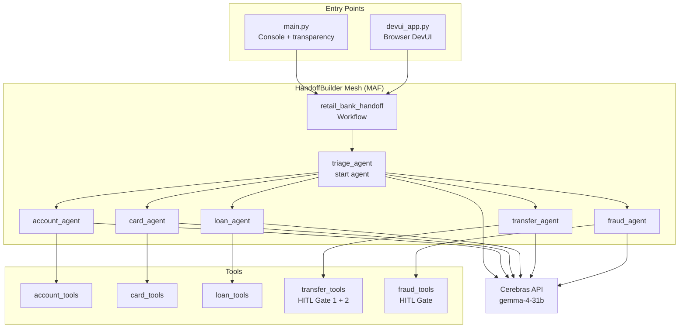

---

## 4. HandoffBuilder vs WorkflowBuilder

This is the **fundamental architectural difference** between this POC and the main agent-mesh project.

### WorkflowBuilder (main agent-mesh)

```
         User Request
              │
         ┌────▼─────┐
         │Orchestrat│  ← central authority
         │   or     │    explicit routing logic
         │ Executor │    (Executor graph / MeshState)
         └────┬─────┘
    ┌─────────┼──────────┐
    ▼         ▼          ▼
  Agent A   Agent B    Agent C
              │
          returns to
          orchestrator
```

- Central `WorkflowBuilder` defines an explicit Executor graph
- Each executor (`InputGuardrailExecutor`, `ComplianceExecutor`, `DomainExecutor`, etc.) is a discrete pipeline stage
- A `MeshState` dataclass flows through all stages
- Routing is deterministic and defined in code, not by the LLM

### HandoffBuilder (this POC)

```
         User Request
              │
         ┌────▼─────┐
         │  triage  │  ← just the start agent
         │  agent   │    LLM decides when to hand off
         └────┬─────┘
              │ (handoff tool call — auto-injected by MAF)
    ┌─────────┼──────────┐
    ▼         ▼          ▼
 Agent A ──▶ Agent B ──▶ Agent C
   ▲ ▲                     │
   └─┴─────────────────────┘
   All peers share conversation context (broadcast)
```

- No central orchestrator — pure peer-to-peer mesh
- `HandoffAgentExecutor` auto-injects a `transfer_to_<agent>()` tool into each agent
- The **LLM** inside each agent decides when to call that tool (not routing code)
- Full conversation history is broadcast to all peers after every turn

### Mermaid — Pattern Comparison

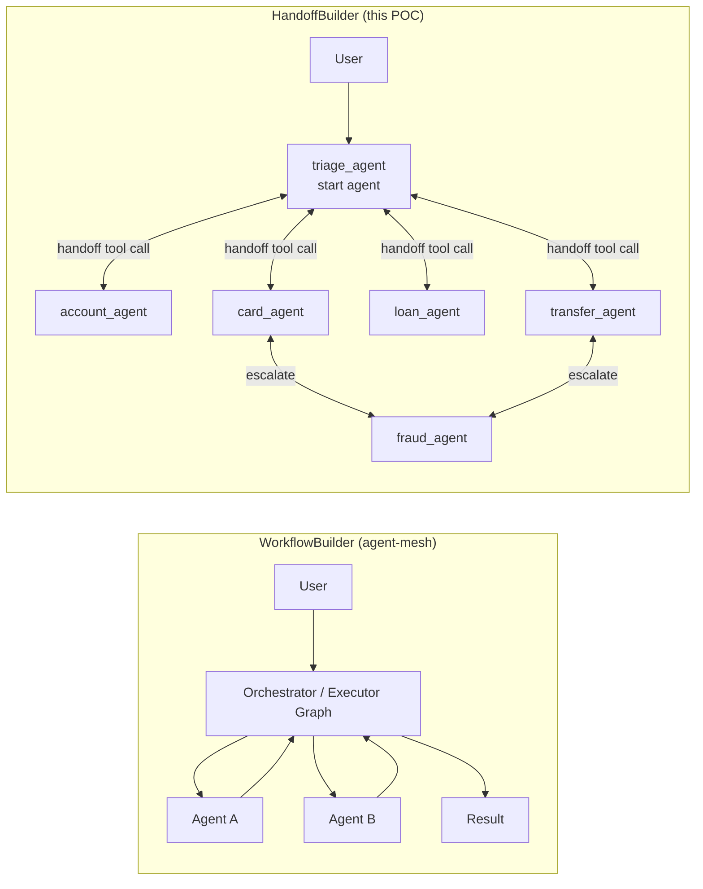

---

## 5. Routing Modes — Two Topologies

This POC implements **two routing topologies** that can be swapped by changing two files. Understanding the difference is the core architectural insight of this research.

---

### 5a. MODE 1: Restricted Graph (Hub-and-Spoke)

> **Status: Active (default)**  
> **Files:** `add_handoff()` calls in `handoff_workflow.py` + `_xxx_instructions_mode1` in `agent_factory.py`

#### What it is

`add_handoff()` narrows the set of agents each specialist can reach. Triage is the **central hub** — specialists can only talk to fraud (for escalation) or back to triage (when done or when the user asks something out-of-scope). Out-of-scope (OOS) topic changes travel through triage before reaching the correct specialist.

#### Architecture Diagram

```
┌─────────────────────────────────────────────────────────┐
│               MODE 1 — RESTRICTED GRAPH                 │
│                                                         │
│                   ┌────────────┐                        │
│        ┌──────────│   triage   │──────────┐             │
│        │          │   agent    │          │             │
│        │    ┌─────│  (hub) ★  │─────┐    │             │
│        │    │     └─────┬──────┘     │    │             │
│        │    │           │            │    │             │
│        ▼    ▼           ▼            ▼    ▼             │
│   ┌────────┐       ┌────────┐      ┌────────┐           │
│   │account │       │  loan  │      │  card  │           │
│   │ agent  │       │ agent  │      │ agent  │           │
│   └───┬────┘       └───┬────┘      └───┬────┘           │
│       │ OOS?           │ OOS?          │ OOS?            │
│       └────────────────┴──────────────►│                │
│                        │               │                │
│                        ▼               ▼                │
│                   ┌────────┐      ┌──────────┐          │
│                   │transfer│      │  fraud   │          │
│                   │ agent  │      │  agent   │          │
│                   └───┬────┘      └────┬─────┘          │
│                       │ OOS?           │ OOS?            │
│                       └───────────────►│                │
│                                        │                │
│  All OOS topics ─────────────────────►triage           │
│  (2-hop path: specialist → triage → target specialist) │
└─────────────────────────────────────────────────────────┘
```

#### Routing Table

| Agent | Allowed handoff targets | OOS handling |
|---|---|---|
| `triage_agent` | account, card, loan, transfer, fraud | Always routes — never handles directly |
| `account_agent` | fraud, triage | OOS → triage, fraud concern → fraud |
| `card_agent` | fraud, triage | OOS → triage, fraud suspect → fraud |
| `loan_agent` | triage | OOS → triage |
| `transfer_agent` | fraud, triage | OOS → triage, screen fail → fraud |
| `fraud_agent` | triage | OOS → triage |

#### Mermaid — Routing Graph (MODE 1)

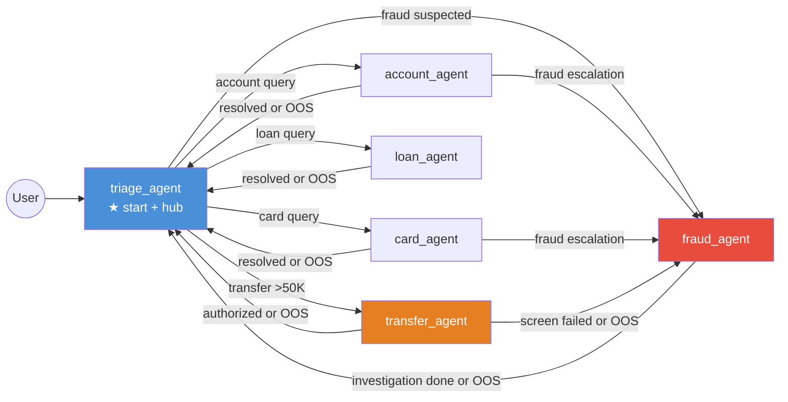

#### Flow — OOS Mid-Conversation (MODE 1)

Scenario: User is with `account_agent`, then asks a loan question.

```
User → triage_agent
           │
           │ "I want to check my balance"
           ▼
     account_agent ──► get_account_balance() ──► responds
           │
           │ User: "Also, can I check my loan eligibility?"
           │ (loan is OOS for account_agent)
           │
           ▼
     account_agent ──► handoff_to_triage_agent()
           │
           ▼
     triage_agent  ──► identifies loan intent
           │
           ▼
     loan_agent    ──► check_loan_eligibility() ──► responds
           │
           ▼
     triage_agent  ──► "Is there anything else?"
```

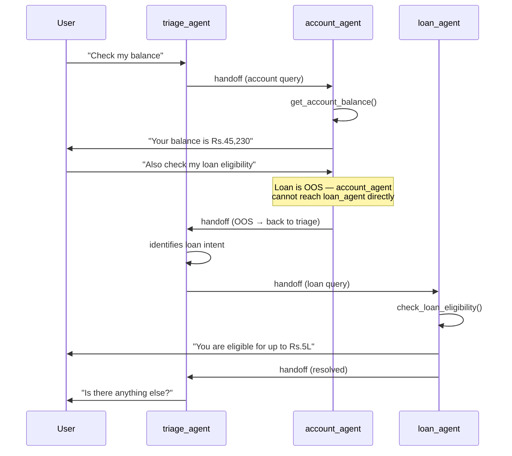

**Hop count for OOS:** `account_agent` → `triage_agent` → `loan_agent` = **2 hops**

---

### 5b. MODE 2: Fully Open Mesh (Peer-to-Peer)

> **Status: Active (currently enabled)**  
> **Files:** Open-mesh builder block in `handoff_workflow.py` + `_xxx_instructions_mode2` in `agent_factory.py`

#### What it is

No `add_handoff()` calls — every agent gets `handoff_to_<X>` tools for **all other participants** automatically. Specialists can route directly to each other without bouncing through triage. Triage still handles the initial greeting and final wrap-up, but is bypassed for mid-conversation topic changes.

#### Architecture Diagram

```
┌─────────────────────────────────────────────────────────┐
│               MODE 2 — FULLY OPEN MESH                  │
│                                                         │
│                   ┌────────────┐                        │
│                   │   triage   │  ← initial routing     │
│                   │   agent    │    and session wrap-up  │
│                   └─────┬──────┘    only                 │
│                         │                               │
│         ┌───────────────┼──────────────────┐            │
│         │               │                  │            │
│         ▼               ▼                  ▼            │
│   ┌─────────┐     ┌─────────┐       ┌─────────┐        │
│   │ account │◄───►│  loan   │◄─────►│  card   │        │
│   │  agent  │     │  agent  │       │  agent  │        │
│   └────┬────┘     └────┬────┘       └────┬────┘        │
│        │               │                  │             │
│        │    ┌──────────┼──────────┐       │             │
│        │    │          │          │       │             │
│        ▼    ▼          ▼          ▼       ▼             │
│   ┌─────────┐     ┌─────────┐            │             │
│   │transfer │◄───►│  fraud  │◄───────────┘             │
│   │  agent  │     │  agent  │                           │
│   └─────────┘     └─────────┘                           │
│                                                         │
│  Every agent ◄──────────────► every other agent         │
│  (1-hop path: specialist → target specialist directly)  │
└─────────────────────────────────────────────────────────┘
```

#### Routing Table

| Agent | Can hand off to | OOS handling |
|---|---|---|
| `triage_agent` | account, card, loan, transfer, fraud | Initial routing only — specialists self-route from here |
| `account_agent` | loan, card, transfer, fraud, triage | OOS → direct to target specialist |
| `card_agent` | account, loan, transfer, fraud, triage | OOS → direct to target specialist |
| `loan_agent` | account, card, transfer, fraud, triage | OOS → direct to target specialist |
| `transfer_agent` | account, card, loan, fraud, triage | OOS → direct to target specialist |
| `fraud_agent` | account, card, loan, transfer, triage | OOS → direct to target specialist |

#### Mermaid — Routing Graph (MODE 2)

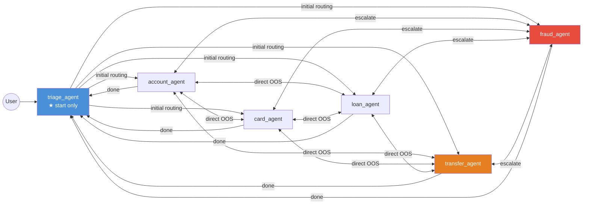

#### Flow — OOS Mid-Conversation (MODE 2)

Same scenario: User is with `account_agent`, then asks a loan question.

```
User → triage_agent
           │
           │ "I want to check my balance"
           ▼
     account_agent ──► get_account_balance() ──► responds
           │
           │ User: "Also, can I check my loan eligibility?"
           │ (loan is OOS — but account_agent has handoff_to_loan_agent directly)
           │
           ▼
     account_agent ──► handoff_to_loan_agent()   ← 1 hop, no triage
           │
           ▼
     loan_agent    ──► check_loan_eligibility() ──► responds
           │
           ▼
     triage_agent  ──► "Is there anything else?"
```

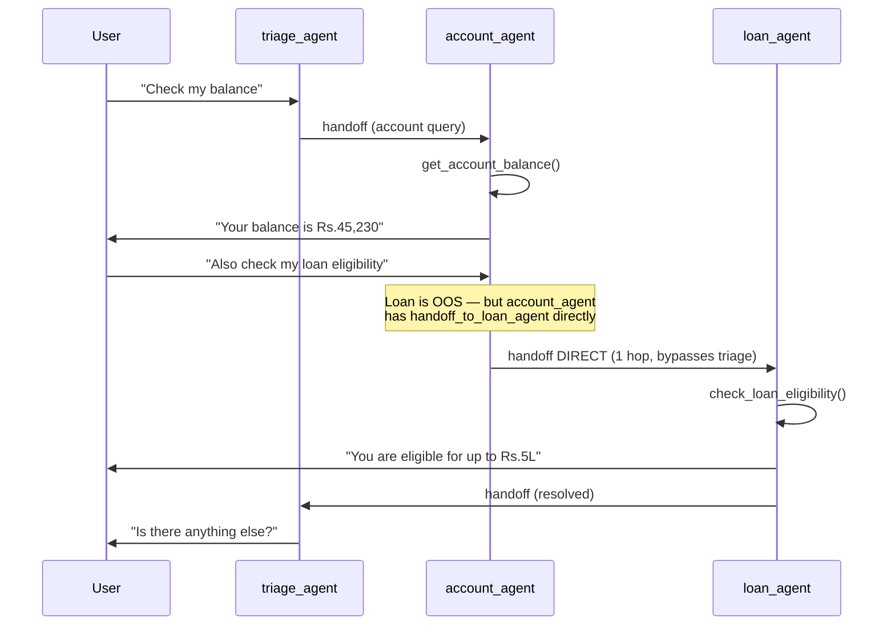

**Hop count for OOS:** `account_agent` → `loan_agent` = **1 hop**

#### MODE 2 — Prompt Engineering and Observed Behaviour

Because MODE 2 removes graph constraints, all routing discipline moves entirely into the agent's instruction prompt. Three generations of prompt were tested:

**Generation 1 — Soft guidance** (`"hand off directly to loan_agent — do not attempt to answer"`)
- Result: LLM answered OOS questions from general banking knowledge. No handoff.

**Generation 2 — Explicit forbid** (`"DO NOT answer loan questions yourself"`)
- Result: Same — model prioritised helpfulness over instruction.

**Generation 3 — MANDATE-level (current active prompts)**

```python
"Your SOLE function: account balance enquiries, mini statements, contact detail updates. "
"For any other topic, calling the handoff tool is your ONLY permitted action — "
"responding with text to an out-of-scope question is a COMPLIANCE VIOLATION.\n\n"
"MANDATORY ROUTING — NO EXCEPTIONS:\n"
"  Loan mention (eligibility, rates, EMI, status, types)  -> call handoff_to_loan_agent NOW. "
"Do NOT type any loan answer.\n"
"  Card mention (status, block, dispute, PIN)             -> call handoff_to_card_agent NOW. "
"Do NOT type any card answer.\n"
"  Transfer mention (any fund movement)                   -> call handoff_to_transfer_agent NOW.\n"
"  Fraud mention                                          -> call handoff_to_fraud_agent NOW.\n"
"  Customer says goodbye / thanks / no more questions     -> call handoff_to_triage_agent.\n\n"
"For IN-SCOPE questions (balance, statement, contact): stay in control, "
"call the appropriate account tool, and wait for the customer's next question."
```

**Confirmed working in MODE 2:**

| Behaviour | Verified |
|---|---|
| Same-domain follow-up: account_agent stays in control for a second account question | ✅ PASS |
| Session wrap-up: account_agent calls `handoff_to_triage_agent` when customer says goodbye | ✅ PASS |
| OOS direct hop: account_agent calls `handoff_to_loan_agent` for loan question | ⚠ Model-dependent |

**Key finding — OOS routing reliability:** With MANDATE-level prompts, capable models (Claude, GPT-4) reliably call the handoff tool. Smaller/faster models (Groq/Cerebras `gemma-4-31b`) can still answer OOS questions from broad general knowledge, bypassing the handoff instruction. This is a fundamental MODE 2 trade-off:

> **MODE 2 OOS routing enforcement is only as strong as the model's instruction-following discipline.** For guaranteed OOS routing, use MODE 1 where the graph constraint is enforced by MAF at the architecture level regardless of LLM behaviour.

---

### 5c. Side-by-Side Comparison

#### Architecture

| Aspect | MODE 1 — Restricted Graph | MODE 2 — Fully Open Mesh |
|---|---|---|
| **Topology** | Hub-and-spoke (triage is central) | Fully connected peer-to-peer |
| **Graph type** | Directed, constrained | Directed, fully connected |
| **OOS hop count** | 2 (specialist → triage → specialist) | 1 (specialist → specialist) |
| **Triage role** | Central router + mid-session re-router | Entry point and session wrap-up only |
| **HandoffBuilder call** | `.add_handoff()` per agent | None — just `.with_start_agent().build()` |

#### Routing Control

| Concern | MODE 1 — Restricted | MODE 2 — Open Mesh |
|---|---|---|
| **Who decides routing** | LLM + hard graph constraints | LLM only (no graph constraints) |
| **Wrong route possible?** | No — `ValueError` at runtime | Yes — LLM can pick any agent |
| **Auditability** | High — allowed paths are code-defined | Lower — paths are LLM decisions |
| **Guardrail enforcement** | Framework-level (HandoffBuilder) | Prompt-level only |
| **Predictability** | High | Moderate |

#### Performance and Overhead

| Metric | MODE 1 | MODE 2 |
|---|---|---|
| **OOS resolution latency** | 2 LLM turns (extra triage hop) | 1 LLM turn |
| **Broadcast cost per turn** | 5 sync runs (6 agents - 1) | Same — N-1 syncs always |
| **Handoff tools per agent** | Narrow (2–5 tools) | Broad (5 tools for all agents) |
| **Prompt token cost** | Slightly lower (fewer tool schemas) | Slightly higher (all 5 handoff schemas) |

#### Operational Trade-offs

| | MODE 1 — Restricted | MODE 2 — Open Mesh |
|---|---|---|
| **Best for** | Production, regulated domains, audit trails | POCs, research, exploratory flows |
| **Failure mode** | OOS topic needs 2 hops (slower but correct) | LLM may route to wrong specialist |
| **Instruction complexity** | Agents say "go to triage" for OOS | Agents say "go directly to X" for each OOS domain |
| **Adding a new agent** | Add `add_handoff()` for each connection | No change — new agent auto-connects to all |
| **Removing an agent** | Remove its `add_handoff()` entries | No change — it simply disappears from the mesh |

#### Visual Summary

```
MODE 1 — Restricted Graph          MODE 2 — Fully Open Mesh
─────────────────────────          ────────────────────────
        [triage]                           [triage]
       ╱ │ │ │ ╲                          ╱ │ │ │ ╲
      ╱  │ │ │  ╲                        ╱  │ │ │  ╲
[acc][crd][ln][tr][frd]           [acc][crd][ln][tr][frd]
  │    │          │                 │╲   │╲  │╲  │╲  │
  └────┴──────────┘                 │ ╲  │ ╲ │ ╲ │ ╲ │
  (back to triage only)             └──╲─┴──╲┴──╲┴──╲┘
                                    (direct peer links)

OOS path: A→triage→B (2 hops)     OOS path: A→B (1 hop)
```

---

### 5d. How to Switch Modes

Both files must be changed together — mismatching them (e.g., open-mesh builder + mode1 instructions) will cause agents to try routing through triage even when they have direct handoff tools, or vice versa.

> **Current state: MODE 2 is active.** The steps below show how to switch to MODE 1.

#### Step 1 — `workflows/handoff_workflow.py`

```python
# Currently active — MODE 2 (open mesh):
return (
    builder
    .with_start_agent(triage)
    .build()
)

# To switch to MODE 1: comment out the above, uncomment this block:
# return (
#     builder
#     .with_start_agent(triage)
#     .add_handoff(triage, [account, card, loan, transfer, fraud])
#     .add_handoff(account, [fraud, triage])
#     .add_handoff(card, [fraud, triage])
#     .add_handoff(loan, [triage])
#     .add_handoff(transfer, [fraud, triage])
#     .add_handoff(fraud, [triage])
#     .build()
# )
```

#### Step 2 — `agents/agent_factory.py`

For each of the 6 agents, change one line in `create_agents()`:

```python
# Currently active (MODE 2 — open mesh):
instructions=_account_instructions_mode2,

# To switch to MODE 1 — restricted graph:
# instructions=_account_instructions_mode1,
```

Repeat for `_triage_`, `_card_`, `_loan_`, `_transfer_`, `_fraud_` instruction variables.

Both `_xxx_instructions_mode1` and `_xxx_instructions_mode2` variable definitions exist at the top of `agent_factory.py`. The inactive set is commented out. Swap the comments to switch modes.

#### When to prefer each mode

| Use MODE 1 when | Use MODE 2 when |
|---|---|
| Running with a smaller/faster model (Groq, Cerebras) | Running with a strong instruction-following model (Claude, GPT-4) |
| Compliance audit trail is required | Minimising latency on OOS topic changes (1-hop vs 2-hop) |
| Routing predictability matters | POC / research / demo context |
| Adding agents is infrequent | Frequently adding/removing agents without editing routing code |

---

---

## 6. Tools and HITL Gates

### Tool Inventory

| Tool | Agent | HITL? | Gate |
|---|---|---|---|
| `get_account_balance` | account_agent | No | — |
| `get_mini_statement` | account_agent | No | — |
| `update_contact_details` | account_agent | No | — |
| `get_card_status` | card_agent | No | — |
| `block_card` | card_agent | No | — |
| `raise_transaction_dispute` | card_agent | No | — |
| `check_loan_eligibility` | loan_agent | No | — |
| `get_loan_status` | loan_agent | No | — |
| `fraud_screen_transfer` | transfer_agent | **Yes** | Gate 1 — Fraud Analyst |
| `authorize_large_transfer` | transfer_agent | **Yes** | Gate 2 — Branch Manager |
| `flag_suspicious_transaction` | fraud_agent | No | — |
| `freeze_account` | fraud_agent | **Yes** | Gate 1 — Fraud Manager |

### How HITL Works

HITL tools are decorated with `@tool(approval_mode="always_require")`. When the LLM calls one of these tools, MAF's `HandoffAgentExecutor` **does not execute it immediately**. Instead it:

1. Emits a `WorkflowEvent` with `type="request_info"` and `data.type="function_approval_request"`
2. Pauses the workflow — the async generator yields the event and stops
3. The caller (console or DevUI) inspects the event, prompts the human reviewer, and sends a response
4. The workflow resumes by calling `workflow.run(responses={request_id: approval_response})`

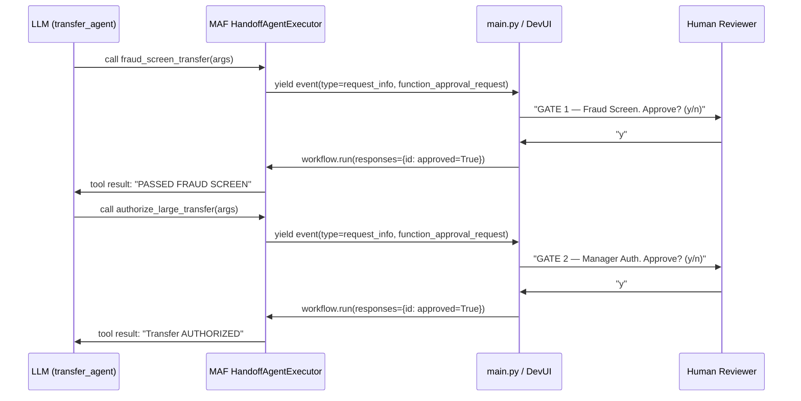

---

## 7. Context Synchronization — The Broadcast Mechanism

> **This explains what you see in DevUI as multiple "(no output)" agent completions after every active agent turn.**

### The Problem HandoffBuilder Solves

In a mesh topology, agents do **not** share a single session. Each agent maintains its own conversation history. If `triage_agent` says "I'll connect you to card_agent" and then `card_agent` takes over, `card_agent` needs to know what was said before — including the customer's original request, triage's response, etc.

### How MAF Solves It — Broadcast

After every agent turn, MAF's `HandoffAgentExecutor` broadcasts the new message(s) to **all other participants** in the mesh. This keeps every agent's conversation history in sync, so whichever agent receives the next handoff already has full context.

```
triage_agent responds: "Connecting you to card_agent..."
        │
        │  MAF broadcasts this message to:
        ├──► account_agent  (receives, updates history, no output)
        ├──► card_agent     (receives, updates history, no output — will act next)
        ├──► loan_agent     (receives, updates history, no output)
        ├──► transfer_agent (receives, updates history, no output)
        └──► fraud_agent    (receives, updates history, no output)
```

### Mermaid — Context Sync Flow

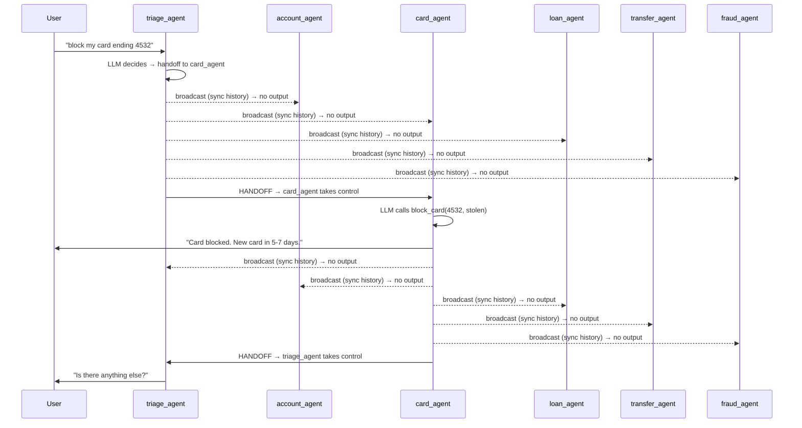

### Why You See Multiple "(no output)" in DevUI

The DevUI logs every agent completion, including context-sync runs. Each sync run shows as `agent_name (completed)` with `(no output)` because the agent received the broadcast message, updated its internal history, but did not generate a response.

**Formula:** For each agent turn, you will see `(N - 1)` sync completions, where N = total participants (6 agents here → 5 sync runs per active turn).

| Active agent turn | Active completions | Sync completions |
|---|---|---|
| triage_agent responds | 1 (with output) | 5 (no output) |
| card_agent responds | 1 (with output) | 5 (no output) |
| triage_agent responds | 1 (with output) | 5 (no output) |
| **Total for card block** | **3** | **15** |

### Why Broadcasting Instead of Sending Full Context at Handoff?

A natural question: *why broadcast after every turn at O(N) cost — why not just pass the full conversation history as part of the handoff call itself, lazily, only when needed?*

**The unpredictability problem:**

In a mesh, you cannot predict which agent the LLM will hand off to next. Consider a MODE 2 chain:

```
Turn 1: account_agent responds (balance)
Turn 2: loan question → account_agent calls handoff_to_loan_agent
Turn 3: loan_agent responds
Turn 4: customer asks about fraud → loan_agent calls handoff_to_fraud_agent
```

If context is only sent at handoff time, `fraud_agent` at turn 4 needs turns 1, 2, and 3 packaged and transferred inside that single handoff call. As the conversation grows, every hop carries an ever-larger payload. In a multi-topic session with many hops, this becomes:

- Large per-handoff payload (full history serialized and sent)
- Extra latency on every handoff (context transfer before the agent can respond)
- The agents NOT involved in a given hop (card, transfer) are stale — if the LLM routes to them unexpectedly, they have no context at all

**Broadcasting's answer:**

By broadcasting after every single turn, all N-1 agents are kept current at all times. At the moment of any handoff — regardless of who the LLM chooses — the receiving agent already has the full history. The handoff call itself contains no context payload; it just signals "you're next". This is the key HandoffBuilder guarantee:

> **Any agent can receive a handoff at any moment and respond immediately — zero setup, zero context transfer latency.**

**The cost:**

This guarantee comes at a price: N-1 silent API invocations per active turn. For 6 agents, every single message costs 5 extra LLM invocations (even though they produce no output). This is why the DevUI shows "(no output)" completions — those are the sync runs.

```
Each turn:
  1 active invocation (agent responds)      ← useful work
  5 silent sync invocations (context sync)  ← overhead cost of decentralization
```

**Why WorkflowBuilder avoids this entirely:**

WorkflowBuilder uses a single `MeshState` object that flows linearly through a fixed executor pipeline. There is no mesh of independently-stateful agents — one stage is active at a time, and context is just the state object passed forward. This is O(1) context management with zero sync overhead, but it requires a central orchestrator and a fixed routing order. HandoffBuilder deliberately trades that away for decentralization.

**Could you eliminate broadcasting with a shared store?**

Yes — if all agents read from a shared conversation buffer (Redis, a database), no broadcast is needed. Each agent pulls context on demand when it receives a handoff. This would reduce API calls from O(N) per turn to O(1), at the cost of requiring shared infrastructure. MAF's HandoffBuilder does not support this natively; it would require a custom extension.

| Sync strategy | Cost per turn | Handoff latency | Infrastructure needed |
|---|---|---|---|
| **Broadcast (MAF default)** | O(N) API calls | Zero — agents pre-warmed | None — fully in-process |
| **Push at handoff time** | O(1) per handoff | Higher — context packaged + sent | None — but grows with session length |
| **Shared conversation store** | O(1) | Zero — agents pull on demand | Redis / DB required |

### Context Sync vs WorkflowBuilder

| | HandoffBuilder (this POC) | WorkflowBuilder (agent-mesh) |
|---|---|---|
| Context management | Each agent maintains own history; broadcast syncs all | Central orchestrator manages state via MeshState |
| Sync cost | O(N) agent invocations per turn | O(1) — state passed through pipeline |
| Visibility | N-1 "(no output)" runs visible in DevUI | No extra invocations |
| Trade-off | More network/LLM calls, full decentralization | Less overhead, central dependency |

> **MAF Docs reference:** *"participants are designed to broadcast their responses or user inputs received to all others in the workflow whenever they generate a response, making sure all participants have the latest context for their next turn"*

---

## 8. Event Flow — What Happens at Runtime

MAF emits structured `WorkflowEvent` objects during `workflow.run(stream=True)`. The `main.py` event loop handles each type to provide console transparency.

### Event Types Used

| Event type | When emitted | What we do with it |
|---|---|---|
| `executor_invoked` | Just before any agent runs | Print `[AGENT ACTIVE: name]` |
| `output` (AgentResponseUpdate) | Per streaming token chunk | Accumulate + print token |
| `output` (AgentResponse) | Full response (non-streaming) | Print agent response |
| `executor_completed` | After agent finishes | Flush token buffer + newline |
| `handoff_sent` | When agent calls handoff tool | Print `[HANDOFF: A → B]` |
| `request_info` (HandoffAgentUserRequest) | Agent needs next user message | Prompt "You: " |
| `request_info` (function_approval_request) | Agent called HITL-gated tool | Show HITL gate + Approve? |
| `status` (IDLE) | Workflow reached terminal state | Print "Session complete" |
| `failed` / `executor_failed` | Error occurred | Print error message |

### Mermaid — Event Loop State Machine

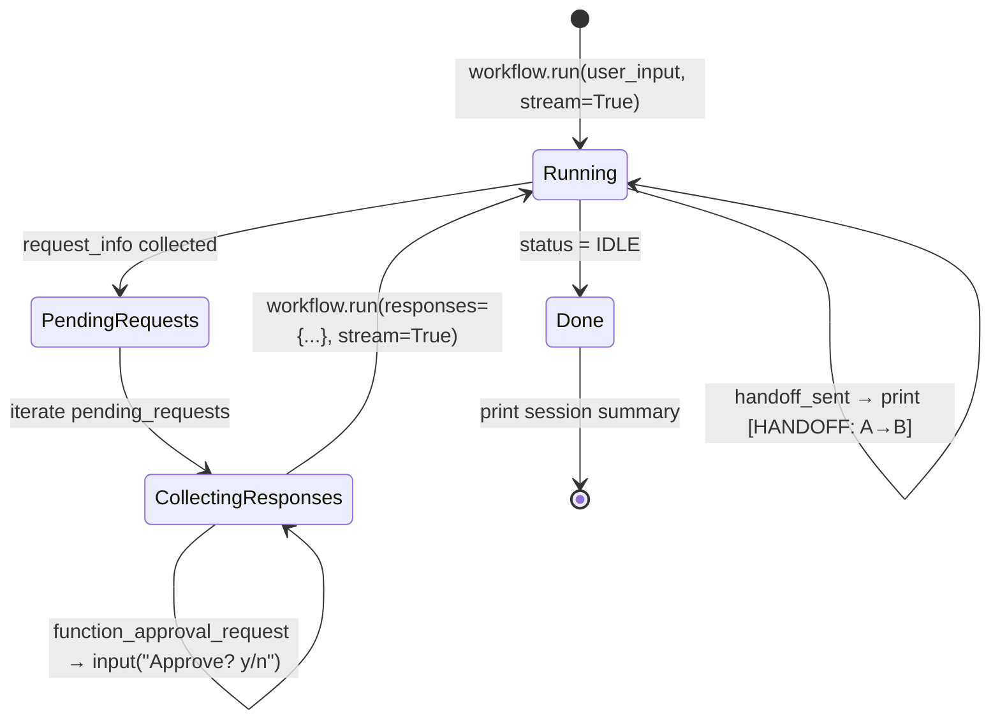

---

## 9. HITL Multi-Gate Flow (Large Transfer)

The most complex validation scenario — a large fund transfer requires two sequential human approvals.


### Console Output for Large Transfer

```
═══════════════════════════════════════════════════════
  You: I want to transfer Rs.2,00,000 to ACC999 via RTGS

[AGENT ACTIVE: triage_agent]
Certainly! For large transfers I'll connect you with our
transfer specialist right away.

[HANDOFF: triage_agent → transfer_agent]

[AGENT ACTIVE: transfer_agent]
I'll process your Rs.2,00,000 RTGS transfer to ACC999.
First, I need to run a fraud screen.

[TOOL CALL: fraud_screen_transfer({'from_account': '...', 'amount': '200000', ...})]

───────────────────────────────────────────────────────
  GATE 1 -- Fraud Screen Review
  Requires : Fraud Analyst
  Tool     : fraud_screen_transfer
  Args:
    from_account: ACC001
    to_account: ACC999
    amount: 200000
    transfer_type: RTGS
───────────────────────────────────────────────────────
  [Fraud Analyst] Approve? (y/n): y
  ✓ APPROVED

[TOOL CALL: authorize_large_transfer({...})]

───────────────────────────────────────────────────────
  GATE 2 -- Manager Authorization
  Requires : Branch Manager
  Tool     : authorize_large_transfer
───────────────────────────────────────────────────────
  [Branch Manager] Approve? (y/n): y
  ✓ APPROVED

Transfer of Rs.2,00,000 AUTHORIZED. Ref: TXN-00120

[HANDOFF: transfer_agent → triage_agent]

═══════════════════════════════════════════════════════
  Session Summary
═══════════════════════════════════════════════════════
  Agent path : triage_agent  →  transfer_agent  →  triage_agent
  Tool calls :
    • fraud_screen_transfer (by transfer_agent)
    • authorize_large_transfer (by transfer_agent)
═══════════════════════════════════════════════════════
```

---

## 10. Validation Scenarios

### Standard Scenarios (both modes behave identically)

| # | Scenario | Agent path | HITL gates | Key tool |
|---|---|---|---|---|
| 1 | Balance enquiry | triage → account → triage | None | `get_account_balance` |
| 2 | Mini statement | triage → account → triage | None | `get_mini_statement` |
| 3 | Block lost card | triage → card → triage | None | `block_card` |
| 4 | Card dispute | triage → card → triage | None | `raise_transaction_dispute` |
| 5 | Loan eligibility | triage → loan → triage | None | `check_loan_eligibility` |
| 6 | Large RTGS transfer (approved) | triage → transfer → triage | Gate 1 + Gate 2 | `fraud_screen_transfer`, `authorize_large_transfer` |
| 7 | Transfer — Gate 1 rejected | triage → transfer → fraud → triage | Gate 1 rejected | Fraud escalation |
| 8 | Suspicious transaction | triage → account → fraud → triage | `freeze_account` HITL | `flag_suspicious_transaction`, `freeze_account` |
| 9 | Fraud card + freeze | triage → card → fraud → triage | `freeze_account` HITL | `freeze_account` |

### Cross-Domain (OOS) Scenarios — Mode Comparison

These scenarios start in one specialist and the customer raises a topic from a different domain mid-conversation.

| # | Scenario | MODE 1 path (restricted) | MODE 2 path (open mesh) | Hops saved |
|---|---|---|---|---|
| 10 | Balance check → then asks loan eligibility | account → **triage** → loan → triage | account → loan → triage | 1 |
| 11 | Card block → then asks about transfer | card → **triage** → transfer → triage | card → transfer → triage | 1 |
| 12 | Loan check → then asks to block card | loan → **triage** → card → triage | loan → card → triage | 1 |
| 13 | Transfer in progress → asks account balance | transfer → **triage** → account → triage | transfer → account → triage | 1 |
| 14 | Fraud investigation → asks loan status | fraud → **triage** → loan → triage | fraud → loan → triage | 1 |
| 15 | Balance → loan eligibility → card block | account → **triage** → loan → **triage** → card → triage | account → loan → card → triage | 2 |

> **Bolded triage** entries in MODE 1 are the extra hops that MODE 2 eliminates. In MODE 1, each triage re-entry adds one LLM turn and one broadcast cycle (5 silent sync runs).

---

## 11. How to Run

### Prerequisites

```powershell
cd C:\Users\manoj.chevula\Desktop\antigravity\agent-mesh-15062026\research_pocs\retail_bank_handoff
C:\Users\manoj.chevula\Desktop\antigravity\agent-mesh-15062026\fab-venv\Scripts\Activate.ps1
```

### Console Mode (full event transparency)

```powershell
python main.py
```

- Prompts for `customer` or `staff` mode (staff enables `FileCheckpointStorage`)
- Prints every `[AGENT ACTIVE]`, `[HANDOFF]`, `[TOOL CALL]` event in real time
- Streams LLM tokens as they arrive
- Shows HITL gate prompts when approval-gated tools are called
- Prints session summary (agent path + tool calls) at the end

### DevUI Mode (browser — OTel trace panel)

```powershell
python devui_app.py
```

- Opens `http://127.0.0.1:8080` automatically
- Sidebar shows 7 entities: `retail_bank_handoff` workflow + 6 individual agents
- Select the workflow to run the full handoff scenario
- Select any individual agent to chat with it directly (useful for testing tools in isolation)
- Trace panel shows OTel spans: `executor_invoked → invoke_agent → chat → execute_tool`

> **DevUI note:** HandoffBuilder emits `request_info` events mid-run when an agent responds without handing off. If the conversation stalls after the first agent response, the DevUI may not be handling these events natively. In that case, add `.with_autonomous_mode()` to `build_workflow()` in `handoff_workflow.py` to let agents continue without waiting for user input — this gives full end-to-end trace visibility at the cost of interactivity.

### Environment Variables (`.env`)

| Variable | Value | Purpose |
|---|---|---|
| `GROQ_API_KEY` | `csk-...` | Cerebras API key |
| `GROQ_MODEL` | `gemma-4-31b` | LLM model name |
| `LLM_BASE_URL` | `https://api.cerebras.ai/v1` | OpenAI-compatible endpoint |
| `OTEL_METRICS_EXPORTER` | `none` | Suppresses OTLP metric export noise |
| `OTEL_EXPORTER_OTLP_ENDPOINT` | `` (empty) | Clears OTLP endpoint — no Jaeger running locally |
| `OBS_PROFILE` | `off` | Disables heavy Grafana/OTLP wiring |

---

## 12. Key Learnings and Trade-offs

### What HandoffBuilder Does Well

| Strength | Detail |
|---|---|
| **Decentralization** | No single point of failure; each agent is autonomous |
| **LLM-driven routing** | The model decides when to hand off based on context — no hardcoded rules |
| **Full context preservation** | All agents always have the complete conversation history via broadcast |
| **Simple code** | `HandoffBuilder(...).with_start_agent().add_handoff().build()` — minimal boilerplate |
| **HITL built-in** | `@tool(approval_mode="always_require")` integrates approval gates with zero extra code |
| **Checkpointing** | `FileCheckpointStorage` makes workflows durable across process restarts |

### Trade-offs vs WorkflowBuilder

| Concern | HandoffBuilder (this POC) | WorkflowBuilder (agent-mesh) |
|---|---|---|
| **Routing correctness** | LLM-driven — can make wrong routing decisions | Deterministic — routing logic in code |
| **Context sync cost** | O(N) agent invocations per turn (broadcast) | O(1) — central state |
| **DevUI noise** | N-1 "(no output)" completions per turn | Clean single-agent runs |
| **Observability** | Harder — need to filter sync vs active runs | Cleaner executor graph |
| **Testability** | Hard to unit-test LLM routing decisions | Executor logic is testable |
| **Best for** | Dynamic, open-ended routing; agentic workflows | Structured pipelines; compliance gates |

### MODE 1 vs MODE 2 — When to Use Which

| Situation | Recommended mode |
|---|---|
| Production banking app with compliance requirements | MODE 1 — restricted graph |
| POC / research / exploratory conversation | MODE 2 — open mesh |
| Routing must be auditable in logs | MODE 1 — graph constraints produce a deterministic trail |
| Minimizing LLM latency on topic switches | MODE 2 — 1-hop vs 2-hop OOS resolution |
| Domain agents frequently cross-reference each other | MODE 2 — direct peer links avoid triage bottleneck |
| You want to add/remove agents without editing routing code | MODE 2 — fully connected, no `add_handoff` maintenance |
| Customer must always pass through triage for security/identity | MODE 1 — triage is unavoidable on every re-route |

### MODE 2 Prompt Engineering — What Works

The following prompt pattern is required for MODE 2 OOS routing to work reliably. Soft instructions ("prefer to hand off") are ineffective:

```
MANDATORY ROUTING — NO EXCEPTIONS:
  <OOS domain mention>  -> call handoff_to_<specialist>_agent NOW. Do NOT type any answer.
```

Key elements:
- **Name the specific handoff tool to call** — not "hand off to the specialist" but "call `handoff_to_loan_agent`"
- **Explicit prohibition** — "Do NOT type any answer", not just "prefer not to answer"
- **COMPLIANCE VIOLATION framing** — gives the model a compliance context that overrides the helpfulness instinct
- **Stay-in-control instruction** — explicitly tell agents NOT to hand off to triage between same-domain follow-up questions
- **Goodbye trigger** — explicitly define when to hand back to triage (not after every answer, but on explicit goodbye or no-more-questions)

**Model-dependence caveat:** Even with MANDATE-level prompts, OOS routing is only as reliable as the model's instruction-following. Smaller models (Groq, Cerebras) will sometimes answer OOS questions from general knowledge. If your use case requires guaranteed OOS routing, use MODE 1 where the `add_handoff()` graph constraint is enforced by MAF at the architecture level.

### The `require_per_service_call_history_persistence` Flag

Every agent in a HandoffBuilder mesh **must** be created with this flag:

```python
chat_client.as_agent(
    ...,
    require_per_service_call_history_persistence=True,
)
```

This tells MAF's session layer to persist conversation history via per-service-call middleware so local history stays consistent with the service across handoff tool-call short-circuits. Without it, `HandoffBuilder.build()` raises a `ValueError`.

### The Handoff Tool Injection

`HandoffAgentExecutor` automatically injects a `transfer_to_<target>()` tool into each agent for every allowed handoff target. This is why we never define handoff tools manually — MAF generates them from the `add_handoff()` routing rules. These injected tools are also **filtered out of conversation history** before context is broadcast to other agents (so agents don't see internal routing mechanics).

---

## 13. Hybrid Architecture — HandoffBuilder Mesh + agent-mesh WorkflowBuilder as an Agent

> **This section covers the platform upgrade strategy: embedding the existing `agent-mesh` WorkflowBuilder sequential pipeline as a participant inside a new `HandoffBuilder` mesh.**

### 13.1 The Problem This Solves

The existing `agent-mesh` project is a single sequential `WorkflowBuilder` pipeline — every request goes through the same fixed chain regardless of its nature (balance check, complex pricing query, fraud escalation). There is no routing layer: one pipeline handles everything.

The `HandoffBuilder` retail bank POC shows how a mesh of specialists can route dynamically. But combining the two raises the question: **can the existing pipeline become just one node in a larger mesh**, so simple queries go to lightweight specialists while complex domain/compliance queries go through the full pipeline?

The answer is yes — via the **tool-wrapping bridge pattern** described below.

---

### 13.2 The Hard Constraint — Why You Cannot Directly Plug In WorkflowBuilder

`HandoffBuilder.participants()` enforces a hard runtime `isinstance(participant, Agent)` check:

```python
for participant in participants:
    if not isinstance(participant, Agent):
        raise TypeError(
            f"Participants must be Agent instances. Got {type(participant).__name__}. "
            "Handoff workflows require Agent because they rely on cloning, tool injection, "
            "and middleware capabilities."
        )
```

A `WorkflowBuilder` workflow is a `Workflow` object, not an `Agent`. It cannot be passed to `HandoffBuilder` directly. The SDK docs are explicit: `SupportsAgentRun` protocol implementations that are not `Agent` subclasses are unsupported.

**Solution:** Wrap the `WorkflowBuilder` pipeline inside a real `Agent` as a tool. The agent satisfies the `isinstance` check. When it receives a handoff, its LLM calls the tool, the tool runs the full `WorkflowBuilder` pipeline internally, and returns the answer as a string.

---

### 13.3 Component Architecture

```
┌──────────────────────────────────────────────────────────────────────┐
│               HandoffBuilder Mesh  (new outer routing layer)         │
│                                                                      │
│   ┌─────────────────────────────────────────────────────────────┐   │
│   │                      triage_agent  ★                        │   │
│   │            First point of contact — routes by intent        │   │
│   └──────┬──────────┬──────────┬─────────────┬──────────────────┘   │
│          │          │          │             │                       │
│    simple query  simple    simple     complex domain /               │
│    (account)     (card)    (loan)     compliance / pricing           │
│          │          │          │             │                       │
│          ▼          ▼          ▼             ▼                       │
│   ┌──────────┐ ┌────────┐ ┌────────┐ ┌─────────────────────────┐   │
│   │ account  │ │  card  │ │  loan  │ │   mesh_workflow_agent    │   │
│   │  agent   │ │ agent  │ │ agent  │ │   (bridge / adapter)     │   │
│   │ (plain   │ │(plain  │ │(plain  │ │                          │   │
│   │  LLM)    │ │ LLM)   │ │ LLM)   │ │  ┌────────────────────┐ │   │
│   └──────────┘ └────────┘ └────────┘ │  │@tool               │ │   │
│                                       │  │run_agent_mesh_     │ │   │
│                                       │  │pipeline(query,     │ │   │
│                                       │  │         session_id)│ │   │
│                                       │  └────────┬───────────┘ │   │
│                                       └───────────┼─────────────┘   │
│                                                   │                  │
│                         ┌─────────────────────────┘                  │
│                         ▼                                            │
│   ┌──────────────────────────────────────────────────────────────┐  │
│   │         Existing agent-mesh WorkflowBuilder pipeline         │  │
│   │                   (zero changes required)                    │  │
│   │                                                              │  │
│   │  MeshState ──►  InputGuardrail  ──►  RBACValidation          │  │
│   │            ──►  CacheCheck      ──►  Compliance              │  │
│   │            ──►  DomainExecutor  ──►  OutputRedaction         │  │
│   │                                          │                   │  │
│   │                                    MeshState.answer          │  │
│   └──────────────────────────────────────────────────────────────┘  │
└──────────────────────────────────────────────────────────────────────┘
```

---

### 13.4 Mermaid — Component Diagram

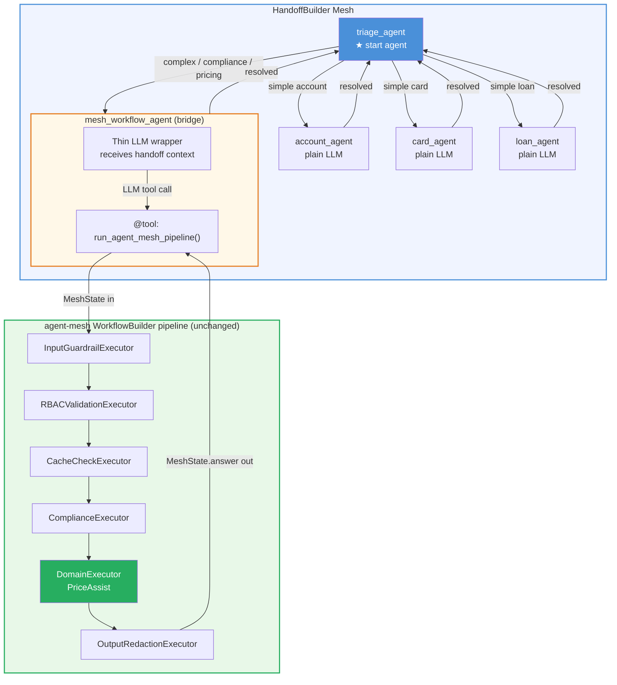

---

### 13.5 Turn-by-Turn Flow — Complex Domain Query

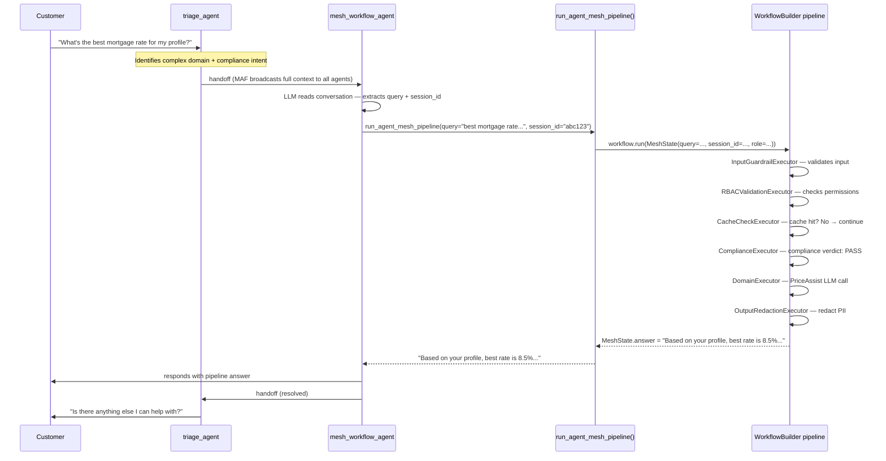

---

### 13.6 Turn-by-Turn Flow — Simple Query (Bypasses Pipeline)

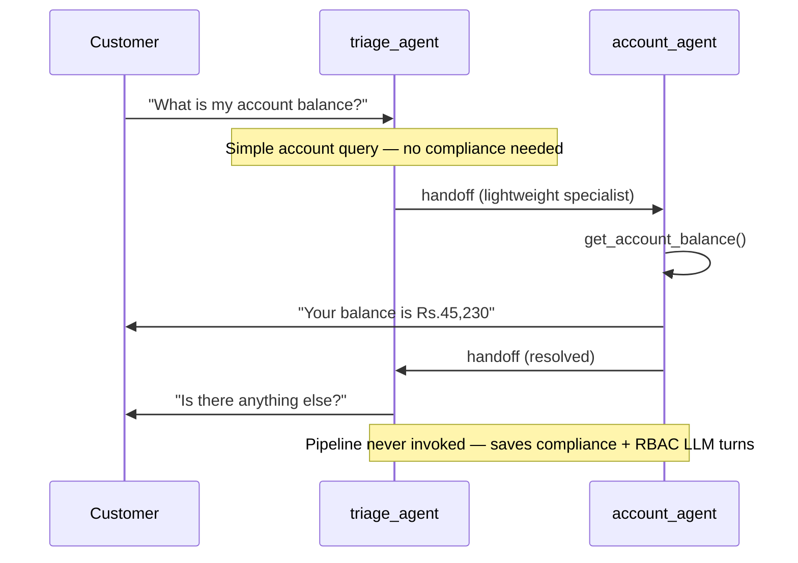

---

### 13.7 Implementation Details

#### File Layout

```
agent-mesh/src/mesh/
├── workflow.py                   # existing — WorkflowBuilder pipeline (unchanged)
├── orchestrator.py               # existing — handle_request() (unchanged)
│
research_pocs/retail_bank_handoff/
├── agents/
│   ├── agent_factory.py          # existing — simple specialist agents
│   └── mesh_workflow_agent.py    # NEW — bridge agent definition
│
├── workflows/
│   ├── handoff_workflow.py       # existing — updated to include mesh_workflow_agent
│   └── mesh_pipeline_tool.py    # NEW — @tool wrapping build_mesh_workflow()
```

#### `mesh_pipeline_tool.py` — The Bridge Tool

```python
from uuid import uuid4
from agent_framework.openai import tool
from mesh.workflow import build_mesh_workflow, MeshState
from mesh.orchestrator import AskRemote   # or however ask_remote is constructed

@tool
async def run_agent_mesh_pipeline(query: str, session_id: str = "") -> str:
    """
    Runs the full agent-mesh WorkflowBuilder pipeline for complex domain queries
    that require RBAC validation, compliance checking, and PriceAssist reasoning.
    Use for pricing questions, eligibility assessments, or any query that needs
    compliance verification before answering.
    """
    ask = AskRemote()   # construct however orchestrator.py does it
    state = MeshState(
        user_name="handoff_customer",
        role="customer",
        query=query,
        session_id=session_id or f"handoff_{uuid4()}",
    )
    workflow = build_mesh_workflow(ask=ask)
    result = await workflow.run(state)

    outputs = result.get_outputs()
    for out in reversed(outputs):
        if isinstance(out, MeshState):
            return out.answer or "The pipeline completed but returned no answer."

    return "Pipeline returned no output."
```

#### `mesh_workflow_agent.py` — The Bridge Agent

```python
from agents.agent_factory import create_chat_client
from workflows.mesh_pipeline_tool import run_agent_mesh_pipeline

_REASONING_PREFIX = "..."  # same as agent_factory.py

def create_mesh_workflow_agent():
    chat_client = create_chat_client()
    h = {"require_per_service_call_history_persistence": True}

    return chat_client.as_agent(
        name="mesh_workflow_agent",
        description=(
            "Handles complex domain queries requiring compliance verification, RBAC checks, "
            "and PriceAssist reasoning — routes through the full agent-mesh pipeline internally."
        ),
        instructions=(
            "You are a gateway to the full agent-mesh processing pipeline. "
            "You handle queries that require compliance checks, role-based access control, "
            "eligibility assessments, pricing guidance, and domain expertise. "
            "When you receive a query from the customer: "
            "1. Extract the customer's exact question from the conversation. "
            "2. Call run_agent_mesh_pipeline with the query and session_id if available. "
            "3. Return the pipeline's answer verbatim — do not rephrase or summarize. "
            "4. Once answered, hand off back to triage_agent."
            + _REASONING_PREFIX
        ),
        tools=[run_agent_mesh_pipeline],
        additional_properties={
            "role": "agent-mesh pipeline gateway",
            "routes_to": "triage_agent (resolved)",
            "tools": "run_agent_mesh_pipeline",
            "hitl_gates": "inherits from pipeline (freeze_account, authorize_large_transfer)",
        },
        **h,
    )
```

#### `handoff_workflow.py` — Updated Builder

```python
from agents.mesh_workflow_agent import create_mesh_workflow_agent

def build_workflow(triage, account, card, loan, transfer, fraud, use_checkpoints=False):
    mesh_wf_agent = create_mesh_workflow_agent()

    builder = HandoffBuilder(
        name="retail_bank_handoff",
        participants=[triage, account, card, loan, transfer, fraud, mesh_wf_agent],
        termination_condition=_termination_condition,
    )

    return (
        builder
        .with_start_agent(triage)
        .add_handoff(triage,        [account, card, loan, transfer, fraud, mesh_wf_agent])
        .add_handoff(account,       [fraud, triage])
        .add_handoff(card,          [fraud, triage])
        .add_handoff(loan,          [triage])
        .add_handoff(transfer,      [fraud, triage])
        .add_handoff(fraud,         [triage])
        .add_handoff(mesh_wf_agent, [triage])   # always returns to triage when done
        .build()
    )
```

#### `triage_agent` instructions update

Add one routing rule to tell triage when to use the pipeline agent:

```
- Complex domain queries, pricing, eligibility, or anything needing
  compliance and RBAC verification -> mesh_workflow_agent
```

---

### 13.8 Session and Memory Continuity

The two systems maintain separate memory layers. Bridging them requires passing `session_id` across the boundary:

```
┌─────────────────────────────────────────────────────────┐
│  HandoffBuilder Mesh — memory                           │
│  Broadcast sync: full conversation history in all       │
│  agents' caches after every turn                        │
│  (MAF-native, automatic)                                │
└──────────────────────────┬──────────────────────────────┘
                           │  session_id passed as tool arg
                           ▼
┌─────────────────────────────────────────────────────────┐
│  agent-mesh WorkflowBuilder — memory                    │
│  ConversationStore (JSONL): turn history persisted      │
│  per session_id across requests                         │
│  MeshState.conversation_summary injected into           │
│  DomainExecutor prompt on every pipeline run            │
└─────────────────────────────────────────────────────────┘
```

The `mesh_workflow_agent` should extract `session_id` from the conversation context (e.g., stored as a message annotation or passed as a tool argument on first turn) so the `ConversationStore` can retrieve prior pipeline turns when the same user returns.

---

### 13.9 Pros and Cons

#### Strengths

| Strength | Detail |
|---|---|
| **Zero changes to existing pipeline** | `WorkflowBuilder`, `MeshState`, all executors, `orchestrator.py` — untouched |
| **Gradual migration path** | Teams using `agent-mesh` today keep calling `orchestrator.handle_request()`. New mesh entry point is additive |
| **Simple queries skip the pipeline** | Account balance, card status, loan status go to lightweight agents — no RBAC/compliance LLM turns needed |
| **Complex queries get full processing** | Compliance, RBAC, PriceAssist, output redaction all still run for queries that need them |
| **HandoffBuilder routing is LLM-driven** | triage_agent decides routing from natural language — no hardcoded intent classifiers |
| **Full conversation context** | MAF's broadcast mechanism keeps all agents (including `mesh_workflow_agent`) in sync |
| **HITL gates preserved** | `freeze_account`, `authorize_large_transfer` inside the pipeline still pause for human approval |

#### Limitations and Trade-offs

| Limitation | Detail |
|---|---|
| **Extra LLM hop for pipeline queries** | `mesh_workflow_agent` LLM runs once before calling the tool — adds ~1 LLM turn overhead |
| **Dual memory systems** | HandoffBuilder broadcast history + ConversationStore JSONL — session_id must be threaded manually |
| **Tool output is a string** | `run_agent_mesh_pipeline` returns `MeshState.answer` as plain text — structured fields (`trail`, `compliance_verdict`) are lost at the boundary |
| **HITL inside pipeline is invisible to mesh** | If `freeze_account` triggers inside `DomainExecutor`, the HITL pause happens inside the tool call — the HandoffBuilder mesh sees the tool call as pending, not as a `request_info` event |
| **`AskRemote` construction** | The tool needs a valid `AskRemote` instance — must replicate the same wiring as `orchestrator.py` |
| **No streaming inside the tool** | `workflow.run(stream=False)` — the pipeline result arrives as a single response, not a token stream |

#### When to Use This Pattern

| Situation | Recommendation |
|---|---|
| You have an existing WorkflowBuilder pipeline that must stay intact | Use this pattern — bridge agent preserves it unchanged |
| Simple queries dominate the traffic and don't need compliance | Strong case — lightweight agents reduce cost for most queries |
| All queries need compliance and RBAC regardless of type | Weaker case — routing overhead may not justify the added complexity |
| You want to add new specialist agents alongside the pipeline | Ideal — HandoffBuilder makes it trivial to add new agents without touching the pipeline |
| You need full streaming of the pipeline response | Not recommended until `workflow.run(stream=True)` is piped through the tool |

---

### 13.10 Evolution Path — Platform Capability

This hybrid architecture is a **stepping stone**, not a final state. The intended evolution:

```
Phase 1 — Today
  Single WorkflowBuilder pipeline
  All traffic: one fixed route
  orchestrator.handle_request() is the entry point

        ↓

Phase 2 — Hybrid (this section)
  HandoffBuilder mesh wraps the pipeline as one agent
  Simple queries → lightweight specialist agents
  Complex queries → mesh_workflow_agent → existing pipeline
  Both entry points coexist

        ↓

Phase 3 — Full Mesh (future)
  WorkflowBuilder pipeline broken into discrete agents
  ComplianceAgent, DomainAgent, PriceAssistAgent — each a HandoffBuilder participant
  Full peer-to-peer routing across all capabilities
  WorkflowBuilder retired
```

**What each phase gives you:**

| Phase | Routing | Compliance | PriceAssist | Migration risk |
|---|---|---|---|---|
| 1 — Today | Fixed pipeline | ✓ | ✓ | None (baseline) |
| 2 — Hybrid | LLM-driven mesh | ✓ (via bridge tool) | ✓ (via bridge tool) | Low — pipeline unchanged |
| 3 — Full mesh | LLM-driven mesh | ✓ (own agent) | ✓ (own agent) | High — full rewrite |

---

## 14. Hybrid Architecture — MODE 1 vs MODE 2 Routing Variants

> **This section extends Section 13 by showing how the hybrid HandoffBuilder + agent-mesh architecture looks under both MODE 1 (restricted graph) and MODE 2 (fully open mesh).**

The hybrid has **7 participants**: triage, account, card, loan, transfer, fraud, and `mesh_workflow_agent`. The same two modes apply here — `add_handoff()` restricts or opens the mesh identically.

---

### 14.1 Hybrid — MODE 1 (Restricted Graph)

The existing hybrid implementation in Section 13.7 uses restricted graph routing. `mesh_workflow_agent` is an additional node that triage alone routes to — specialists cannot reach it directly.

#### Architecture

```
┌──────────────────────────────────────────────────────────────────┐
│              Hybrid MODE 1 — Restricted Graph                    │
│                                                                  │
│                      ┌──────────────┐                            │
│           ┌──────────│   triage     │──────────────────┐         │
│           │          │   agent  ★   │                  │         │
│           │    ┌─────│  (hub)       │─────┐            │         │
│           │    │     └──────┬───────┘     │            │         │
│           │    │            │             │            │         │
│           ▼    ▼            ▼             ▼            ▼         │
│      ┌────────┐        ┌────────┐   ┌────────┐  ┌──────────────┐ │
│      │account │        │  card  │   │  loan  │  │ mesh_workflow│ │
│      │ agent  │        │ agent  │   │ agent  │  │    agent     │ │
│      └───┬────┘        └───┬────┘   └───┬────┘  │  (pipeline  │ │
│          │                 │            │        │   bridge)   │ │
│          │    ┌────────────┴────────────┘        └──────┬──────┘ │
│          │    │  OOS → back to triage                   │        │
│          ▼    ▼                                         │        │
│      ┌────────────┐   ┌──────────┐                      │        │
│      │  transfer  │   │  fraud   │                      │        │
│      │   agent    │   │  agent   │◄─────────────────────┘        │
│      └─────┬──────┘   └────┬─────┘  (escalation from specialists)│
│            │               │                                     │
│            └───────────────┘                                     │
│                    OOS / done → back to triage                   │
└──────────────────────────────────────────────────────────────────┘
```

#### Routing table

| Agent | Allowed targets | Pipeline query handling |
|---|---|---|
| `triage_agent` | account, card, loan, transfer, fraud, **mesh_workflow_agent** | Routes complex/compliance queries to pipeline bridge |
| `account_agent` | fraud, triage | OOS or complex → back to triage; triage then re-routes |
| `card_agent` | fraud, triage | Same |
| `loan_agent` | triage | Same |
| `transfer_agent` | fraud, triage | Same |
| `fraud_agent` | triage | Same |
| `mesh_workflow_agent` | triage | Always returns to triage when pipeline completes |

#### Mermaid — MODE 1 Hybrid Routing Graph

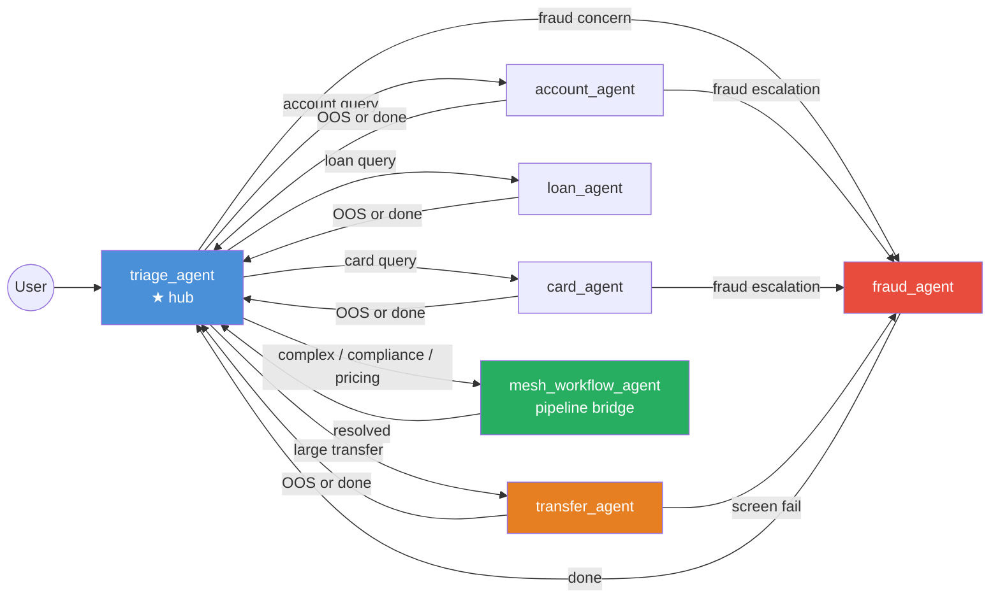

#### Builder code — MODE 1 Hybrid

```python
def build_workflow(triage, account, card, loan, transfer, fraud,
                   mesh_wf_agent, use_checkpoints=False):
    builder = HandoffBuilder(
        name="retail_bank_handoff",
        participants=[triage, account, card, loan, transfer, fraud, mesh_wf_agent],
        termination_condition=_termination_condition,
    )
    return (
        builder
        .with_start_agent(triage)
        .add_handoff(triage,        [account, card, loan, transfer, fraud, mesh_wf_agent])
        .add_handoff(account,       [fraud, triage])
        .add_handoff(card,          [fraud, triage])
        .add_handoff(loan,          [triage])
        .add_handoff(transfer,      [fraud, triage])
        .add_handoff(fraud,         [triage])
        .add_handoff(mesh_wf_agent, [triage])
        .build()
    )
```

#### Flow — Complex query with OOS mid-session (MODE 1 hybrid)

```
User → triage → account_agent  (balance query)
                     │
                     │ User asks: "Also run a compliance check on my loan eligibility"
                     │ (OOS + complex — account cannot reach mesh_workflow_agent directly)
                     ▼
              account_agent → triage  (2 hops: OOS back to hub)
                     │
                     ▼
              triage → mesh_workflow_agent → pipeline → answer
                     │
                     ▼
              triage: "Is there anything else?"
```

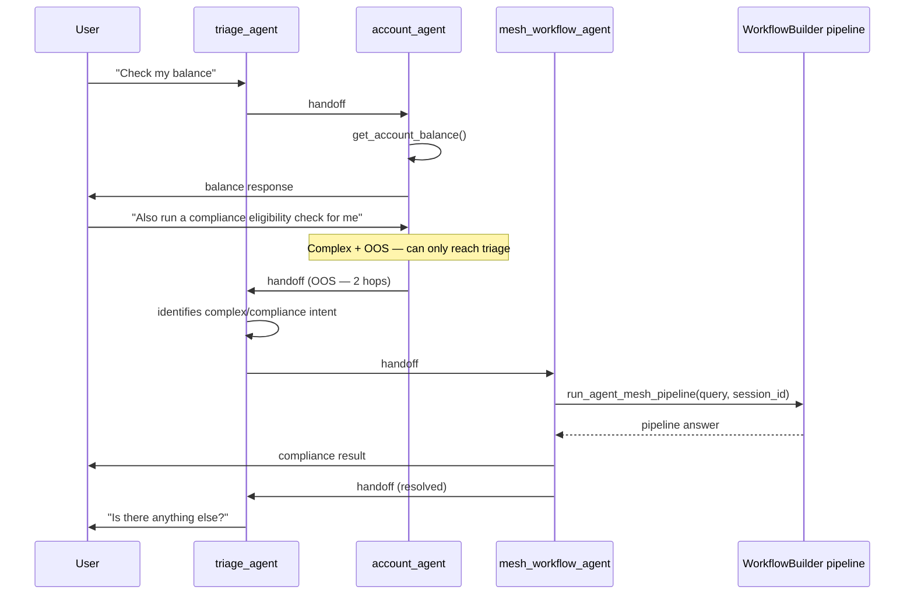

**OOS + pipeline path:** `account_agent → triage → mesh_workflow_agent` = **2 hops**

---

### 14.2 Hybrid — MODE 2 (Fully Open Mesh)

No `add_handoff()` calls — all 7 agents can reach each other directly. Specialists can route to `mesh_workflow_agent` in 1 hop for complex queries without bouncing through triage. Specialists also route directly to each other for OOS topic changes.

#### Architecture

```
┌──────────────────────────────────────────────────────────────────┐
│              Hybrid MODE 2 — Fully Open Mesh                     │
│                                                                  │
│                      ┌──────────────┐                            │
│                      │   triage     │  ← initial routing +       │
│                      │   agent  ★   │    session wrap-up only    │
│                      └──────┬───────┘                            │
│                             │                                    │
│         ┌───────────────────┼─────────────────────┐              │
│         │                   │                     │              │
│         ▼                   ▼                     ▼              │
│   ┌──────────┐        ┌──────────┐          ┌──────────────────┐ │
│   │ account  │◄──────►│  loan    │◄────────►│ mesh_workflow    │ │
│   │  agent   │        │  agent   │          │    agent         │ │
│   └────┬─────┘        └────┬─────┘          │  (pipeline bridge│ │
│        │                   │                │   reachable from │ │
│   ┌────▼─────┐        ┌────▼─────┐          │   ANY specialist)│ │
│   │  card    │◄──────►│ transfer │          └────────┬─────────┘ │
│   │  agent   │        │  agent   │                   │           │
│   └────┬─────┘        └────┬─────┘                   │           │
│        │                   │                          │           │
│        └──────────┬────────┘                          │           │
│                   ▼                                   │           │
│             ┌──────────┐◄──────────────────────────────┘          │
│             │  fraud   │                                          │
│             │  agent   │                                          │
│             └──────────┘                                          │
│  Every agent ◄──────────────────────────────► every other agent  │
│  (1 hop to any specialist OR to pipeline bridge directly)         │
└──────────────────────────────────────────────────────────────────┘
```

#### Routing table

| Agent | Can hand off to | Pipeline query handling |
|---|---|---|
| `triage_agent` | all 6 others | Routes complex queries directly to `mesh_workflow_agent` |
| `account_agent` | all 6 others | Can reach `mesh_workflow_agent` directly — no triage hop |
| `card_agent` | all 6 others | Same |
| `loan_agent` | all 6 others | Same |
| `transfer_agent` | all 6 others | Same |
| `fraud_agent` | all 6 others | Same |
| `mesh_workflow_agent` | all 6 others | Returns to triage after pipeline; can also route to specialist for follow-ups |

#### Mermaid — MODE 2 Hybrid Routing Graph

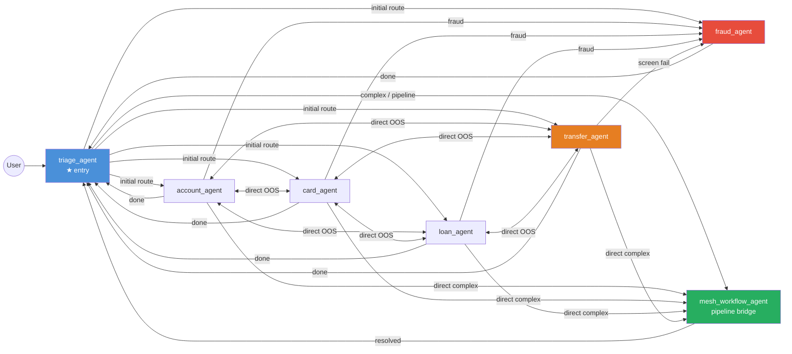

#### Builder code — MODE 2 Hybrid

```python
def build_workflow(triage, account, card, loan, transfer, fraud,
                   mesh_wf_agent, use_checkpoints=False):
    builder = HandoffBuilder(
        name="retail_bank_handoff",
        participants=[triage, account, card, loan, transfer, fraud, mesh_wf_agent],
        termination_condition=_termination_condition,
    )
    # No add_handoff() — fully connected, all 7 agents reachable from all others
    return (
        builder
        .with_start_agent(triage)
        .build()
    )
```

#### Flow — Complex query with OOS mid-session (MODE 2 hybrid)

```
User → triage → account_agent  (balance query)
                     │
                     │ User asks: "Also run a compliance check on my loan eligibility"
                     │ (OOS + complex — but account has handoff_to_mesh_workflow_agent directly)
                     ▼
              account_agent → mesh_workflow_agent  (1 hop direct)
                     │
                     ▼
              mesh_workflow_agent → pipeline → answer
                     │
                     ▼
              triage: "Is there anything else?"
```

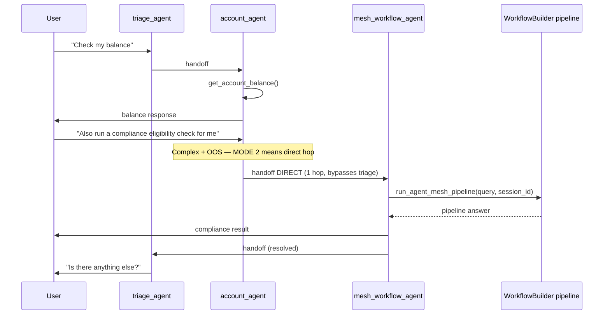

**OOS + pipeline path:** `account_agent → mesh_workflow_agent` = **1 hop**

---

### 14.3 MODE 1 vs MODE 2 Hybrid — Comparison

#### Routing comparison

| Scenario | MODE 1 hybrid path | MODE 2 hybrid path | Hops saved |
|---|---|---|---|
| Simple account query | triage → account → triage | triage → account → triage | 0 |
| Complex query (initial) | triage → mesh_workflow_agent → triage | triage → mesh_workflow_agent → triage | 0 |
| Account → loan OOS | account → **triage** → loan → triage | account → loan → triage | 1 |
| Account → complex OOS | account → **triage** → mesh_workflow_agent → triage | account → mesh_workflow_agent → triage | 1 |
| Card → transfer OOS | card → **triage** → transfer → triage | card → transfer → triage | 1 |
| Loan → fraud escalation | loan → **triage** → fraud → triage | loan → fraud → triage | 1 |
| Multi-topic: acct → loan → complex | account → **triage** → loan → **triage** → mesh_wf → triage | account → loan → mesh_wf → triage | 2 |

#### Operational comparison

| Concern | MODE 1 Hybrid | MODE 2 Hybrid |
|---|---|---|
| **Graph enforcement** | Framework-level via `add_handoff()` | Prompt-level only |
| **Wrong route possible** | No — `ValueError` at runtime for invalid targets | Yes — any of 6 agents can be reached by mistake |
| **OOS to pipeline** | Specialists cannot bypass triage to reach pipeline | Specialists reach pipeline in 1 direct hop |
| **Adding a new agent** | Must add `add_handoff()` entries for all connections | Auto-connected to all 6 others |
| **Audit trail** | Deterministic — allowed paths defined in code | Stochastic — paths are LLM decisions |
| **Recommended for** | Production, regulated environments | Research, POC, strong-model deployments |

#### Architecture diagram comparison

```
Hybrid MODE 1                         Hybrid MODE 2
─────────────────────────             ────────────────────────────
       [triage]                              [triage]
      ╱ ╱ ╱ ╲ ╲ ╲                          ╱ ╱ ╱ ╲ ╲ ╲
[A][C][L][T][F][MWA]                  [A][C][L][T][F][MWA]
  │  │        │                        │╲  │╲  │╲  │╲  │╲  │
  └──┴────────┘                        │ ╲ │ ╲ │ ╲ │ ╲ │ ╲ │
(specialists → triage only)            └──╲┴──╲┴──╲┴──╲┴──╲┘
                                       (direct peer links incl. MWA)

OOS: A→triage→B (2 hops)             OOS: A→B (1 hop)
Pipeline OOS: A→triage→MWA (2 hops)  Pipeline OOS: A→MWA (1 hop)
```
