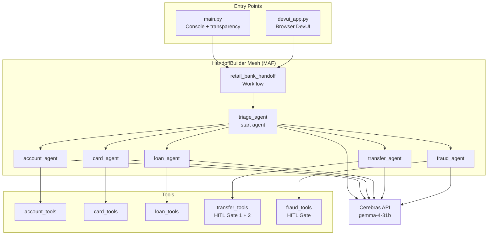
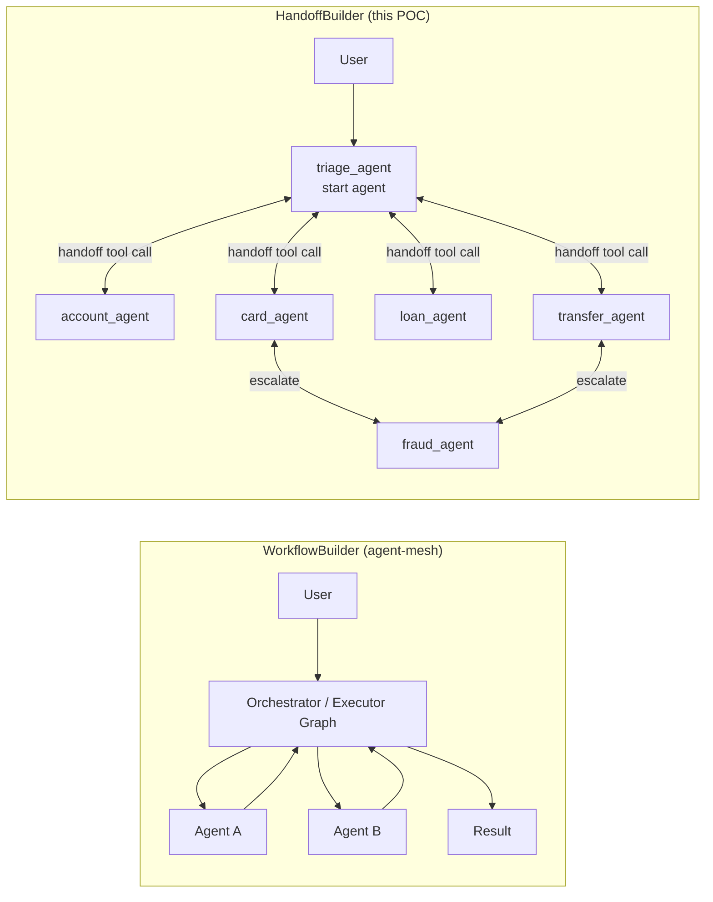
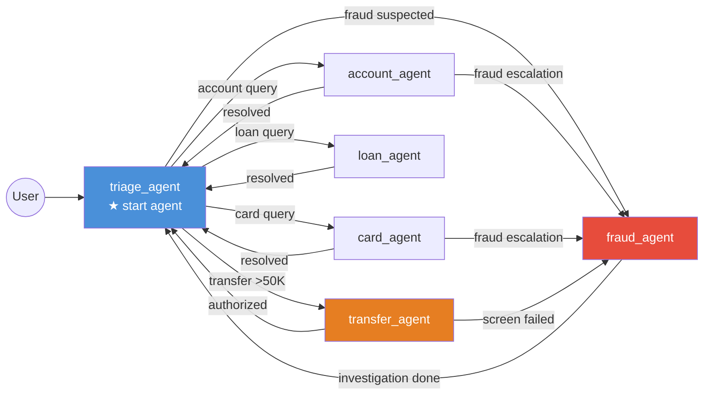
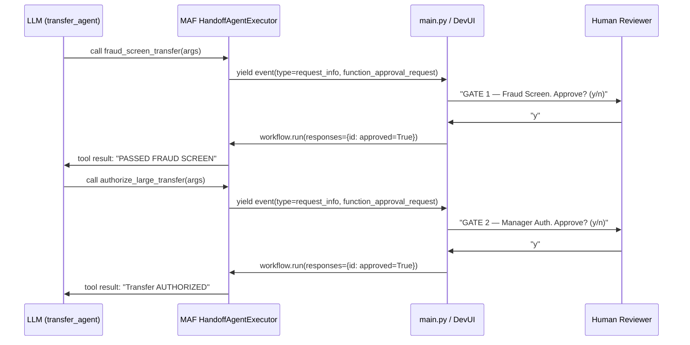
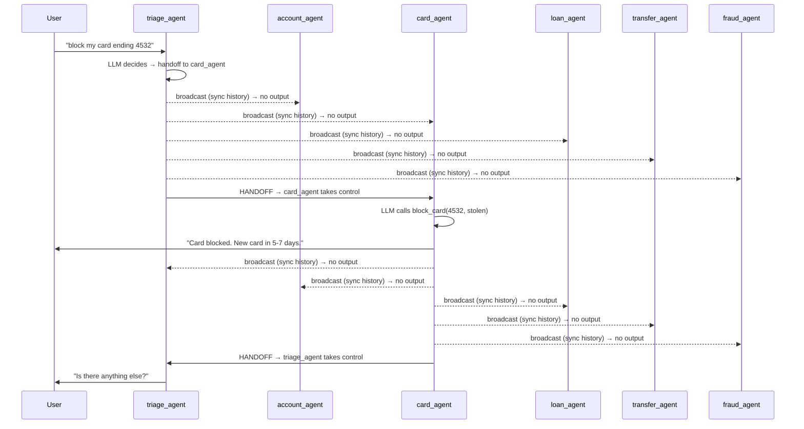
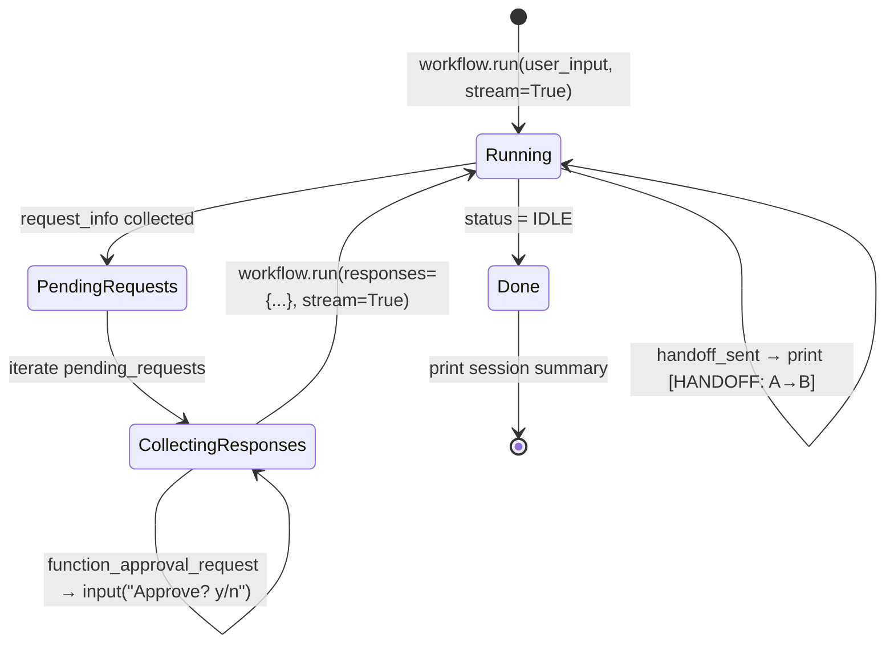
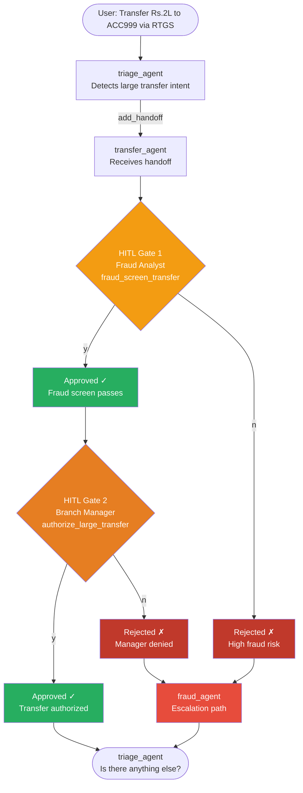

# Retail Banking Handoff POC — Implementation Reference

> **Location:** `research_pocs/retail_bank_handoff/`  
> **Framework:** Microsoft Agent Framework (MAF) — `HandoffBuilder` orchestration  
> **LLM:** Cerebras (`gemma-4-31b`) via OpenAI-compatible endpoint  
> **Purpose:** Research POC demonstrating the HandoffBuilder (mesh topology) pattern as an alternative to the WorkflowBuilder (executor graph) pattern used in the main agent-mesh project.

---

## Table of Contents

1. [What This POC Demonstrates](#1-what-this-poc-demonstrates)
2. [Project Structure](#2-project-structure)
3. [Architecture Overview](#3-architecture-overview)
4. [HandoffBuilder vs WorkflowBuilder](#4-handoffbuilder-vs-workflowbuilder)
5. [Agent Mesh — Routing Rules](#5-agent-mesh--routing-rules)
6. [Tools and HITL Gates](#6-tools-and-hitl-gates)
7. [Context Synchronization — The Broadcast Mechanism](#7-context-synchronization--the-broadcast-mechanism)
8. [Event Flow — What Happens at Runtime](#8-event-flow--what-happens-at-runtime)
9. [HITL Multi-Gate Flow (Large Transfer)](#9-hitl-multi-gate-flow-large-transfer)
10. [Validation Scenarios](#10-validation-scenarios)
11. [How to Run](#11-how-to-run)
12. [Key Learnings and Trade-offs](#12-key-learnings-and-trade-offs)

---

## 1. What This POC Demonstrates

This POC implements a **Retail Banking customer support system** using MAF's `HandoffBuilder` pattern. A customer contacts the bank, a triage agent identifies their intent, and control is handed off to the appropriate specialist. Sensitive operations (large transfers, account freezes) require human approval through **multi-gate HITL** (Human-in-the-Loop).

**Core research questions answered:**
- How does `HandoffBuilder` (mesh) differ from `WorkflowBuilder` (executor graph)?
- How does agent-to-agent handoff work without a central orchestrator?
- How does MAF's context synchronization maintain conversation history across all mesh peers?
- How does `@tool(approval_mode="always_require")` pause the workflow for HITL gates?

---

## 2. Project Structure

```
research_pocs/retail_bank_handoff/
│
├── .env                        # LLM credentials, OTel settings
├── requirements.txt            # Pinned MAF dependencies
│
├── tools/                      # Simulated banking tool functions
│   ├── account_tools.py        # get_account_balance, get_mini_statement, update_contact_details
│   ├── card_tools.py           # get_card_status, block_card, raise_transaction_dispute
│   ├── loan_tools.py           # check_loan_eligibility, get_loan_status
│   ├── transfer_tools.py       # fraud_screen_transfer (HITL Gate 1), authorize_large_transfer (HITL Gate 2)
│   └── fraud_tools.py          # flag_suspicious_transaction, freeze_account (HITL Gate)
│
├── agents/
│   └── agent_factory.py        # Creates 6 agents via OpenAIChatCompletionClient (Cerebras)
│
├── workflows/
│   └── handoff_workflow.py     # HandoffBuilder with restricted add_handoff() routing
│
├── approvals/
│   └── approval_handler.py     # Console HITL prompt handler (gate info, approve/reject)
│
├── main.py                     # Interactive console mode with full event transparency
├── devui_app.py                # MAF DevUI browser UI (http://127.0.0.1:8080)
└── checkpoints/                # Auto-created by FileCheckpointStorage (staff mode)
```

---

## 3. Architecture Overview

### System Architecture

```
┌─────────────────────────────────────────────────────────────────┐
│                  retail_bank_handoff POC                        │
│                                                                 │
│  Entry points:                                                  │
│  ┌──────────────┐     ┌────────────────────────────────────┐   │
│  │  main.py     │     │  devui_app.py                      │   │
│  │  (console)   │     │  agent_framework.devui.serve()     │   │
│  └──────┬───────┘     └──────────────┬─────────────────────┘   │
│         │                            │                          │
│         └──────────┬─────────────────┘                          │
│                    ▼                                            │
│         ┌─────────────────────┐                                │
│         │  HandoffBuilder     │  ← workflows/handoff_workflow  │
│         │  Workflow (MAF)     │                                │
│         │  mesh topology      │                                │
│         └──────────┬──────────┘                                │
│                    │  auto-injects handoff tools into each agent│
│    ┌───────────────┼───────────────────────────────────┐        │
│    ▼               ▼               ▼                   ▼        │
│ ┌──────┐       ┌──────┐       ┌──────┐           ┌──────┐      │
│ │triage│       │card  │       │loan  │           │fraud │      │
│ │agent │       │agent │       │agent │           │agent │      │
│ └──────┘       └──────┘       └──────┘           └──────┘      │
│                ┌──────┐       ┌──────┐                          │
│                │acct  │       │trans-│                          │
│                │agent │       │fer   │                          │
│                └──────┘       │agent │                          │
│                               └──────┘                          │
│                                                                 │
│  LLM: OpenAIChatCompletionClient → Cerebras (gemma-4-31b)       │
└─────────────────────────────────────────────────────────────────┘
```

### Mermaid — Component Diagram



---

## 4. HandoffBuilder vs WorkflowBuilder

This is the **fundamental architectural difference** between this POC and the main agent-mesh project.

### WorkflowBuilder (main agent-mesh)

```
         User Request
              │
         ┌────▼─────┐
         │Orchestrat│  ← central authority
         │   or     │    explicit routing logic
         │ Executor │    (Executor graph / MeshState)
         └────┬─────┘
    ┌─────────┼──────────┐
    ▼         ▼          ▼
  Agent A   Agent B    Agent C
              │
          returns to
          orchestrator
```

- Central `WorkflowBuilder` defines an explicit Executor graph
- Each executor (`InputGuardrailExecutor`, `ComplianceExecutor`, `DomainExecutor`, etc.) is a discrete pipeline stage
- A `MeshState` dataclass flows through all stages
- Routing is deterministic and defined in code, not by the LLM

### HandoffBuilder (this POC)

```
         User Request
              │
         ┌────▼─────┐
         │  triage  │  ← just the start agent
         │  agent   │    LLM decides when to hand off
         └────┬─────┘
              │ (handoff tool call — auto-injected by MAF)
    ┌─────────┼──────────┐
    ▼         ▼          ▼
 Agent A ──▶ Agent B ──▶ Agent C
   ▲ ▲                     │
   └─┴─────────────────────┘
   All peers share conversation context (broadcast)
```

- No central orchestrator — pure peer-to-peer mesh
- `HandoffAgentExecutor` auto-injects a `transfer_to_<agent>()` tool into each agent
- The **LLM** inside each agent decides when to call that tool (not routing code)
- Full conversation history is broadcast to all peers after every turn

### Mermaid — Pattern Comparison



---

## 5. Agent Mesh — Routing Rules

Six agents participate in the mesh. `add_handoff()` restricts which agents each peer is allowed to hand off to. By default (without `add_handoff`), all agents can hand off to any other — `add_handoff` narrows that.

### Routing Table

| Agent | Can hand off to | Role |
|---|---|---|
| `triage_agent` | account, card, loan, transfer, fraud | Entry point — routes by intent |
| `account_agent` | fraud, triage | Account balance, statements, contact updates |
| `card_agent` | fraud, triage | Card status, block, dispute |
| `loan_agent` | triage | Loan eligibility, status |
| `transfer_agent` | fraud, triage | High-value transfers (>Rs.50,000) — dual HITL |
| `fraud_agent` | triage | Flag transactions, freeze accounts — HITL |

### Mermaid — Routing Graph



### Key Design Decision — Restricted Routing

`transfer_agent` and `fraud_agent` are **not directly reachable from the user**. All traffic must go through `triage_agent` first. This prevents customers from jumping straight to high-risk operations without identification. The `add_handoff()` calls enforce this at the framework level — the LLM cannot hand off to an agent that isn't in its allowed list.

---

## 6. Tools and HITL Gates

### Tool Inventory

| Tool | Agent | HITL? | Gate |
|---|---|---|---|
| `get_account_balance` | account_agent | No | — |
| `get_mini_statement` | account_agent | No | — |
| `update_contact_details` | account_agent | No | — |
| `get_card_status` | card_agent | No | — |
| `block_card` | card_agent | No | — |
| `raise_transaction_dispute` | card_agent | No | — |
| `check_loan_eligibility` | loan_agent | No | — |
| `get_loan_status` | loan_agent | No | — |
| `fraud_screen_transfer` | transfer_agent | **Yes** | Gate 1 — Fraud Analyst |
| `authorize_large_transfer` | transfer_agent | **Yes** | Gate 2 — Branch Manager |
| `flag_suspicious_transaction` | fraud_agent | No | — |
| `freeze_account` | fraud_agent | **Yes** | Gate 1 — Fraud Manager |

### How HITL Works

HITL tools are decorated with `@tool(approval_mode="always_require")`. When the LLM calls one of these tools, MAF's `HandoffAgentExecutor` **does not execute it immediately**. Instead it:

1. Emits a `WorkflowEvent` with `type="request_info"` and `data.type="function_approval_request"`
2. Pauses the workflow — the async generator yields the event and stops
3. The caller (console or DevUI) inspects the event, prompts the human reviewer, and sends a response
4. The workflow resumes by calling `workflow.run(responses={request_id: approval_response})`



---

## 7. Context Synchronization — The Broadcast Mechanism

> **This explains what you see in DevUI as multiple "(no output)" agent completions after every active agent turn.**

### The Problem HandoffBuilder Solves

In a mesh topology, agents do **not** share a single session. Each agent maintains its own conversation history. If `triage_agent` says "I'll connect you to card_agent" and then `card_agent` takes over, `card_agent` needs to know what was said before — including the customer's original request, triage's response, etc.

### How MAF Solves It — Broadcast

After every agent turn, MAF's `HandoffAgentExecutor` broadcasts the new message(s) to **all other participants** in the mesh. This keeps every agent's conversation history in sync, so whichever agent receives the next handoff already has full context.

```
triage_agent responds: "Connecting you to card_agent..."
        │
        │  MAF broadcasts this message to:
        ├──► account_agent  (receives, updates history, no output)
        ├──► card_agent     (receives, updates history, no output — will act next)
        ├──► loan_agent     (receives, updates history, no output)
        ├──► transfer_agent (receives, updates history, no output)
        └──► fraud_agent    (receives, updates history, no output)
```

### Mermaid — Context Sync Flow



### Why You See Multiple "(no output)" in DevUI

The DevUI logs every agent completion, including context-sync runs. Each sync run shows as `agent_name (completed)` with `(no output)` because the agent received the broadcast message, updated its internal history, but did not generate a response.

**Formula:** For each agent turn, you will see `(N - 1)` sync completions, where N = total participants (6 agents here → 5 sync runs per active turn).

| Active agent turn | Active completions | Sync completions |
|---|---|---|
| triage_agent responds | 1 (with output) | 5 (no output) |
| card_agent responds | 1 (with output) | 5 (no output) |
| triage_agent responds | 1 (with output) | 5 (no output) |
| **Total for card block** | **3** | **15** |

### Context Sync vs WorkflowBuilder

| | HandoffBuilder (this POC) | WorkflowBuilder (agent-mesh) |
|---|---|---|
| Context management | Each agent maintains own history; broadcast syncs all | Central orchestrator manages state via MeshState |
| Sync cost | O(N) agent invocations per turn | O(1) — state passed through pipeline |
| Visibility | N-1 "(no output)" runs visible in DevUI | No extra invocations |
| Trade-off | More network/LLM calls, full decentralization | Less overhead, central dependency |

> **MAF Docs reference:** *"participants are designed to broadcast their responses or user inputs received to all others in the workflow whenever they generate a response, making sure all participants have the latest context for their next turn"*

---

## 8. Event Flow — What Happens at Runtime

MAF emits structured `WorkflowEvent` objects during `workflow.run(stream=True)`. The `main.py` event loop handles each type to provide console transparency.

### Event Types Used

| Event type | When emitted | What we do with it |
|---|---|---|
| `executor_invoked` | Just before any agent runs | Print `[AGENT ACTIVE: name]` |
| `output` (AgentResponseUpdate) | Per streaming token chunk | Accumulate + print token |
| `output` (AgentResponse) | Full response (non-streaming) | Print agent response |
| `executor_completed` | After agent finishes | Flush token buffer + newline |
| `handoff_sent` | When agent calls handoff tool | Print `[HANDOFF: A → B]` |
| `request_info` (HandoffAgentUserRequest) | Agent needs next user message | Prompt "You: " |
| `request_info` (function_approval_request) | Agent called HITL-gated tool | Show HITL gate + Approve? |
| `status` (IDLE) | Workflow reached terminal state | Print "Session complete" |
| `failed` / `executor_failed` | Error occurred | Print error message |

### Mermaid — Event Loop State Machine



---

## 9. HITL Multi-Gate Flow (Large Transfer)

The most complex validation scenario — a large fund transfer requires two sequential human approvals.



### Console Output for Large Transfer

```
═══════════════════════════════════════════════════════
  You: I want to transfer Rs.2,00,000 to ACC999 via RTGS

[AGENT ACTIVE: triage_agent]
Certainly! For large transfers I'll connect you with our
transfer specialist right away.

[HANDOFF: triage_agent → transfer_agent]

[AGENT ACTIVE: transfer_agent]
I'll process your Rs.2,00,000 RTGS transfer to ACC999.
First, I need to run a fraud screen.

[TOOL CALL: fraud_screen_transfer({'from_account': '...', 'amount': '200000', ...})]

───────────────────────────────────────────────────────
  GATE 1 -- Fraud Screen Review
  Requires : Fraud Analyst
  Tool     : fraud_screen_transfer
  Args:
    from_account: ACC001
    to_account: ACC999
    amount: 200000
    transfer_type: RTGS
───────────────────────────────────────────────────────
  [Fraud Analyst] Approve? (y/n): y
  ✓ APPROVED

[TOOL CALL: authorize_large_transfer({...})]

───────────────────────────────────────────────────────
  GATE 2 -- Manager Authorization
  Requires : Branch Manager
  Tool     : authorize_large_transfer
───────────────────────────────────────────────────────
  [Branch Manager] Approve? (y/n): y
  ✓ APPROVED

Transfer of Rs.2,00,000 AUTHORIZED. Ref: TXN-00120

[HANDOFF: transfer_agent → triage_agent]

═══════════════════════════════════════════════════════
  Session Summary
═══════════════════════════════════════════════════════
  Agent path : triage_agent  →  transfer_agent  →  triage_agent
  Tool calls :
    • fraud_screen_transfer (by transfer_agent)
    • authorize_large_transfer (by transfer_agent)
═══════════════════════════════════════════════════════
```

---

## 10. Validation Scenarios

| # | Scenario | Agent path | HITL gates | Key tool |
|---|---|---|---|---|
| 1 | Balance enquiry | triage → account → triage | None | `get_account_balance` |
| 2 | Mini statement | triage → account → triage | None | `get_mini_statement` |
| 3 | Block lost card | triage → card → triage | None | `block_card` |
| 4 | Card dispute | triage → card → triage | None | `raise_transaction_dispute` |
| 5 | Loan eligibility | triage → loan → triage | None | `check_loan_eligibility` |
| 6 | Large RTGS transfer (approved) | triage → transfer → triage | Gate 1 + Gate 2 | `fraud_screen_transfer`, `authorize_large_transfer` |
| 7 | Transfer — Gate 1 rejected | triage → transfer → fraud → triage | Gate 1 rejected | Fraud escalation |
| 8 | Suspicious transaction | triage → account → fraud → triage | `freeze_account` HITL | `flag_suspicious_transaction`, `freeze_account` |
| 9 | Fraud card + freeze | triage → card → fraud → triage | `freeze_account` HITL | `freeze_account` |

---

## 11. How to Run

### Prerequisites

```powershell
cd C:\Users\manoj.chevula\Desktop\antigravity\agent-mesh-15062026\research_pocs\retail_bank_handoff
C:\Users\manoj.chevula\Desktop\antigravity\agent-mesh-15062026\fab-venv\Scripts\Activate.ps1
```

### Console Mode (full event transparency)

```powershell
python main.py
```

- Prompts for `customer` or `staff` mode (staff enables `FileCheckpointStorage`)
- Prints every `[AGENT ACTIVE]`, `[HANDOFF]`, `[TOOL CALL]` event in real time
- Streams LLM tokens as they arrive
- Shows HITL gate prompts when approval-gated tools are called
- Prints session summary (agent path + tool calls) at the end

### DevUI Mode (browser — OTel trace panel)

```powershell
python devui_app.py
```

- Opens `http://127.0.0.1:8080` automatically
- Sidebar shows 7 entities: `retail_bank_handoff` workflow + 6 individual agents
- Select the workflow to run the full handoff scenario
- Select any individual agent to chat with it directly (useful for testing tools in isolation)
- Trace panel shows OTel spans: `executor_invoked → invoke_agent → chat → execute_tool`

> **DevUI note:** HandoffBuilder emits `request_info` events mid-run when an agent responds without handing off. If the conversation stalls after the first agent response, the DevUI may not be handling these events natively. In that case, add `.with_autonomous_mode()` to `build_workflow()` in `handoff_workflow.py` to let agents continue without waiting for user input — this gives full end-to-end trace visibility at the cost of interactivity.

### Environment Variables (`.env`)

| Variable | Value | Purpose |
|---|---|---|
| `GROQ_API_KEY` | `csk-...` | Cerebras API key |
| `GROQ_MODEL` | `gemma-4-31b` | LLM model name |
| `LLM_BASE_URL` | `https://api.cerebras.ai/v1` | OpenAI-compatible endpoint |
| `OTEL_METRICS_EXPORTER` | `none` | Suppresses OTLP metric export noise |
| `OTEL_EXPORTER_OTLP_ENDPOINT` | `` (empty) | Clears OTLP endpoint — no Jaeger running locally |
| `OBS_PROFILE` | `off` | Disables heavy Grafana/OTLP wiring |

---

## 12. Key Learnings and Trade-offs

### What HandoffBuilder Does Well

| Strength | Detail |
|---|---|
| **Decentralization** | No single point of failure; each agent is autonomous |
| **LLM-driven routing** | The model decides when to hand off based on context — no hardcoded rules |
| **Full context preservation** | All agents always have the complete conversation history via broadcast |
| **Simple code** | `HandoffBuilder(...).with_start_agent().add_handoff().build()` — minimal boilerplate |
| **HITL built-in** | `@tool(approval_mode="always_require")` integrates approval gates with zero extra code |
| **Checkpointing** | `FileCheckpointStorage` makes workflows durable across process restarts |

### Trade-offs vs WorkflowBuilder

| Concern | HandoffBuilder (this POC) | WorkflowBuilder (agent-mesh) |
|---|---|---|
| **Routing correctness** | LLM-driven — can make wrong routing decisions | Deterministic — routing logic in code |
| **Context sync cost** | O(N) agent invocations per turn (broadcast) | O(1) — central state |
| **DevUI noise** | N-1 "(no output)" completions per turn | Clean single-agent runs |
| **Observability** | Harder — need to filter sync vs active runs | Cleaner executor graph |
| **Testability** | Hard to unit-test LLM routing decisions | Executor logic is testable |
| **Best for** | Dynamic, open-ended routing; agentic workflows | Structured pipelines; compliance gates |

### The `require_per_service_call_history_persistence` Flag

Every agent in a HandoffBuilder mesh **must** be created with this flag:

```python
chat_client.as_agent(
    ...,
    require_per_service_call_history_persistence=True,
)
```

This tells MAF's session layer to persist conversation history via per-service-call middleware so local history stays consistent with the service across handoff tool-call short-circuits. Without it, `HandoffBuilder.build()` raises a `ValueError`.

### The Handoff Tool Injection

`HandoffAgentExecutor` automatically injects a `transfer_to_<target>()` tool into each agent for every allowed handoff target. This is why we never define handoff tools manually — MAF generates them from the `add_handoff()` routing rules. These injected tools are also **filtered out of conversation history** before context is broadcast to other agents (so agents don't see internal routing mechanics).
