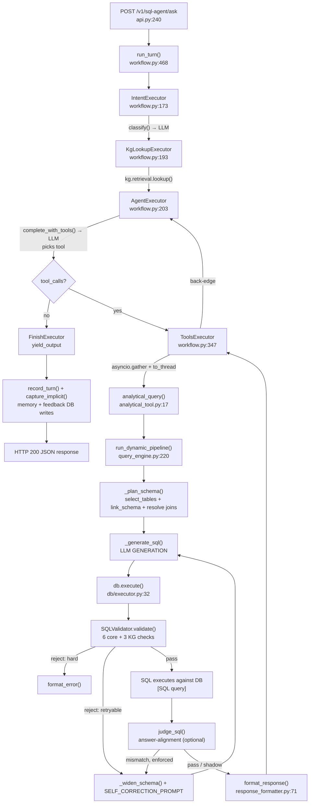

# SQL Agent — End-to-End Call Graph

Scope note: this is a large, multi-layered service (~70 modules). Call-chain depth is
concentrated on the two flows that dominate the runtime: **`POST /v1/sql-agent/ask`**
(the ReAct agent) and, within it, the **full-dynamic (tier-3) SQL generation pipeline**,
since that's where nearly all of the architecture (KG, semantic layer, validator,
self-correction) actually executes.

────────────────────────────────────────────────────────────────────
## 1. Entry points
────────────────────────────────────────────────────────────────────

**HTTP endpoints** — `sql_agent/service/api.py` (FastAPI app `app`, instantiated line 49)

| Method | Path | Handler | Line |
|---|---|---|---|
| POST | `/v1/sql-agent/invoke` | `def invoke(req: InvokeRequest) -> dict` | api.py:100 |
| POST | `/v1/sql-agent/ask` | `async def ask(req: AskRequest) -> dict` | api.py:240 |
| POST | `/v1/sql-agent/feedback` | `def feedback(req: FeedbackRequest) -> dict` | api.py:421 |
| GET | `/v1/sql-agent/sessions` | `def sessions(user_id: str) -> dict` | api.py:433 |
| GET | `/v1/sql-agent/sessions/{session_id}/history` | `def history(session_id: str) -> dict` | api.py:439 |
| PATCH | `/v1/sql-agent/sessions/{session_id}` | `def rename(session_id, req) -> dict` | api.py:445 |
| DELETE | `/v1/sql-agent/sessions/{session_id}` | `def delete(session_id, user_id) -> dict` | api.py:452 |
| GET | `/healthz` | `def healthz() -> dict` | api.py:459 |

**Startup hook (module-level code that runs on process boot)**
- `@app.on_event("startup") async def _prewarm()` — api.py:141: builds the workflow,
  opens the conversation store, warms the embedding/vector index and the KG client so
  the first real request isn't slow.

**CLI / script entry points** (`if __name__ == "__main__":` + argparse, all under
`scripts/` and `eval/`)

| File | main() | Purpose |
|---|---|---|
| scripts/load_excel_to_db.py:155 | `def main()` | Load POC Excel workbook into Postgres/MySQL/SQLite |
| scripts/init_agent_db.py:18 | `def main()` | Create the agent metadata DB tables |
| scripts/build_schema_index.py:34 | `def main()` | Build/upsert the schema vector index |
| scripts/build_example_index.py:36 | `def main()` | Build/upsert the few-shot example vector index |
| scripts/build_metadata_kg.py:28 | `def main()` | Build the metadata Knowledge Graph artifact |
| scripts/seed_examples.py:47 | `def main()` | Seed approved few-shot examples from YAML |
| scripts/promote_example.py:19 | `def main()` | Promote one Q→SQL pair to an approved example |
| scripts/generate_example_metadata.py:49 | `def main()` | Tag examples with structured metadata |
| scripts/audit_example_corpus.py:33 | `def main()` | Lint the example corpus |
| scripts/agent_scenario_tests.py:719 | `async def main()` | Scenario battery against the live agent |
| eval/run_agent.py:228 | `async def main()` | Run the agent over a gold dataset (records raw runs) |
| eval/run_eval.py:467 | `async def main()` | Full eval harness (agent + LLM judge) |
| eval/deterministic_eval.py:67 | `def main()` | Deterministic (non-LLM) scoring against recorded runs |
| eval/compare_llm.py:426 | `def main()` | LLM-judge re-scoring |
| eval/check_table_retrieval.py:563 | `def main()` | Isolated retrieval-quality check |
| eval/check_example_retrieval.py:165 | `def main()` | Isolated example-retrieval check |
| eval/materialize_gold.py:170 / materialize_gold_v1_expected.py:105 | | Materialize expected answers by running SQL against the DB |
| eval/correlate_retrieval_outcome.py:151 | `def main()` | Correlate retrieval quality with eval outcome |

**UI entry point (not HTTP, run via `streamlit run`)**
- `ui/app.py` — module-level Streamlit script. Executes top-to-bottom on every rerun
  (`st.set_page_config` line 77 → `_init_state()` line 102 → sidebar block lines 147–232
  → chat render loop 334–339 → `_ask()` line 342, invoked at the bottom, line 391).

────────────────────────────────────────────────────────────────────
## 2. Call chains
────────────────────────────────────────────────────────────────────

### Flow A — `POST /v1/sql-agent/ask` → ReAct loop → **full-dynamic SQL generation** (the primary flow)

```
POST /v1/sql-agent/ask
  ask(req: AskRequest)                                          api.py:240  [async, HOT PATH]
    ├─ set_caller_scopes(scopes)                                 registry.py:20
    ├─ new_session_id() / touch_session(session_id, user_id)     memory/sessions.py         [DB write, sqlite/pg]
    ├─ _agent_workflow()  (lru_cache singleton)                  api.py:132
    ├─ get_conversation_store()  (lru_cache singleton)           conversation_store.py
    ├─ _merge_pending_clarification(store, session_id, question) api.py:226
    │    └─ store.load(session_id)                               conversation_store.py:63   [DB/RAM read]
    │
    └─ run_turn(workflow, state, store, thread_id=session_id)     workflow.py:468  [async]
         ├─ merge_state(prior, state)                             agent/state.py:56
         ├─ workflow.run(merged)   — MAF WorkflowBuilder graph:
         │
         │   ── IntentExecutor.run(state, ctx) ──                 workflow.py:173  [async]
         │      ├─ _guard_supersteps(state)                       workflow.py:154  [may raise GraphRecursionError]
         │      └─ classify(last_human_text)                      routing/intent_classifier.py:42  [async]
         │           └─ acomplete(Step.INTENT, prompt)             llm/step.py:47  [async]  [HTTP POST → LLM provider]
         │                └─ get_llm(Step.INTENT) → client.get_response(...)  llm/factory.py:222
         │      (gated by settings.intent_detection_enabled — default OFF, shadow)
         │
         │   ── KgLookupExecutor.run(state, ctx) ──                workflow.py:193  [async]
         │      └─ kg_lookup_node(state)                           kg/node.py:34
         │           └─ lookup(question, tables_hint)               kg/retrieval.py:438
         │                ├─ template/exact/semantic signal fusion (S1–S5, RRF-style)
         │                ├─ embedding search over :Term/:Scenario vectors  [called from N sites, cached backend]
         │                └─ set_kg_lookup(result)                  kg/context.py  [ContextVar publish]
         │      (gated by settings.kg_enabled — default OFF)
         │
         │   ── AgentExecutor.run(state, ctx) ──                   workflow.py:203  [async, HOT PATH, called from N sites (ReAct loop back-edge)]
         │      ├─ tools_for_caller(caller_agent, auth_scopes)      routing/tier_router.py:108
         │      ├─ render_examples_block(approved_examples())      memory/examples.py       [DB read: approved few-shot examples]
         │      ├─ invoke(base_messages)                           workflow.py:231 (closure) [async]
         │      │    └─ complete_with_tools(Step.AGENT, msgs, tools, tool_choice)  llm/step.py:26  [async] [HTTP POST → LLM]
         │      │         [catch: tool_use_failed → retry once with corrective user_message, else raise SQLAgentError]
         │      ├─ (model returns a tool_call, e.g. analytical_query(question=...))
         │      └─ state["messages"] = add_messages(...)            agent/state.py:35
         │
         │   ── condition: tool_calls_of(last_message) truthy → route to ToolsExecutor ──
         │
         │   ── ToolsExecutor.run(state, ctx) ──                   workflow.py:347  [async, HOT PATH]
         │      ├─ _enforce_verbatim_question(messages, tool_calls) workflow.py:65   [dynamic-only mode guard]
         │      ├─ for each call: guard_tool_call(state, name)      routing/tier_router.py:131  [circuit breaker, may raise SQLAgentError]
         │      ├─ asyncio.gather(*(_dispatch(tools, c) for c in tool_calls))   [PARALLEL fan-out]
         │      │    └─ _dispatch(tools, call)                      workflow.py:384  [async]
         │      │         ├─ fn.input_model(**args).model_dump()     [Pydantic validation — bad args → correctable error msg]
         │      │         └─ asyncio.to_thread(fn.func, **validated)  [runs the TOOL BODY on a worker thread — sync, blocking-safe]
         │      │
         │      │              ═══ TOOL BODY: analytical_query(question) ═══
         │      │              tools/dynamic/analytical_tool.py:17          [sync, called from ToolsExecutor worker thread]
         │      │                ├─ caller_has_scope(GATED_SCOPE) check      [raises AuthError if ungated caller]
         │      │                └─ run_dynamic_pipeline(question)           routing/query_engine.py:220  [sync, HOT PATH]
         │      │                     │
         │      │                     ├─ _plan_schema(question, tables_hint)  query_engine.py:158
         │      │                     │    ├─ _resolve_kg(question, tables_hint)  query_engine.py:105
         │      │                     │    │    └─ get_kg_lookup() (ContextVar) OR kg_lookup(question, hint)  [dedupe: reuses turn's KG lookup]
         │      │                     │    ├─ select_tables(question, hint, apply_closure=False)  semantic_layer/selector.py:140
         │      │                     │    │    ├─ ranked_core(question, hint)  selector.py:108
         │      │                     │    │    │    ├─ glossary_expand(question)     semantic_layer/catalog.py  [expands business jargon]
         │      │                     │    │    │    ├─ _dense_ranking(q)  selector.py:80  → embeddings.get_backend().embed_query()  [local model inference OR HTTP to Azure embeddings]
         │      │                     │    │    │    ├─ _sparse_ranking(q)  selector.py:92  → BM25Okapi.get_scores()  [in-process]
         │      │                     │    │    │    └─ _rrf(rankings, k)   selector.py:99  [Reciprocal Rank Fusion]
         │      │                     │    │    └─ base_join_closure(core)   semantic_layer/loader.py  [add 1-hop bridge tables]
         │      │                     │    ├─ link_schema(question, candidates)  semantic_layer/schema_link.py:74
         │      │                     │    │    └─ complete(Step.PLAN, planner_prompt)  llm/step.py:57 [sync→asyncio.run(acomplete)]  [HTTP POST → LLM, precision planner]
         │      │                     │    ├─ _plan_with_kg(plan.tables, plan.join_pairs, kg)  query_engine.py:120
         │      │                     │    │    ├─ resolve_kg_joins(tables, pairs)   kg/retrieval.py:348  [KG-typed edges, cardinality-aware]
         │      │                     │    │    └─ resolve_joins(tables, pairs)      semantic_layer/joins.py:39  [fallback: schema.yaml rule strings]
         │      │                     │    └─ render_schema_context(tables=used)     semantic_layer/renderer.py  [schema.yaml → prompt text]
         │      │                     │
         │      │                     ├─ log_kg_lookup(question, plan.kg, plan.kg_constraints)  formatting/audit_logger.py:50  [DEBUG structured log]
         │      │                     ├─ resolve_customer_hint(question)      routing/entity_resolver.py:36  [DB query: customer_master name→id]
         │      │                     │
         │      │                     └─ LOOP attempt = 1..max_self_correction_attempts (default 3):
         │      │                          ├─ _generate_sql(prompt, Step.GENERATION|CORRECTION)  query_engine.py:147
         │      │                          │    └─ complete(step, prompt)   llm/step.py:57  [HTTP POST → LLM]  → raw SQL text
         │      │                          ├─ [if "-- CANNOT_ANSWER"] → _widen_schema(...) and retry (bounded, once)  query_engine.py:190
         │      │                          ├─ db.execute(sql, allowed_join_pairs, strict_columns=True, kg_constraints)
         │      │                          │    Executor.execute()  db/executor.py:32  [sync]  [called from N sites — every tier]
         │      │                          │      ├─ SQLValidator.validate(sql, ...)  validation/sql_validator.py:55
         │      │                          │      │    ├─ check_1_parse (sqlglot.parse_one)         [raises ParseError]
         │      │                          │      │    ├─ check_2_statement_type                    [raises StatementTypeError]
         │      │                          │      │    ├─ check_3_table_whitelist                   [raises TableNotAllowedError]
         │      │                          │      │    ├─ check_4_column_filter (blocked columns)   [raises ColumnBlockedError]
         │      │                          │      │    ├─ check_5_injection_scan (regex)             [raises InjectionDetectedError]
         │      │                          │      │    ├─ check_6_row_cap (inject/clamp LIMIT 50)
         │      │                          │      │    ├─ check_9_view_join_scope                    [raises JoinNotAllowedError]
         │      │                          │      │    ├─ check_7_join_graph (allowed_join_pairs)     [raises JoinNotAllowedError]
         │      │                          │      │    ├─ check_8_column_binding (strict_columns)     [raises ColumnNotInTableError]
         │      │                          │      │    ├─ check_10_kg_join_keys (kg_constraints)      [raises KGJoinNotAllowedError]
         │      │                          │      │    ├─ check_11_kg_columns (type/enum domain)      [raises KGColumnUnknownError / KGTypeMismatchError]
         │      │                          │      │    └─ check_12_kg_cardinality (fan-out guard, default OFF) [raises CardinalityRiskError]
         │      │                          │      ├─ [settings.execution_guard_enabled] _explain_guard(engine, sql)  db/executor.py:81  [EXPLAIN <sql>]  [DB query]  [raises ExecutionCostError]
         │      │                          │      ├─ engine.connect() → _apply_statement_timeout(conn)  db/executor.py:116
         │      │                          │      └─ conn.execute(text(safe_sql), params)             [DB QUERY — SELECT, read-only credential]
         │      │                          │           returns QueryResult(rows, latency_ms, truncated, sql, params)
         │      │                          ├─ [HARD_REJECT exceptions] → format_error(...) and return  (no retry)
         │      │                          ├─ [RETRYABLE exceptions] → _widen_schema + append SELF_CORRECTION_PROMPT, continue loop
         │      │                          ├─ [SQLAlchemyError from DB] → same widen+retry path
         │      │                          ├─ judge_sql(question, sql, columns, row_count, schema_context)  validation/answer_validator.py  [async→sync, HTTP POST → LLM]  [gated by answer_validation_enabled, default OFF]
         │      │                          └─ [on success] format_response(result, tier="full_dynamic", tool="analytical_query")  formatting/response_formatter.py:71
         │      │                               → returns {"status":"success","data":[...],"sql":...,"rows_returned":N,"audit_id":...}
         │      │
         │      ├─ log_invocation(state, tool_calls, {"messages": results})   formatting/audit_logger.py:25  [DEBUG/INFO log]
         │      └─ state["tool_call_count"] += len(tool_calls); state["dynamic_call_count"] += dynamic_in_batch
         │
         │   ── back-edge: ToolsExecutor → AgentExecutor ── (ReAct loop, bounded by MAX_SUPERSTEPS=25)
         │
         │   ── AgentExecutor (2nd pass): no further tool_calls ──
         │      └─ [if response_synthesis_enabled] _synthesize_final_answer(question, tool_msgs, cid)  workflow.py:127  [async]
         │           └─ acomplete(Step.SYNTHESIS, prompt)   llm/step.py:47   [HTTP POST → LLM, smaller model]
         │
         │   ── condition: no tool_calls → FinishExecutor.run(state, ctx) ──  workflow.py:428
         │        └─ ctx.yield_output(state)
         │
         └─ store.save(thread_id, final)                          conversation_store.py:64   [DB/RAM write — persists full turn]
    │
    ├─ [parse turn_messages, build `steps` trace, extract `answer`]        api.py:293-395
    ├─ [if last agent action == ask_clarification] → record_turn(...) and return {"status":"clarification", ...}   api.py:355
    ├─ [if no tool ran at all] → capture_implicit(...) + format_error("NoToolInvoked", ...)                        api.py:374
    ├─ record_turn(session_id, user_id, turn_ref, question, answer, tier, tool, sql, rows_returned)   memory/turns.py  [DB write]
    ├─ capture_implicit(...)                                       feedback/signals.py:8
    │    └─ record(...)                                            feedback/store.py                              [DB write]
    └─ return last_result  (JSON envelope: status, tool, query_tier, data, sql, answer, steps, session_id, turn_ref)
```

### Flow B — `POST /v1/sql-agent/invoke` (direct, single-tool call — bypasses the ReAct agent)

```
invoke(req: InvokeRequest)                        api.py:100  [sync, HOT PATH]
  ├─ TOOL_TIER_REGISTRY lookup + gating check       tier_router.py:26 / 79
  ├─ set_caller_scopes(scopes)                      registry.py:20
  └─ tool.func(**tool.input_model(**req.args).model_dump())   [SYNC — runs directly in FastAPI's threadpool]
       └─ e.g. get_customer_360(customer_id)         tools/parameterised/semantic_view_tools.py:98
            ├─ _resolve_customer_id(customer_id)     semantic_view_tools.py:39   [DB query: name→id resolution]
            └─ db.execute(sql, {"customer_id": ...})  db/executor.py:32           [same 6-check validator, no KG checks — strict_columns=False]
                 └─ format_response(rows, tier="parameterised", tool=...)  formatting/response_formatter.py:71
```

### Flow C — Semi-dynamic search tool (called from N sites via ToolsExecutor or /invoke)

```
find_customers(segment, risk_category, region, industry, ...)   tools/semi_dynamic/search_tools.py:17  [sync]
  ├─ canonicalize_enum(table, column, value)   semantic_layer/loader.py    [normalizes user-worded enum to governed token, per filter]
  ├─ csv_membership_clause(...)                db/dialect.py               [dialect-aware CSV membership predicate]
  ├─ build WHERE clause from populated filters ONLY (menu-bounded, never free predicates)
  └─ db.execute(sql, params)                   db/executor.py:32           [validator run, no strict_columns/allowed_join_pairs]
       └─ format_response(rows, tier="semi_dynamic", tool="find_customers")
```

### Flow D — CLI eval entry point (`eval/run_agent.py main()`) — same production pipeline, different caller

```
main()                                          eval/run_agent.py:228  [async]
  ├─ argparse selection (--id/--ids/--range/--all)
  ├─ build_sql_agent_workflow()  (back-compat alias build_sql_agent_graph)   agent/workflow.py:440
  └─ per question: run_turn(workflow, state, store=None, thread_id=None)     agent/workflow.py:468
       (identical call chain to Flow A from AgentExecutor downward — this is how eval/ and scripts/agent_scenario_tests.py
        exercise the exact production ReAct + dynamic-SQL pipeline outside the FastAPI process)
```

────────────────────────────────────────────────────────────────────
## 3. Data flow summary
────────────────────────────────────────────────────────────────────

**`/ask` (dynamic tier), end to end:**

```
raw JSON {question, user_id, session_id, envelope}
  → AskRequest (Pydantic model, api.py:78)
  → question_text (str, clarification-merged)
  → AgentState dict {messages:[user_message], caller_agent, auth_scopes, ...}   (agent/state.py:8)
  → MAF Message/Content objects (agent/messages.py) travel through the workflow
  → LLM tool_call {"name": "analytical_query", "args": {"question": "..."}, "id": ...}
  → SchemaPlan dataclass (query_engine.py:74): schema_context (str), join_clauses (list[str]),
      allowed_pairs (set[frozenset]), planned_tables (list[str]), kg_constraints (KGConstraints|None), kg (KGLookup|None)
  → generated SQL (raw str from LLM)
  → validated SQL (str, LIMIT-augmented) — sqlglot AST checked, never re-serialized from the AST
  → QueryResult (db/executor.py:139): rows (list[dict]), latency_ms, truncated, sql, params
  → response envelope (dict, formatting/response_formatter.py:71):
      {status, tool, query_tier, rows_returned, data:[{...}], calculated, truncated,
       latency_ms, audit_id, sql, sql_params}
  → tool_message (JSON string) appended to AgentState.messages
  → composed by AgentExecutor / synthesis step into the final assistant text
  → api.py assembles: {status, tool, query_tier, data, sql, answer, steps:[...], session_id, turn_ref}
  → HTTP 200 JSON response
  → ui/api_client.py SqlAgentClient.ask() parses into a dict
  → ui/app.py renders via _render_assistant() / _render_details() (Streamlit widgets)
```

Persistence side-channel: the same turn (question/answer/tier/tool/SQL/rows) is written
via `record_turn()` (memory/turns.py) into the agent metadata DB, independent of the HTTP
response, so `/sessions/{id}/history` can reconstruct it later.

────────────────────────────────────────────────────────────────────
## 4. Cross-module dependency map
────────────────────────────────────────────────────────────────────

| From | → | To | Uses |
|---|---|---|---|
| `service.api` | → | `agent.workflow` | `build_sql_agent_workflow`, `run_turn` |
| `service.api` | → | `agent.messages` | `is_user/is_assistant/text_of/tool_calls_of/...` |
| `service.api` | → | `routing.tier_router` | `TOOL_TIER_REGISTRY`, `GATED_TOOLS`, `fixed_tiers_disabled` |
| `service.api` | → | `tools.registry` | `ALL_TOOLS`, `set_caller_scopes` |
| `service.api` | → | `memory` | session/turn/store helpers |
| `service.api` | → | `feedback` | `capture_implicit`, `record` |
| `service.api` | → | `formatting` | `format_error` |
| `agent.workflow` | → | `routing.tier_router` | `tools_for_caller`, `guard_tool_call`, `tier_of`, `fixed_tiers_disabled` |
| `agent.workflow` | → | `routing.intent_classifier` | `classify` |
| `agent.workflow` | → | `kg.node` | `kg_lookup_node` |
| `agent.workflow` | → | `llm` (step) | `acomplete`, `complete_with_tools` |
| `agent.workflow` | → | `memory` | `approved_examples`, `render_examples_block` |
| `agent.workflow` | → | `formatting.audit_logger` | `log_invocation` |
| `routing.tier_router` | → | `tools.registry` | `ALL_TOOLS`, `set_caller_scopes` |
| `tools.dynamic.analytical_tool` | → | `tools.registry` | `caller_has_scope` |
| `tools.dynamic.analytical_tool` | → | `routing.tier_router` | `fixed_tiers_disabled` (**lazy import — breaks a cycle**) |
| `tools.dynamic.analytical_tool` | → | `routing.query_engine` | `run_dynamic_pipeline` (**lazy import**) |
| `routing.query_engine` | → | `semantic_layer.{selector,schema_link,joins,renderer,glossary}` | table retrieval / planning / rendering |
| `routing.query_engine` | → | `kg.{context,retrieval,constraints}` | KG-first join resolution & constraints |
| `routing.query_engine` | → | `routing.entity_resolver` | `resolve_customer_hint` |
| `routing.query_engine` | → | `validation.answer_validator` | `judge_sql` |
| `routing.query_engine` | → | `db` | `db.execute` |
| `routing.query_engine` | → | `llm` | `complete` |
| `routing.query_engine` | → | `memory.examples` | `relevant_examples`, `render_examples_block` |
| `db.executor` | → | `validation.sql_validator` | `SQLValidator.validate` |
| `db.executor` | → | `db.connection` | `get_engine` |
| `validation.sql_validator` | → | `semantic_layer.loader` | `ALLOWED_TABLES`, `BLOCKED_COLUMNS`, `VIEW_TABLES`, `table_columns` |
| `validation.sql_validator` | → | `db.dialect` | `sqlglot_dialect` (**lazy import — avoids circular import with `db`**) |
| `tools.parameterised.*` / `tools.semi_dynamic.*` | → | `db`, `formatting`, `semantic_layer.loader` | `db.execute`, `format_response`, `canonicalize_enum` |
| `llm.step` | → | `llm.factory` | `get_llm`, `log_usage` |
| `kg.node` | → | `kg.retrieval`, `kg.context` | `lookup`, `set_kg_lookup` |
| `formatting.audit_logger` | → | `routing.tier_router` | `tier_of` (**lazy import**) |
| `ui.app` | → | `ui.api_client` | `SqlAgentClient` (pure HTTP boundary — no internal import into `sql_agent`) |

**Circular imports (resolved via lazy/local imports, all deliberate and commented in-code):**
- `tools.registry` ↔ `tools.dynamic.analytical_tool` — `analytical_tool` needs
  `caller_has_scope` from `registry`, which is why the `ContextVar` is defined *before*
  the tool-module imports in registry.py:11-25.
- `tools.dynamic.analytical_tool` ↔ `routing.tier_router` / `routing.query_engine` —
  both imported lazily inside `analytical_query()` (analytical_tool.py:27-33).
- `validation.sql_validator` ↔ `db.dialect` — lazy import inside `_check_1_parse`
  (sql_validator.py:101).
- `formatting.audit_logger` ↔ `routing.tier_router` — lazy import inside `_tier_of`
  (audit_logger.py:21).

────────────────────────────────────────────────────────────────────
## 5. External integrations
────────────────────────────────────────────────────────────────────

| Direction | Protocol | Target | Auth method | Called from |
|---|---|---|---|---|
| inbound | HTTP | `/v1/sql-agent/*`, `/healthz` | none (CORS-open by default) | api.py |
| outbound | HTTP (chat completions) | Groq (`api.groq.com/openai/v1`, default) | `GROQ_API_KEY` (+ optional per-step keys) | llm/factory.py:108 via llm/step.py |
| outbound | HTTP (chat completions) | OpenAI | `OPENAI_API_KEY` | llm/factory.py:163 |
| outbound | HTTP (chat completions) | Azure OpenAI | `AZURE_OPENAI_API_KEY` + endpoint | llm/factory.py:174 |
| outbound | HTTP | Anthropic | `ANTHROPIC_API_KEY` | llm/factory.py:191 |
| outbound | SQL (SELECT-only) | Postgres / MySQL / SQLite (`fab_pricing`/`fab_curated`+`fab_semantic`) | DSN credential (`DB_DSN`, read-only grant) | db/connection.py:19, executed in db/executor.py:62 |
| outbound | SQL (read/write) | agent metadata DB (sqlite/postgres, `AGENT_DB_DSN`) | separate DSN | memory/*, feedback/store.py |
| outbound | Cypher (optional) | Neo4j (`kg_backend=neo4j`) | `neo4j_user`/`neo4j_password` | kg/client.py |
| outbound | HTTP (optional) | Qdrant vector store | `qdrant_url`/`qdrant_api_key` | semantic_layer/vector_index.py |
| outbound | in-process model inference | local embedding model (BAAI/bge-base-en-v1.5, sentence-transformers) | none | semantic_layer/embeddings.py |
| outbound | HTTP | UI → agent service (`SQL_AGENT_API_URL`, default `localhost:8000`) | none | ui/api_client.py:66 |
| outbound | filesystem | rotating log file (`logs/sql_agent.log`) | n/a | logging_config.py |
| outbound | filesystem | KG artifact (`./kg/metadata_kg.json`) | n/a | kg/client.py, built by scripts/build_metadata_kg.py |

Auth model overall: **no inbound auth on the FastAPI service itself** — access control
is `auth_scope` values inside the request `envelope` (caller-declared, checked in-app
for the `dynamic_sql` gate only). This is a DAL microservice meant to sit behind a
trusted parent agent/gateway, not to be internet-facing on its own.

────────────────────────────────────────────────────────────────────
## 6. Async concurrency map
────────────────────────────────────────────────────────────────────

- **`asyncio.gather`** — agent/workflow.py:373, `ToolsExecutor.run`: fans out every
  tool call in one LLM turn's batch in parallel via `_dispatch`. Preserves result order
  (`asyncio.gather` is ordered).
- **`asyncio.to_thread`** — agent/workflow.py:407 inside `_dispatch`: every tool body
  (`db.execute`, the whole dynamic pipeline including its nested sync LLM calls) runs on
  a worker thread. This is intentional — tool bodies are sync/blocking (SQLAlchemy I/O,
  the sync `complete()` wrapper), and this is what keeps them off the event loop.
- **`asyncio.to_thread`** — service/api.py:162 and api.py:179, inside `_prewarm()`:
  warms the embedding backend / vector index and the KG client without blocking
  FastAPI's startup event loop.
- **⚠ Blocking-inside-async risk, mitigated by design**: `routing.query_engine.run_dynamic_pipeline`
  is entirely **synchronous** (calls `complete()` — sync wrapper — not `acomplete()`),
  including multiple sequential LLM calls (plan → generate → up to 3 self-correction
  retries, each its own blocking HTTP call) and a DB query per attempt. It is *only*
  safe because it's always invoked via `asyncio.to_thread` from `_dispatch` — never
  called directly from a coroutine running on the event loop. `llm/step.py:57`
  `complete()` explicitly guards this: it raises `RuntimeError` if called while an
  event loop is already running in the current thread.
- **No `asyncio.create_task`** fire-and-forget usage found — every async call in the
  codebase is awaited synchronously in sequence (single-turn, single-in-flight-request
  model; concurrency exists only *within* one turn's tool-call batch).
- **Thread pools**: no explicit `ThreadPoolExecutor` — relies on `asyncio.to_thread`'s
  default executor. FastAPI's own sync-endpoint threadpool additionally backs `/invoke`
  (a plain `def`, not `async def`).

────────────────────────────────────────────────────────────────────
## 7. Configuration & environment wiring
────────────────────────────────────────────────────────────────────

All settings load once via `pydantic_settings.BaseSettings` in sql_agent/config.py:16
→ `settings = Settings()` (module-level singleton, config.py:348), reading `.env`
(`SettingsConfigDict(env_file=".env")`, line 345).

| Env var (examples) | Read in | Used by |
|---|---|---|
| `DB_DSN`, `DB_DIALECT` | `settings.db_dsn/db_dialect` | `db/connection.get_engine`, `db/dialect.py` |
| `AGENT_DB_DSN` | `settings.agent_db_dsn` | `memory/db.py`, `feedback/store.py` (blank ⇒ everything degrades to no-op/in-RAM) |
| `LLM_PROVIDER`, `LLM_MODEL`, `LLM_*_PROVIDER/MODEL` (per-step) | `settings.llm_*` | `llm/factory._resolve` → `get_llm(step)` |
| `GROQ_API_KEY`, `GROQ_API_KEY_AGENT`/`_GENERATION`/... | `settings.groq_api_key*` | `llm/factory._resolve_groq_key` |
| `CORS_ALLOW_ORIGINS` | `settings.cors_allow_origins` | `service/api.py:54` CORS middleware config |
| `CHECKPOINTER_BACKEND` (memory/sqlite/postgres) | `settings.checkpointer_backend` | `memory/conversation_store.get_conversation_store` — picks `InMemoryStore`/SQLite/Postgres impl |
| `SCHEMA_RETRIEVAL_ENABLED`, `EMBEDDING_*` | `settings.schema_retrieval_enabled`, etc. | `semantic_layer/selector.py` (gates dense/BM25 retrieval vs. full-schema fallback) |
| `KG_ENABLED`, `KG_BACKEND`, `KG_ARTIFACT_PATH`, `NEO4J_*` | `settings.kg_*` | `kg/client.py`, `kg/node.py`, `routing/query_engine.py` |
| `INTENT_DETECTION_ENABLED/ENFORCED` | `settings.intent_detection_*` | `agent/workflow.py` `IntentExecutor`, `_after_intent_continues` |
| `RESPONSE_SYNTHESIS_ENABLED`, `LLM_SYNTHESIS_*` | `settings.response_synthesis_enabled` | `agent/workflow._synthesize_final_answer` |
| `PARAMETERISED_TOOLS_ENABLED`, `SEMI_DYNAMIC_TOOLS_ENABLED` | `settings.*_tools_enabled` | `routing/tier_router._tier_enabled`, `fixed_tiers_disabled` — controls which tool tiers bind to the agent at all |
| `ANSWER_VALIDATION_ENABLED/ENFORCED` | `settings.answer_validation_*` | `routing/query_engine.run_dynamic_pipeline` → `judge_sql` |
| `MAX_TOOL_CALLS_PER_TURN`, `MAX_DYNAMIC_CALLS_PER_TURN` | `settings.max_*_per_turn` | `routing/tier_router.guard_tool_call` (circuit breaker) |
| `ROW_CAP`, `STATEMENT_TIMEOUT_SECONDS` | `settings.row_cap/statement_timeout_seconds` | `validation/sql_validator._check_6_row_cap`, `db/executor._apply_statement_timeout` |
| `LOG_LEVEL`, `LOG_FILE*` | `settings.log_*` | `logging_config.py` |
| `SQL_AGENT_API_URL` (UI-only, not pydantic-settings) | `os.environ.get` in ui/app.py:67 | `ui/api_client.SqlAgentClient` base URL |

Config → module wiring is uniformly **flag-gated and shadow-first**: nearly every
"production upgrade" feature (intent detection, schema retrieval, KG, answer-alignment
judge, synthesis step, cardinality check) defaults `False`/off and degrades to
byte-identical legacy behavior, per the repeated docstring pattern across the codebase.

────────────────────────────────────────────────────────────────────
## Mermaid — the most important flow: `POST /v1/sql-agent/ask` → dynamic SQL pipeline
────────────────────────────────────────────────────────────────────


