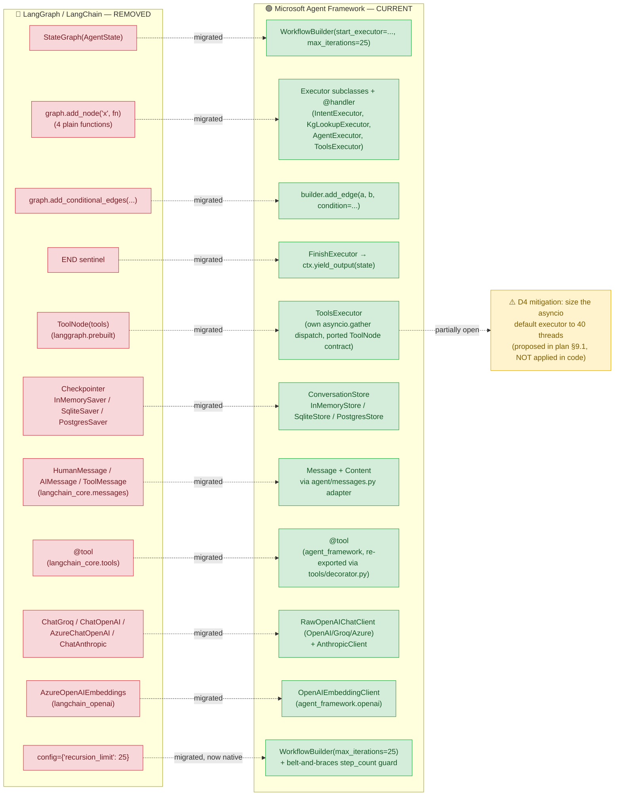
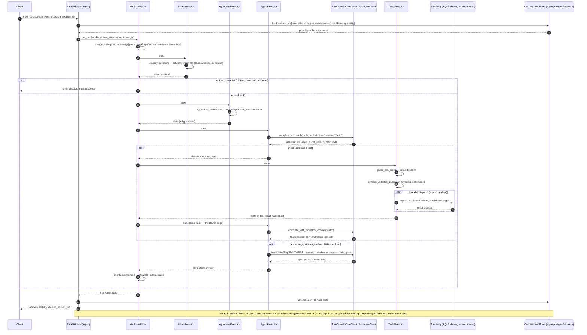

# LangGraph → Microsoft Agent Framework (MAF) Migration

**Repo:** `sqlagent-as-a-service`
**Branch:** `feat/sqlagent-kg-maf` (uncommitted working-tree changes at the time of writing)
**Reference plan:** [`docs/MAF_MIGRATION_PLAN.md`](docs/MAF_MIGRATION_PLAN.md) — the pre-implementation design document this migration was executed against. This document describes the **actual state of the code**, verified against that plan.

> **Glossary, up front, for readers new to either framework:**
>
> - **LangGraph** — a Python library for building stateful, multi-step LLM agents as a graph of "nodes" (functions) connected by "edges" (including conditional/branching edges). The old orchestration layer here.
> - **MAF (Microsoft Agent Framework)** — the successor to Microsoft's Semantic Kernel and AutoGen projects; offers a similar graph-of-steps abstraction called a **Workflow**, built from **Executor** classes. The new orchestration layer here.
> - **ReAct loop** — the agent pattern this codebase implements: the LLM reasons about a question, calls a tool (SQL lookup, calculation, etc.), reads the result, and repeats until it can answer. Both frameworks are just different plumbing around the same loop.
> - **Checkpointer / thread** (LangGraph) vs. **ConversationStore / thread_id** (MAF, this repo's own naming) — both mean "the saved conversation state for one chat session, keyed by an ID."

---

## 1. Executive Summary

The `sqlagent-as-a-service` agent — a bounded ReAct loop that answers natural-language questions by selecting SQL/calculation tools — has been re-platformed from **LangGraph + LangChain** onto **Microsoft Agent Framework (MAF)**. The change is a deliberate **framework substitution, not a redesign**: every node, edge, guard, retry, and log line was ported 1:1 (per the "prime directive" stated in the migration plan), so the agent's external behavior — its HTTP contract, its tool-selection logic, its retry/self-correction rules — is intended to be unchanged. The motivation (per the plan doc) is to move off a framework whose newer async/checkpointing APIs were adding friction, onto Microsoft's actively-developed MAF, while keeping the blast radius small because only `sql_agent/agent/` and five downstream call sites ever imported the framework directly. As of this writing, **the migration is code-complete and passing the full test suite (212/212 tests, including a dedicated 9-scenario parity gate). 

Structurally, migration is **~95% complete**: no LangGraph/LangChain imports remain anywhere in the codebase; the ~5% gap is runtime validation (live-provider smoke test, eval-harness parity run, and one proposed concurrency mitigation that was never applied — see §9).

---

## 2. Migration Overview Diagram

**Reading this diagram:** every red (old) box has a fully-migrated green (new) counterpart — there is no component still running on LangGraph. The single yellow box is not a leftover LangGraph dependency; it is a documented performance mitigation (§9.1 "D4" in the plan) that was designed but never wired into `service/api.py`, so it is a live risk rather than a migration gap per se.

---

## 3. Component Mapping Table

| LangGraph / LangChain Concept                                      | MAF Equivalent                                                                                                                        | File(s) Affected                                                            | Status      | Notes                                                                                                                                                                        |
| ------------------------------------------------------------------ | ------------------------------------------------------------------------------------------------------------------------------------- | --------------------------------------------------------------------------- | ----------- | ---------------------------------------------------------------------------------------------------------------------------------------------------------------------------- |
| `StateGraph(AgentState)`                                         | `WorkflowBuilder()`                                                                                                                 | `agent/workflow.py` (was `agent/graph.py`)                              | ✅ Migrated | Graph-of-executors replaces graph-of-functions                                                                                                                               |
| `graph.add_node("x", fn)`                                        | `class XExecutor(Executor)` + `@handler async def run(...)`                                                                       | `agent/workflow.py`                                                       | ✅ Migrated | 4 plain functions (`intent_node`, `kg_lookup_node`, `agent_node`, `tool_node`) became 5 executor classes (adds an explicit `FinishExecutor` for `END`)           |
| `graph.add_conditional_edges(...)`                               | `builder.add_edge(a, b, condition=callable)` — one call per branch                                                                 | `agent/workflow.py`                                                       | ✅ Migrated | MAF has no single "conditional edges" call; each branch is its own`add_edge`                                                                                               |
| `graph.set_entry_point("intent")`                                | `WorkflowBuilder(start_executor=intent)`                                                                                            | `agent/workflow.py`                                                       | ✅ Migrated | Constructor kwarg, not a method                                                                                                                                              |
| `END`                                                            | Explicit`FinishExecutor` calling `ctx.yield_output(state)`                                                                        | `agent/workflow.py`                                                       | ✅ Migrated | MAF has no`END` sentinel; termination is modeled as a real terminal node                                                                                                   |
| `graph.compile(checkpointer=...)`                                | `builder.build()` (workflow) + separate `ConversationStore` consulted per turn                                                    | `agent/workflow.py`, `memory/conversation_store.py`                     | ✅ Migrated | Memory is no longer a compile-time argument — decoupled into`run_turn()`                                                                                                  |
| `graph.invoke(state, config)`                                    | `await workflow.run(state)`                                                                                                         | `agent/workflow.py`, `service/api.py`                                   | ✅ Migrated | **Sync → async**; propagates through the whole call chain (§7)                                                                                                       |
| `Annotated[list, add_messages]` (state reducer)                  | Local`add_messages()` port + `merge_state()`                                                                                      | `agent/state.py`                                                          | ✅ Migrated | MAF has no built-in reducers; the LangGraph reducer semantics were hand-ported                                                                                               |
| `ToolNode(tools).invoke(state)`                                  | `ToolsExecutor` (custom, ~90 lines)                                                                                                 | `agent/workflow.py`                                                       | ✅ Migrated | Reproduces ToolNode's parallel dispatch, schema validation, and error-message templates verbatim (see §6)                                                                   |
| `llm.bind_tools(tools, tool_choice="any"/"auto")`                | `complete_with_tools(step, msgs, tools, tool_choice)` → `ChatOptions(tools=..., tool_choice={"mode": ...})`                      | `llm/step.py`                                                             | ✅ Migrated | `"any"` → `"required"`; `ToolMode` is a TypedDict, not a string                                                                                                       |
| `@tool` (`langchain_core.tools`)                               | `@tool` (`agent_framework`), re-exported                                                                                          | `tools/decorator.py` + 11 tool modules                                    | ✅ Migrated | One-line import swap per tool module; docstrings (= the routing logic) carry over verbatim                                                                                   |
| `HumanMessage` / `AIMessage` / `ToolMessage`                 | `Message(role, [Content...])` — one tagged `Content` type discriminated by `.type`                                             | `agent/messages.py` (new adapter)                                         | ✅ Migrated | Adapter functions (`is_user`, `text_of`, `tool_calls_of`, etc.) isolate every downstream caller from MAF's data model                                                  |
| `ChatGroq` / `ChatOpenAI` / `AzureChatOpenAI`                | `RawOpenAIChatClient` (one class serves OpenAI, Groq via `base_url`, and Azure via `azure_endpoint`)                            | `llm/factory.py`                                                          | ✅ Migrated | Must be the**Raw** variant — the non-Raw client auto-executes tool calls, which would break this codebase's own tool-execution step                                   |
| `ChatAnthropic`                                                  | `agent_framework.anthropic.AnthropicClient`                                                                                         | `llm/factory.py`                                                          | ✅ Migrated | Optional dependency (`agent-framework-anthropic`), imported lazily                                                                                                         |
| `AzureOpenAIEmbeddings`                                          | `agent_framework.openai.OpenAIEmbeddingClient`                                                                                      | `semantic_layer/embeddings.py`                                            | ✅ Migrated | Async client wrapped with`asyncio.run()` since `embed()` is called from sync code                                                                                        |
| `response.usage_metadata`                                        | `ChatResponse.usage_details` (`UsageDetails`)                                                                                     | `llm/factory.py` (`log_usage`)                                          | ✅ Migrated | Field names also changed (`input_token_count` vs. `input_tokens`, etc.)                                                                                                  |
| `InMemorySaver` / `SqliteSaver` / `PostgresSaver`            | `ConversationStore` (project-authored: `InMemoryStore` / `SqliteStore` / `PostgresStore`)                                     | `memory/conversation_store.py` (new; replaces `memory/checkpointer.py`) | ✅ Migrated | Same`CHECKPOINTER_BACKEND` env values (`memory`\|`sqlite`\|`postgres`) preserved on purpose so `.env` files don't break                                            |
| `GraphRecursionError` (LangGraph's built-in, limit 25)           | `WorkflowBuilder(max_iterations=25)` (native) + hand-rolled `GraphRecursionError` subclass of `Exception` for API compatibility | `agent/workflow.py`, `validation/exceptions.py`                         | ✅ Migrated | MAF's own ceiling is native and*better* than the LangGraph original (no hand-rolled counter needed) — kept anyway so the API error envelope/log level stay byte-identical |
| Sync FastAPI endpoints (tool bodies ran in anyio's 40-thread pool) | `async def` endpoints + `asyncio.to_thread(...)` per tool call                                                                    | `service/api.py`, `agent/workflow.py` (`ToolsExecutor._dispatch`)     | 🟡 Partial  | Functionally equivalent, but the**thread-pool capacity was not resized** (default executor caps at `min(32, cpu+4)` vs. anyio's 40) — see §9 Open Risks            |

---

## 4. Detailed Change Log Table

| File Path                                                                        | What Changed                                                                                                                    | Before (LangGraph pattern)                                                                                                                                                                                                                                 | After (MAF pattern)                                                                                                                                                                                                                                                                                                                               | Reason for Change                                                                                                                                                                                                                   |
| -------------------------------------------------------------------------------- | ------------------------------------------------------------------------------------------------------------------------------- | ---------------------------------------------------------------------------------------------------------------------------------------------------------------------------------------------------------------------------------------------------------- | ------------------------------------------------------------------------------------------------------------------------------------------------------------------------------------------------------------------------------------------------------------------------------------------------------------------------------------------------- | ----------------------------------------------------------------------------------------------------------------------------------------------------------------------------------------------------------------------------------- |
| `sql_agent/agent/graph.py`                                                     | **Deleted** (339 lines)                                                                                                   | The entire`StateGraph` definition: 4 node functions, 2 conditional-edge functions, `build_sql_agent_graph()`                                                                                                                                           | Replaced by`agent/workflow.py`                                                                                                                                                                                                                                                                                                                  | Framework substitution                                                                                                                                                                                                              |
| `sql_agent/agent/workflow.py`                                                  | **New** (489 lines)                                                                                                       | —                                                                                                                                                                                                                                                         | Port of`graph.py`: 5 `Executor` classes, `WorkflowBuilder` wiring, `run_turn()` orchestration helper that merges prior thread state and persists the result                                                                                                                                                                               | Ported node bodies "verbatim" per the plan's prime directive; only the plumbing (sync→async, executor classes vs. functions, explicit`FinishExecutor`) differs                                                                   |
| `sql_agent/agent/messages.py`                                                  | **New** (113 lines)                                                                                                       | —                                                                                                                                                                                                                                                         | Adapter layer: constructors (`user_message`, `tool_message`, ...), predicates (`is_user`, `is_tool_result`, ...), accessors (`text_of`, `tool_calls_of`, ...) over MAF's `Message`/`Content` types                                                                                                                                | Isolates every downstream module from MAF's data model in one place, the same design role`langchain_core.messages` played before                                                                                                  |
| `sql_agent/agent/state.py`                                                     | Modified                                                                                                                        | `messages: Annotated[list, add_messages]` using LangGraph's built-in reducer import                                                                                                                                                                      | `messages: list` (plain) + hand-written `add_messages()` and new `merge_state()` functions; added `step_count: int` field                                                                                                                                                                                                                 | MAF has no state-reducer concept, so the append/replace-by-id semantics were manually ported;`step_count` backs the new recursion guard                                                                                           |
| `sql_agent/agent/__init__.py`                                                  | Modified (comment only)                                                                                                         | Docstring: "the only layer that imports a framework (LangGraph)"                                                                                                                                                                                           | Docstring updated to "Microsoft Agent Framework"                                                                                                                                                                                                                                                                                                  | Documentation accuracy                                                                                                                                                                                                              |
| `sql_agent/llm/factory.py`                                                     | Modified                                                                                                                        | `_build_groq`/`_build_openai`/`_build_azure`/`_build_anthropic` each returned one pre-configured LangChain chat-model instance (e.g. `ChatGroq(model=..., temperature=...)`)                                                                     | Each builder now returns a`(client, default_options)` tuple; sampling params (temperature, etc.) moved from the client constructor to the per-call `ChatOptions`                                                                                                                                                                              | MAF puts sampling parameters on the call, not the client; also required switching to the**Raw** client variants (see §6)                                                                                                     |
| `sql_agent/llm/step.py`                                                        | **New** (67 lines)                                                                                                        | —                                                                                                                                                                                                                                                         | `complete_with_tools()` (one model step with tools, no auto-execution), `acomplete()`/`complete()` (plain prompt→text, async/sync)                                                                                                                                                                                                         | New "isolation seam" so the 6 call sites that previously did`get_llm(step).invoke(prompt)` don't need to know MAF's response shape                                                                                                |
| `sql_agent/llm/__init__.py`                                                    | Modified                                                                                                                        | Exported`Step, get_llm, log_usage`                                                                                                                                                                                                                       | Also exports`complete, acomplete, complete_with_tools`                                                                                                                                                                                                                                                                                          | Surface new public helpers from`step.py`                                                                                                                                                                                          |
| `sql_agent/config.py`                                                          | Modified                                                                                                                        | —                                                                                                                                                                                                                                                         | Added`groq_base_url` setting (Groq reached via OpenAI-compatible endpoint since MAF ships no Groq-specific client); also (found in code, beyond the original plan) added `groq_reasoning_max_output_tokens` and extended reasoning-model detection from `"gpt-oss"`-only to include `"qwen"`                                              | MAF architectural requirement (`groq_base_url`) plus an empirically-discovered truncation bug fix that shipped alongside the migration                                                                                            |
| `sql_agent/tools/decorator.py`                                                 | **New** (19 lines)                                                                                                        | —                                                                                                                                                                                                                                                         | Re-exports`agent_framework.tool` as `tool`                                                                                                                                                                                                                                                                                                    | Central swap point — all 11 tool modules import from here instead of a framework directly, so a future orchestrator swap costs one line, not eleven                                                                                |
| `sql_agent/tools/{dynamic,kg,meta,parameterised,semi_dynamic}/*.py` (11 files) | Modified (1 import line each)                                                                                                   | `from langchain_core.tools import tool`                                                                                                                                                                                                                  | `from sql_agent.tools.decorator import tool`                                                                                                                                                                                                                                                                                                    | Mechanical decorator swap                                                                                                                                                                                                           |
| `sql_agent/tools/semi_dynamic/search_tools.py`                                 | Modified (also parameter annotations)                                                                                           | `segment: str = None` (LangChain tolerated implicit-Optional)                                                                                                                                                                                            | `segment: str \| None = None`                                                                                                                                                                                                                                                                                                                    | MAF builds a strict Pydantic schema from the type annotation and rejects`None` against a bare `str`; behavior is identical, only the type hint needed correcting                                                                |
| `sql_agent/tools/parameterised/{customer,deal,product,semantic_view}_tools.py` | Same implicit-Optional fix as`search_tools.py`, applied to `find_products`/`find_policies`/`find_deals`-style functions | —                                                                                                                                                                                                                                                         | —                                                                                                                                                                                                                                                                                                                                                | Same MAF schema-strictness reason                                                                                                                                                                                                   |
| `sql_agent/memory/checkpointer.py`                                             | **Deleted** (90 lines)                                                                                                    | `get_checkpointer()` — built `InMemorySaver`/`SqliteSaver`/`PostgresSaver` from `langgraph.checkpoint.*`                                                                                                                                        | Replaced by`memory/conversation_store.py`                                                                                                                                                                                                                                                                                                       | Framework substitution                                                                                                                                                                                                              |
| `sql_agent/memory/conversation_store.py`                                       | **New** (170 lines)                                                                                                       | —                                                                                                                                                                                                                                                         | `ConversationStore` ABC + `InMemoryStore`/`SqliteStore`/`PostgresStore`, storing the **whole `AgentState` per thread_id** as JSON (`Message.to_dict()`/`from_dict()` round-trip)                                                                                                                                              | MAF has no built-in checkpointer; this hand-rolled store reproduces the same persistence contract.`get_checkpointer = get_conversation_store` alias kept for compatibility                                                        |
| `sql_agent/memory/__init__.py`                                                 | Modified                                                                                                                        | Exported`get_checkpointer`                                                                                                                                                                                                                               | Exports both`get_checkpointer` (aliased) and `get_conversation_store`                                                                                                                                                                                                                                                                         | Backward-compatible export surface during cutover                                                                                                                                                                                   |
| `sql_agent/kg/node.py`                                                         | Modified                                                                                                                        | `isinstance(m, HumanMessage)`, `m.content`                                                                                                                                                                                                             | `is_user(m)`, `text_of(m)` (from `agent/messages.py`)                                                                                                                                                                                                                                                                                       | Adopt the message adapter; node body logic unchanged                                                                                                                                                                                |
| `sql_agent/routing/intent_classifier.py`                                       | Modified                                                                                                                        | `classify()` was sync; called `get_llm(Step.INTENT).invoke(prompt)`, read `.content`                                                                                                                                                                 | `classify()` is now `async def`; calls `await acomplete(Step.INTENT, prompt)`                                                                                                                                                                                                                                                               | One of the "6 hidden`get_llm().invoke()` call sites" the plan called out as easy to miss; propagates async since `AgentExecutor` awaits it                                                                                      |
| `sql_agent/routing/query_engine.py`                                            | Modified (2 lines)                                                                                                              | `get_llm(step).invoke(prompt)` + manual `log_usage` + `.content` read                                                                                                                                                                                | `complete(step, prompt)` (sync helper; usage logging happens inside)                                                                                                                                                                                                                                                                            | Same call-site simplification; stays**sync** deliberately since it runs inside a worker thread (`asyncio.to_thread`) already                                                                                                |
| `sql_agent/semantic_layer/embeddings.py`                                       | Modified                                                                                                                        | `AzureOpenAIEmbeddings(...).embed_documents(...)` (`langchain_openai`)                                                                                                                                                                                 | `OpenAIEmbeddingClient(...)`; `asyncio.run(self._client.get_embeddings(...))`                                                                                                                                                                                                                                                                 | MAF ships its own embedding client; wrapped in`asyncio.run` because `embed()` is invoked from sync code on a worker thread                                                                                                      |
| `sql_agent/semantic_layer/schema_link.py`                                      | Modified (2 lines)                                                                                                              | `get_llm(Step.PLAN).invoke(prompt)` + manual usage/content handling                                                                                                                                                                                      | `complete(Step.PLAN, prompt)`                                                                                                                                                                                                                                                                                                                   | Same call-site simplification pattern                                                                                                                                                                                               |
| `sql_agent/validation/answer_validator.py`                                     | Modified (2 lines)                                                                                                              | `get_llm(Step.JUDGE).invoke(prompt)` + manual usage/content handling                                                                                                                                                                                     | `complete(Step.JUDGE, prompt)`                                                                                                                                                                                                                                                                                                                  | Same call-site simplification pattern                                                                                                                                                                                               |
| `sql_agent/validation/exceptions.py`                                           | Modified                                                                                                                        | Only`SQLAgentError` and its subclasses existed                                                                                                                                                                                                           | Added`GraphRecursionError(Exception)` — deliberately **not** a subclass of `SQLAgentError`                                                                                                                                                                                                                                             | Preserves the original error-handling/log-level branch in`service/api.py` (recursion failures log at `ERROR`, not `WARNING`) even though LangGraph itself is gone                                                             |
| `sql_agent/service/api.py`                                                     | Modified (145 lines changed)                                                                                                    | `ask()`/`_prewarm()` were sync `def`; used `graph.invoke(state, config={"configurable": {"thread_id": ...}, "recursion_limit": 25})`; `graph.get_state(config)` to peek at prior messages; `isinstance` checks against LangChain message types | `ask()`/`_prewarm()` are `async def`; calls `await run_turn(workflow, state, store=store, thread_id=session_id)`; reads prior state via `store.load(session_id)`; uses the `agent/messages.py` adapter throughout; `/invoke` now validates args via `tool.input_model(**args).model_dump()` before calling `tool.func` directly | Structural sync→async change (§6) plus decoupling conversation memory from the compiled graph object                                                                                                                              |
| `eval/run_agent.py`                                                            | Modified (41 lines)                                                                                                             | Sync runner; imported`agent.graph`, `langchain_core.messages`                                                                                                                                                                                          | Async runner (wrapped in`asyncio.run`); uses `agent.workflow` + `agent/messages.py` adapters                                                                                                                                                                                                                                                | Follows the same async propagation as the production service                                                                                                                                                                        |
| `eval/run_eval.py`                                                             | Modified (51 lines)                                                                                                             | Same as above — a second, independent agent runner                                                                                                                                                                                                        | Same async + adapter migration                                                                                                                                                                                                                                                                                                                    | The plan flagged this as "the 2nd eval runner," easy to miss since it duplicates`run_agent.py`'s logic                                                                                                                            |
| `eval/scorers.py`                                                              | Modified (5 lines)                                                                                                              | `get_llm(Step.JUDGE).invoke(prompt)`                                                                                                                                                                                                                     | `complete(Step.JUDGE, prompt)`                                                                                                                                                                                                                                                                                                                  | Call-site simplification                                                                                                                                                                                                            |
| `eval/compare_llm.py`                                                          | Modified (5 lines)                                                                                                              | `get_llm(Step.JUDGE).invoke(prompt)`                                                                                                                                                                                                                     | `complete(Step.JUDGE, prompt)`                                                                                                                                                                                                                                                                                                                  | Call-site simplification                                                                                                                                                                                                            |
| `scripts/agent_scenario_tests.py`                                              | Modified (46 lines)                                                                                                             | Sync scenario runner against`langchain_core.messages`                                                                                                                                                                                                    | Async runner + adapters                                                                                                                                                                                                                                                                                                                           | Same pattern as the eval runners                                                                                                                                                                                                    |
| `scripts/init_agent_db.py`                                                     | Modified (9 lines)                                                                                                              | Imported`memory.checkpointer` by path to initialize tables                                                                                                                                                                                               | Imports`memory.conversation_store`                                                                                                                                                                                                                                                                                                              | Follows the module rename                                                                                                                                                                                                           |
| `tests/conftest.py`                                                            | **New**                                                                                                                   | —                                                                                                                                                                                                                                                         | Adds a`call_tool()` helper used by tests that previously called `tool.invoke({...})`                                                                                                                                                                                                                                                          | LangChain's`StructuredTool.invoke(dict)` has no MAF equivalent; centralizing the replacement avoids repeating validation logic in every test                                                                                      |
| `tests/test_agent_node.py`                                                     | Modified (20 lines)                                                                                                             | Constructed`HumanMessage`/`AIMessage`/`ToolMessage` directly                                                                                                                                                                                         | Uses`agent/messages.py` constructors                                                                                                                                                                                                                                                                                                            | Keep tests aligned with the new message model                                                                                                                                                                                       |
| `tests/test_kg_tools.py`, `tests/test_router.py`, `tests/test_tools.py`    | Modified (small)                                                                                                                | `tool.invoke({...})`                                                                                                                                                                                                                                     | `call_tool(tool, {...})` (from `conftest.py`)                                                                                                                                                                                                                                                                                                 | Mechanical replacement for the removed`.invoke()` convenience method                                                                                                                                                              |
| `tests/test_memory.py`                                                         | Modified (115 lines)                                                                                                            | Tested`InMemorySaver`/`SqliteSaver`/`PostgresSaver` from `langgraph.checkpoint.*`                                                                                                                                                                  | Tests`InMemoryStore`/`SqliteStore`/`PostgresStore` from `memory/conversation_store.py`                                                                                                                                                                                                                                                    | Test suite follows the checkpointer→store rename                                                                                                                                                                                   |
| `tests/test_workflow_parity.py`                                                | **New** (333 lines)                                                                                                       | —                                                                                                                                                                                                                                                         | 9 test cases (scripted fake LLM client, no network) asserting the specific behaviors enumerated in the plan's §9.2 parity checklist — tool-choice switching, error templates, schema rejection, circuit breaker, recursion ceiling, multi-turn thread merge, verbatim-question enforcement                                                      | The migration's own regression gate — proves the port didn't silently change observable behavior                                                                                                                                   |
| `pyproject.toml`                                                               | Modified (43 lines)                                                                                                             | Depended on`langgraph`, `langchain-core`, `langchain-groq`, `langchain-openai`, `langchain-anthropic`; `memory` group had `langgraph-checkpoint-{postgres,sqlite}`                                                                           | Depends on`agent-framework`, `agent-framework-openai`, pinned `openai>=2.25,<3`; new `anthropic` extra (`agent-framework-anthropic`) and `demo` extra (`streamlit`, `requests`)                                                                                                                                                   | See §7 for the full dependency table                                                                                                                                                                                               |
| `uv.lock`                                                                      | Modified (5,240 lines changed — lockfile regeneration)                                                                         | —                                                                                                                                                                                                                                                         | —                                                                                                                                                                                                                                                                                                                                                | Mechanical consequence of the dependency swap                                                                                                                                                                                       |
| `.env.example`                                                                 | Modified (2 lines)                                                                                                              | —                                                                                                                                                                                                                                                         | Added commented`GROQ_BASE_URL`                                                                                                                                                                                                                                                                                                                  | Documents the new`groq_base_url` setting                                                                                                                                                                                          |
| `README.md`                                                                    | Modified (12 lines)                                                                                                             | Described`agent/graph.py`; `get_llm(Step.GENERATION)` usage example                                                                                                                                                                                    | Describes`agent/workflow.py` + `agent/messages.py`; usage example now shows `complete(Step.GENERATION, prompt)`                                                                                                                                                                                                                             | Keep onboarding docs accurate                                                                                                                                                                                                       |
| `ui/app.py`, `ui/api_client.py`, `ui/README.md`                            | **New** (534 lines, untracked)                                                                                            | —                                                                                                                                                                                                                                                         | A Streamlit chat UI that talks to the FastAPI service over plain HTTP                                                                                                                                                                                                                                                                             | **Not part of the migration** — has zero LangGraph/MAF imports of its own — but was added in the same working-tree change set; included here for completeness since it's an untracked new directory alongside the migration |

---

## 5. What Remains Unchanged

| Component / File                                                                                                                                                 | Why It Wasn't Touched                                                                                                                                                                                           | Risk / Tech-Debt Notes                                                                                                                     |
| ---------------------------------------------------------------------------------------------------------------------------------------------------------------- | --------------------------------------------------------------------------------------------------------------------------------------------------------------------------------------------------------------- | ------------------------------------------------------------------------------------------------------------------------------------------ |
| `sql_agent/db/` (all files)                                                                                                                                    | Zero framework imports — pure SQLAlchemy data access                                                                                                                                                           | None; correctly isolated by the original architecture                                                                                      |
| `sql_agent/calculations/` (all files)                                                                                                                          | Pure formulas, no SQL, no LLM                                                                                                                                                                                   | None                                                                                                                                       |
| `sql_agent/feedback/` (all files)                                                                                                                              | No framework dependency                                                                                                                                                                                         | None                                                                                                                                       |
| `sql_agent/formatting/` (all files)                                                                                                                            | No framework dependency (audit logging, response formatting)                                                                                                                                                    | None                                                                                                                                       |
| `sql_agent/validation/sql_validator.py`                                                                                                                        | No framework dependency (only`exceptions.py` in this package changed)                                                                                                                                         | None                                                                                                                                       |
| `sql_agent/kg/` — everything except `node.py` (retrieval, context, client)                                                                                  | No framework dependency;`node.py` only needed the message-type swap                                                                                                                                           | None                                                                                                                                       |
| `sql_agent/semantic_layer/` — everything except `embeddings.py` and `schema_link.py` (catalog, glossary, joins, loader, renderer, selector, vector_index) | No direct LLM client or message-type usage                                                                                                                                                                      | None                                                                                                                                       |
| `sql_agent/routing/tier_router.py`, `routing/entity_resolver.py`, `routing/intent_tagger.py`                                                               | No framework dependency                                                                                                                                                                                         | None                                                                                                                                       |
| `sql_agent/tools/registry.py`                                                                                                                                  | `ALL_TOOLS` is just a name→object map; MAF's `FunctionTool` exposes `.name` the same way LangChain's `StructuredTool` did, so no code here needed to change                                            | None — confirmed by the plan's verification log                                                                                           |
| `sql_agent/agent/prompts.py`                                                                                                                                   | Plain string templates, no framework coupling                                                                                                                                                                   | None                                                                                                                                       |
| `sql_agent/config.py` (all settings except the 2 additions in §4)                                                                                             | No functional/behavioral change needed                                                                                                                                                                          | None                                                                                                                                       |
| `scripts/build_*.py`, `scripts/load_excel_to_db.py`                                                                                                          | No agent-runtime dependency (offline build tooling)                                                                                                                                                             | None                                                                                                                                       |
| `eval/deterministic/` (entire subpackage)                                                                                                                      | No framework dependency                                                                                                                                                                                         | None                                                                                                                                       |
| 13 of 20 test modules not listed in §4                                                                                                                          | Test the unaffected packages above                                                                                                                                                                              | None                                                                                                                                       |
| **`asyncio.to_thread` default executor sizing** (proposed `_size_executor()` startup hook in the plan, §9.1 "D4")                                     | **Not implemented** — the plan proposed resizing the event loop's default thread pool to 40 workers (to match FastAPI's old anyio pool) but the corresponding code was never added to `service/api.py` | **Real, open risk** — see §9 Open Risks below; this is a genuine gap, not an intentional deferral                                  |
| Live LLM provider wiring (Groq`reasoning_effort`/`reasoning_format`, tool_choice=`required` behavior under real providers)                                 | The plan's reference spike (`docs/maf/reference_spike.py`) used a fake chat client; no request has yet been made to a real provider through the new MAF clients                                               | **Scheduled for validation, not yet done** — flagged explicitly in the plan's §13 verification log as "still unresolved"           |
| **`docs/MAF_MIGRATION_PLAN.md` and `docs/maf/reference_spike.py`**                                                                                     | Planning artifacts, kept as historical record and as the parity-test rationale                                                                                                                                  | None — should probably be marked "implemented" once this document/commit lands, so future readers don't mistake it for still-pending work |

---

## 6. Data Flow / Request Lifecycle Diagram

The sequence below traces one `/v1/sql-agent/ask` call end-to-end. **Every hop shown is MAF-native** — there is no LangGraph glue code left anywhere in the live request path. The two dashed notes call out the only places where the code intentionally keeps LangGraph-era **naming** (`get_checkpointer`, `GraphRecursionError`) for external/API compatibility, even though nothing underneath is LangGraph anymore.

---

## 7. Dependency Changes Table

| Package                                                                | Old Version / Removed                    | New Version / Added                       | Purpose                                                                                                                                                         |
| ---------------------------------------------------------------------- | ---------------------------------------- | ----------------------------------------- | --------------------------------------------------------------------------------------------------------------------------------------------------------------- |
| `langgraph`                                                          | `>=0.2.0` → **removed**         | —                                        | Was the orchestration engine (StateGraph)                                                                                                                       |
| `langchain-core`                                                     | `>=0.3.0` → **removed**         | —                                        | Was the message types (`HumanMessage`, etc.) and `@tool` decorator                                                                                          |
| `langchain-groq`                                                     | `>=0.2.0` → **removed**         | —                                        | Was the Groq chat-model client                                                                                                                                  |
| `langchain-openai`                                                   | `>=0.2.0` → **removed**         | —                                        | Was the OpenAI/Azure chat-model + embeddings clients                                                                                                            |
| `langchain-anthropic`                                                | `>=0.2.0` → **removed**         | —                                        | Was the Anthropic chat-model client                                                                                                                             |
| `langgraph-checkpoint-postgres` (in `memory` dependency group)     | `>=2.0.0` → **removed**         | —                                        | Was`PostgresSaver`                                                                                                                                            |
| `langgraph-checkpoint-sqlite` (in `memory` dependency group)       | (unpinned) →**removed**           | —                                        | Was`SqliteSaver`                                                                                                                                              |
| `agent-framework`                                                    | —                                       | **added**, `>=1.16.0,<2`          | Core MAF package —`WorkflowBuilder`, `Executor`, `Message`/`Content`, `@tool`                                                                        |
| `agent-framework-openai`                                             | —                                       | **added**, `>=1.14.0`             | Provider client (`RawOpenAIChatClient`, `OpenAIEmbeddingClient`) — serves OpenAI, Groq (via `base_url`), and Azure (via `azure_endpoint`) in one class |
| `openai`                                                             | (transitive, unpinned)                   | **added, pinned**, `>=2.25,<3`    | `agent-framework-openai`'s underlying SDK; an unpinned install resolves to a 3.x that breaks import — pin is load-bearing, not cosmetic                      |
| `agent-framework-anthropic` (new `anthropic` extra)                | —                                       | **added (optional)**, `>=1.0.0b1` | Anthropic provider client; only pulled in when`LLM_*_PROVIDER=anthropic`; still pre-release upstream                                                          |
| `streamlit` (new `demo` extra)                                     | —                                       | **added (optional)**, `>=1.38.0`  | Powers the new`ui/` Streamlit POC (unrelated to the MAF migration itself, shipped alongside it)                                                               |
| `requests` (new `demo` extra)                                      | —                                       | **added (optional)**, `>=2.31.0`  | HTTP client for the`ui/` POC to call the FastAPI service                                                                                                      |
| `psycopg[binary]`, `psycopg-pool` (in `memory` dependency group) | Present before (backed`PostgresSaver`) | Retained, unchanged                       | Now back`PostgresStore` in `conversation_store.py` instead                                                                                                  |

**Net dependency change:** 7 packages/entries removed, 6 added (3 core, 1 optional-Anthropic, 2 optional-demo). `requires-python = ">=3.13"` is unchanged; MAF itself only requires `>=3.10`.

---

## 8. Testing & Validation

**What exists and passes today:**

- **Full suite: 212/212 tests pass** (`pytest -q`, ~17s), covering the entire repo including the migrated code paths.
- **`tests/test_workflow_parity.py`** (new, 9 test cases) — the migration's dedicated regression gate. Uses a scripted `FakeClient` (subclass of `agent_framework.BaseChatClient`) so it exercises the **real** `agent/workflow.py` module with zero network/DB access. It asserts, specifically:
  1. Happy-path tool selection + `tool_choice` switching (`required` → `auto`)
  2. A raising tool becomes an `Error: ValueError(...)` tool message (drives self-correction)
  3. An unknown tool name produces the exact LangGraph-verbatim error string (`"Error: X is not a valid tool, try one of [...]"`)
  4. Bad/mistyped tool args are schema-rejected **before** the tool body runs (proves parity item **D2** — validation via `fn.input_model`)
  5. `out_of_scope` intent short-circuits only when `intent_detection_enforced=True`; shadow mode proceeds normally
  6. Multi-turn thread memory: `kg_context` survives a turn that doesn't resend it; per-turn counters reset (proves `merge_state`)
  7. The circuit breaker aborts a turn that's already at `MAX_TOOL_CALLS_PER_TURN`; a forced infinite loop hits the recursion ceiling and raises `GraphRecursionError`
  8. Verbatim-question enforcement rewrites a paraphrased `analytical_query.question` arg back to the user's exact words in dynamic-only mode
- **Every other test file touched by the migration** (`test_agent_node.py`, `test_kg_tools.py`, `test_memory.py`, `test_router.py`, `test_tools.py`) was updated mechanically to use the new message adapters (`agent/messages.py`) and the new `call_tool()` test helper (`tests/conftest.py`) in place of the removed `.invoke({...})` convenience method.
- The plan's own **§9.1 "Deltas that are real but inconsequential"** section documents several small, deliberately-accepted behavioral differences (e.g. an empty synthesis response now returns `""` instead of the string `"None"`) — reviewed and judged not to matter for this codebase.
