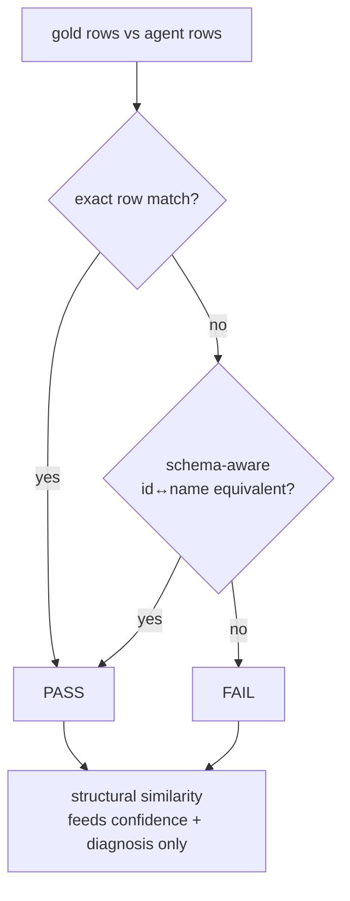

 

# Evaluation — Deterministic SQL Accuracy & RAG Retrieval

This directory contains two independent, **LLM-free** evaluation systems for the
text-to-SQL agent. Every number they produce is exact arithmetic: the same inputs always
give the same score, with no provider key, no tokens, and no run-to-run variance.

1. **Deterministic SQL accuracy** (`eval/deterministic/`) — did the agent produce the
   *right answer*, and was the SQL *built like gold*?
2. **RAG retrieval quality** (`check_table_retrieval.py`, `check_example_retrieval.py`) —
   did the retrievers surface the *right tables* and the *right few-shot examples* for a
   question?

---

## Table of contents

- [Core concepts — the similarity logics used everywhere](#core-concepts--the-similarity-logics-used-everywhere)
- [Part 1 — Deterministic SQL accuracy](#part-1--deterministic-sql-accuracy)
  - [The one verdict rule](#the-one-verdict-rule)
  - [Layer A — Answer correctness (decides PASS/FAIL)](#layer-a--answer-correctness-decides-passfail)
  - [Layer B — Query construction (diagnostic only)](#layer-b--query-construction-diagnostic-only)
  - [Layer C — Schema-aware semantic equivalence](#layer-c--schema-aware-semantic-equivalence)
  - [Confidence score](#confidence-score)
  - [Core-answer match (lenient lens)](#core-answer-match-lenient-lens)
  - [Diagnosis labels](#diagnosis-labels)
  - [Fully worked example](#fully-worked-example)
- [Part 2 — RAG retrieval quality](#part-2--rag-retrieval-quality)
  - [Table retrieval](#table-retrieval-check_table_retrievalpy)
  - [Example (few-shot) retrieval](#example-few-shot-retrieval-check_example_retrievalpy)
- [Formula Reference](#formula-reference)

---

# Core concepts — the similarity logics used everywhere

Before the layers, here are the handful of building blocks the whole evaluation is made of.
Every one of them boils "how alike are these two things?" down to a single number between
`0.0` (nothing in common) and `1.0` (identical), so scores from very different comparisons —
text, sets of rows, sets of tables — all live on the same scale and can be combined or
compared directly. All are implemented from scratch in
[deterministic/text_sim.py](deterministic/text_sim.py) (no external libraries), so each score
is exact and reproducible.

### Jaccard similarity — "how much do two sets overlap?"

Jaccard answers one question: *of everything that appears in either set, what fraction
appears in both?* You count the items the two sets share, then divide by the total number of
distinct items across both.

$$
J(A, B) = \frac{|A \cap B|}{|A \cup B|} = \frac{\text{items in both}}{\text{items in either}}
$$

- Identical sets → `1.0`; no shared items → `0.0`; half-shared → somewhere in between.
- **Order doesn't matter** and **duplicates are ignored** (it works on sets), which is
  exactly what you want when comparing things like "which tables were used" or "which words
  are in this name" — `{deals, product_master}` is the same set no matter what order you
  list them in.
- Two empty sets are treated as `1.0` (identical): "neither side selected anything" is
  agreement, not a failure to compare.

*Tiny example.* Gold used tables `{deals, product_master}`; the agent used
`{deals, accounts}`. They share only `deals` (1 item) out of `{deals, product_master, accounts}`
(3 distinct items), so Jaccard = `1/3 ≈ 0.33`.

**Where it is used in this eval:**

- **Row overlap** between the agent's result and gold (`result_jaccard`) — treated as a
  *multiset* so a row that should appear twice must appear twice.
- **Word overlap** between two text values (`token_set_ratio`) — the words are turned into a
  set, so "Ltd Trading Co" and "Trading Co Ltd" score `1.0` despite the reordering.
- **Table / pattern overlap** when judging retrieval quality and when re-ranking few-shot
  examples ([memory/example_ranker.py](../sql_agent/memory/example_ranker.py)).

### Edit distance (Levenshtein) — "how many keystrokes apart are two strings?"

Edit distance counts the fewest single-character edits — insert, delete, or substitute — that
turn one string into another. `"Overdraft"` → `"Overdaft"` is **1** edit (one deletion). To
put it on the shared `0..1` scale we normalise it into a similarity `ratio`:

$$
\text{ratio}(a, b) = 1 - \frac{\text{edit distance}}{\text{length of the longer string}}
$$

So a one-character slip in a nine-character word scores `1 − 1/9 ≈ 0.89` — "almost right",
not "wrong". This is what makes the evaluator **typo-tolerant**: a minor spelling wobble
doesn't get treated the same as a genuinely different value. Text is lower-cased and its
spacing is collapsed first, so cosmetic differences (`"Trade Finance"` vs `"trade  finance"`)
never cost anything.

### Fuzzy similarity — "the kinder of a typo-check and a word-overlap check"

Edit distance and Jaccard each have a blind spot: edit distance over-punishes **reordered**
words, and word-overlap ignores **typos** inside a word. The evaluator sidesteps both by
taking the **higher** of the two scores (`best_ratio`). A value only scores low when it fails
*both* tests — i.e. it is neither a near-spelling nor a re-ordering of the target, which is a
good signal that it is genuinely a different value. This combined, forgiving score is what
the docs call **fuzzy similarity**.

### Precision, recall, F1 — "how much noise, how much did we miss, and one number for both"

When comparing two collections (rows the agent returned vs gold rows; tables retrieved vs
tables actually needed), three standard measures apply:

- **Precision** — of what the agent *returned*, how much was correct? (Low precision = noise,
  extra junk.)
- **Recall** — of what gold *expected*, how much did the agent actually return? (Low recall =
  missed things.)
- **F1** — the harmonic mean of the two, a single number that stays low unless *both*
  precision and recall are high, so one good half can't hide a bad half.

$$
P = \frac{\text{correct}}{\text{returned}}, \quad R = \frac{\text{correct}}{\text{expected}}, \quad F_1 = \frac{2 P R}{P + R}
$$

---

Each gold item (from [datasets/gold_dynamic.yaml](datasets/gold_dynamic.yaml)) carries a
`question`, a `gold_sql`, and the `gold_result` (the rows that SQL returns). Each recorded
agent run carries an `agent_sql` and an `agent_result`. The evaluator grades one
`(gold item, agent run)` pair and returns a `DeterministicResult`.

## The one verdict rule

> **The DATA decides correctness. The SQL structure only explains it.**

A result is **PASS** if **either**:

- the returned **rows match gold exactly** (within tolerance), **or**
- the schema-aware matcher proves the two sets **name the same entities** under a swapped
  id ↔ name key.

Structural similarity of the SQL **never** flips the verdict. A completely different query
that returns the right rows PASSES; a byte-for-byte copy of gold's SQL that happened to
return nothing FAILS.



## Layer A — Answer correctness (decides PASS/FAIL)

File: [deterministic/result_metrics.py](deterministic/result_metrics.py). Compares the
**rows**, not the SQL text. It is deliberately forgiving of everything that is not the
answer, and strict about everything that is.

| Forgiven (not penalised)                                        | Strict (penalised)                   |
| --------------------------------------------------------------- | ------------------------------------ |
| Different row**order** (unless the question is a ranking) | A genuinely different value          |
| Different column**names** / order                         | A missing or extra row               |
| **Extra** agent columns                                   | A`NULL` where a value was expected |
| Numeric**rounding** within tolerance                      | —                                   |
| `0/1` vs `True/False`                                       | —                                   |
| Whitespace / case in text, minor typos (fuzzy)                  | —                                   |

**How cells are compared.** Each value is coerced to one of `num`, `null`, or `text`:

- **num**: match if `|gold − agent| ≤ tolerance`. Tolerance defaults to half the last
  published digit of the gold value (so `ROUND(x,1)` printing `16.2` matches a true
  `16.25`), floored by the dataset's `numeric_tolerance` (default `0.01`). A number is
  right or wrong — there is no "partially 42".
- **null**: matches **only** another `null` (a `NULL` is never equal to `0` or `""`).
- **text**: exact after lower/whitespace normalisation → `1.0`; otherwise a fuzzy edit +
  token-overlap ratio in `[0,1]` (typo tolerance).

**How columns are aligned.** *Name-first*: if the agent's columns cover gold's names, that
mapping is the only one used (so a same-name/different-value column is a real miss). Only
when names differ (a genuine rename) does it search column permutations (bounded to ≤ 8
columns) for the alignment that maximises total cell similarity.

**How rows are aligned.** For a ranking (order-sensitive) question, rows are compared
**positionally**. Otherwise each gold row is greedily paired with its most-similar unused
agent row, so "did every gold row come back" is measured independent of emit order.

### The metrics produced

| Metric                   | Meaning                                                  | Formula                                                                               |
| ------------------------ | -------------------------------------------------------- | ------------------------------------------------------------------------------------- |
| `result_exact_match`   | whole result identical to gold (within tolerance)        | `1.0` if every row & cell matches as a multiset (sequence if ranking), else `0.0` |
| `result_row_precision` | of the rows the agent returned, how many are correct     | `matched_rows / agent_rows`                                                         |
| `result_row_recall`    | of gold's rows, how many the agent returned              | `matched_rows / gold_rows`                                                          |
| `result_row_f1`        | harmonic mean of the two                                 | `2·P·R / (P+R)`                                                                   |
| `cell_accuracy`        | fraction of individual cells correct across aligned rows | `right_cells / total_cells`                                                         |
| `result_jaccard`       | row overlap                                              | `                                                                                     |
| `fuzzy_similarity`     | mean best-match row similarity, typo/rounding tolerant   | mean over gold rows of best aligned-row similarity                                    |

A row counts as *matched* only when its aligned pair is ≥ `0.999` similar (i.e. every cell
within tolerance) — near-miss rows are visible in `fuzzy_similarity`/`jaccard` but do not
inflate `row_f1`.

> **Order sensitivity is earned, not assumed.** A question is graded order-sensitively only
> when the dataset marks `order_sensitive: true` **AND** the gold SQL is structurally a real
> ranking — it has an `ORDER BY` **and** a `LIMIT` *below* the system's blanket 50-row cap.
> A plain `ORDER BY deal_id` (no limit, or the forced `LIMIT 50`) is treated as an unordered
> set, so a correct agent is never failed for a harmless permutation.

## Layer B — Query construction (diagnostic only)

File: [deterministic/sql_structure.py](deterministic/sql_structure.py). Parses both queries
with `sqlglot` and decomposes each into **seven schema elements**, scoring
precision/recall/F1 for each independently. This is **blind to text**: `WHERE a AND b` ==
`WHERE b AND a`, and `SELECT x AS m` == `SELECT x`.

> These numbers **never gate pass/fail**. A legitimately different but correct query *should*
> score below 1.0 here — that is exactly the LLM-vs-deterministic tension we want to surface.

| Element          | What it captures                                                                              |
| ---------------- | --------------------------------------------------------------------------------------------- |
| `tables`       | tables referenced                                                                             |
| `columns`      | bare column names in the query (minus output aliases)                                         |
| `joins`        | normalised`ON` conditions, split on `AND`, symmetric (`a=b` == `b=a`)                 |
| `filters`      | normalised`WHERE` + `HAVING` predicates, split on top-level `AND`                       |
| `group_by`     | grouping expressions                                                                          |
| `order_by`     | `(expr, ASC/DESC)`, alias-resolved; sequence kept for ranking checks                        |
| `aggregations` | `sum(amount)`, `count(*)`, `avg(distinct x)` … — catches AVG-of-pre-aggregated errors |

Per element, treating gold as ground truth:

$$
P = \frac{|gold \cap agent|}{|agent|}, \quad R = \frac{|gold \cap agent|}{|gold|}, \quad F_1 = \frac{2PR}{P+R}
$$

Two empty sets score `1.0` (agreement on absence is agreement — e.g. neither query has a
`WHERE`).

**`structural_similarity`** rolls the seven F1s into one `[0,1]` scalar via fixed weights
that reflect how much each element changes the *meaning* of a query:

| tables | columns | joins | filters | group_by | order_by | aggregations |
| ------ | ------- | ----- | ------- | -------- | -------- | ------------ |
| 0.22   | 0.18    | 0.16  | 0.20    | 0.10     | 0.05     | 0.09         |

**Reading those numbers.** Each column already has its own F1 score (0–1) saying how well the
agent matched gold on *that one part*. The numbers above are the **weights** used to combine
those seven scores into a single overall score — they say *how much each part matters*, because
getting the wrong **tables** breaks a query far more than getting the wrong sort **order**. The
seven weights **sum to 1.00**, so the result stays in `[0,1]`:

| Part             | Weight | Why it sits there                                                                  |
| ---------------- | ------ | ---------------------------------------------------------------------------------- |
| `tables`       | 0.22   | Highest — wrong tables means the query reads the wrong data entirely.             |
| `filters`      | 0.20   | `WHERE`/`HAVING` decide *which rows* count; a wrong filter = a wrong answer. |
| `columns`      | 0.18   | Which data the query pulls and uses.                                               |
| `joins`        | 0.16   | How tables are connected; a bad join corrupts everything downstream.               |
| `group_by`     | 0.10   | Changes the grouping granularity, but less catastrophic.                           |
| `aggregations` | 0.09   | `SUM` / `COUNT` / `AVG` and friends.                                         |
| `order_by`     | 0.05   | Lowest — sort order rarely changes*which* answer is correct.                    |

The final score is the weighted sum — each part's F1 multiplied by its weight, all added up —
so nailing the heavy-weighted parts (tables, filters, columns) keeps the score high even if a
light part like `order_by` is slightly off:

$$
\text{structural\_similarity} = \sum_{e} w_e \cdot F_{1,e}
$$

Remember this score is **diagnostic only** — it never decides PASS/FAIL (that is the data's job
in Layer A). A query built differently but returning the right rows *should* score below 1.0
here, and that is expected.

**`sql_exact_match`** is `True` only when all seven element F1s equal `1.0` and both queries
parsed — i.e. the same query modulo formatting/aliasing/predicate order. It is normally ≈ 0
across a run (few agents reproduce gold verbatim) and that is expected.

## Layer C — Schema-aware semantic equivalence

File: [deterministic/schema_semantic.py](deterministic/schema_semantic.py). Only consulted
when Layer A did **not** already match, so a clean match is never second-guessed and the DB
is spared the lookup. It closes the gap where two answers name the **same entity** with a
different key:

```
gold : [{product_name: "Term Loan", won_deals: 11}, ...]
agent: [{product_id:   "PROD002",   deal_count: 11}, ...]   # same breakdown, id vs name
```

It proves equivalence two ways:

1. **Structural (offline, primary).** `product_id` and `product_name` are both unique keys
   of `product_master`. Set the entity column aside; if *every other column* matches
   row-for-row **and** those other columns are distinct enough to tag each row uniquely, the
   rows describe the same entities — no DB needed. Confidence `0.95`.
2. **Lookup-based (needs the DB, fallback).** When the entity column *is* the whole answer
   (e.g. "list the product names"), there is no signature to match on. It resolves ids →
   names through the master table and compares. If the DB is absent it reports
   `decidable = False` — never a false PASS.

Registered identity pairs live in `LOOKUPS` (product, customer); adding a new one is a
one-line change. The `semantic_equivalence` metric is `1.0` (matched outright or via
id↔name), `0.0` (genuinely differ), or `None` (matcher could not decide — excluded from the
mean).

## Confidence score

`confidence ∈ [0,1]` says *how sure the arithmetic is* about its own PASS/FAIL — it points
reviewers at the grey zone.

| Situation                                                            | Confidence                                                     |
| -------------------------------------------------------------------- | -------------------------------------------------------------- |
| Not evaluable (agent returned no rows)                               | `0.0` — nothing to grade                                    |
| Exact row match                                                      | `1.0`                                                        |
| Semantic (id↔name) equivalence                                      | the matcher's own confidence (`0.90`–`0.95`)              |
| A FAIL                                                               | `0.5 + 0.5 · gap`, where `gap = 1 − max(fuzzy, jaccard)` |
| A FAIL where the SQL is > 0.9 structurally identical yet rows differ | capped at`0.7` (something subtle is off — flag for review)  |

So a FAIL where the results are far apart is *confident* (~1.0); a near-miss FAIL is *unsure*
(~0.5), which is exactly where the LLM and the metrics are expected to disagree.

## Core-answer match (lenient lens)

`core_answer_match` is a **second, additive** verdict — it never changes the strict
`verdict`. It is `True` when the strict verdict already passed **OR** the agent returned a
proper **subset** of gold's columns and *every value it did return is correct* (e.g. it
dropped a label/count column the question may not have actually asked for).

Both numbers are reported side by side so a human can judge whether the omitted columns
mattered for a given question. The evaluator deliberately does **not** guess "was that column
relevant" from the question text — there is no reliable structural signal for that, and this
layer stays fully deterministic.

## Diagnosis labels

One label per result, ordered by what actually happened:

| Diagnosis                                                                                                | Meaning                                                                       |
| -------------------------------------------------------------------------------------------------------- | ----------------------------------------------------------------------------- |
| `correct-identical-sql`                                                                                | rows match**and** SQL is structurally identical                         |
| `correct-equivalent-sql`                                                                               | rows match, SQL built differently                                             |
| `correct-semantic-equivalent`                                                                          | same entities via id↔name resolution                                         |
| `correct-rows-wrong-order`                                                                             | same rows, but order-sensitive question and order differs                     |
| `correct-values-missing-columns`                                                                       | every value right, but a gold column was omitted                              |
| `wrong-entities`                                                                                       | id↔name pair spans the results but they are different entities               |
| `wrong-tables`                                                                                         | table recall < 1.0                                                            |
| `partially-correct-rows`                                                                               | some rows/values right (`row_recall > 0` or `fuzzy > 0.6`)                |
| `semantically-wrong-sql`                                                                               | catch-all wrong answer                                                        |
| `rate-limited` / `agent-error` / `no-tool-called` / `no-sql-produced` / `sql-execution-failed` | run never produced a gradable answer (not counted as a measured wrong answer) |

## Fully worked example

**Question:** "Won deals per product."

**Gold SQL / rows:**

```sql
SELECT p.product_name, COUNT(*) AS won_deals
FROM deals d JOIN product_master p ON d.product_id = p.product_id
WHERE d.stage = 'Won' GROUP BY p.product_name;
```

```
[{product_name: "Term Loan",  won_deals: 11},
 {product_name: "Overdraft",  won_deals:  7}]
```

**Agent SQL / rows** (returned the id, in a different order):

```sql
SELECT d.product_id, COUNT(*) AS deal_count
FROM deals d WHERE d.stage = 'Won' GROUP BY d.product_id;
```

```
[{product_id: "PROD005", deal_count:  7},
 {product_id: "PROD002", deal_count: 11}]
```

Step-by-step:

1. **Layer A (rows).** Column names differ (`product_name` vs `product_id`). Name-first
   alignment fails, so permutations are tried; the `count` columns align, but the entity
   column values (`"Term Loan"` vs `"PROD002"`) are text-unequal → `result_exact_match = 0`.
   The counts still line up, so `cell_accuracy ≈ 0.5` (one of two columns right per row).
2. **Layer C (semantic).** `product_id`/`product_name` is a registered lookup and spans the
   two results. Set the entity column aside → the remaining `(won_deals)` = `(deal_count)`
   signatures match row-for-row and are distinct → **structural proof succeeds**.
   `semantic_equivalent = True`, confidence `0.95`.
3. **Verdict.** `passed = exact OR semantic = True` → **PASS**, diagnosis
   `correct-semantic-equivalent`.
4. **Layer B (construction, diagnostic).** The agent skipped the join to `product_master`,
   so `tables` recall = 0.5, `joins` F1 = 0, but `filters`/`aggregations`/`group_by` match.
   `structural_similarity` ≈ 0.6 — reported, but it does **not** change the PASS.

Contrast: if the agent had returned `deal_count: 9` for `PROD002`, the count signatures would
**not** match, structural proof fails, semantic verdict = `not equivalent` → **FAIL**,
diagnosis `wrong-entities`, and confidence would be high because the rows are clearly apart.

---

# Part 2 — RAG retrieval quality

Before the agent writes a single line of SQL, two "retrievers" go and fetch context for it:

- a **table retriever** that decides *which database tables* are relevant to the question, and
- an **example retriever** that pulls *a few similar past questions* (few-shot examples) to
  show the model how to write the query.

If either one hands over the wrong context, generation is doomed before it starts — the model
can't query a table it was never shown. **Part 2 grades these two retrievers on their own**,
with no agent turn and no LLM involved, driven purely by the gold question text. The question
it answers is: *"before generation even begins, is the agent being fed the right context?"*

## Table retrieval ([check_table_retrieval.py](check_table_retrieval.py))

### What "correct" means here

We know the *exact* right answer for every question. Each `gold_dynamic` item stores
`gold_tables` — the tables its `gold_sql` actually reads, parsed straight from the SQL so they
can't drift out of date. That is a real ground-truth label, so we score table retrieval
directly (no guessing, no proxy).

### The guiding principle: recall-first

The retriever's job is to return a **shortlist of candidate tables**; a later step (the
schema-link planner) trims that shortlist down. Because of that split, the two kinds of
mistakes are **not** equally bad:

- **Missing a needed table = fatal.** If a gold table never makes the shortlist, the query can
  never be written correctly — generation is starved and cannot recover.
- **Extra tables = cheap.** A few irrelevant candidates just cost a handful of tokens.

So the retriever is tuned to **never miss** (high recall), even if that means occasionally
including tables that aren't needed.

### The three table sets

The trouble with a single score is that it can't tell a *genuine ranking win* apart from a
*lucky rescue*. The retriever ranks tables, but the system can also **auto-add tables via join
closure** — if you picked `deals`, it pulls in tables that `deals` joins to. To keep those two
effects separate, each question is scored against three progressively wider sets:

| Set                     | Where it comes from                    | What it tells you                                                     |
| ----------------------- | -------------------------------------- | --------------------------------------------------------------------- |
| **ranked core**   | `ranked_core`                        | the retriever's own top-K ranking — retrieval quality*lone*        |
| **planner set**   | `select_tables(apply_closure=False)` | ranked core plus base-table join closure                              |
| **generator set** | `select_tables(apply_closure=True)`  | ranked core plus the full join closure — what the model finally sees |

If a table only shows up because closure dragged it in, it lands in the generator set but
**not** the ranked core — and that difference is exactly what the metrics below expose.

### Metrics

| Metric                                 | What it measures (plain English)                                                                                                                                                               |
| -------------------------------------- | ---------------------------------------------------------------------------------------------------------------------------------------------------------------------------------------------- |
| **full recall (core)**           | fraction of questions where**every** gold table was already in the ranked core — did ranking alone get *everything* right?                                                            |
| **full recall (generator)**      | fraction of questions where**every** gold table is in the generator set — does the model end up seeing a complete set? This is what predicts whether generation*can* even be correct. |
| **table recall (core / gen)**    | partial credit: across all questions,*shared gold tables ÷ total gold tables* in that set. Useful for triage when full recall isn't 1.                                                      |
| **precision (core)**             | of the tables the ranked core returned,*how many were actually gold tables* — i.e. signal vs. noise.                                                                                        |
| **questions rescued by closure** | count of questions where a table the ranking**missed** was saved by join closure — stops a rescue from quietly hiding a ranking regression.                                             |

The headline number is **full recall (generator)**: it's the "can the model possibly succeed?"
gate. The others tell you *why* a number moved.

Three further signals are recorded (see [check_table_retrieval.py](check_table_retrieval.py)):

- **column full recall** *(headline)* — tables present is necessary, but generation still fails
  if a column the gold SQL reads lives in no shown table. This is the fraction of questions where
  **every** gold column exists in some generator-set table — the stronger sufficiency check.
  `mean column coverage` is its partial-credit companion.
- **full-recall depth** *(diagnostic)* — the shallowest rank K at which *all* a question's gold
  tables are in the ranked core (the deepest gold table's rank). Its mean/max tell you the
  smallest `embedding_top_k` you could safely use.
- **recall@K** *(diagnostic)* — the full-recall rate at increasing cut-offs K (1, 3, 5, …); the
  curve shows how quickly ranking captures the complete set.

### Per-question verdicts

Each question gets one of three labels:

- **`OK`** — every gold table was in the ranked core. A clean ranking win.
- **`RESQ`** ("rescued") — the full set is present, but only because closure pulled in a table
  the ranking itself missed. The answer is complete, yet the ranking has a weak spot.
- **`MISS`** — a gold table is absent even from the generator set. A true, unrecoverable miss.

The point of splitting `OK` from `RESQ` is honesty: both end up with a complete table set, but
only `OK` means the *ranking* did its job. Counting a rescue as `OK` would let a ranking
regression hide behind the safety net.

### Worked example

Question `D11`, with `gold_tables = {deals, product_master}`:

- The ranked core comes back as `[deals, opportunities, accounts]` → **`product_master` is
  missing** from the ranking.
- Join closure follows the `deals.product_id` foreign key and adds `product_master`, so the
  generator set becomes `{deals, opportunities, accounts, product_master}` — now complete.

Scores for this question:

- **full recall core = 0** (the ranking alone missed one gold table),
- **full recall generator = 1** (the set the model sees is complete),
- **rescued by closure** = `[product_master]`,
- **precision of core** = `1/3 ≈ 0.33` (only `deals` of the 3 ranked candidates was a gold table),
- **verdict = `RESQ`**.

*How to read it:* retrieval under-ranked `product_master`, but the deterministic join net
caught it, so generation is safe. Labelling it `RESQ` (not `OK`) keeps that ranking weakness
visible instead of masking it.

## Example (few-shot) retrieval ([check_example_retrieval.py](check_example_retrieval.py))

### What we measure — and what we deliberately do *not*

First, the thing that trips everyone up. **In production, examples are fetched by hybrid
search (dense + BM25) over the user's *question*** — never over any SQL, because at inference
time the answer doesn't exist yet. So the retriever, by construction, always returns
examples whose *questions* look similar to the user's. That is its objective.

Which means: grading it on "did it return question-similar examples?" would be **circular** —
the answer is always "yes," so the score is always ~100% and teaches us nothing. We therefore
**do not** evaluate on question similarity.

What we actually want to know is different and harder: *of the question-similar examples it
fetched, are they the **useful** ones — the ones that demonstrate the SQL this question
actually needs?* Question similarity is only the retriever's **bet** that a similar-question
example will be useful, and that bet can be wrong — two questions can be worded almost
identically yet require completely different SQL (e.g. *"list customers"* vs *"rank the top-5
customers"*). Retrieval is blind to that gap; this evaluation exists to expose it.

To do that deterministically (no LLM), we need an independent definition of "what this
question needs." The **gold SQL is that yardstick** — it is used only as the offline answer
key, *not* as a search input. Concretely, two distinct SQLs are involved and must not be
conflated:

- the **question's gold SQL** — the reference answer, i.e. *what tables and query shape this
  question truly requires*;
- each **retrieved example's own SQL** — *what that example actually teaches*.

The evaluation compares the second against the first. The example's *question* is what got it
retrieved; the example's *SQL* is what determines whether it was worth retrieving.

### Why this one has no perfect answer key

Unlike tables, there is **no ground-truth list** of "the right examples" for each question —
the gold questions and the curated example library were built separately, so nobody ever
labelled which example belongs to which question. So we can't simply check "did we retrieve
*the* correct example." Instead we ask a more answerable question: **does each retrieved
example resemble the *correct answer* for this question?**

### How we decide if a retrieved example "aligns" with the question

The trick: we don't compare the example against the *question text* (two questions can be
worded very differently yet need the same SQL). We compare each retrieved example against the
question's **gold answer** — the reference SQL we already know is correct — along two simple
axes. For every retrieved example we ask two yes/no questions:

| We ask…                                                    | It's a**yes** when…                                              | In plain terms                                                                                                           |
| ----------------------------------------------------------- | ----------------------------------------------------------------------- | ------------------------------------------------------------------------------------------------------------------------ |
| **Does it touch the same data?** (table match)        | the example's tables overlap the gold answer's tables (`gold_tables`) | the example queries at least one of the same tables the correct answer uses                                              |
| **Does it do the same kind of work?** (pattern match) | the example's SQL pattern tags overlap the gold answer's pattern tags   | the example demonstrates at least one of the same SQL "shapes" (aggregation, ranking, join, …) the correct answer needs |

An example **aligns** (counts as a *hit*) if **either** answer is yes; if **both** are yes we
call it a **strong hit** — the most relevant kind, because it's about the same data *and*
teaches the same query shape.

Why two axes instead of one? Because each alone is fooled easily:

- *Same tables, wrong shape* — an example that queries `customer_master` to **list** customers
  is not helpful for a question that needs to **rank** them, even though the table matches.
- *Same shape, wrong tables* — a `ranking` example about products doesn't teach much about
  ranking customers by exposure, even though both are "top-N" queries.

Requiring only one to fire keeps the check forgiving (a genuinely useful example rarely
matches on *nothing*), while the **strong hit** and **operator coverage** metrics below reward
the examples that match on both.

### What "SQL pattern" means

A "pattern" is the *shape* of a query, not its words. `classify_sql` reads a query's structure and tags it with every shape it uses — e.g. `aggregation`,
`comparison`, `ranking`, `trend`, `policy_violation`, `threshold`, `top_n` / `bottom_n`,
`join`, `window_function`, `cte`, `subquery`, `exists`, `case_when`. A query can carry several
tags at once, and a **pattern match** fires if the example and the gold answer share *any* one
of them. This is what lets the check tell *"compares two columns"* apart from *"aggregates one
column"* — the subtle logical difference that used to let a merely word-similar (but wrong)
example rank above the genuinely relevant one.

**A quick walkthrough (question `D03`).** *"Which five customers have the highest existing
exposure?"* Its gold answer uses table `customer_master` and patterns `{ranking, top_n}`.
The retriever returns two examples:

1. *"Which high-risk customers have the largest existing exposure?"* — tables `{customer_master}`,
   patterns `{ranking, top_n}`. → same table ✅ **and** same shape ✅ → **strong hit**.
2. *"What is the total existing exposure by risk category?"* — tables `{customer_master}`,
   patterns `{aggregation}`. → same table ✅, different shape ❌ → still a **hit** (on the table
   axis), but not a strong one.

So `D03` counts toward `table_match`, `pattern_match`, `strong_hit`, and `either_match`, and
its `operator_coverage` is 1.0 because between the two examples every gold pattern
(`ranking`, `top_n`) is demonstrated.

### Metrics (over a run of N questions)

Think of it simply: for each question the retriever hands the model a small set of example
questions-and-their-SQL. These metrics score **how helpful that set was**, by comparing each
example's SQL to the *correct answer's* SQL (its tables and its "shape"). Every number is an
average across all N questions. They come in three groups.

#### Group 1 — Coverage: did we surface what the answer needs?

| Metric                               | The question it asks                                                                                              | How to read it                                                                                                              |
| ------------------------------------ | ----------------------------------------------------------------------------------------------------------------- | --------------------------------------------------------------------------------------------------------------------------- |
| `table_match`                      | Did*at least one* example use one of the same tables as the correct answer?                                     | loose yes/no per question; easy to pass, so only a rough baseline                                                           |
| `pattern_match`                    | Did*at least one* example do the same *kind* of SQL (ranking, aggregation, …) as the correct answer?         | also loose, and almost always "yes" in a banking corpus, so weak on its own                                                 |
| `either_match`                     | Did at least one example match on tables**or** shape?                                                       | the easiest bar of all; near-100% is expected, treat as a baseline only                                                     |
| `operator_coverage` *(headline)* | Across**all** examples **together**, what share of the SQL techniques the answer needs did they show? | 1.0 = the set demonstrates every technique the answer uses; below 1.0 = the model was handed an**incomplete toolbox** |
| `strong_hit` *(headline)*        | Was there**one** example matching on **both** the same tables **and** the same shape at once?   | the gold standard for a single genuinely useful example; far stronger than`either_match`                                  |

> **The short version:** `either_match` = "something vaguely relevant showed up" (weak).
> `strong_hit` = "a really on-point example showed up" (strong). `operator_coverage` = "the
> examples, as a team, cover every technique the answer needs" (completeness).

#### Group 2 — Ranking quality: are the good examples near the top? *(all diagnostic)*

The model is influenced most by the first examples it sees, so ordering matters.

| Metric              | The question it asks                                                   | How to read it                                                                                        |
| ------------------- | ---------------------------------------------------------------------- | ----------------------------------------------------------------------------------------------------- |
| `mrr`             | How high up was the*first relevant* example?                         | 1.0 = the very first example was relevant; 0.5 = the first relevant one sat in position 2; and so on  |
| `ndcg_at_k`       | Were the*best* examples placed first, or buried under weaker ones?   | 1.0 = already in the ideal order                                                                      |
| `precision_at_k`  | Of the few examples shown, what share were actually relevant?          | low = prompt slots wasted on junk (the score gate or`top_k` is too loose)                           |
| `pattern_jaccard` | How close is the*best single* example's shape to the answer's shape? | 1.0 = one example uses exactly the same set of techniques; lower = only partial overlap (e.g. 1 of 5) |

#### Group 3 — Health

| Metric           | The question it asks                                                                       | How to read it                                                             |
| ---------------- | ------------------------------------------------------------------------------------------ | -------------------------------------------------------------------------- |
| `no_retrieval` | How often did we show the model**zero** examples because none were confident enough? | some zeros are fine; a sudden jump means the confidence gate is too strict |

---

## Design principle recap

| Layer                     | Question it answers                    | Gates PASS/FAIL?                        |
| ------------------------- | -------------------------------------- | --------------------------------------- |
| Answer correctness (rows) | Is the DATA right?                     | **Yes** — the source of truth    |
| Schema-aware equivalence  | Same entities, different key?          | **Yes** — can only rescue a PASS |
| Query construction (SQL)  | Was it*built* like gold?             | No — diagnostic + confidence only      |
| Core-answer match         | Value-correct despite dropped columns? | No — additive, reported alongside      |
| Table retrieval           | Right tables surfaced?                 | n/a — retrieval quality metric         |
| Example retrieval         | Right few-shots surfaced?              | n/a — retrieval quality metric         |

> Nothing in the deterministic layer imports an LLM. The only optional external touch is the
> id↔name lookup, which reads master tables from the live DB and degrades gracefully to
> "cannot decide" when the DB is absent — never to a wrong verdict.

---

# Formula reference

Every score below is exact, deterministic arithmetic — written here in plain English.
"Gold" = the correct answer's set; "agent/retrieved" = what the system produced; N = the number
of questions. When two empty sets are compared for overlap the result is 1.0 (agreement on
absence) unless noted.

### Similarity primitives ([text_sim.py](deterministic/text_sim.py))

| Name                       | Formula (in words)                                                                      | Formula (math)                               | Notes                                       |
| -------------------------- | --------------------------------------------------------------------------------------- | -------------------------------------------- | ------------------------------------------- |
| `jaccard(A, B)`          | count of items in**both** sets, divided by count of items in **either** set | `len(A ∩ B) / len(A ∪ B)`                | overlap of two sets; empty and empty = 1.0  |
| `ratio(a, b)`            | 1 minus (the edit distance between a and b, divided by the longer string's length)      | `1 - editdist(a, b) / max(len(a), len(b))` | after lowercasing and collapsing whitespace |
| `token_set_ratio(a, b)`  | the Jaccard overlap of the**word sets** of a and b                                | `jaccard(words(a), words(b))`              | order-insensitive word overlap              |
| `fuzzy` (`best_ratio`) | the**larger** of `ratio` and `token_set_ratio`                                | `max(ratio, token_set_ratio)`              | tolerant of either a typo or a reordering   |

### Part 1 · Layer A — answer correctness ([result_metrics.py](deterministic/result_metrics.py))

| Metric                    | Formula (in words)                                                               | Formula (math)                                 | Notes                                                                                                               |
| ------------------------- | -------------------------------------------------------------------------------- | ---------------------------------------------- | ------------------------------------------------------------------------------------------------------------------- |
| numeric cell match        | true when the absolute difference between gold and agent is within the tolerance | `abs(gold - agent) <= tol`                   | tolerance = the larger of (half the last shown decimal place) and the dataset's numeric_tolerance, never below 0.01 |
| text cell match           | 1.0 if the values are equal after normalizing, otherwise the`fuzzy` score      | `1.0 if equal(norm) else fuzzy(gold, agent)` | typo-tolerant                                                                                                       |
| a row counts as "matched" | only when the paired row's overall similarity is at least 0.999                  | `row_similarity >= 0.999`                    | near-misses do not count as matched                                                                                 |
| `result_row_precision`  | matched rows divided by the number of rows the agent returned                    | `matched_rows / agent_rows`                  | how much of what came back is right                                                                                 |
| `result_row_recall`     | matched rows divided by the number of gold rows                                  | `matched_rows / gold_rows`                   | how much of gold came back                                                                                          |
| `result_row_f1`         | two times precision times recall, divided by (precision plus recall)             | `2 * P * R / (P + R)`                        | harmonic mean of the two                                                                                            |
| `cell_accuracy`         | correct cells divided by total compared cells                                    | `correct_cells / total_cells`                | partial credit within rows                                                                                          |
| `result_jaccard`        | shared rows divided by all distinct rows (duplicates counted)                    | `len(shared_rows) / len(all_distinct_rows)`  | row overlap                                                                                                         |
| `fuzzy_similarity`      | the average, over gold rows, of the best-matching agent row's similarity         | `mean over g of ( max over a of sim(g, a) )` | typo/rounding tolerant                                                                                              |
| `result_exact_match`    | 1 if every row and every cell matches, otherwise 0                               | `1 if all rows and cells match else 0`       | the headline correctness bit                                                                                        |

### Part 1 · Layer B — SQL construction ([sql_structure.py](deterministic/sql_structure.py))

Per element `e` in {tables, columns, joins, filters, group_by, order_by, aggregations}:

| Metric                    | Formula (in words)                                                                        | Formula (math)                        | Notes                                  |
| ------------------------- | ----------------------------------------------------------------------------------------- | ------------------------------------- | -------------------------------------- |
| precision of an element   | count of that element shared by gold and agent, divided by the count in the agent's query | `len(G_e ∩ A_e) / len(A_e)`        | —                                     |
| recall of an element      | count shared by gold and agent, divided by the count in gold                              | `len(G_e ∩ A_e) / len(G_e)`        | —                                     |
| F1 of an element          | two times precision times recall, divided by (precision plus recall)                      | `2 * P_e * R_e / (P_e + R_e)`       | two empty sets score 1.0               |
| `structural_similarity` | add up, for each element, its weight times its F1                                         | `sum over e of ( weight_e * F1_e )` | weighted roll-up (weights below)       |
| `sql_exact_match`       | 1 only if every element's F1 equals 1.0                                                   | `1 if all F1_e == 1.0 else 0`       | same query apart from formatting/order |

Element weights (the only tunable weighting in the eval; they sum to 1.00):

| tables | columns | joins | filters | group_by | order_by | aggregations |
| ------ | ------- | ----- | ------- | -------- | -------- | ------------ |
| 0.22   | 0.18    | 0.16  | 0.20    | 0.10     | 0.05     | 0.09         |

### Part 1 · Verdict & confidence ([evaluator.py](deterministic/evaluator.py))

| Quantity                                    | Formula (in words)                                                                     | Formula (math)                                         | Notes                                            |
| ------------------------------------------- | -------------------------------------------------------------------------------------- | ------------------------------------------------------ | ------------------------------------------------ |
| `passed`                                  | true if rows exactly match**or** the schema-aware matcher proves equivalence     | `exact_match OR semantic_equivalent`                 | data decides; structure never gates              |
| confidence — not evaluable                 | 0.0                                                                                    | `0.0`                                                | the agent returned no rows                       |
| confidence — exact match                   | 1.0                                                                                    | `1.0`                                                | —                                               |
| confidence — semantic match                | between 0.90 and 0.95                                                                  | `0.90 .. 0.95`                                       | the matcher's own confidence                     |
| confidence — a FAIL                        | 0.5 plus (0.5 times the gap), where the gap is 1 minus the larger of fuzzy and jaccard | `0.5 + 0.5 * gap`, `gap = 1 - max(fuzzy, jaccard)` | far-apart FAIL is confident; near-miss is unsure |
| confidence — FAIL but SQL over 0.9 similar | capped at 0.7                                                                          | `min(confidence, 0.7)`                               | flag subtle mismatches for review                |

### Part 2 · Table retrieval ([check_table_retrieval.py](check_table_retrieval.py))

| Metric                | Formula (in words)                                                                        | Formula (math)                               | Notes                                     |
| --------------------- | ----------------------------------------------------------------------------------------- | -------------------------------------------- | ----------------------------------------- |
| core full recall      | count of questions where**all** gold tables are in the ranked core, divided by N    | `count( G_t ⊆ core ) / N`                 | ranking alone got everything              |
| generator full recall | count of questions where all gold tables are in the generator set, divided by N           | `count( G_t ⊆ gen_set ) / N`              | headline — model sees a complete set     |
| column full recall    | count of questions where all gold columns exist in some generator-set table, divided by N | `count( G_c ⊆ cols(gen_set) ) / N`        | headline — every needed column present   |
| mean column coverage  | the average of (needed columns that are available, divided by needed columns)             | `avg( len(G_c ∩ cols) / len(G_c) )`       | partial-credit column version             |
| table recall          | total gold tables found across all questions, divided by total gold tables needed         | `sum( len(G_t ∩ set) ) / sum( len(G_t) )` | per-table partial credit                  |
| mean core precision   | the average of (gold tables in the core, divided by the core size)                        | `avg( len(G_t ∩ core) / len(core) )`      | signal vs. noise in the core              |
| full-recall depth     | the rank of the**deepest** gold table in the core (only when all are present)       | `max over t in G_t of rank(t)`             | the smallest safe top-K for that question |
| recall@K              | count of questions whose gold tables all sit within the top-K, divided by N               | `count( G_t ⊆ topK(core) ) / N`           | the recall curve over increasing K        |

### Part 2 · Example retrieval ([check_example_retrieval.py](check_example_retrieval.py))

Per retrieved example `e`, with tables `T(e)` and patterns `P(e)`:

| Quantity                            | Formula (in words)                                                                                                  | Formula (math)                                            | Notes                                                                                  |
| ----------------------------------- | ------------------------------------------------------------------------------------------------------------------- | --------------------------------------------------------- | -------------------------------------------------------------------------------------- |
| an example is "relevant"            | when its tables overlap the gold tables**or** its patterns overlap the gold patterns                          | `(T(e) ∩ G_t ≠ ∅) OR (P(e) ∩ G_p ≠ ∅)`            | table-or-pattern hit                                                                   |
| graded relevance                    | half the table overlap (Jaccard) plus half the pattern overlap (Jaccard)                                            | `0.5 * jaccard(T(e), G_t) + 0.5 * jaccard(P(e), G_p)`   | fixed 50/50 blend, used by NDCG                                                        |
| `table_match` / `pattern_match` | count of questions with at least one example overlapping on that axis, divided by N                                 | `count( any e overlaps on that axis ) / N`              | coarse baselines                                                                       |
| `either_match`                    | count of questions with a table**or** pattern hit, divided by N                                               | `count( table_hit OR pattern_hit ) / N`                 | loosest baseline                                                                       |
| `strong_hit`                      | count of questions with at least one example overlapping on**both** tables and patterns, divided by N         | `count( any e with table AND pattern overlap ) / N`     | headline — one on-point example                                                       |
| `operator_coverage`               | the average of (gold SQL techniques shown by**all** examples combined, divided by gold SQL techniques needed) | `avg( len(G_p ∩ ⋃ P(e)) / len(G_p) )`                 | headline — set teaches every needed shape                                             |
| `table_set_coverage`              | the average of (gold tables shown by all examples combined, divided by gold tables needed)                          | `avg( len(G_t ∩ ⋃ T(e)) / len(G_t) )`                 | table-side twin of the above                                                           |
| `pattern_jaccard`                 | the average of (the best single example's pattern overlap with gold)                                                | `avg( max over e of jaccard(P(e), G_p) )`               | closeness of the best-shaped example                                                   |
| `precision_at_k`                  | the average of (relevant examples among the k shown, divided by k)                                                  | `avg( relevant_in_topk / k )`                           | wasted-slot check                                                                      |
| `mrr`                             | the average of (1 divided by the rank of the first relevant example)                                                | `avg( 1 / rank_of_first_relevant )`                     | 0 for a question with no relevant example                                              |
| `ndcg_at_k`                       | the average of (actual ranking score divided by the ideal ranking score)                                            | `avg( DCG / IDCG )`, `DCG = sum g(e_i) / log2(i + 1)` | ranking score with a depth-based position discount; ideal = best examples placed first |
